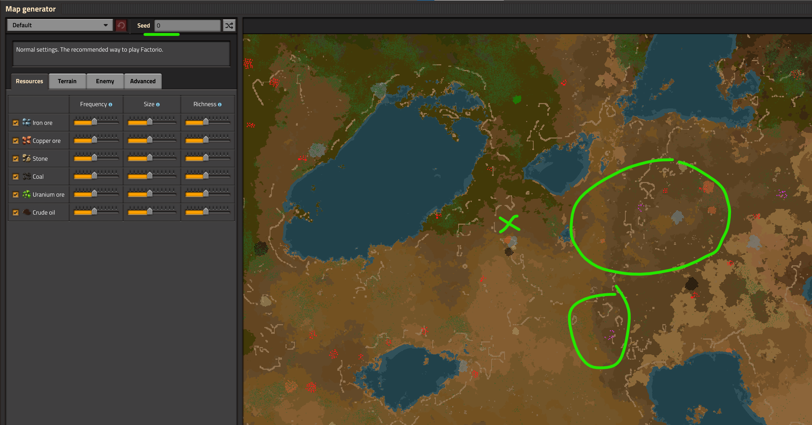
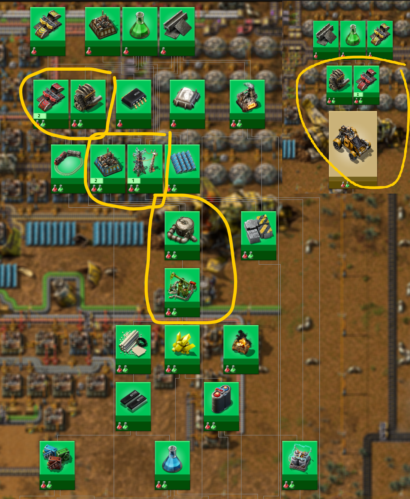

# Как начать играть?

:::danger
Это заготовка для будущей статьи, сейчас она не рекомендуется для изучения, а в будущем может измениться или вообще исчезнуть.
:::

Имеется вариант, при котором можно получить в конце концов начальную базу на 75 научных пакетов в минуту и при этом не столкнуться с проблемами связанные с нехваткой ресурсов и электричества. Если присмотреться к типовым расчётам, что база на 45, что на 75 научных пакетов используют одинаковое количество сборочных автоматов, только разного уровня.

**

Решение простое, мы строим чертежи базы на 75 научных пакетов, планируем достаточное место для плавки ресурсов, возводим нужное количество конвейеров и дополнительных заводов. При этом в самой игре используем сборочные автоматы второго уровня `Assembling machine 2`, вместо третьего `Assembling machine 3`. Этот финт даст нам начальную базу на 45 научных пакетов в минуту, которую простым движением, улучшением сборочных автоматов, можно перевести в базу на 75 научных пакетов в минуту, когда будет достаточное количество ресурсов.

Походу, этот вариант построения начальной базы является весьма интересным.

## Первый выход с базы

Перед стартом игры, [стоит подбирать такую карту](https://wiki.factorio.com/Map_generator), чтобы месторождение нефти располагалось близко к начальной точке и содержало не менее 6 мест добычи. Тогда не придётся заморачиваться с поездами слишком рано. Хорошо, если в придачу к нефти, будет ещё каких-то дополнительных ресурсов. Вы не поверите, но нулевой сид, *Seed=0* который, является хорошей стартовой позицией, попробуйте:

Итак, для того чтобы покинуть базу и отправиться на поиски приключений с нефтью, нужно закончить следующие исследования: `Logistics 2`, `Engine`, `Automobilism`, построить автомобиль `Car`, без автомобиля покидать базу не рационально в начале игры, далее `Electric energy distribution 1` и `Oil processing`, произвести достаточное количество труб `Pipe` и подземных труб `Pipe to ground`, больших опор ЛЭП `Big electric pole`, нефтяных вышек `Pumpjack` и разумеется достаточного количества патронов и гранат, иногда и пару турелей `Gun turret` не помешает захватить.

Необходимый минимум исследований:

К этому времени уже более менее будет налажена добыча ресурсов, их переплавка и автоматизировано производство первых двух научных пакетов `Automation science pack` и `Logistic science pack`. Покинув базу вы сможете в автоматическом режиме закончить ряд исследований которым не требуются химические научные пакеты `Chemical science pack`, что включает нужные нам `Solar energy` и `Electric energy accumulators`. В момент первого выхода с базы, нужно обязательно завершить исследование `Battery research` которое потребно для `Robotics`, так как робототехника и дроны это наше всё-всё-всё после освоения нефтепереработки, другие стратегии менее продуктивные.

## Угольное улучшение

Переходим на `Solid fuel` через `Coal liquefaction`.

## После запуска спутника

куда дальше двигаться

## Строим завод, который построит остальные заводы
