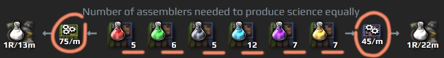
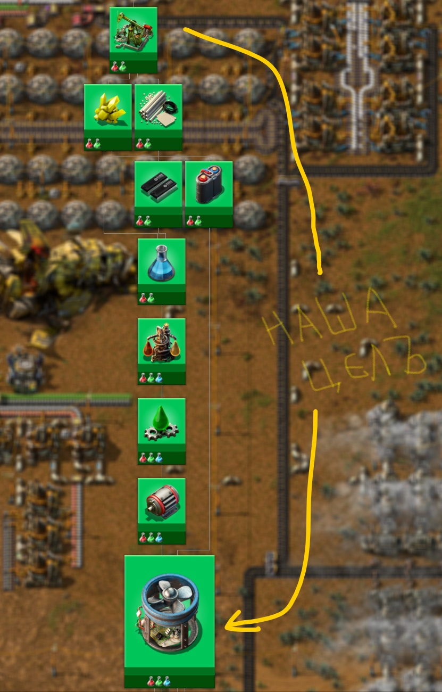

# Начинаем играть правильно

:::danger
Это заготовка для будущей статьи, сейчас она не рекомендуется для изучения, а в будущем может измениться или вообще исчезнуть.
:::

:::tip Вся статья, кратко **
*Factorio* удивительно раздражающая игра. Она способна удивить до глубины сознания и постоянно раздражать потерянным попусту временем. В большинстве случаев вы будете играть в полном одиночестве, рисовать пикселями на экране подобие виртуальной фабрики, которая перемалывает виртуальные пикселы по последним техническими нормативам, но всем на это будет абсолютно пофиг.

**Не играйте в *Factorio*, есть много других полезных занятий в жизни...**
:::

Цель игры *Factorio* - это запустить ракету в космос как можно быстрее. Всё остальное не существенно. [После запуска первого спутника](#после-запуска-спутника) можно играть дальше и строить большой завод. [Если мощности оборудования хватает](../Additionals/FPSandUPS.md) можно даже преогромный завод, по всех канонам чего-то там научного. Но для того, чтобы всего этого добиться нужно иметь представление как устроена игровая механика и куда нас направляет замысел разработчиков и какие уловки и где нужно применять. Хорошим делом будет попробовать самостоятельно разок другой сыграть до запуска спутника и даже чуток дальше, чтобы обрести основные понятия об играх в *Factorio*. Полагаю, что вы уже всё перепробовали и подтянулись и мне не придётся тянуть кота за усы, а посему сразу к деталям.

## Ранее планирование

Планировать свои действия нужно заранее, и не только в *Factorio*. Несмотря на то, что запуск спутника является единственной нашей задачей, стоит подумать над тем, как мы будем играть [после полёта рыбки в космос](https://wiki.factorio.com/Achievements/ru), и что у нас будет с начальной базой. Если мы хорошо спланировали начальную базу, хорошо её построили, она хорошо работает, то значить она и дальше будет приносить нам бонусы и не потребуется сносить и перестраивать всё это безумие инженерной мысли. А значить, наша начальная база и заводик на ней, пусть и будут похожими [на макаронные изделия](https://www.bing.com/search?q=what+is+spaghetti+code), но всё же должны сохраниться и работать, вписавшись в нашу будущую большую фабрику.

:::info Наша начальная база
Строить надо так, чтобы не было мучительно больно за бесцельно потраченные ресурсы и время.
:::

Существует не так уж и много пригодных вариантов для строительства первой фабрики. Танцевать следует от сборочных автоматов, второго `Assembling machine 2` и третьего `Assembling machine 3`. Первый сборочный автомат `Assembling machine 1` не рассматриваем, он как и твёрдотопливный бур `Burner mining drill` предназначен для ручного строительства. И вот количества требуемых сборочных автоматов для [производства научных пакетов](https://factoriocheatsheet.com/#science):

**

 , пригодны всего два варианта: на 45 научных пакетов в минуту и на 75 научных пакетов в минуту. Есть ещё вариант на 30 пакетов, но это нам не нужно.

Имеется вариант, при котором можно получить в конце концов начальную базу на 75 научных пакетов в минуту и при этом не столкнуться с проблемами связанные с нехваткой ресурсов и электричества. Если присмотреться к типовым расчётам, что база на 45, что на 75 научных пакетов используют одинаковое количество сборочных автоматов, только разного уровня.

**

Решение простое, мы строим чертежи базы на 75 научных пакетов, планируем достаточное место для плавки ресурсов, возводим нужное количество конвейеров и дополнительных заводов. При этом в самой игре используем сборочные автоматы второго уровня `Assembling machine 2`, вместо третьего `Assembling machine 3`. Этот финт даст нам начальную базу на 45 научных пакетов в минуту, которую простым движением, улучшением сборочных автоматов, можно перевести в базу на 75 научных пакетов в минуту, когда будет достаточное количество ресурсов.

Походу, этот вариант построения начальной базы является весьма интересным.

## Выбор правильной карты

Старт переработки нефти начинается ещё до начала самой игры. Во как! Следует подобрать такую карту, с которой у вас не будет проблем в будущем. Хорошей картой является та, на которой имеется хотя бы одно, а лучше два, месторождения нефти близко расположенных к месту начальной базы. Тогда не придётся идти в ранние поезда и можно ускориться в робототехнику. Поезда это не плохо, но на начальном этапе игры, роботы предпочтительней. Тем более, в момент освоения нефти у вас будут и другие дополнительные задачи, и [как играть](../HowToStartNewGame/README.md#выбор-правильной-карты) стоит планировать заранее. Прикол таков, что нулевой сид (Seed=0) в генераторе карт, является хорошей стартовой позицией для игры *Factorio*:

## Первый выход с базы

Перед стартом игры, [стоит подбирать такую карту](https://wiki.factorio.com/Map_generator), чтобы месторождение нефти располагалось близко к начальной точке и содержало не менее 6 мест добычи. Тогда не придётся заморачиваться с поездами слишком рано. Хорошо, если в придачу к нефти, будет ещё каких-то дополнительных ресурсов. Вы не поверите, но нулевой сид, *Seed=0* который, является хорошей стартовой позицией, попробуйте:

Итак, для того чтобы покинуть базу и отправиться на поиски приключений с нефтью, нужно закончить следующие исследования: `Logistics 2`, `Engine`, `Automobilism`, построить автомобиль `Car`, без автомобиля покидать базу не рационально в начале игры, далее `Electric energy distribution 1` и `Oil processing`, произвести достаточное количество труб `Pipe` и подземных труб `Pipe to ground`, больших опор ЛЭП `Big electric pole`, нефтяных вышек `Pumpjack` и разумеется достаточного количества патронов и гранат, иногда и пару турелей `Gun turret` не помешает захватить.

Необходимый минимум исследований:

К этому времени уже более менее будет налажена добыча ресурсов, их переплавка и автоматизировано производство первых двух научных пакетов `Automation science pack` и `Logistic science pack`. Покинув базу вы сможете в автоматическом режиме закончить ряд исследований которым не требуются химические научные пакеты `Chemical science pack`, что включает нужные нам `Solar energy` и `Electric energy accumulators`. В момент первого выхода с базы, нужно обязательно завершить исследование `Battery research` которое потребно для `Robotics`, так как робототехника и дроны это наше всё-всё-всё после освоения нефтепереработки, другие стратегии менее продуктивные.

## Угольное улучшение

Переходим на `Solid fuel` через `Coal liquefaction`.

## Первый вокзальчик

## После запуска спутника

куда дальше двигаться

## Строим завод, который построит остальные заводы
