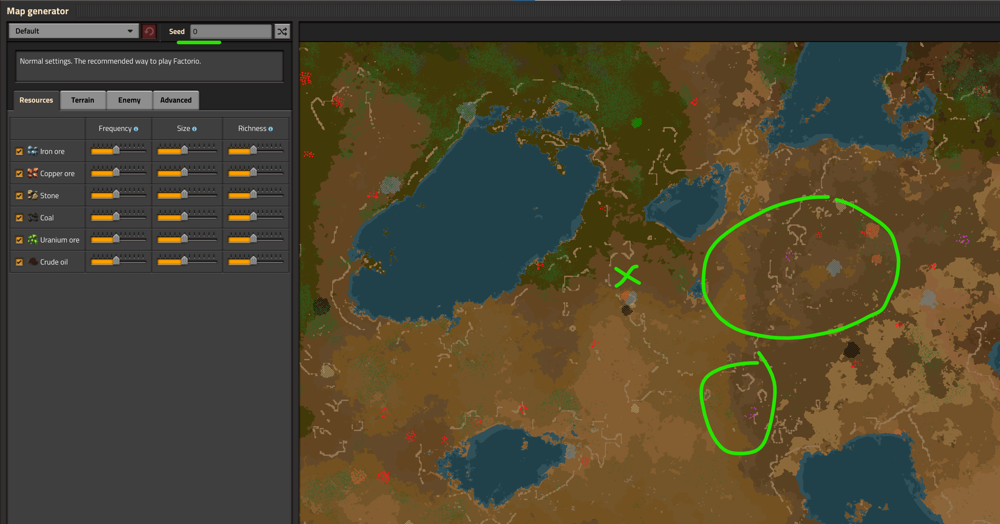
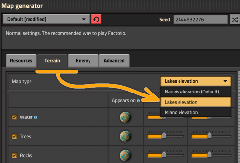
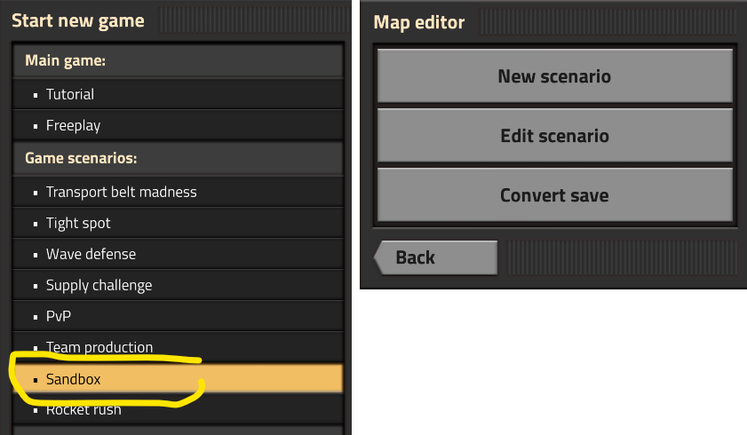
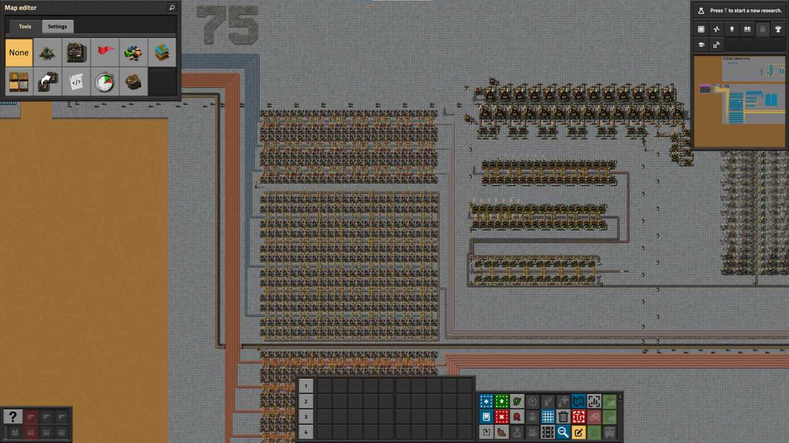
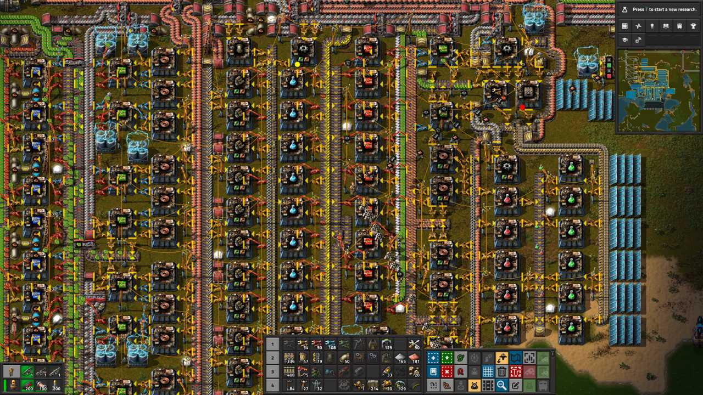

# Начинаем играть эффективно

:::tip Вся статья, кратко **
*Factorio* удивительно раздражающая игра. Она способна удивить до глубины сознания и постоянно раздражать потерянным попусту временем. В большинстве случаев вы будете играть в полном одиночестве, рисовать пикселями на экране подобие виртуальной фабрики, которая перемалывает виртуальные пикселы по последним техническими нормативам, но всем на это будет абсолютно пофиг.

**Не играйте в *Factorio*, есть много других [бесполезных занятий в жизни](https://duckduckgo.com/?q=%D1%87%D0%B5%D0%BC+%D0%B7%D0%B0%D0%BD%D1%8F%D1%82%D1%8C%D1%81%D1%8F+%D0%B2+%D0%B6%D0%B8%D0%B7%D0%BD%D0%B8+%D1%80%D0%B0%D0%B4%D0%B8+%D0%B2%D1%81%D0%B5%D0%B3%D0%BE+%D1%87%D0%B5%D0%BB%D0%BE%D0%B2%D0%B5%D1%87%D0%B5%D1%81%D1%82%D0%B2%D0%B0)...**
:::

Цель любой игры в *Factorio* - это запустить ракету в космос как можно быстрее. Всё остальное не существенно. [После запуска первого спутника](AfterSatelliteLaunch.md) можно играть дальше и строить большой завод. [Если мощности оборудования хватает](../Additionals/FPSandUPS.md) можно построить даже преогромный завод по всем канонам чего-то там научного. Но для того, чтобы всего этого добиться нужно иметь представление как устроена игровая механика и куда направлять свои инженерные замыслы, какие уловки существуют и где их можно применять. Хорошим делом будет попробовать самостоятельно разок другой сыграть до запуска спутника и даже чуток дальше, чтобы обрести основные понятия об играх в *Factorio*. Если ещё не научились самостоятельно завершать игру на любой карте, то не тяните кота за усы, читайте написанное и просвещайтесь эффективностью.

## Выбор подходящей игровой карты

Настоящая игра в *Factorio* начинается с выбора правильной карты. Какую карту ты себе выберешь, так всю жизнь и проведёшь. Это как выбор правильной жены, даже ещё больше. Конечно, пару разок можно сыграть на лево, чисто приглядеться, потренироваться, освоиться с механиками игры. Но наступит такой момент, когда ты выберешь себе ту единственную, на которой будешь зависать годами. И никакие другие карты, тебе уже будут не интересны.

На самом деле в этом выборе ничего этакого нет. Приглядитесь к расположению ресурсов, они не должны быть сильно раскиданы друг от друга. Особе внимание уделите нефтяному месторождению `Crude oil resource`. Оно должно быть в шаговой доступности от вашей стартовой позиции. А ещё лучше если будет два месторождения нефти, тогда не придётся идти в ранние поезда и можно сразу заняться робототехникой `Roboport`. Также обратите внимание на деревья `Tree`, они помогают защищаться от местной фауны потребляя загрязнение.

:::info Это важно **
Игровую карту следует выбирать так, чтобы можно было пампить нефть не отходя далеко от сберкассы. В остальном выбирайте себе карту на вкус и цвет.
:::

Стоит также обратить внимание на водные глади. Этот момент особенно важен, если играете против сильной фауны. Удачное расположение начальной базы окружённое водной преградой является бонусом к защите от нападений.

**

### Пресеты

А вот про *пресеты*, которые *presets*, стоит рассказать подробнее. При выборе новой карты вы сначала выбираете заинтересовавший *пресет*. Его задача установить различные значения для генерации карты. Эти же значения вы можете задать и самостоятельно, но *готовым персетом* будет быстрее.

*Пресет по умолчанию (Default)* ничем особым не выделяется, обычная игра в *Factorio*. На этом пресете вы будете играть вполне замечательно, он подходит для большинства ваших игр. Пресет довольно сбалансирован, ресурсы разбросаны весьма равномерно, а месторождения рядом со стартовой позицией не большие. То есть они выработаются довольно быстро, освободив место для разрастающейся базы. Месторождения на удалении от стартовой позиции по массивнее будут и с учётом открытия бонусов на добычу ко времени их освоения будут почти неиссякаемы. Однако с нефтью есть проблема, её существенно не хватает, а значить придётся больше напирать на `Coal liquefaction`, хотя, походу, так всё и задумывалось.

*Пресет на богатые ресурсы (Rich resources)* является твиком для ~~неудачников~~ [новичков в *Factorio*](../Additionals/NerdsVsGeeks.md#кого-в-игре-больше-нердов-или-гиков), которые сомневаются в своих способностях построить добывающие аванпосты. На стартовой позиции будет немного больше ресурсов в месторождениях, но не на столько больше, чтобы забыть про поезда после робототехники.

*Пресет железнодорожного мира (Rail world)* также даёт богатые месторождения, но раскидывает их на большие расстояния. Его прелесть в том, что он пресекает расползание местной фауны, а посему является любимым пресетом большинства.

*Пресет марафона (Marathon)* своеобразное издевательство над игроком. Его мало кто играет, так как в нём нарушены основные соотношения и чертежи из интернетов не подойдут, а посему такое чудо пропускаем.

*Мир смерти (Death world)* ещё одно издевательство над игроком, в котором фауна становиться более злющей. Играть его имеет смысл, так как даёт больше адреналина. Но после запуска первого спутника вся фауна становится раздражающим фактором, вне зависимости от выбранного пресета. Поэтому игру на таком пресете не планируйте для строительства огромной фабрики, [если только вы не задрот какой-то](../Additionals/NerdsVsGeeks.md).

*Узкий мир (Ribbon world)* странное мракобесие на первый взгляд, но если комбинировать такой пресет с очень злющей фауной, то может что-то да и получится. Вас будут атаковать только с двух сторон, плюс можно подобрать карту с перешейками и водными преградами, а значить можно легко защищаться.

*Остальные пресеты* фигня полная.

### Тыкаем генератор карт

Итак, выделим основные моменты выбора игровой карты в *Factorio*:

* выбираем интересующей пресет (preset), пресет по умолчанию тоже вполне играбелен
* обращаем внимание на ресурсы, особенно на близкое расположение нефтяного месторождения
* присматриваемся к деревьям или водяным преградам, если играем против усиленной фауны
* или вообще отключаем фауну и загрязнение чтобы не мешалась грандиозным планам

Отключаем доставучую живность и полюшион:

### Самая лучшая карта

А самый из самых приколов игры таков, что нулевое зерно (Seed=0) в генераторе карт, является хорошей стартовой позицией для игры *Factorio*. Тут имеется два богатых месторождения нефти и месторождения руды в шаговой доступности:

Вот ещё хорошие зёрна, чтобы начать игру, попробуйте:

| | | | | | | | |
|-|-|-|-|-|-|-|-|
|3583792512|124659354|124659354|1288701856|875663488|2309722145|3924512296|4288228591|
|1668426016|2719068379|4015339952|3977562799|3831698325|2944434070|1128758444|3158287416|
|3732018335|591810610|591810610|65819733|2583873784|1511450352|1640996487|3610990573|
|942467752|1927252588|

А вот эти зёрна хороши для игры с усиленными кусаками на пресете *Death world* с 600%+600%+75% на вражину:

| | | | | | | | |
|-|-|-|-|-|-|-|-|
|1559601430|3547579518|288170111|1208729184|3949911051|1512953424|3202597448|861551436|

Также присмотритесь к старому генератору из *Factorio 1.1\**, это закладка `Terrain` в режиме `Lakes elevation`:

| | | | | | | | |
|-|-|-|-|-|-|-|-|
|1432440542|2157416278|2338624140|539022216|1229227785|1462695934|3231640834|3820421358|

А вот как можно генерировать карты игры из предыдущей версии:

## Ранее планирование

Планировать свои действия нужно заранее, и не только в *Factorio*. Несмотря на то, что запуск спутника является единственной нашей задачей, стоит подумать над тем, как мы будем играть [после полёта рыбки в космос](./Achievements.md), и что у нас будет с начальной базой.

:::info Это интересно **
Отправить рыбку в космос задача простая, если у вас готова на старте заправленная к запуску ракета. Для этого нужно вместо спутника `!Satellite` положить в неё рыбку `!Raw fish`, отловленную в ближайшем пруду. Это также является способом получения достижения *"So long and thanks for all the fish"*, оно же *"Всего хорошего, и спасибо за рыбу"*.
:::

Если мы хорошо спланировали начальную фабрику, хорошо её построили, она хорошо работает, то значить она и дальше будет приносить нам бонусы и не потребуется сносить её и перестраивать это безумие инженерной мысли. А значить, наша начальная база и заводик на ней, пусть и будут похожими [на макаронные изделия](https://www.bing.com/search?q=what+is+spaghetti+code), но всё же должны сохраниться и работать, вписавшись в нашу будущую большую фабрику.

:::warning  Наша начальная база
Строить надо так, чтобы не было мучительно больно за бесцельно потраченные ресурсы и время.
:::

:::danger Скажем спасибо многолетним дэбилам из *Wube Software*
Шопорукие чешского происхождения постоянно ломают *Factorio* за наши долляры, шекели, рубли и гривны. Нововведение второй версии в виде `Cargo landing pad` всячески стараются не дать вам использовать вашу начальную фабрику, но мы всё равно будем стараться её сохранить и использовать. Варианты решения имеются.
:::

Существует не так уж и много пригодных вариантов для строительства первой фабрики. Сбалансированные варианты следует вытанцовывать от производства научных пакетов на сборочных автоматах, второго `Assembling machine 2` и третьего `Assembling machine 3`. Первый сборочный автомат `Assembling machine 1` не рассматриваем, он предназначен больше для ручного строительства на очень ранней стадии игры, когда у вас ещё твёрдотопливные буры `Burner mining drill` добывают в сундук. Также, первый сборочный автомат не поддерживает установку модулей `!Module`, что плохо в дальнейшем.

Имеется всего два варианта, на 45 научных пакетов в минуту для вторых сборочных автоматов и вариант на 75 научных пакетов в минуту для третьих. Эти цифры ровно сходятся по количеству сборочных автоматов, что позволяет усовершенствовать первый вариант во второй простой заменой сборочных автоматов, ну почти простой заменой. И вот вам раскадровки для [производства научных пакетов](https://factoriocheatsheet.com/#science):

**

Нужно конечно ещё [улучшить переработку нефти](../OilRefining/README.md), которое простой заменой нефтеперерабатывающих заводов `!Oil refinery` и химических заводов `!Chemical plant` не получиться улучшить. Ещё нужно заранее продумать о доставке большего числа предметов к сборочным автоматам. Ещё [возросшее потребление электричества](../PowerProduction/README.md#начальная-база-на-75-научных-пакетов-в-минуту), то есть нужно заранее продумать все тонкости такого изменения начальной базы. Но мы получаем замечательную возможность, увеличить производство науки почти в два раза сразу после запуска спутника, ещё до строительства большого завода.

Почему стоит выбрать вариант на 45 научных пакетов в начале? А потому, что на 75 вы просто надорвётесь. Ресурсов на стартовой позиции не так уж и много. [Энергии для снабжения большей фабрики потребуется больше](../PowerProduction/README.md#начальная-база-на-75-научных-пакетов-в-минуту). Потребуется большее количество нефти и больше места для кузницы. К тому же, третьи сборочные автоматы не так просто открыть по исследованиям и ещё сложнее их произвести массово. Тогда как вторые сборочные автоматы доступны почти с начала игры. Решая все эти вопросы вы упустите время, когда сбалансированная фабрика на 45 научных пакетов позволит вам запустить первый спутник быстрее и без затруднений.

### Краткий план игры

Исходя из выше перечисленного вот как нужно эффективно играть:

* [выбираем хорошую карту](#выбор-подходящей-игровой-карты) по своему усмотрению, с ресурсами и близкой нефтью
* сразу подготавливаем чертёж готовой базы на 75 научных пакетов, с сопровождающими заводиками, переработкой нефти и [кузницей на электрических печах](../RawResourcesProcessing/README.md#после-запуска-первого-спутника)
* на основании готового чертежа подготавливаем его клон на 45 научных пакетов, [с паровой электростанцией](../PowerProduction/SteamPower.md#чертёж-угольной-паровой-электростанции), [заводиком снабжения](Mall.md#магазин-шота-у-ашота) и [кузницей на каменных печах](../RawResourcesProcessing/README.md#чертежи-для-плавки-руд) для нормального начала игры

[чертежи делаем в песочнице](#чертежи-в-песочнице), там удобно всё тестировать и переделывать, далее:

* начинаем играть в 45 и выигрываем, [часов за 5 отправляем ракету в космос](https://steamcommunity.com/sharedfiles/filedetails/?id=2832606269)
* потом [строим фабрику снабжения](Mall.md#магазин-три-тысячи-мелочей) и улучшаем нашу начальную фабрику в 75
* дальше строим огромную [фабрику на 100500 научных пакетов в минуту](https://steamcommunity.com/sharedfiles/filedetails/?id=2960715629)
* открываем [канал на твойтубе](https://www.youtube.com/@AwesomeFactorio) и рассказываем как всего добиться в жизни

Вот такой план, дерзайте.

## Чертежи в песочнице

Игра в песочнице позволяет легко строить большие чертежи и тестировать их без особых затруднений. Это можно сказать реальная игра с читами. Другим вариантом является редактор сценариев, который не совсем игра, а больше именно редактор с няшками недоступными в реальной игре. Оба варианта подходят для индивидуального творчества. Песочница больше рассчитана на ламеров. С редактором сценариев без пол литра не разобраться, но оно может того стоить. Запускать эти режимы игры нужно через меню *при создании новой игры* или через *меню редактора сценариев*:

**

Ещё один способ включить редактор в любой уже начатой игре, это написать в консоли команду `/editor`, возможно потребуется ввести команду два раза. Консоль открывается нажатием клавиши тильда `~`. Закрыть редактор можно ввести команду ещё раз. А также есть модификация под названием [EditorExtensions](https://mods.factorio.com/mod/EditorExtensions), которая открывает редактор в любой игре.

Итак, мы строим все чертежи начальной базы на 75 научных пакетов. Планируем достаточное место для плавки ресурсов, возводим нужное количество конвейеров и дополнительных заводов, перерабатываем нефть, снабжаем электричеством. То есть создаём полностью рабочий заводик, где-то в песочнице. Полностью отлаживаем его работу и вылизываем потребления ресурсов со всеми прибамбасами.

Потом даунгрэдим его во второй чертёж до состояния 45 научных пакетов в минуту с уменьшенными электростанциями, кузницами, меньшей переработкой нефти и вторыми сборочными автоматами. Начинаем реальную игру и используем созданные чертежи на сборочных автоматах второго уровня `Assembling machine 2`, вместо третьего `Assembling machine 3`. Стремимся как можно быстрее запустить первый спутник, такой простой фабрики будет достаточно как по добываемым ресурсам, так и по производимому электричеству.

А после полёта в космос занимаемся улучшением начальной фабрики и готовимся строить мегафабрику с поездами и маяками. Профффит.

:::warning  Опять про шопоруких из Wube
Будьте готовы, что выход обновлений для *Factorio* может изменить алгоритм генерации карт, что было в прошлом не единожды. Даже небольшие изменения могут сломать ваши готовые чертежи, которые вы клипали неделями затачивая их под конкретную карту. Чтобы избежать этого, создайте новую игру, которую планируйте играть в будущем и побегайте немного вокруг, чтобы открыть несколько чанков (игровых квадратов) на стартовой позиции. Сохраните игру на этой ранней стадии и храните это сохранение отдельно. Таким образом вы всегда сможете начать играть на некогда сгенерированной карте вне зависимости от обновлений игры *Factorio*.
:::

## Больше подробностей

Радиопередача:

[**](https://www.youtube.com/watch?v=yPFaT4FohGw).

Смотрите и делитесь комментариями.
