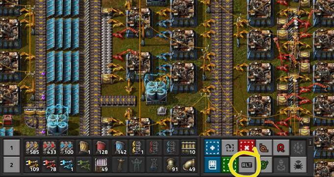
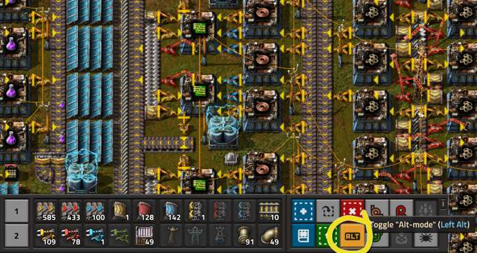
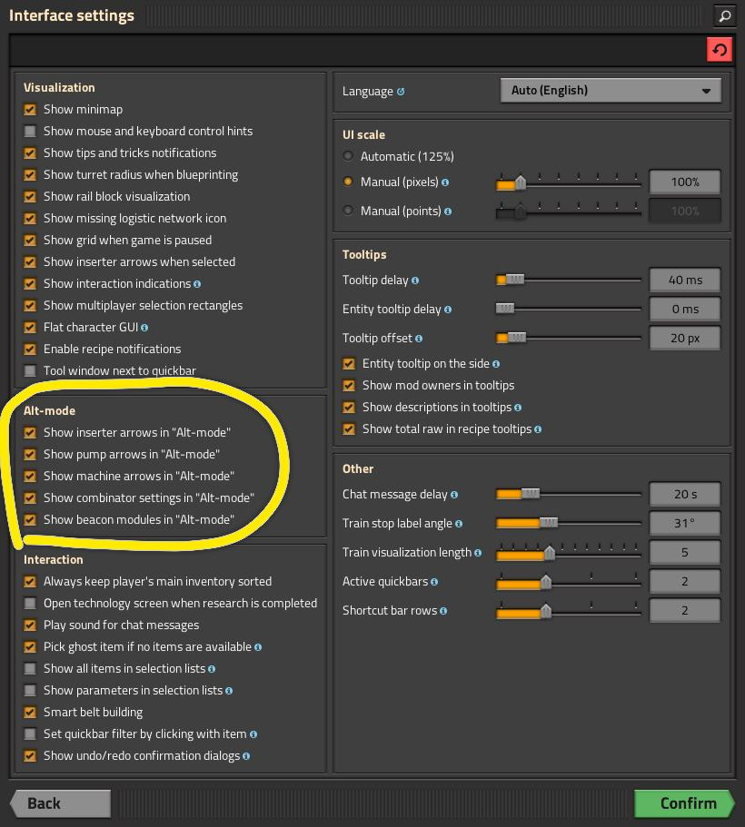
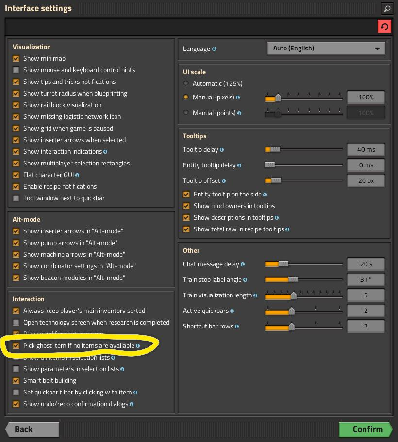
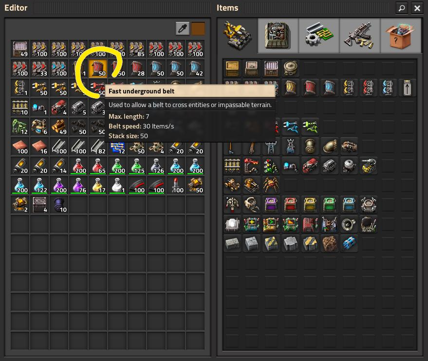
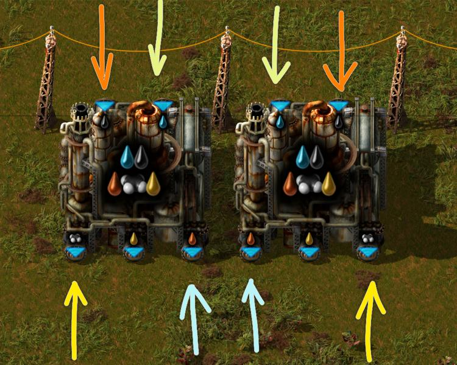
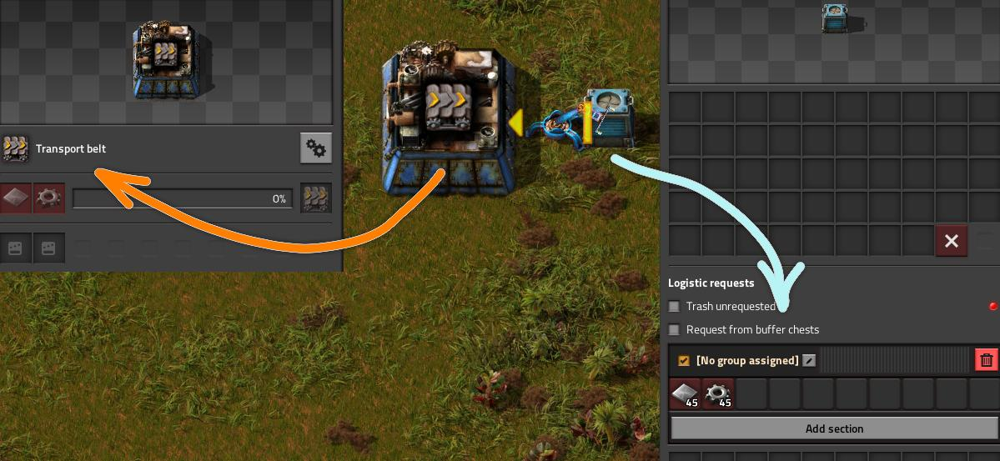
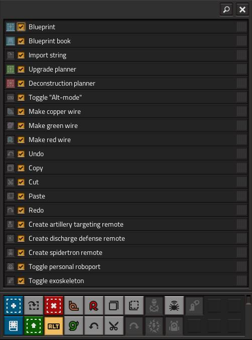

# Советы и рекомендации

:::tip Вся статья, кратко **
Сборище всего полезного о чём стоит знать всем и каждому. Тут повествуется о разных режимах игры, мелких ухищрениях, о том как монструозно владеть мышкой да клавиатурой, как управляться постройками и как делать рутинные вещи просто, также указываются узкие места в игре, на которые нужно обязательно обращать внимание.
:::

## ALT Mode

*ALT Mode*, он же *альтернативный режим* позволяет отображать дополнительную информацию о построенных объектах, например, рецепты в сборочных автоматах, содержимое сундуков, настройки комбинаторов и всего прочего. Режим включается и выключается нажатием клавиши *Alt* на физической клавиатуре (левый *AltGr* в Linux) или кнопки *ALT* на *Shortcut bar*, которая *Панель ярлыков* в самой игре. Сравните отображение с выключенным и включенным режимом:

**
**

Если вам нужно отключить определённые элементы, например стрелки для манипуляторов, это можно сделать в настройках игры, в настройках интерфейса:

**

Лучше держать все опции включенными, для полноты картины, хотя кому как.

## Две самые главные кнопки

Как работают кнопки ***Q*** и ***E*** нужно помнить наизусть, а также помнить и другие важные комбинации клавиш.

Клавиша ***Q*** выполняет роль "пипетки". Если вы наведёте курсор на уже размещённый объект (например, конвейер или сборочный автомат), то нажатие этой клавиши выберет этот предмет из вашего инвентаря, если он там есть. Повторное нажатие этой клавиши уберёт выбранный предмет. Таким образом можно быстро строить не открывая постоянно рюкзак для выбора предметов.

Интересной особенность пипетки является режим выбора призрака, если предмета нет в рюкзаке. Это позволяет строить даже не имея предметов в наличии на данный момент, а призраки могут быть построены роботами. Для этого нужно задать специальную настройку, которая по умолчанию отключена:

**

Клавиша ***E*** используется для открытия инвентаря, он же рюкзак. Это одна из самых часто используемых клавиш, поскольку позволяет быстро управлять ресурсами, предметами и экипировкой.

**

## Кручу, верчу, ставлю как хочу

Клавиша ***R*** используется для вращения объектов по часовой стрелке, а ***Shift*** + ***R*** используется для вращения против часовой стрелки. Эти клавиши особенно полезны при размещении конвейеров, сборочных автоматов и других построек, где направление имеет значение. Вращаться можно всё, что выбрано пипеткой или уже размещено на игровой карте, будь-то предметы или чертежи. Также можно отразить выбранное или уже размещенное по горизонтали клавишей ***H*** и по вертикали клавишей ***V***. Особую полезность это вызывает для кручения нефтеперерабатывающих и химических заводов, чтобы поменять выходы производимых жидкостей.

**

## Копирование настроек

Скопировать настройки с одной игровой сущности на другую является удобнейшей игровой механикой. Для этого зажимаем ***Shift*** и кликаем ***правой кнопкой мыши*** по игровому предмету, с которого хотим снять копию настроек. И теперь также с нажатой клавишей ***Shift*** кликаем ***левой кнопкой мыши*** по игровому предмету, на которое хотим применить скопированные настройки.

Копировать можно сколько угодно раз и копировать настройки можно практически со всех игровых сущностей, таких как настройки логистических сундуков, локомотивов, железнодорожных станций, комбинаторов, настройки манипуляторов в логической и логистической сети. Даже скопировать можно сборочный автомат на сундук запроса, тогда сундук запроса будет запрашивать из логистической сети всё то, что нужно для производства согласно рецепту на сборочном автомате.

**

## Панели быстрого доступа

Строго говоря в *Factorio* различается *Quickbar* как панель быстрого доступа и *Shortcut bar* как панель ярлыков. Но их суть мало чем отличается.

***Панель ярлыков*** содержит значки для часто используемых функций, таких как копирование чертежей, включение персональных роботов или переключение режима ALT-mode. Установленные моды будут добавлять в эту панель кнопки своих функции. Панель ярлыков можно настроить, изменяя порядок значков и скрывая ненужные элементы, а если вам нужно включить все ярлыки, можно использовать команду:

```console
/unlock-shortcut-bar
```

**

***Панель быстрого доступа*** позволяет закреплять различные предметы и элементы чтобы быстрого их использовать. Вы можете добавить на панель любые предметы, ресурсы, боеприпасы, чтобы не искать их в инвентаре. Можно добавить даже чертежи и всё прочее что можно кликнуть и использовать. Эта панель намного функциональней панели ярлыков, так как позволяет добавить в закладки практически всё и быстро это всё выбирать для строительства или использования.


