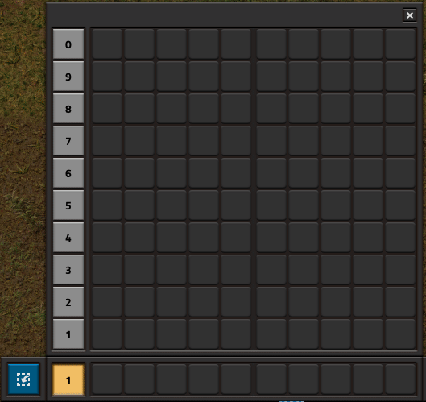
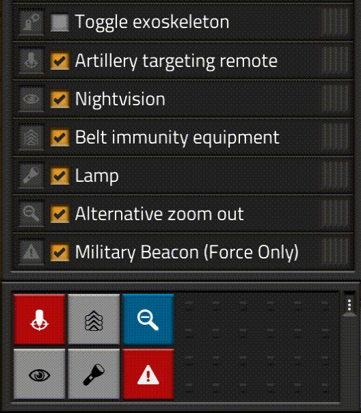

# Полезные модификации

## Для загрязнения

Существует несколько модификаций для игры *Factorio* связанные с загрязнением и которые развлекают не по-детски. Самое-самое что стоит попробовать конечно же *[Pollution is the Solution](https://mods.factorio.com/mod/Pollution_is_the_Solution)*. Данная модификация уничтожает улья, если они уже разродились шестьюдесятью единицами местной фауны. Вот так, загрязнение плачевно влияет на природу. Со временем местная фауна погибает

Следующий прикол называется *[No Enemy Spawners for Space Age](https://mods.factorio.com/mod/no-enemy-spawners)*, которое таки убирает все улья кусак и плевак и добавляет альтернативные рецепты для производства яиц пентаподов `Pentapod egg` и захваченный улей кусак `Captive biter spawner`. Модификация эта нужна только тем гениям, которые заплатили долярами за бесплатный мод криворуким чехам, а ванильщикам модификация сия не нужна от слова совсем.

И ысчё интересная обнова под названием *[Air Scrubbing](https://mods.factorio.com/mod/atan-air-scrubbing)*, которая добавит в игру новое строение занимающееся проветриванием воздуха и очисткой его от спор и загрязнения. Не очень просто, но надёжно, если вы только не боитесь заморочиться с производством кучи воздушных фильтров для работы нового строения. Есть похожая приблуда под названием *[TJ's Air Cleaner](https://mods.factorio.com/mod/TjAirCleaner)*. Также добавляет строения для фильтрации воздуха, но работает от липестричества и не требует производства никаких фильтров. Однако на вид строения похожи на ветряные электростанции, а не на очистители воздуха, что портит впечатление.

## Дополнительная функциональность для игровых панелей

Существует модификатор игры, который позволяет импортировать и экспортировать настроенные слоты *панели быстрого доступа* как чертежи. Также этот мод может установить шаблон по умолчанию, который будет настраивать *панель быстрого доступа* при запуске новой игры.

Называется *QuickbarTemplates*, [качать и устанавливать отсюда](https://mods.factorio.com/mod/QuickbarTemplates). Работает просто и прикольно:

**

Ещё есть хороший мод для *панели ярлыков* добавляющий дополнительные игровые функции и связывающий их с кнопками ярлыков. Называется *Shortcuts for 2.0*, [качать и устанавливать отсюда](https://mods.factorio.com/mod/Shortcuts-ick). Среди дополнительных игровых функций присутствуют: включение/отключение фонарика, сигнальные метки на карте, включение игровой сетки, включение визуализации рельсов, изменение масштаба карты, планы для деконструкции деревьев и камней, взаимодействие с различным оборудованием и прочие.

**

Откровенно говоря, модификация энта была полезна в давние времена, но сейчас утратила свои прекрасные качества. Выход новой *Factorio*, которая второй версии, добавил много полезных ярлыков и потребность в таких модах потерялась.

### И как же размещать километры полей солнечных панелей?

И тут возникает ещё один важный вопрос: **как всё это строить на огромной площади?** Ответ зависит от того в какую игру вы играете. Если с модами, то можно воспользоваться модом [`JetPack`](https://mods.factorio.com/mod/jetpack) который позволяет летать яки *Питер Пэн* над *Кенсингтонскими садами*. Также подойдёт мод [`Squeak Through`](https://mods.factorio.com/mod/Squeak%20Through), который позволить ходить между солнечными панелями, но не рекомендую его к использованию, по причине того, что данный мод меняет области строительства и некоторые чертежи созданные в игре с данным модом могут не работать в играх без этого мода.

## Редактор сценариев

А также есть модификация под названием [EditorExtensions](https://mods.factorio.com/mod/EditorExtensions), которая открывает редактор в любой игре.

## Прочие инструменты

[Много разных чертежей](https://www.reddit.com/r/factorio/comments/ig96gm/big_book_of_mining_blueprints), есть интересные варианты

[Расчёт количества буров в зависимости от уровня продуктивности добычи](https://factoriocheatsheet.com/#mining)