# Доставка разного барахла

:::danger
Это заготовка для будущей статьи, сейчас она не рекомендуется для изучения, а в будущем может измениться или вообще исчезнуть.
:::

:::tip Jlovber: Jlovo’s boxes, Yber’s wheels.
Забудьте желтые коробки Jlovo, забудьте грязных кусако-водителей Yber, мы лучше всех. Просто и понятно...
:::

В любой игре *Factorio* у подавляющем большинстве случаев ваши поезда чинно возят единственный ресурс туда, полностью погружаясь на станции погрузки и сюда, полностью разгружаясь на станции разгрузки. Но иногда возникает потребность отвезти кучу разного хабара, как правило, с центра фабрики на окраину, например, для [снабжения фортификаций](../MilitaryOutposts/Biggest.md) сдерживающих [экспансию местной фауны](../MilitaryOutposts/README.md#экспансия-жуков) или для строительства очередного [добывающего аванпоста](../MiningResources/Autotorio.md).

Стандартный грузовой вагон `Cargo wagon` перевозит по 40 ячеек (али слотов) различного барахла. Но если класть всё подряд и без разбору, то какой предмет куда попадёт и в каком количестве, про то ведает только *Кетцалькоатль*. Без автоматизации погрузки, грузовой вагон переполнится не тем количеством предметов, погружающие манипуляторы ваще заблокируются, а локомотив застрянет на станции погрузки, как Чапаев на Марсе. Те же проблемы характерны и при разгрузке на месте назначения с похожими симптомами. В результате вся такая автоматизация превращается в ручную очистку грузовых вагонов и доставку пешком недостатков.

## Фильтрация ячеек грузового вагона

Начнём с простого. Сначала отфильтруем ячейки грузового вагона и назначим каждой свой тип предмета. Для этого достаточно выбрать какой-то грузовой вагон и прожать средним батоном мыши (поведение настраиваемо через настройки управления) на выбранной ячейке. Откроется окно выбора предмета где нужно указать на интересуемый (синяя стрелка). После этого в данную ячейку можно будет погрузить только выбранный предмет. При необходимости можно нажать красную кнопку под ячейками и ограничить количество доступных слотов (красная стрелка).

Пример настройки грузового вагона, в который можно погрузить по одной стопке конвейеров и манипуляторов и ничего окромя более:

*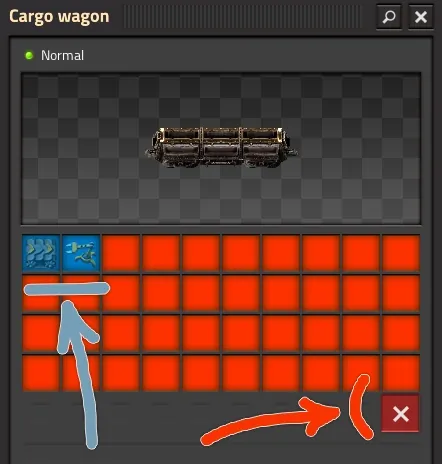*

Фильтрацию ячеек грузового вагона действительно стоит устанавливать всегда. Даже если вы абсолютно уверены, что поезд никогда не уйдёт по другому расписанию, глупая ошибка может случиться в самый неожиданный момент.

:::info Всегда устанавливайте фильтры
Предотвратить логистический кошмар на этапе настройки поезда гораздо проще, чем ликвидировать последствия случайностей на огромной фабрике.
:::

Достаточно перепутать название какой-то станции и вместо *"Разгрузка Железной Руды"* написать *"Разгрузка Медной Руды"*, как вся логистика полетит в тартарары. Без ограничительной фильтрации ячеек, поезда моментально развезут не те предметы по всей игровой карте, и я искренне желаю вам удачи разбирать потом всю захламлённую фабрику, выковыривая чужеродные пластины с конвейеров.

И дабы ну мучиться над каждою ячейкой устанавливая фильтры, всё можно скопировать из одной ячейки на другие. Для этого зажимаем *Shift + правый батон* над ячейкой с уже установленным фильтром (синяя стрелка), и потом переносим настройки фильтрации по *Shift + левый батон* на прочие ячейки (красная стрелка).

*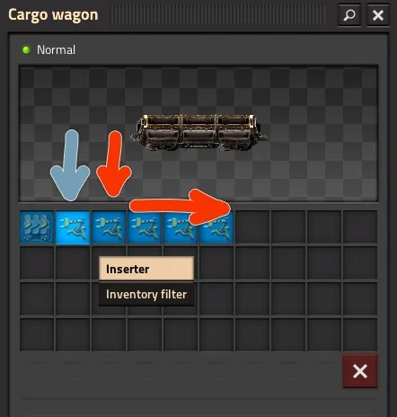*

Собственно так всё в *Factroio* можно копировать с одного игрового предмета на другие, настройки сундуков запроса, настройки фильтрации вагонов, настройки турелей, расписания локомотивов, рецепты сборочных автоматов и тд и тп. Освойте эту технику, она полезная.

## Размещение станций погрузки

[**](pathname:///blog/2026/05/17/grand-opening-transport-company)

Станции погрузки для поездов с разношерстной перевозкой предметов стоит размещать поближе к производимому хабару. В самом начале строительства большой фабрики, то есть [после запуска первого спутника](../HowToStartNewGame/AfterSatelliteLaunch.md), логично держать станцию погрузку ближе к [заводам снабжения, яки моллам](../HowToStartNewGame/Mall.md), но по мере роста фабрики и увеличения количества [форпостов](../MilitaryOutposts/README.md) один единственный завод снабжения может перестать справляться с нагрузками. Эти маленькие фабрики лениво создают всевозможный хабар понемногу, удовлетворяя базовые нужды инженера. Строить второй аналогичный завод снабжения бессмысленно ибо для бесперебойного снабжения удаленных форпостов или производства предметов расширяющих фабрику потребно производить не весь игровой ассортимент, а только строительные расходники и амуницию для фронта.

Поэтому стоит задуматься о возведении отдельного заводостроительного комбината и отдельного заводика снабжения форпостов, а станции погрузки размещать поблизости. Для всего такого отлично подходит [архитектура масштабируемых сити-блоков](../FactoryDesign/README.md), позволяющая легко играться перепланировкой в зависимости от потребностей растущей фабрики.

## Погрузка нескольких предметов в грузовой вагон

Организация подачи десятков разных предметов на погрузку может вызвать инженерное безумие. Вы вряд ли будете доставлять предметы к станции погрузки по конвейерам, поскольку хабара потребуется много не в количественном исчислении, а именно в ассортименте. Целесообразно использовать транспортных дронов, которые будут оперативно доставлять нужные предметы в сундуки запроса. Один такой сундук заменяет громоздкие конвейерные развязки, позволяя гибко настраивать объемы и типы погружаемых ресурсов. Но помните, что транспортные дроны действуют эффективнее на небольших расстояниях. Посему старайтесь максимально уютно организовывать производство и станцию погрузки.

Поначалу кажется заманчивым использовать всего один сундук, чтобы погрузить абсолютно все предметы в отфильтрованные ячейки поезда, но здесь в силу вступает своеобразный алгоритм работы манипуляторов в игре. Когда манипулятор взаимодействует с сундуком, он всегда пытается взять максимально доступное количество предметов за один раз. Для массового манипулятора `Bulk inserter` максимальный стек равен двенадцати единицам, а для быстрого манипулятора `Fast inserter` трем штукам, в платном моде *Space Age* есть пакетный манипулятор `Stack inserter` на шестнадцать штук. Если в грузовом вагоне под конкретный ресурс осталось свободно места меньше, чем уже взято манипулятором, то произойдет глухая блокировка манипулятора до прибытия следующего поезда, способного принять этот остаток ресурсов. То есть, если вы погружаете одним манипулятором несколько предметов, то ваш состав может застопориться на станции погрузки либо уйдёт в рейс не погруженным.

Ограничение размера пачки манипулятора до одной единицы через специальную настройку в интерфейсе (*Override Stack Size*) выглядит очевидным, но далеко не самым лучшим способом преодолеть блокировку. Манипулятор действительно физически не сможет взять большее число предметов, чем осталось свободного места в отфильтрованных ячейках грузовых вагонов. Однако подобный костыль критически снижает скорость погрузки и увеличивает время простоя поезда на станции. На картинке демонстрируется пример переопределения размера пачки массового манипулятора и при таких настройках его уже следует заменить на быстрый манипулятор, так как скорости вращения у них одинаковые, и количество перемещаемых предметов тоже:

**

Дабы побороть проблему скорости погрузки и блокировок следует увеличить число сундуков запроса и связанных с ними манипуляторов, когда каждая отдельная пара настраивается на погрузку строго одного типа хабара. Даже если какой-то манипулятор заблокируется с зажатым остатком, это будет означать, что он уже полностью забил вагон своим ресурсом, а остальные необходимые предметы погрузят другие манипуляторы. Но и такой метод имеет свои жесткие физические пределы, обусловленные габаритами грузового вагона, в который можно одновременно погружать из двенадцати сундуков расположенных по шесть с каждой стороны вагона или по двадцать четыре предмета при использовании длинных красных манипуляторов расположенных в два ряда с каждой стороны.

*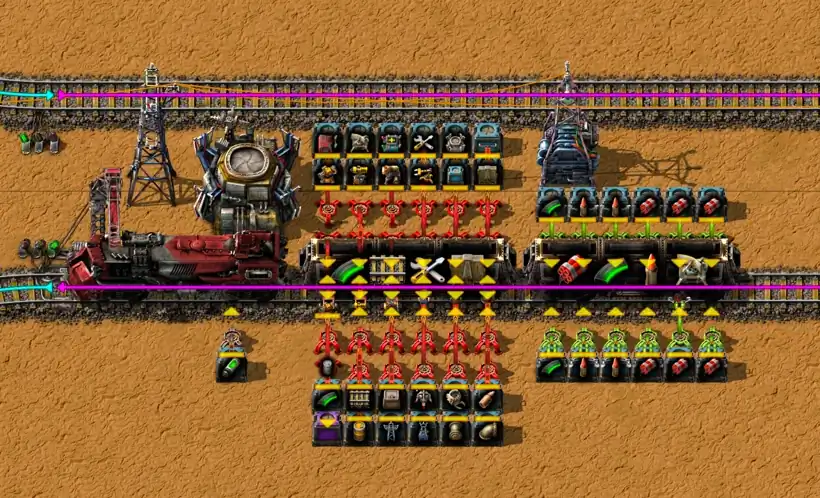*

:::tip
Для ускорения процесса погрузки поездов можно использовать несколько манипуляторов на один тип предмета. Однако, если один манипулятор погружает несколько разных предметов без логического контроля, это неизбежно приведёт к его блокировке.
:::

Предложенных выше вариантов организации погрузки хватит с лихвой на многие игровые случаи, особенно при снабжении строительных поездов, которые забиваем предметами под завязку и отправляем [возводить очередной добывающий аванпост](../MiningResources/README.md#как-строить-добывающие-аванпосты). Но для [снабжения фортификаций](../MilitaryOutposts/README.md#планирование-снабжения) следует поискать решения получше и сделать всё посложнее.

## Управляемая погрузка одним манипулятором

И вот из кустов появляются комбинаторы... Для управления погрузкой возьмём за основу вариант использования через [объединения множеств](../CircuitNetwork/Combinators.md#объединение-множеств), который позволяет через определение списка предметов организовывать их погрузку в поезд. Нам потребуется постоянный комбинатор `Constant combinator`, на котором определим список всех предметов для погрузки в поезд, а также необходимые количества. Через железнодорожную станцию `Train stop` будем получать список предметов уже погруженных в поезд и их количества. Воспользуемся арифметическим комбинатором `Arithmetic combinator`, чтобы вычесть количества уже погружённых предметов из списка запрашиваемых. И под конец задаём в качестве фильтров на погружаемом манипуляторе `Bulk inserter` результат этого вычисления. Если предметов в поезде меньше чем, запрашиваемое количество на постоянном комбинаторе, то фильтры на манипуляторе будут установлены. А ежели предметов погружено больше, то фильтров установлено не будет, так как сигналы станут отрицательными или будут отсутствовать. Прямой сигнал от постоянного комбинатора можно подать также и на сундук запроса, чтобы запрашивать недостающие предметы из логистической сети, но по другому цветному проводу, чтобы сигналы для фильтрации манипулятора не смешивались. Вот схема реализации, которая позволяет одним манипулятором погрузить все предметы в грузовой вагон:

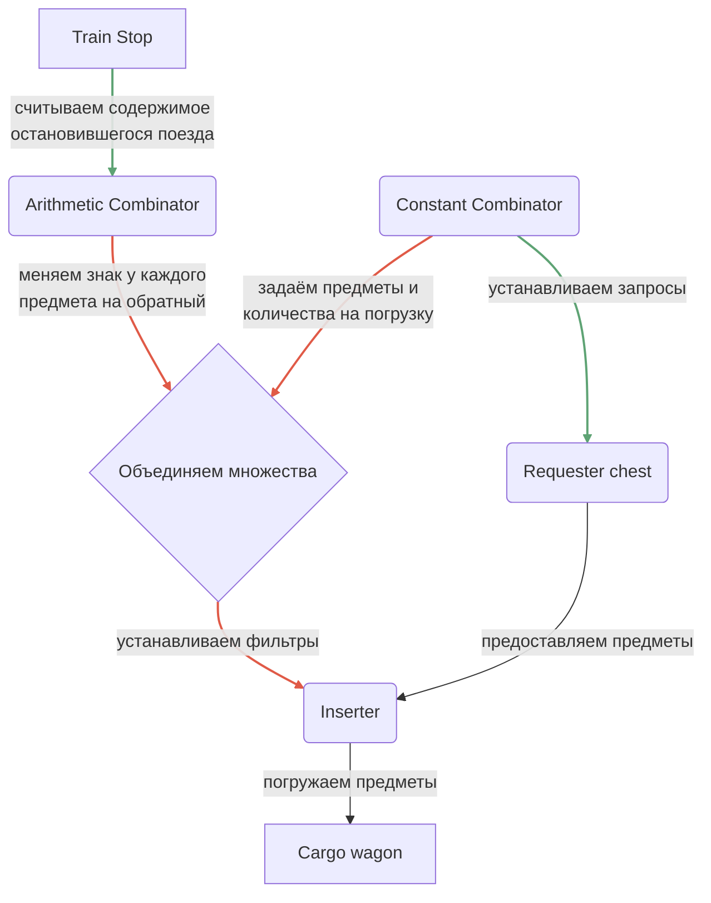

Но тут всё равно важно помнить, что манипулятор может быть заблокирован, если возьмёт предметов больше чем свободного места в грузовом вагоне. Поэтому устанавливайте число погружаемых предметов на постоянном комбинаторе меньше, чем размер стопки за вычетом размера пачки манипулятора.

:::note Пример
Максимальное число предметов в одной пачке (*stack size*) лазерных турелей `Laser turret` составляет 50 штук. Если погрузка производится через массовый манипулятор `Bulk inserter` с максимальным бонусом вместимости манипулятора `Inserter capacity bonus`, то манипулятор способен погрузить сразу 12 лазерных турелей. Чтобы предотвратить блокировку манипулятора, устанавливайте максимальное количество погружаемых лазерных турелей в 50-12 = 38 штук на постоянном комбинаторе `Constant combinator`. А для быстрого манипулятора `Fast inserter` с таким же бонусом, 50-3 = 47 штук, но вся погрузка будет на много медленнее.
:::

Также понимаем, что хотя это схема и рабочая, но всё равно медленная, так как задействован всего один манипулятор на целый вагон. Вышеописанная схема в действии:

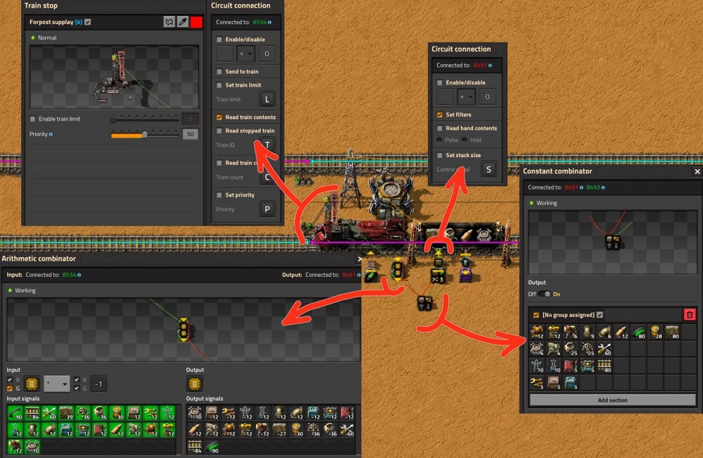

## Управляемая погрузка несколькими манипуляторами

Займёмся полировкой и доведением до приемлемого варианта всего выше обусловленного. Первым делом вынесем на отдельные сундуки запроса и манипуляторы погрузку тех предметов, которые желаем погрузить по самые гогошары, то есть без контроля.  Это стены `!Wall`, патроны `!Uranium rounds magazine`, артиллерийские снаряды `!Artillery shell`, ремонтные комплекты `!Repair pack`, иногда топливо в бочках `!Light oil barrel` и даже дроны `!Construction robot` `!Logistic robot`, всё что производится быстро и быстро расходуется на форпостах. Такие предметы можно погружать и двумя и тремя манипуляторами сразу, что ещё больше увеличит скорость их погрузки. Главное не погружать несколько предметов одним манипулятором, помним об этом.

Вторым делом, можно разделить погрузку всего связанного с постоянным комбинатором на несколько связок через несколько постоянных комбинаторов и манипуляторов, чем увеличим скорость погрузки предметов. Но тут продолжает действовать главное правило, что каждый предмет погружается через свой манипулятор и постоянный комбинатор и не дублируется на другой связке, иначе может произойти блокировка манипуляторов. Схема выглядит так:

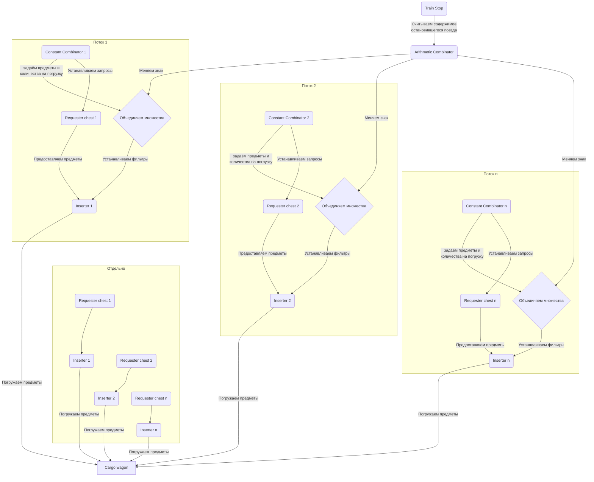

И вотана наглядная демонстрация задуманного. Сверху у нас манипуляторы погружающие без контроля предметы в вагон. Один манипулятор выгружате пустые бочки пришедшие с форпостов. Из-за нехватки места сверху мы погружаем ремонтные комплекты снизу, тоже без контроля. Остальная погрузка снизу разделена на четыре манипулятора, которые соединенны со своими постоянным комбинаторами, согласно схеме выше:

*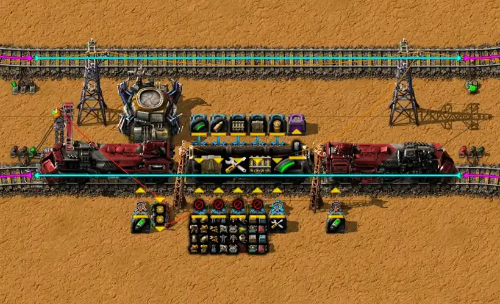*

И вот вам готовый чертёжик со всеми важными нюансами для детального изучения:

```blueprint title="Пример станции погузки для снабжения"
0eNrlWt1u2zYUfhVDl4NUWD+0pAB7i91lhUBbtE1MElWKSpcVBrYOWG+K7QX2EO26DMW6pK8gv9EOJTuyV9nWUYosQS8CU9ThZ/I7Hw/PofPCmCYlyyXPlHH2wuAzkRXG2fkLo+CLjCa6L6MpM84MSXlirEyDZzH73jizV09Ng2WKK86aEfXDZZSV6ZRJMDC3IwsFYxdLZdUQppGLAkaJTIMDkmUT1zQuYUQQAn7MJZs1r72V+Qmsg4C1+8O6/WG9sD+sh4D1+8MSBCzpDztBwCJc5iNgES4L+sO6CJeFCFiEy+wxAhfhMxuxz1yE0+x2o2nYzCqUyI9t3tDdB9UAEE2UFEk0ZUt6wYXUgwqWxZESUY1qnM1pUjDTkIzG0VyKdNuvZAnd9UOkvzpncdTGJHWZ65ldcKlKqte6paC2sL4xVjCZQtFmKgYYpDQDywa9iBKecqWDWMfC21Aw5QuLJbAgyWdWLhJ2LMqEzqoLrY0AUkxFLqTq1H1wC6K5eFayQkVznigmi4a0mtUm0LYRuPMb2+Awp4WyYLlMAk53cHhCtt57QjrR2piwmRaT1mwJnyfwHMDrFsCMy1nJVZSKmEViHomcyY2jgMrtWxgZ1+ARy+g0YfFGKgh+TOPWYq93s55S0oyXqSVFmcWFldIF/YFn2sfPQClAAthkQqa1vmYizSlMUy/B+LruKPWR6Y3H4IZuR/gIR3gnHRGgHOE9IkdQqXiSMHlpFUuWJDgHuIf5DxH8O6f4d8Yo/p1HxD+E14xZzyme+oPcOzaCe/ck9w6Ke/cRcb85qj8T6y6KJ/sR8ZTUiY3giTWlUjIkZ+QwZR5CqPZJoWLO3vEe2l7uFJxgA8GBLtPKgrX868Sqa+rtQU9hFhfMyqW44PFRBY33FNSF6uOSKZccS6acAF9ThqRHTRnii8o+uO4YX1X2wrXxZWUvXAdfV/bCdfGFZS9cD19Z9sIl+NKyF+4EX1v2wvXxtWUv3ABfW/bCbffbtJQZhJijgTK4jTKTTwJl150LLlNr0f0a/TMdWFk5SxiV1rzEHlb2obPK202ZuVqmTEEoBZgpz2qYzu3fLu+TM6brwG+R21O9JmHOJbDSuwRndLbU14XAHcBoLCjH9fIsWMVOFmF8BUNFqfISDb7qJKmNYSmLdX138tDxJnsC6wJ1BxZf/v+fWB3QkjeoOJ10ZCrHVlcw9d/Mo1c24g27xLi36Q29FXm4evAHFWz3RngwsAJ8uISHA+8THuyKyHjQfct9SYjYgyq9XikHcQYW3v7Dv6BgOeXSyunsu892M0pcTP7nIvM/4mGc4T6e/I8QdGrjhqdSG9IeZdsc7VRK2aYDwUH5tpQNvReLqcTxFurVbYCco9cOCNDJDuhOFVtOtz8uDUZrVbojftRyG5kYeUIvmYxiVswkzzdZdfV79b66hr9/qjfVh/VraN9UV6P1q+r9+qfqQ3Uzqj6uf6yuqj/B4mr9Et7+MYI312D+tvoLXsDg9W/fZgB0A8/XesQN2P0NaL+uX61frl+bo3rcO8B4A2Ph4U11vf5FjxtVb9c/Qz8gj2Ds1QjaN9oEej/qLzG6pOijpUjuQYqLMrNUKSVTyH3sdAoyoeDtuwO2Ypwn8KmWUjwfiNutypznbPgGJHs4lhLWov6d7YvXeIDWuHMPGudSZLdn5EDpHMuB7hxxu8m6s8gP3aN82RoN0Rp17yMlaP9/4s4Krdcly3oSlgZGojrjTpUmYsELLaZhkI9bSE9N4zlk5tp757Zj2qZnm/ZT89x2TWI6vkmgrT9MyGN1G167pkdqG8/Z6XdNeJqYzrbteU3b05h+Y1+3N2OJttnYT/RYv2mDqQlFqd20wSZo+gNtEzbtULeDnfYY2rASrliqs8fbf440jQtQZu0LMnFCLwxJ4I2dsResVv8C77eszw==
```

## Транспортировка жидкостей

Доставлять топливо для огнеметных турелей `!Flamethrower turret` можно двумя вариантами, либо гонять жидкую горючку в вагон-цистернах `!Fluid wagon` либо фасовать её по бочкам `!Empty barrel`. У каждого варианта свои нюансы и свой уровень головной боли. Вариант с вагонами-цистернами подходит для [жирноватых фортификаций](../MilitaryOutposts/Biggest.md) испытывающих проблем с нехваткой топлива. Логистика тут проста как [одноколейные рельсы](./LeftHandTraffic.md#история-железных-дорог-на-планете-nauvis), потому что схема работает по принципу залил, отвез и слил. Никакой лишней возни, но есть нюанс, ведь под это дело нужен отдельный вагон, что увеличивает размер состава. Из-за этого [малюсенькие форпосты](../MilitaryOutposts/Smallest.md) превращаются в проблему, так как длинный состав сложнее защитить, да и городить бо́льшую разгрузочную станцию посреди территории кусак `!Captive biter spawner` является сомнительным удовольствием. Фасовка бочками является выбором любителей компактного микроменеджмента, так как их главный плюс заключается в том, что они прекрасно делят место с амуницией и ремонтными комплектами в обычном грузовом вагоне. Это позволяет собирать ультракороткие поезда для маленьких форпостов и сильно экономит пространство, можно уложиться и в один вагон. Минус в том, что придётся заниматься дополнительной расфасовкой и логистикой по возврату пустой тары на фабрику, но всё решаемо. [Подробности](../MilitaryOutposts/README.md#доставка-топлива-для-огнемётных-турелей-в-бочках-или-в-цистернах-или-вообще-по-трубам).

## Строительств добывающих аванпостов и фортификаций (TBD)

Такой вариант использования действительно существует, и в сообществе игроков он называется строительным поездом в один конец. Это невероятно удобный способ расширения фабрики, который позволяет за считанные минуты развернуть полностью автономный укрепрайон прямо под носом у кусак.

Для организации такой схемы вам понадобится настроить логистическую сеть на самой станции и правильно подготовить автоматику поезда. В грузовой вагон вы загружаете строго определенное количество рельсов, турелей, стен, конвейеров, дрон-станций и, самое главное, несколько десятков строительных дронов. На месте будущего аванпоста вы вручную ставите только рельсы для станции, саму остановку, один сундук снабжения, один манипулятор, дрон-станцию и подключаете все это к минимальному источнику питания, например, к паре солнечных панелей или аккумуляторов.

Манипулятор выгружает из приехавшего поезда строительных дронов и складывает их в дрон-станцию, а остальные ресурсы отправляются в сундуки снабжения. После этого вы просто «выстреливаете» по радарной карте заранее подготовленным огромным чертежом всего форпоста. Выгруженные дроны моментально забирают материалы из сундуков и начинают автоматическую сборку стен, оборонительных линий и добывающих буров.

Чтобы превратить этот процесс в идеальный замкнутый цикл, разгрузочные манипуляторы на станции необходимо подключить к логической сети через зеленый или красный провод. Вы задаете им условие работы только в том случае, если строительных материалов на станции меньше необходимого по чертежу количества. Когда строительство завершается, вы меняете режим работы манипуляторов на погрузку, чтобы они собрали все неиспользованные остатки ресурсов обратно в вагоны. Поезд получает автоматическую команду отправляться назад на базу, как только его инвентарь перестанет меняться или сундуки на станции полностью опустеют.

## Разгрузка на форпостах

Организовать разгрузку снабжения на форпостах можно так же просто, как и погрузить грузовой вагон с помощью одного манипулятора. Схема строится на логической сети, где фильтры для выгружающего манипулятора строятся на объединение множества запрашиваемых предметов с уже выгруженными в сундуки. Вот схема:

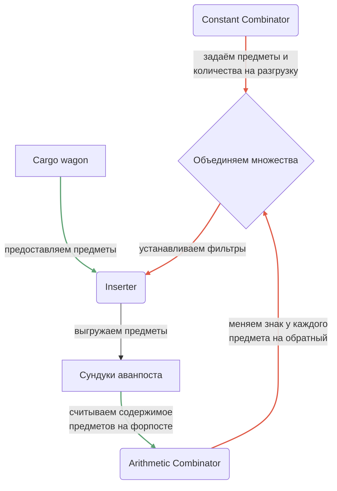

И вот наглядное воплощение в чертеже, тут мы переливаем топливо для огнемётных турелей по бочкам и возвращаем пустую тару назад:

*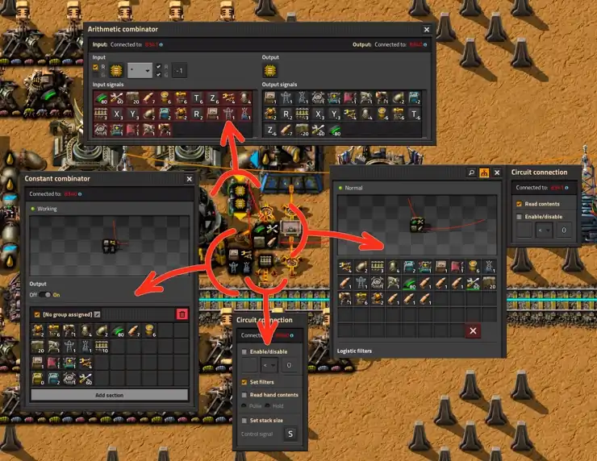*

Ничего нового чертёж не приносить, всё тот же самый метод объединения множества запрашиваемых предметов за вычетом уже имеющихся.

## Управление станцией разгрузки

Выше описанная схема объединения множеств также подходит и для управления доступностью станций снабжения на форпостах, то есть включения станции когда нужно доставить амуницию или строительные материалы на форпост и её отключения при достаточном количестве на форпосте. Схема становится ещё проще:


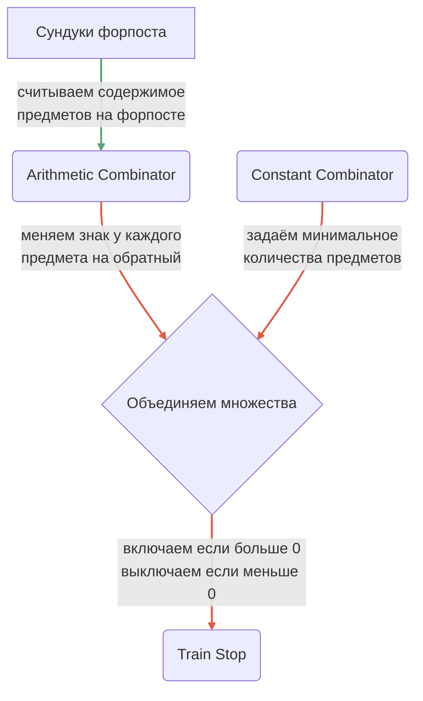

И вот непосредственно чертёж, который так удобно совместить с управляемой разгрузкой и о которой мы уже говорили в предыдущем разделе.

*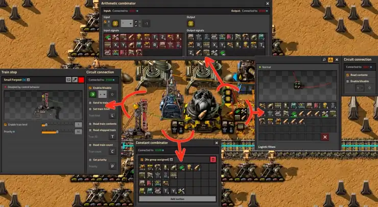*

Привожу полный чертёж станции разгрузки на форпосте с комбинатором управления доступностью станции:

```blueprint
0eNrtWd1u2zYUfhWDlwNVWLKk2Ma2y73AelN0gUDbjE1EfyWpZG5gYOuA9WJFB+x6D5Fuy1CsS/oK8hvtUJIt2aZjSU6ADmiCOBR/Ph6eP346vkIjP6ExZ6FEwyvExlEo0PD5FRJsGhJf9YUkoGiIOGE+WmDEwgn9Hg3NBdZNikZRHHFZmWgtTjGioWSS0Rw6e5h7YRKMKAckvFpNhKDByGfh1AjIeMZCalgIozgSsDgK1T4AaAwGTxyM5tDqP3FgownjdJxPsDGCNosVGg1iOTd8Np1JI2K+MSKcUx+tZngvEuKDHDAzjHhA1OF2ZLPWsrFQUC6hb1ces9tdCeRuC9TXgPbKA3MmZwGVbGyMo2DEQiIj/Q7maoeTLXyMwGSSR743ojNywWA9LCqBPRieZGBCDZwxLqRX2k3OM11dMC5BHWgtWT7DoGAGZUtBFYzCEpIoVzHAalFMOcnFQF/A0iiRcdICvCqTF1J5GfHzTFhOJ2goeUIxmnJKYZ8z4gu6gJ9drdp1TFW6jrKUBsXBO66sQXFLW+i0zymZeEzSQHhBNAGwLs77FCacVBIp8oMt1MCLhML5z5gPMmfnFrl182hZxZvSUzFjo7cQNzMNT7KFRrYPCL7j4kreICY887Mh+irrSJRBncUp/Go04q63kJACQkPIKNa66CBXylYAmJZeR2PGxwmTHg3JyC/tvOpee20LpyXhXELymKLcPIXHdrfO/nXu1+DVMvKyoxXuhfODeuqgMZ3U3/cpWihIuYqJb0HjfuebiIOulDUCEsKyfC/h+SxgssijWyo/KZGT0QpPp/LCD12d3fqbrgE6OJRjnFVs2FkW01mt9Mx2XjpNQkMmkIcbemempdWFskbzCQT60XhlOj7z4b+c8ejyAWDLfBSr+6g1jrOBY8jImHKYNWmPWEZ0wknIksDIAAVculPyEm7dhtDdCnbpupqLt6W8/cp9KZnvUz43xIz6DSGtCqRZuiSEOfCMS9IUzqnClT7JyYTw9mc1S28csalBfQgyDvQgjvwjfMi09RmlLVzlllSssLXerNIMjMO9NZ5RcUxmsA7kvLa4hxlbW2Qta2mbyDacmpMpbaPQajT3Kn6d0xRIjEcaqdfTUay2YKC/g7dyI/ReFd05iP7sCHS3otyYMG7EZHzejrWh2Cdzyr0JFWPO4oKApL+n79Nb+Ps3vU4/LN9A+y696Sxfp++XP6Yf0rtO+nH5Q3qT/gUzbpavYPSPDozcwvR36d8wAIuXv34XAtAdPN+qFXcw7x9Ae7t8vXy1fIM72bo/AeMa1sLDdXq7/Fmt66Tvlj9BPyB3YO1NB9p3agr0flSb6N64Bppkv76KdzlLb8VZnJ03L1wieCRRJI/wKUQuEMOCe+++inYbkyZzkzRtvot+ShTKemAK5X7aFMp+cAplPR6F6usp1FF050TLoI5jZe7DUiir+5lDteJQG5T7M4k6lkTZ/wsSZT0miTqWiLjd+5nIb0ArbrboxvIXDdnQcQJzv03uqcU6e6sYO0WmsgqVFxjrV+X0NTOzad3Y1rCX+yQXtCJaUUi8lzXUzjGqWp8IuomOUXRBOWcTqoqX43NPsJdUX7uqJN97j27uJW62DrVhddfWV3crSXcjVe4HcvYAubXkcdva9xGqok83y6HuluW/zIqXj1Fi1nqUTqcntXR68gnp9NmmTnvNdepHUybURfgI+uxXsibEvyJ+RRrYW7zv1QjFQQPYk9qwVrcBrFMf1mwA26sPazWANevD9mrDDupbrMKPDqI2MJhTH3WfvcCTL+FZxcbzHjYxXPTmKYYmPHSLpo372IKWU4472MKQgVUvfBbjagGGi1dNUIMY8ol1CjuoL+LUq8D6e26M4DITmQiOaw3swcDp212ra/cXi/8AU4SYwA==
```

## Больше подробностей

Радиопередача со многими деталями и глубоким смыслом:

[**](https://www.youtube.com/watch?v=XXXXXXX)

Смотрите и делитесь комментариями.
