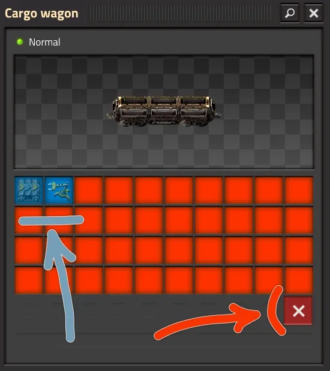
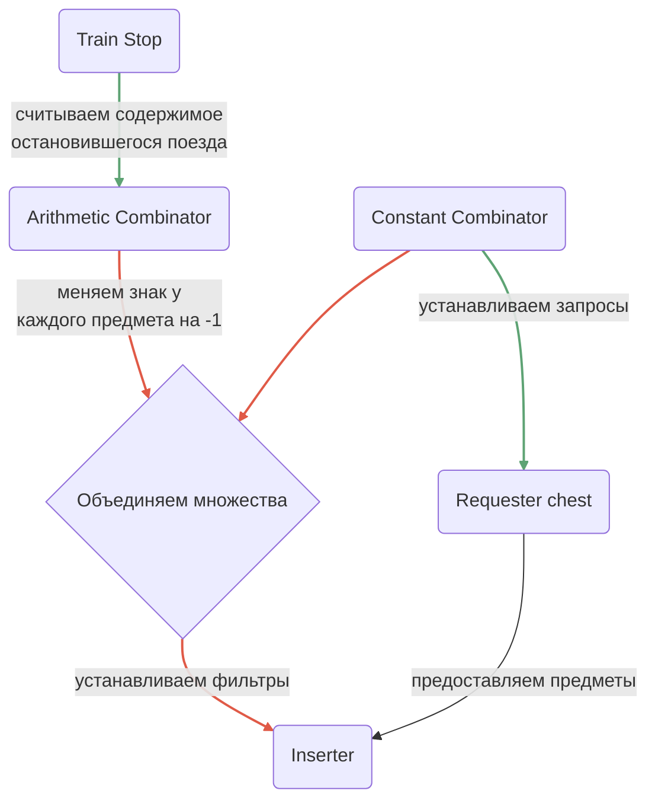
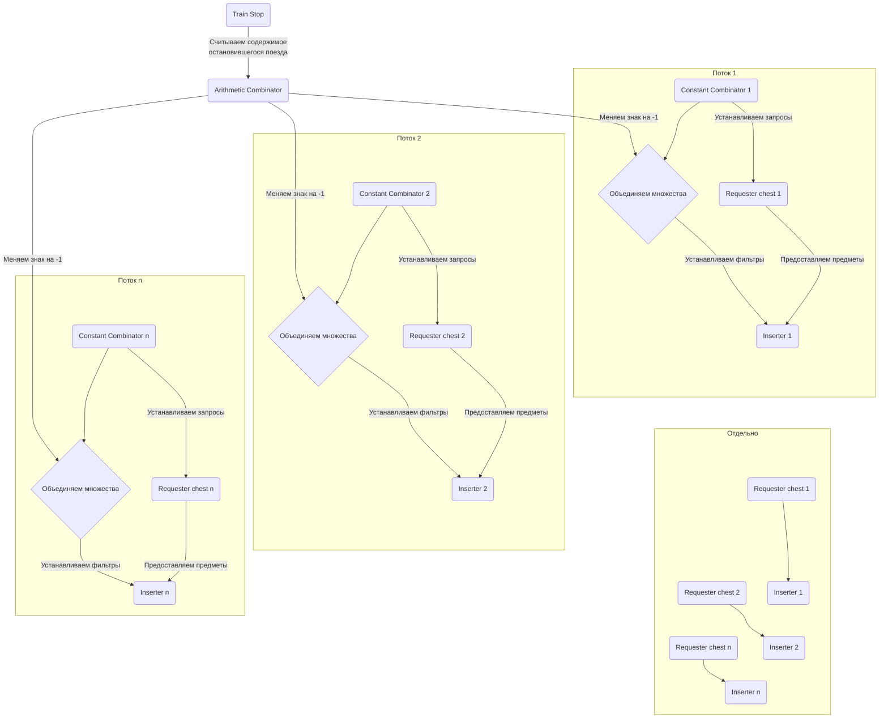

# Доставка разного барахла

:::danger
Это заготовка для будущей статьи, сейчас она не рекомендуется для изучения, а в будущем может измениться или вообще исчезнуть.
:::

:::tip Jlovber: Jlovo’s boxes, Yber’s wheels.
We are driving you to the safety of the shelter, packing your garbage into boxes, and delivering whatever you can salvage. Просто и понятно...
:::

В любой игре *Factorio* у подавляющем большинстве случаев ваши поезда чинно возят единственный ресурс туда, полностью загружаясь на станции погрузки и сюда, полностью разгружаясь на станции разгрузки. Но иногда возникает потребность отвезти кучу разного хабара, как правило, с центра фабрики на окраину, например, для [снабжения фортификаций](../MilitaryOutposts/Biggest.md), сдерживающих [экспансию местной фауны](../MilitaryOutposts/README.md#экспансия-жуков), или для строительства очередного [добывающего аванпоста](../MiningResources/Autotorio.md).

Стандартный грузовой вагон `Cargo wagon` перевозит по 40 ячеек (али слотов) предназначенных для наполнения различным барахлом. Но если класть всё подряд без разбору, то какой предмет куда попадёт и в каком количестве, про то ведает только *Кетцалькоатль*. Без автоматизации погрузки, грузовой вагон переполнится не тем количеством предметов, загружающие манипуляторы ваще заблокируются, а локомотив застрянет на станции погрузки, как Чапаев на Марсе. Те же проблемы характерны и при разгрузке на месте назначения с похожими симптомами. В результате вся такая автоматизация превращается в ручной перебор и очистку грузовых вагонов.

## Фильтрация ячеек грузового вагона

Начнём с простой автоматизации. Сначала нужно отфильтровать ячейки грузового вагона и назначить каждой свой тип предмета. Для этого достаточно выбрать какой-то грузовой вагон и прожать средним батоном мыши (поведение настраиваемо через настройки управления) на выбранной ячейке и в открывшемся списке игровых предметов, указать на интересуемый (синяя стрелка). После этого в данную ячейку можно будет загрузить только выбранный предмет. При необходимости можно нажать красную кнопку под ячейками и ограничить количество доступных слотов (красная стрелка).

Пример настройки грузового вагона, в который можно загрузить по одной стопке конвейеров и манипуляторов и ничего окромя более:

**

Фильтрацию ячеек грузового вагона действительно стоит устанавливать всегда. Даже если вы абсолютно уверены, что поезд никогда не уйдёт по другому расписанию, глупая ошибка может случиться в самый неожиданный момент. Достаточно случайно перепутать название какой-то станции и вместо *"Разгрузка Железной Руды"* написать *"Разгрузка Медной Руды"*, как вся логистика полетит в тартарары. Без ограничительной фильтрации ячеек поезда моментально развезут не те предметы по всей игровой карте, и я искренне желаю вам удачи разбирать потом всю захламлённую фабрику, выковыривая чужеродные пластины с конвейеров.

:::info Всегда устанавливайте фильтры
Предотвратить логистический кошмар на этапе настройки поезда гораздо проще, чем ликвидировать последствия случайностей на огромной фабрике.
:::

## Размещение станций погрузки

[**](pathname:///blog/2026/05/17/grand-opening-transport-company)

Станции погрузки для поездов с разношерстной перевозкой предметов стоит размещать поближе к производимому хабару. В самом начале строительства большой фабрики, то есть [после запуска первого спутника](../HowToStartNewGame/AfterSatelliteLaunch.md), логично держать станцию погрузку ближе к [заводам снабжения, яки моллам](../HowToStartNewGame/Mall.md), но по мере роста фабрики и увеличения количества [форпостов](../MilitaryOutposts/README.md) один единственный завод снабжения может перестать справляться с нагрузками. Эти маленькие фабрики лениво создают всевозможный хабар понемногу, удовлетворяя базовые нужды инженера. Строить второй аналогичный завод снабжения бессмысленно ибо для бесперебойного снабжения удаленных форпостов или производства предметов расширяющих фабрику потребно производить не весь игровой ассортимент, а только строительные расходники и амуницию для фронта.

Поэтому стоит задуматься о возведении отдельного заводика снабжения форпостов и отдельный заводостроительный комбинат, а станции погрузки размещать поблизости. Для всего такого отлично подходит [архитектура масштабируемых сити-блоков](../FactoryDesign/README.md), позволяющих легко играться перепланировкой в зависимости от потребностей растущей фабрики.

## Погрузка нескольких предметов в грузовой вагон

Организация подачи десятков разных предметов на погрузку может вызвать инженерное безумие. Вы вряд ли будете доставлять предметы к станции погрузки по конвейерам, поскольку хабара потребуется много не в количественном исчислении, а именно в ассортименте. Целесообразно использовать транспортных дронов, которые будут оперативно доставлять нужные предметы в сундуки запроса. Один такой сундук заменяет громоздкие конвейерные развязки, позволяя гибко настраивать объемы и типы загружаемых ресурсов. Но помните, что транспортные дроны действуют эффективнее на небольших расстояниях. Посему старайтесь максимально уютно организовывать производство и станцию погрузки.

Поначалу кажется заманчивым использовать всего один сундук, чтобы загрузить абсолютно все предметы в отфильтрованные ячейки поезда, но здесь в силу вступает своеобразный алгоритм работы манипуляторов в игре. Когда манипулятор взаимодействует с сундуком, он всегда пытается взять максимально доступное количество предметов за один раз. Для массового манипулятора `Bulk inserter` максимальный стек равен двенадцати единицам, а для быстрого манипулятора `Fast inserter` трем штукам, в платном моде *Space Age* есть пакетный манипулятор `Stack inserter` на шестнадцать штук. Если в грузовом вагоне под конкретный ресурс осталось свободно места меньше, чем уже взято манипулятором, то произойдет глухая блокировка манипулятора до прибытия следующего поезда, способного принять этот остаток ресурсов. То есть ваш состав застопориться на станции погрузки либо уйдёт в рейс не погруженным.

Ограничение размера пачки манипулятора до одной единицы через специальную настройку в интерфейсе (*Override Stack Size*) выглядит очевидным, но далеко не самым лучшим способом преодолеть блокировку. Манипулятор действительно физически не сможет взять большее число предметов, чем осталось свободного места в отфильтрованных ячейках грузовых вагонов. Однако подобный костыль критически снижает скорость погрузки и увеличивает время простоя поезда на станции. На картинке демонстрируется пример переопределения размера пачки массового манипулятора и при таких настройках его уже следует заменить на быстрый манипулятор, так как скорости вращения у них одинаковые:

**

Дабы побороть проблему скорости погрузки следует увеличить число сундуков запроса и связанных с ними манипуляторов, когда каждая отдельная пара настраивается на загрузку строго одного типа хабара. Даже если какой-то манипулятор заблокируется с зажатым остатком, это будет означать, что он уже полностью забил вагон своим ресурсом, а остальные необходимые предметы загрузят другие манипуляторы. Но и такой метод имеет свои жесткие физические пределы, обусловленные габаритами грузового вагона, в который можно одновременно погружать из двенадцати сундуков расположенных по шесть с каждой стороны вагона или по двадцать четыре предмета при использовании длинных красных манипуляторов расположенных в два ряда с каждой стороны.

**

Предложенных выше вариантов организации погрузки хватит с лихвой на многие игровые случаи, особенно при снабжении строительных поездов, которые забиваем предметами под завязку и отправляем [возводить очередной добывающий аванпост](../MiningResources/README.md#как-строить-добывающие-аванпосты). Но для [снабжения фортификаций](../MilitaryOutposts/README.md#планирование-снабжения) следует поискать решения получше и сделать всё посложнее.

## Погрузка списком через объединение множеств

И вот из кустов появляются комбинаторы... Для управления погрузкой возьмём за основу вариант использования через [объединения множеств](../CircuitNetwork/Combinators.md#объединение-множеств), который позволяет через определение списка предметов организовывать их погрузку в поезд. Нам потребуется постоянный комбинатор `Constant combinator`, на котором определим список всех предметов для загрузки в поезд, а также необходимые количества. Через железнодорожную станцию `Train stop` будем получать список предметов уже загруженных в поезд и их количества. Воспользуемся арифметическим комбинатором `Arithmetic combinator`, чтобы вычесть количества уже загружённых предметов из списка запрашиваемых. И под конец задаём в качестве фильтров на загружаемом манипуляторе `Bulk inserter` результат этого вычисления. Если предметов в поезде меньше чем, запрашиваемое количество на постоянном комбинаторе, фильтры будут установлены для манипулятора, если меньше, то фильтров не будет. Тот же сигнал от постоянного комбинатора можно подать на сундук запроса, чтобы запрашивать недостающие предметы из логистической сети, но по другому цветному проводу, чтобы сигналы для фильтрации манипулятора не смешивались. Вот схема реализации, которая позволяет одним манипулятором загрузить все предметы в грузовой вагон:



Но тут всё равно важно помнить, что манипулятор может быть заблокирован, если возьмёт предметов больше чем свободного места в грузовом вагоне. Поэтому устанавливайте число загружаемых предметов, меньше чем размер стопки за вычетом размера пачки манипулятора. Также понимаем, что хотя это схема и рабочая, но медленная, так как задействован всего один манипулятор на целый вагон. Вышеописанная схема в действии:


Займёмся полировкой и доведением до приемлемого варианта. Первым делом вынесем погрузку на отдельные сундуки запроса и манипуляторы тех предметов, чьи количества мы не хотим особо контролировать и которые мы загружаем по самые гогошары. Это стены `!Wall`, патроны `!Uranium rounds magazine`, артиллерийские снаряды `!Artillery shell`, ремонтные комплекты `!Repair pack`, иногда топливо в бочках `!Light oil barrel` и даже дроны `!Construction robot` `!Logistic robot`, что производится быстро и быстро расходуется на форпостах. Такие предметы можно загружать и двумя манипуляторами сразу ещё больше увеличив скорость загрузки, главное не загружать несколько предметов одним манипулятором.

Вторым делом, можно разделить погрузку на несколько постоянных комбинаторов и связанных манипуляторов, чем увеличим скорость загрузки предметов. Но тут продолжает действовать главное правило, что каждый предмет загружается через свой манипулятор и постоянный комбинатор и не дублируется, иначе может произойти блокировка манипуляторов. Схема выглядит так:



И вотана наглядная демонстрация задуманного. Сверху у нас манипуляторы погружающие без контроля предметы в вагон. Один манипулятор выгружате пустые бочки пришедшие с форпостов. Из-за нехватки места сверху мы загружаем ремонтные комплекты снизу, тоже без контроля. Остальная погрузка снизу разделена на четыре манипулятора, которые соединенны со своими постоянным комбинаторами, согласно схеме выше:

**

И вот вам готовый чертёжик со всеми важными нюансами для детального изучения:

```blueprint title="Пример станции погузки для снабжения"
0eNrlWt1u2zYUfhVDl4NUWD+0pAB7i91lhUBbtE1MElWKSpcVBrYOWG+K7QX2EO26DMW6pK8gv9EOJTuyV9nWUYosQS8CU9ThZ/I7Hw/PofPCmCYlyyXPlHH2wuAzkRXG2fkLo+CLjCa6L6MpM84MSXlirEyDZzH73jizV09Ng2WKK86aEfXDZZSV6ZRJMDC3IwsFYxdLZdUQppGLAkaJTIMDkmUT1zQuYUQQAn7MJZs1r72V+Qmsg4C1+8O6/WG9sD+sh4D1+8MSBCzpDztBwCJc5iNgES4L+sO6CJeFCFiEy+wxAhfhMxuxz1yE0+x2o2nYzCqUyI9t3tDdB9UAEE2UFEk0ZUt6wYXUgwqWxZESUY1qnM1pUjDTkIzG0VyKdNuvZAnd9UOkvzpncdTGJHWZ65ldcKlKqte6paC2sL4xVjCZQtFmKgYYpDQDywa9iBKecqWDWMfC21Aw5QuLJbAgyWdWLhJ2LMqEzqoLrY0AUkxFLqTq1H1wC6K5eFayQkVznigmi4a0mtUm0LYRuPMb2+Awp4WyYLlMAk53cHhCtt57QjrR2piwmRaT1mwJnyfwHMDrFsCMy1nJVZSKmEViHomcyY2jgMrtWxgZ1+ARy+g0YfFGKgh+TOPWYq93s55S0oyXqSVFmcWFldIF/YFn2sfPQClAAthkQqa1vmYizSlMUy/B+LruKPWR6Y3H4IZuR/gIR3gnHRGgHOE9IkdQqXiSMHlpFUuWJDgHuIf5DxH8O6f4d8Yo/p1HxD+E14xZzyme+oPcOzaCe/ck9w6Ke/cRcb85qj8T6y6KJ/sR8ZTUiY3giTWlUjIkZ+QwZR5CqPZJoWLO3vEe2l7uFJxgA8GBLtPKgrX868Sqa+rtQU9hFhfMyqW44PFRBY33FNSF6uOSKZccS6acAF9ThqRHTRnii8o+uO4YX1X2wrXxZWUvXAdfV/bCdfGFZS9cD19Z9sIl+NKyF+4EX1v2wvXxtWUv3ABfW/bCbffbtJQZhJijgTK4jTKTTwJl150LLlNr0f0a/TMdWFk5SxiV1rzEHlb2obPK202ZuVqmTEEoBZgpz2qYzu3fLu+TM6brwG+R21O9JmHOJbDSuwRndLbU14XAHcBoLCjH9fIsWMVOFmF8BUNFqfISDb7qJKmNYSmLdX138tDxJnsC6wJ1BxZf/v+fWB3QkjeoOJ10ZCrHVlcw9d/Mo1c24g27xLi36Q29FXm4evAHFWz3RngwsAJ8uISHA+8THuyKyHjQfct9SYjYgyq9XikHcQYW3v7Dv6BgOeXSyunsu892M0pcTP7nIvM/4mGc4T6e/I8QdGrjhqdSG9IeZdsc7VRK2aYDwUH5tpQNvReLqcTxFurVbYCco9cOCNDJDuhOFVtOtz8uDUZrVbojftRyG5kYeUIvmYxiVswkzzdZdfV79b66hr9/qjfVh/VraN9UV6P1q+r9+qfqQ3Uzqj6uf6yuqj/B4mr9Et7+MYI312D+tvoLXsDg9W/fZgB0A8/XesQN2P0NaL+uX61frl+bo3rcO8B4A2Ph4U11vf5FjxtVb9c/Qz8gj2Ds1QjaN9oEej/qLzG6pOijpUjuQYqLMrNUKSVTyH3sdAoyoeDtuwO2Ypwn8KmWUjwfiNutypznbPgGJHs4lhLWov6d7YvXeIDWuHMPGudSZLdn5EDpHMuB7hxxu8m6s8gP3aN82RoN0Rp17yMlaP9/4s4Krdcly3oSlgZGojrjTpUmYsELLaZhkI9bSE9N4zlk5tp757Zj2qZnm/ZT89x2TWI6vkmgrT9MyGN1G167pkdqG8/Z6XdNeJqYzrbteU3b05h+Y1+3N2OJttnYT/RYv2mDqQlFqd20wSZo+gNtEzbtULeDnfYY2rASrliqs8fbf440jQtQZu0LMnFCLwxJ4I2dsResVv8C77eszw==
```


## Разгрузка списком

пример


## Управление станцией разгрузки


пример

## перевозка жидкостей


## Больше подробностей

Радиопередача со многими деталями и глубоким смыслом:

[**](https://www.youtube.com/watch?v=XXXXXXX)

Смотрите и делитесь комментариями.
