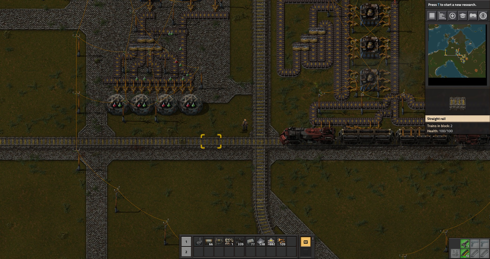
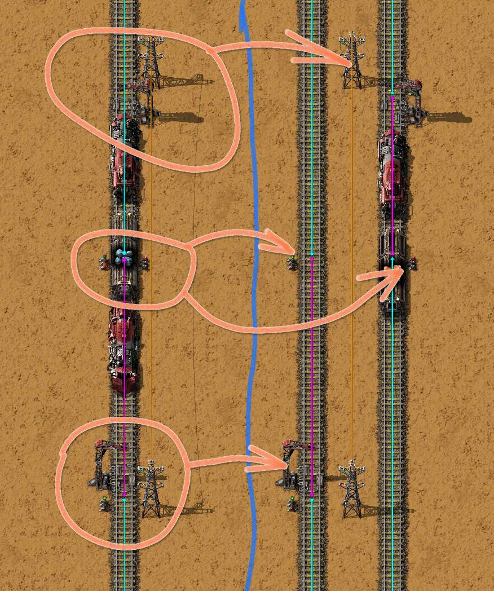
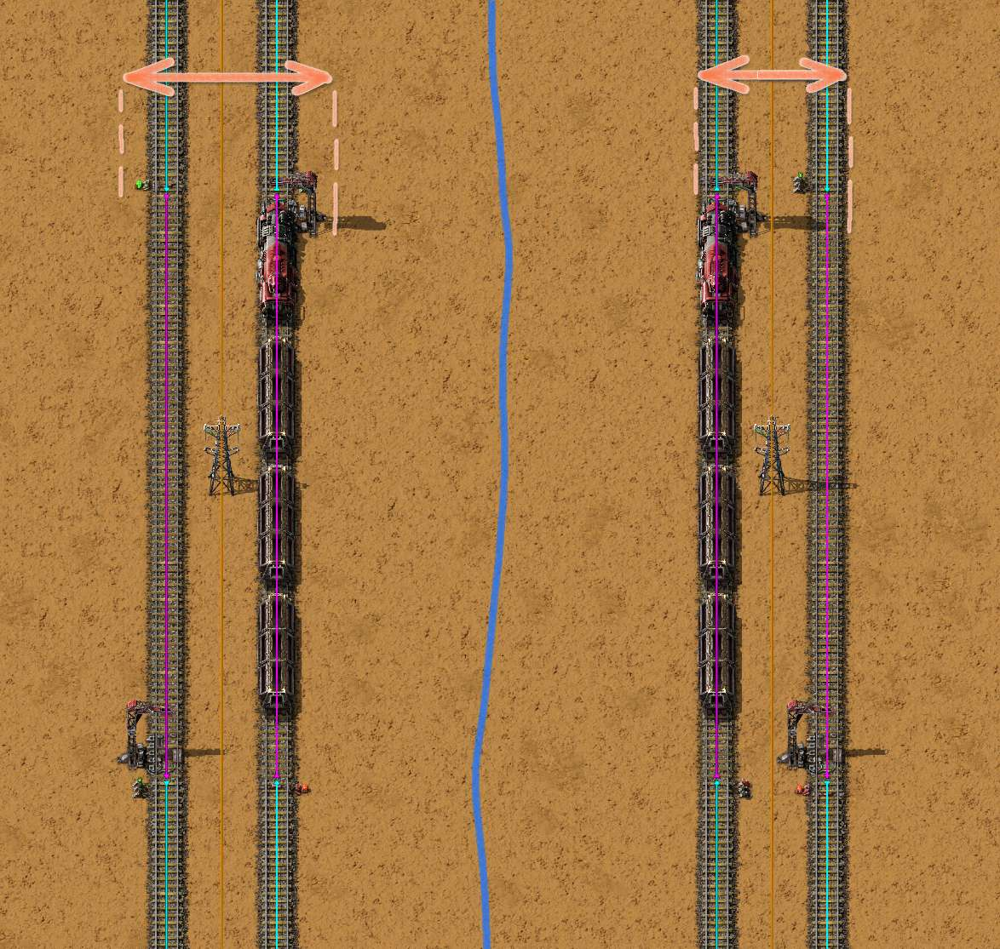

# Основа строительства железных дорог

:::tip Вся статья, кратко **
Как и большинство *Homo erectus* ты наверное правша, то есть с развитым левым полушарием моСКа? А значить и железные дороги в *Factorio* ты строишь правильно, у тебя всё левостороннее.

ЩЫТО?! Правосторонние? Ты что, в Китае родился? Ещё в Римской Империи всё ездило по левой стороне!!! Эх ты... а ещё ынжынэээр...
:::

## История железных дорог на планете Nauvis

Современники спорят, какими были первые железные дороги на ранних версиях игры *Factorio*? В те времена, когда движухи ещё не было, эрэктусы и прочие сапиенсы сидели дома на изоляции и карантине проводя время за разными игрульками и строили свои первые фабрики. На основании закрытых исторических документов можно сказать, что ваша первая игра *Factorio* выглядела так, как она не выглядит сейчас. Без светофоров, одноколейная дорога, один локомотив, только *hardcore* с пешеходными дорожками вымощенные камнями... узнаёте её?

Но время шло, базы разрастались, кто-то даже спутников парочку позапускал и... стало приходить осознание, что одноколейные железные дороги являются узким местом для расширения производства. И пришло осознание, что рельсы можно делать двухколейными, чтобы поезда могли ходить туда-сюда одновременно и расходиться друг с другом без помех. И как же можно из одноколейной железной дороги получить двухколейную? Да просто добавляем рядом ещё одно железнодорожное полотно. И поскольку большинство сапиенсов обладают развитым левым полушарием, то есть большинство таки правши, то по законам жанра добавляли оные персонажи новую колею с права от существующей перенося светофоры с одной колеи на вторую также с права. Так и появилось правостороннее движение на железных дорогах в *Factorio*.

Наглядная демонстрация появления, слева одноколейная железная дорога из ранних версий игры, справа двухколейный выкидыш из немного более поздних игр:

Время опять ещё шло, базы ещё росли и стали появляться вопросы.

:::info Правильные вопросы
А правильно ли располагать светофоры снаружи железнодорожного плотна? А может выгодней располагать светофоры внутри железнодорожного плотна, между двумя рельсами, там где мы проводим линию электропередач?
:::

## Правильный ответ на правильные вопросы

Давайте сравним две возможные реализации железнодорожного движения в игре. Для этого воспользуемся диалектическим материализмом в *Factorio*, эти принципы изложены в отдельной статье посвященной [оценкам чертежей на основе категорий качества](../Additionals/QualityAssessment.md#какие-оценки-качества-есть-в-factorio). Следующая картина маслом демонстрирует всё, намного лучше любых слов, слева у нас правостороннее движение, с права левостороннее.

Очевидно, что оба чертежа требует для своего построения одинаковое количество ресурсов из которых мы произведём все необходимые предметы. Однако, по занимаемому месту, чертёж с правосторонним движением занимает больше места. Внешнее расположение светофоров и железнодорожных станций приводит к тому, что чертежу нужно больше свободного пространства. Следовательно, чертёж с левосторонним движением более оптимален в *Factorio*.

:::info Не удобный вывод для некоторых
Используйте левосторонее железнодорожное движение, оно оптимальней расходует ресурсы
:::

## Больше подробностей

Детальный разбор скоро появиться на YouTube канале.
