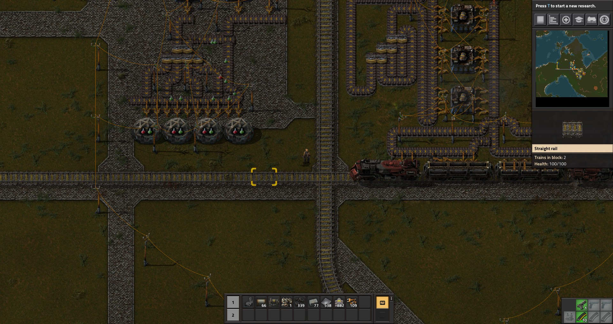
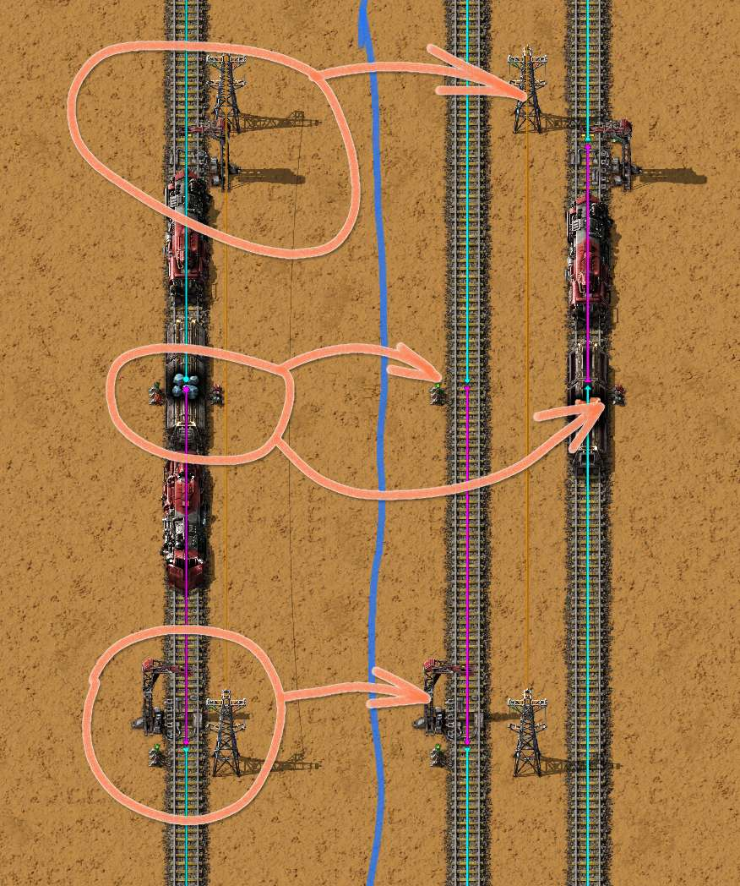
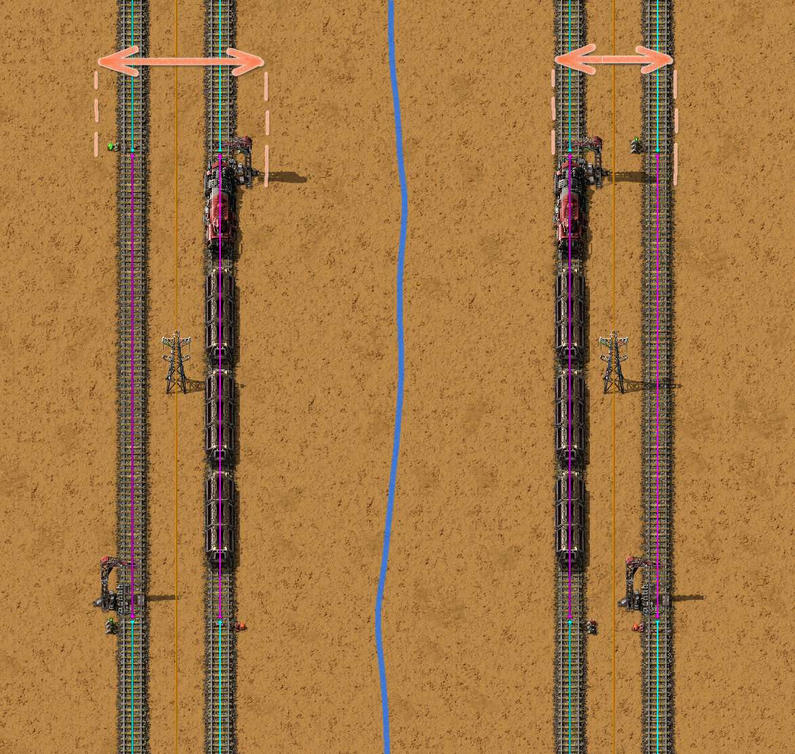
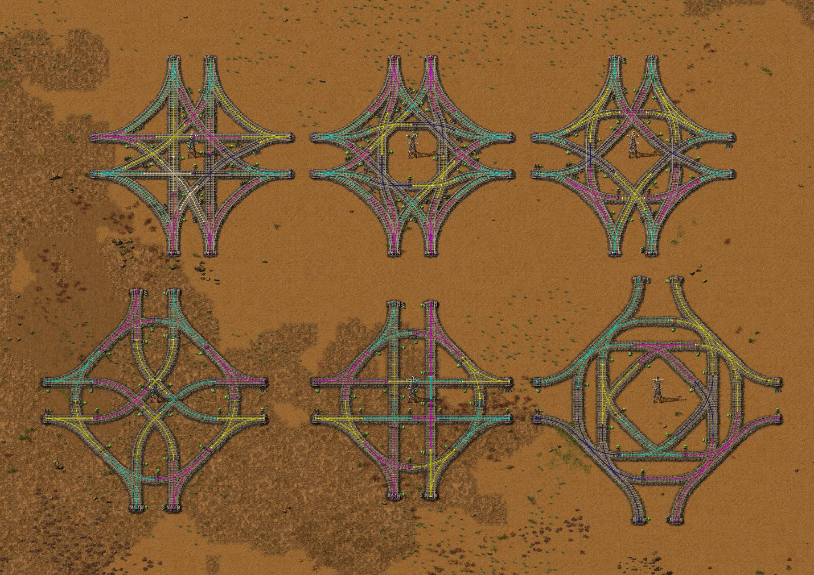

# Строительство железных дорог

:::tip Вся статья, кратко **
Как и большинство *Homo erectus* ты наверное правша, то есть с развитым левым полушарием моСКа? А значить и железные дороги в *Factorio* ты строишь правильно, у тебя всё левостороннее.

ЩЫТО?! Правосторонние? Ты что, в Китае родился? Ещё в Римской Империи всё ездило по левой стороне!!! Эх ты... а ещё ынжынэээр...
:::

## История железных дорог на планете Nauvis

Современники спорят, какими были первые железные дороги на ранних версиях игры *Factorio*? В те времена, когда движухи ещё не было, эректусы и прочие сапиенсы сидели дома на изоляции и карантине проводя время за разными игрульками и строили свои первые [макаронные фабрики](../HowToStartNewGame/README.md). На основании закрытых исторических документов можно сказать, что ваша первая игра *Factorio* выглядела точно так, как на картинке ниже. Без светофоров, одноколейная дорога, по одному локомотиву с каждой стороны поезда направленные в разные стороны, *hardcore* с пешеходными дорожками вымощенные камнями... узнаёте её?

Но время шло, базы разрастались, кто-то даже спутников парочку позапускал и... стало приходить осознание, что одноколейные железные дороги являются узким местом для расширения производства. Ещё пришло осознание, что рельсы можно делать двухколейными, чтобы поезда могли ходить туда-сюда одновременно и расходиться друг с другом без помех. И как же можно из одноколейной железной дороги получить двухколейную? Да просто добавляем рядом ещё одно железнодорожное полотно. И поскольку большинство сапиенсов обладают развитым левым полушарием, то есть большинство таки правши, то по законам жанра добавляли оные персонажи новую колею с права от существующей перенося светофоры с одной колеи на вторую также с права. Так и появилось правостороннее движение на железных дорогах в *Factorio*.

Наглядная демонстрация появления, слева одноколейная железная дорога из ранних версий игры, справа двухколейный выкидыш из немного более поздних игр:

Время опять ещё шло, базы ещё росли и стали появляться вопросы.

:::info Правильные вопросы
А правильно ли располагать светофоры снаружи железнодорожного плотна? А может выгодней располагать светофоры внутри железнодорожного плотна, между двумя рельсами, там где мы проводим линию электропередач?
:::

## Правильный ответ на правильные вопросы

Давайте сравним две возможные реализации железнодорожного движения в игре. Для этого воспользуемся диалектическим материализмом в *Factorio*, эти принципы изложены в отдельной статье посвященной [оценкам чертежей на основе категорий качества](../Additionals/QualityAssessment.md#какие-оценки-качества-есть-в-factorio). Следующая картина маслом демонстрирует всё, намного лучше любых слов, слева у нас правостороннее движение, с права левостороннее.

Очевидно, что оба чертежа требует для своего построения одинаковое количество ресурсов из которых мы произведём все необходимые предметы. Однако, по занимаемому месту, чертёж с правосторонним движением занимает больше места из-за внешнего расположения светофоров и железнодорожных станций. Следовательно, чертёж с левосторонним движением более оптимален в *Factorio*.

:::info Не удобный вывод для некоторых
Используйте левостороннее железнодорожное движение, оно оптимально расходует ресурсы
:::

:::warning Не все поймут, ещё меньшие дочитают абзац до конца
При выборе между правосторонним и левосторонним движением поездов в *Factorio* наблюдается выраженная пространственная асимметрия. Поскольку в игре действует жёсткий регламент, предписывающий размещение светофоров строго по правой стороне вектора движения, то при правостороннем движение эти сигнальные конструкции оказываются ориентированы во внешний контур железнодорожного полотна и внутрь city‑block. Это приводит к тому, что сигнальный слой формирует интрузивный след, физически вторгаясь в полезное пространство city‑block и накладывая прямые ограничения на размещение производственных структур. В левостороннем движении топология меняется принципиально. Сигналы располагаются со стороны железнодорожного полотна, оставаясь в пределах двухпутного коридора, то есть сигнальная подсистема остаётся externally localized, а city‑block сохраняет свойства модульной изоляции, поскольку его внутреннее пространство более не пересекается с инфраструктурными элементами транспортного уровня. С точки зрения системного анализа, правосторонняя топология демонстрирует нарушение принципов information hiding и частичную утрату orthogonality между транспортным и производственным уровнями. Низкоуровневое правило размещения сигналов порождает coordinate‑level coupling, при котором внутренняя планировка блока вынуждена адаптироваться к геометрическому диктату сигнальной инфраструктуры. Это приводит к interface permeability, когда city‑block перестаёт функционировать как полностью инкапсулированный модуль и становится чувствительным к деталям реализации железнодорожной сети. Таким образом, при правостороннем движении внутренняя застройка фактически узнаёт о транспортной подсистеме через вынужденное смещение своих построек, а проектирование базы превращается в multi‑constraint spatial task с неявными cross‑layer зависимостями. Левостороннее движение, напротив, устраняет эту форму когнитивного проникновения и восстанавливает модульную автономность city‑block.
:::

Может возникнуть сомнения, например относительно перекрёстков, можно ли использовать их нормально в левостороннем движении? Возможно могут возникнуть и другие проблемы? Ответ прост, усё будя супер. Нет никаких проблем с перекрёстками ни чем-либо ещё. Практически все перекрёстки, которые могут вам понадобиться в игре существуют как в левостороннем исполнении, так и в правостороннем. А движение поездов ничем не отличается, что по правой стороне, что по левой.

И вот вам несколько перекрёстков на два железнодорожных рельса с левосторонним движением. В верхнем ряду перекрёстки без разворота, в нижнем ряду с разворотом. Все они покроют ваши потребности в организации железнодорожного движения.

Выбирайте на свой вкус, цвет и влажность используя органолептические способности... Но с точки зрения [оценки качества чертежей](../Additionals/QualityAssessment.md#какие-оценки-качества-есть-в-factorio), самый эффективный это средний в нижнем ряду именуемый `Round About + Cross`. А ещё лучше, он же, но без `Cross` в центре.

## Больше подробностей

И вот вам радиопередача на трубе, где всё это объясняется и разжевывается, смотрите и делитесь комментариями:

[**](https://www.youtube.com/watch?v=uq0NMMY9YsE)
