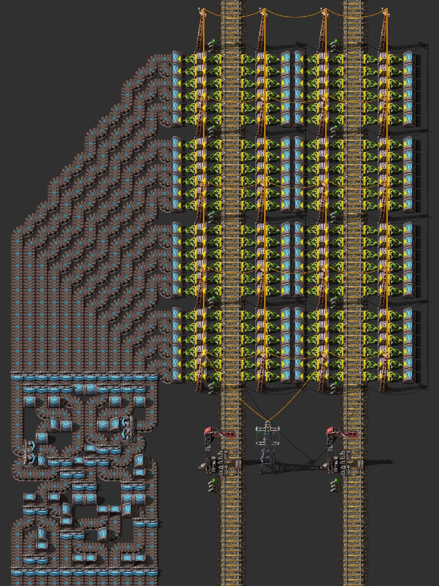
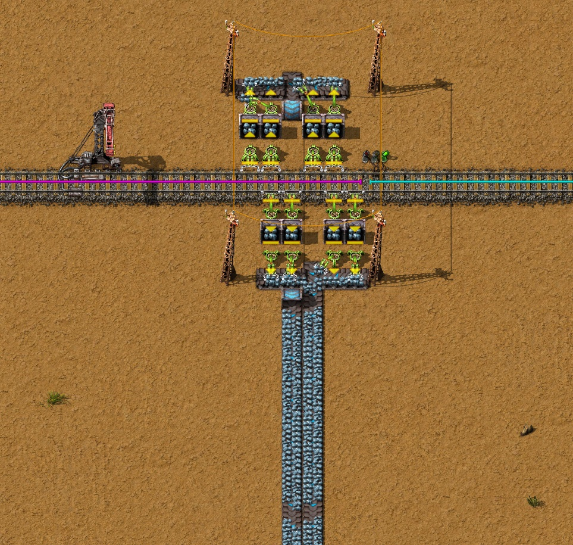
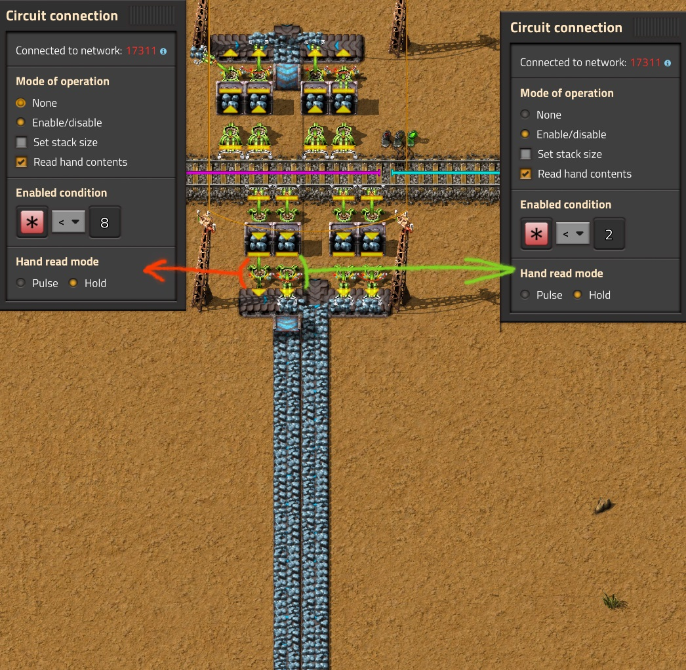
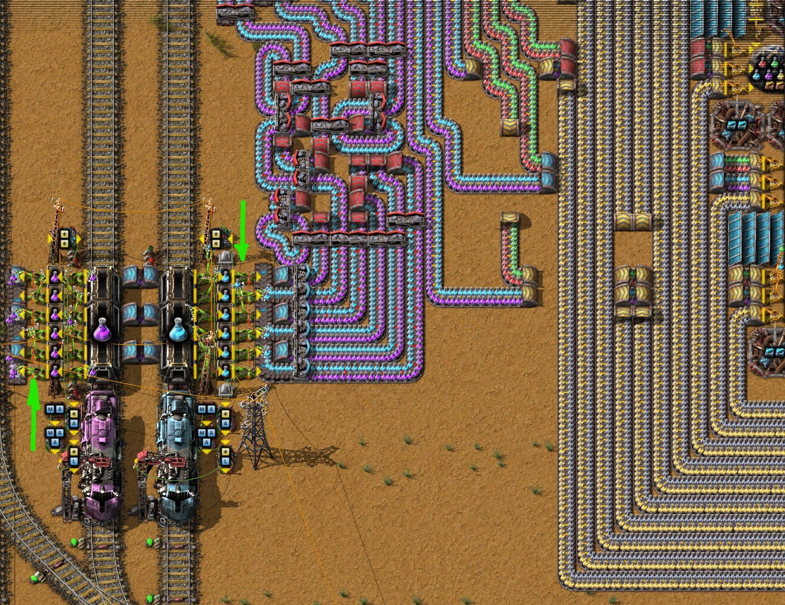

# Синхронизация манипуляторов при разгрузке предметов

> Согласно [Factorio wiki](https://wiki.factorio.com/Inserters#Chest_to_belt) 6 пакетных манипуляторов `Stack inserter`, пристыкованных с одной стороны грузового вагона, способны постоянно выгружать примерно 1.85 полных полос экспресс-конвейера `Express transport belt`, если каждый манипулятор будет выгружать на _выделенную полосу (lane) конвейера_. [Пруф](/blog/2024/04/18/checking-the-unloading), но это не точно.

Можно объединить манипуляторы с двух сторон вагона, чтобы получить выгрузку на три экспресс-конвейера, но всё равно будут промежутки на конвейерах из-за несинхронной работы манипуляторов. Если требуется постоянная выгрузка имеющиеся разрывы на линии конвейеров придётся как-то затыкать, например второй станцией разгрузки.

:::tip А что если попытаться синхронизировать работу двух пакетных манипуляторов на одну линию конвейера?
Тогда может получиться выгрузка трёх *полных линий* экспресс-конвейера с одной стороны вагона. Одина *полоса конвейера* состоит из двух *линий конвейера*, то есть одна *линия конвейера* это ровно *половина полосы конвейера*. А ещё лучше, если получиться выгрузка трёх полных полос конвейера с обеих сторон вагона без второй станции разгрузки.
:::

Легко сказать...

## Односторонняя выгрузка по два манипулятора на линию конвейера

Сначала попробуем поиграть парой манипуляторов, расположенных на одной стороне вагона. То есть, чтобы два рядом стоящих пакетных манипуляторов выгружали на одну и ту же линию конвейера. И вот тут фантазии хватает максимум на два конвейера, не выходя за размеры вагона.

Как и ожидалось, полосы конвейера заполняются не полностью, а нужно чтобы _"не было ни единого разрыва"_. Решаем проблему комбинаторикой. Для этого соединяем красным или зелёным сигнальным проводом два манипулятора, выгружающих на одну линию конвейера. Задаём управление манипулятором на включение/выключение и читаем содержимое руки манипулятора. Методом проб и ошибок подбираем такие значения предметов в руке манипулятора, чтобы выгрузка была ровной (значения для правого и левого манипуляторов отличаются и зависят от чертежа).

И вот мы добились чтобы в каждый момент времени, только один манипулятор выгружал щёта на линию конвейера. Организовать выгрузку трёх полных полос конвейера пока не получается, но зато теперь есть вариант чертежа, где два пакетных манипулятора `Stack inserter` полностью выгружают одну линию экспресс-конвейера `Express transport belt` (пол конвейера).

### Куда бы присобачить?

Предлагаемый вариант выгрузки имеется довольно практичное применение. С его помощью можно легко объединять выгрузку различных предметов с двух разных поездов на разные линии конвейера. То есть, некий аналог не перемешанной выгрузки разных предметов на линии конвейера. Вот пример, где два близкорасположенных поезда позволяют таки протянуть подземные экспресс-конвейеры:

Такой вариант выгрузки нам очень пригодиться, когда будем строить мега-фабрику. Здесь у нас имеется всё хорошее. И шесть манипуляторов с одной стороны вагона и не перемешанное содержимое конвейера и вокзал компактный.

## Двухстороння выгрузка по два манипулятора на линию конвейера

А теперь выдумаем такой чертёж, чтобы два пакетных манипулятора выгружали на одну и ту же линию конвейера, но располагались по разные стороны вагона. Это бы дало заветные три полных конвейера одинаковых предметов.

:::danger TBD
и всё тут будя, когда-нибудь
:::
