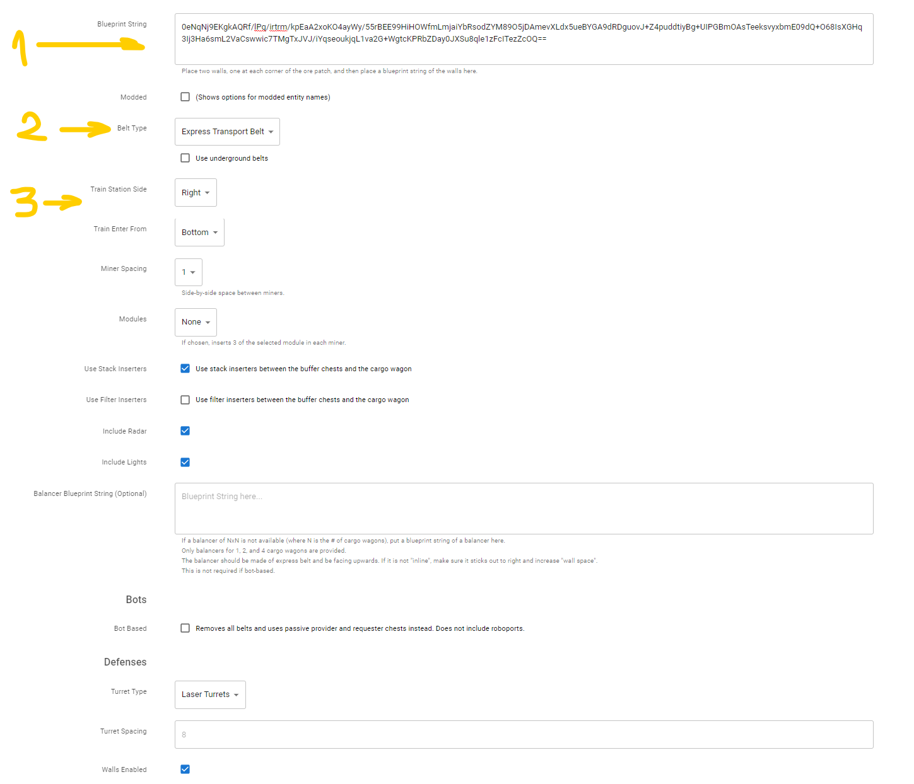

# Строительство шахтёрских аванпостов на автомате

:::tip Вся статья, кратко
[www.autotorio.com](https://www.autotorio.com/)
:::

Можно строить и на пулемёте, смотря как смотреть. А смотреть мы будем на одну тулзу, которая помогает строить большие шахтёрские аванпосты по добыче ресурсов, будь то нефть, уголь, камни или какая-то прочая руда, кроме урановой. К сожалению с урановой рудой беда, но урана обычно хватает и с одного месторождения, поэтому не грешно и руками построить. Хотя при определённой кривизне рук, можно и попробовать на авто-пулемёте. Сама тулза называется [*Autotorio*](https://www.autotorio.com/outpost) и про неё собственно и будем говорить.

:::warning Будет много картинок
и не только
:::

Строить такие шахтёрские аванпосты очень просто. *Autotorio* имеет много разных параметров и настроек. Можно дополнить строимый аванпост стенами, лазерными турелями, даже зачем-то закатать всё в бетон. Вокзал погрузки и балансеры прилагаются.

## Руда, камешки и уголёк

Для возведения добывающего сыпучие ресурсы аванпоста ставим одну стену `Wall` в верхнем левом углу месторождения (1). Ставим такую же стену `Wall` в нижнем правом углу  месторождения (2). Таким образом мы подскажем тулзе размер месторождения по добыче ресурсов. В квадрате между двумя стенами *Autotorio* разместит добывающие буры `Electric mining drill`.

Далее создаём чертеж из этих двух стен (Alt+B, если что) и экспортируем строку чертежа *туда куда надо*, копируем в буфер обмена в общем.

Переходим на тулзу, вот она: [https://www.autotorio.com/outpost](https://www.autotorio.com/outpost). Вставляем экспортированную строку *откуда надо* в самый первый прямоугольник (1)... э, на самом деле это никакой не прямоугольник, а html элемент [textarea](https://www.w3schools.com/tags/tag_textarea.asp), но кому от этого понятней. Выбираем себе тип конвейров `Belt Type` (2) и где будет располагаться железнодорожная станция `Train stop` и с какой стороны заезжает поезд (3). Можно поиграться и с другими параметрами, их тут много.

А именно, можно указать расстояние между бурами, электрическими разумеется, строить ли дефенс, радары, освещение, можно даже балансер свой указать и прочее. Разберётесь как-то, не маленькие же. Поиграйтесь в общем, там кстати и перевод на глаголицу есть, качество конечно так себе, но если с англицким совсем туго, хоть как-то не тужить можно. И в конце страницы (прокрутить надо) получаем такую фигню, которую нужно скопипастить *куда нужно* (Ctrl+C, если что).

Возвращаемся в игру, импортируем строку *откуда нужно* (Ctrl+V, если что).

И о чудо, мы получаем готовый чертёж аванпоста, вуаля, блэк джек и ещё кто-то там. Пользуйтесь на здоровье.

Качество, конечно оставляет желать лучшего, но работает и главное быстро. Подведите энергию, заправьте пушки и можно бежать к следующему месторождению, нефти например, а что кстати с нефтью?

## Нефть

Тут ситуация меняется, нужно расставить нефтяные вышки руками и сориентировать их выходы в желаемом направлении. *Autotorio* к сожалению не обладает телепатией, а подсказать ей где и как располагаются месторождения нефти нет возможностей. Потом нужно кинуть в каком-то месте железнодорожные рельсы (Зачем? Затем. Так надо, для ориентации) и всё.

Дальше нужно действовать так же как и для добычи руды. Переходим на тулзу, только с другим адресом, вот она: [https://www.autotorio.com/oil](https://www.autotorio.com/oil). Задаём нужные параметры, на этот раз без пушек и стен, и строим себе аванпост.

Надо отметить, что с нефтяным делом, тулза изрядно глючит, липестричество не очень вдупляет, иногда и трубы путает. Проверяйте в общем и стучите автору, тулза на гитхабе хостится, каждый желающий имеет право править и жаловаться [тут](https://github.com/demipixel/autotorio).

## Больше подробностей

Детальный обзор смотрите на YouTube канале.

[**](http://www.youtube.com/watch?v=BdD4tp3KQGc)
