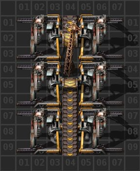
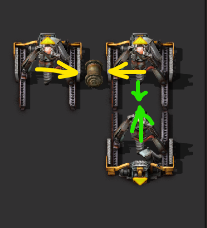

# Добыча урана

:::tip Вся статья, кратко
Добыча урановой руды `Uranium ore` самое простое, с чем можно столкнуться в *Factorio*.
:::

## Подходящие чертежи

Для возведения добывающих урановую руду аванпостов подходят многие из рассмотренных ранее чертежей, особенно [самый основной чертеж](../MiningResources/README.md#самый-основной-чертеж):

**

```blueprint
0eNqdVe2K2kAUfZUwUGghionRaH72NWopfgwyECdhMikVCexuWdqypX2A/pA+QMG12nV1dV/h5o16Z1yCbQwb/RGGmXvmnDNnbpIJ6fkxDQXjkngTMqBRX7BQsoATj8AUdrBOL9Kb9ApWsDRggQu36Q3MYZZ+S7/AEu4NeMTFOSwRdw1b2KWXCu0ZrUbVfdHhHQ4/06v0AkErLCxhk37VkDnsvA63qgZMVRUx3+E3yiA3oh4MDdrBRgka8AN+wdR4CXdY/YPqqoTaD+jtM6zV5FWH24VkGrJVNuFeWf3H9YGUWuzwejHPbfpRBaL3GyqNA6/6kFtE5vVgZhoImcHaSD9pMX2qOdq/xslC8SkYhoJ6OwNVLjVe0c3RWWbhCbA3AjOU1gd5xOoCnw0uKF8L3LlSRlZwtz/sArNT+7dKM28QSYhJIt4NKzKoDAUbqIb4QDzXJGPitROTsH7AI+K9mZCIDXnXVwA5Dim2CpN0hNt5d6Rm1Kd9KVi/MmKc8WFlIJjvE8XABxQpreStSSiXTDK6J9ST8Tsej3pUIOAZKpOEQcT2bapNWtWGtokjygyYwF26aidmjt3O2KXo8igMhKz0qC/ztPUn2tr/tM4R2npGG+MxxVAEOD5DnPPrmFmkPIwlOaLjnBpOo0iseYS9cW70Tpnomxn7iA5YPKpkImHg0+KccEyO0LnnRuGUiaJ1cp80yvRJ+4w+cYr7JIhlQaNYtXPv0i1zl5Z1cj5umXys09/PZine+rnd4pbpFss52XYrbxs/jPpb6h38mE3id5EI1153I9bH+Xsqov29tCzHbdtus23XWnU7Sf4Cgl8+qA==
```

Да и [самый ручной чертеж](../MiningResources/README.md#самый-ручной-чертеж) тоже подойдёт. Тут нужно чтобы электрические буры `Electric mining drill` были соединены какими-нибудь сторонами, чтобы серная кислота `Sulfuric acid` проходила от бура к буру и сквозь них. Если не получается, буры можно соединить трубами, но это не кошерно. Соединены должны быть именно центральные клетки на сторонах электрических буров, куда не выгружается руда.

**

И собственно, нужно решить вопрос с доставкой кислоты к месту добычи. Самый эффективный способ доставки серной кислоты, это вагон-цистерна `Fluid wagon`. Ставьте её в начале состава, сразу за локомотивом `Locomotive` или локомотивами, если используется несколько.


И под конец, урановая руда `Uranium ore` является единственным сыпучим ресурсом, который нельзя добывать киркой, которая [стальной инструмент](https://wiki.factorio.com/Steel_axe/ru) `Steel axe`.

## Вопросы *from Dummies*

**

> Почему вагон-цистерну `Fluid wagon` нужно ставить в начале состава?

Для совместимости, если придётся увеличивать длину состава.

> Почему перевозить жидкость `Sulfuric acid`, а не бочки `Fill sulfuric acid barrel`?

Потому как вагон-цистерна `Fluid wagon` перевозит больше жидкости за раз, на 5 тыщ больше. К тому же бочки нужно ещё разлить, перелить, вылить, нужен сборочный автомат на добывающем аванпосте, потом отвезти пустые бочки `Empty barrel` назад на базу... Оно того не стоит.

> Почему не транспортировать бочки `Fill sulfuric acid barrel` дронами `Logistic robot`?

Потому как даже бочками в вагоне было бы лучше. Транспортный дроны действуют в ограниченной области, не более 50 клеток. На большие расстояния транспортировать много чего они не эффективны.

> А если протянуть трубы `Pipe` до шахтерского аванпоста?

Ну если аванпост не далеко, не далее чем 200 подземных труб `Pipe to ground`, то вариант рабочий. Но на будущее такое не подходит. Когда близлежащее месторождение истощится, то придётся переходить на вагон-цистерну и менять поезда перевозящие урановую руду.

## Больше подробностей

Детальный разбор добычи урановой руды смотрите на YouTube канале.

[**](http://www.youtube.com/watch?v=ErwjhRdBRJ8)
