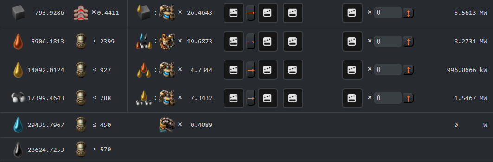
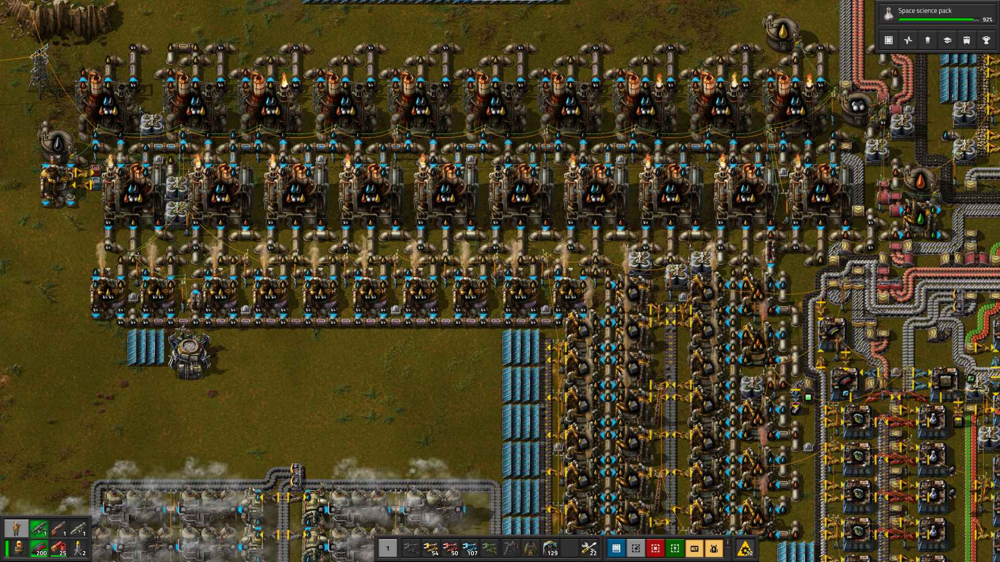

# Переработка нефти

:::danger
Это заготовка для будущей статьи, сейчас она не рекомендуется для изучения, а в будущем может измениться или вообще исчезнуть.
:::

:::tip Вся статья, кратко
Переработка нефти и сложна и проста одновременно.
:::

** Нефть `Crude oil` является очень важным ресурсом. Начало её переработки открывает новый поворот в игре и даёт доступ к таким радостям как робототехника `Roboport` `Construction robot` `Logistic robot` и стимулирует развитие железных дорог `Locomotive` `Cargo wagon` `Fluid wagon`. Сопутствующим бонусом следуют [первый выход с базы](../HowToStartNewGame/README.md#первый-выход-с-базы) и первое разорение ульев мастной фауны. Скучно не будет, гарантирую.

## Выбор начальной базы

Старт переработки нефти начинается ещё до начала самой игры, во как. Действительно, ещё перед началом игры нужно подобрать такую карту, с которой у вас не будет больших проблем в будущем. Хорошей картой является та, на которой имеется хотя бы одно, а лучше два, месторождения нефти близко расположенных к начальной базе. Тогда не придётся идти в ранние поезда и можно ускориться в робототехнику. Поезда это не плохо, но на начальном этапе игры, роботы предпочтительней. Тем более, в момент освоения нефти у вас будут и другие дополнительные задачи, и [как играть](../HowToStartNewGame/README.md) стоит планировать заранее.

## Осваиваем первое месторождение

Так устроена игра, что на старте основные ресурсы будут располагаться компактно рядом с точкой старта. Нефтяные месторождения являются исключением, к ним нужно дотягиваться. Переработка нефти `Crude oil` является необходимым шагом к химическому исследовательскому пакету `Chemical science pack` и далее к робототехнике `Roboport`. После того как вы худо-бедно наладили [начальную кузницу](../RawResourcesProcessing/README.md#теория-плавления-ресурсов) и [производство паровой энергии](../PowerProduction/SteamPower.md#чертёж-угольной-паровой-электростанции), построили [первый заводик производящий всякую мелочь](../HowToStartNewGame/Mall.md#магазин-шота-у-ашота), наладили науку на первых двух склянках, `Automation science pack` и `Logistic science pack`, отбились от первых атак кусак и немного прокачались в плане вооружения `Submachine gun` `Piercing rounds magazine` `Grenade`, наступает пора строить автомобильчик `Car` и двигаться в чащу леса.

Итак, для того чтобы покинуть базу и отправиться на поиски приключений с нефтью, нужно закончить следующие исследования: `Logistics 2`, `Engine`, `Automobilism`, построить автомобиль `Car`, без автомобиля покидать базу не рационально в начале игры, далее `Electric energy distribution 1` и `Oil processing`, произвести достаточное количество труб `Pipe` и подземных труб `Pipe to ground`, больших опор ЛЭП `Big electric pole`, нефтяных вышек `Pumpjack` и разумеется достаточного количества патронов и гранат, иногда и пару турелей `Gun turret` не помешает захватить. План действий:

* едем по направлению к месторождению нефти заодно протягиваем подачу электричества от начальной базы посредством больших опор ЛЭП `!Big electric pole`
* умножаем на ноль всё что шевелится по близости
* [строим нефтяные вышки](../MiningResources/Autotorio.md#нефть) `!Pumpjack` и огораживаем их турелями `!Gun turret`
* возвращаясь назад протягиваем нефтяную трубу `!Pipe` к месту строительства будущего нефтеперерабатывающего завода
* по возвращении строим заводик `!Oil refinery`

Профффит.

## Строим первый завод

Планировать выход сразу на [75 научных пакетов в минуту](../PowerProduction/README.md#начальная-база-на-75-научных-пакетов-в-минуту) не стоит, надорвётесь. [Настраивайтесь на 45](../PowerProduction/README.md#начальная-база-на-45-научных-пакетов-в-минуту), а потом будете апргрэйдиться, где-то [после запуска первого спутника](../HowToStartNewGame/README.md#после-запуска-спутника), ни раньше. [Примерный расчёт](https://kirkmcdonald.github.io/calc.html#zip=bVDbagQxCP2bPCVld7vTpQP5GOs4ray5YMzD/n0TaAudFkU8F1HcwCCew4hXpzVeHc6SOMeL27tmQIrNiCR8IfdGYnGHZsEUcqtFLUzOsVFqEbqVBMYlh4ZMGSlUwPu6r4uX8s7NGI/Ki8cPSowgR+V88d1Y2B5H5ebT5EH/KIuvWraO/91w82109JvW9bp4BZZhOD0tHhB76gJWdJ7gWxHQYc0k35i38Y8B5+jJpbFOqEUteCcbTrW1Pv/kJw==) по количеству химических заводов:

Выглядеть должно примерно так:

