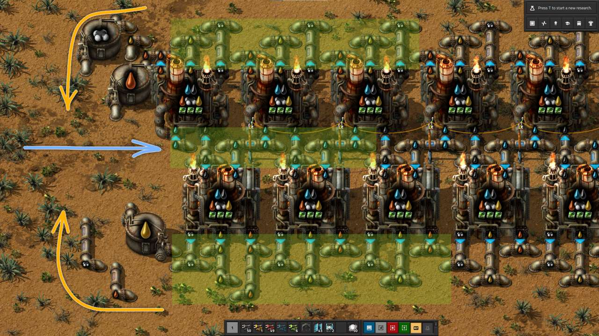
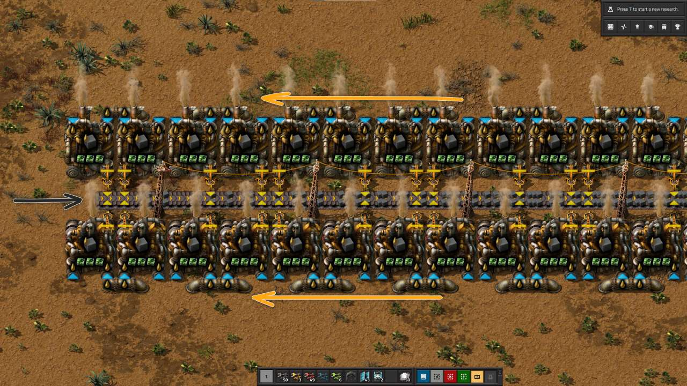
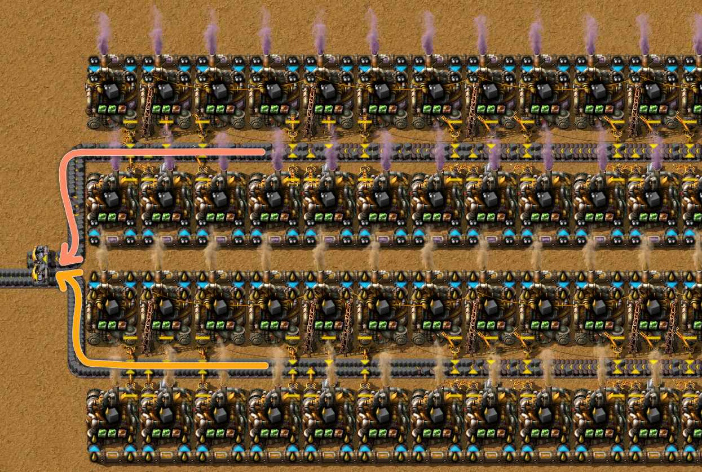
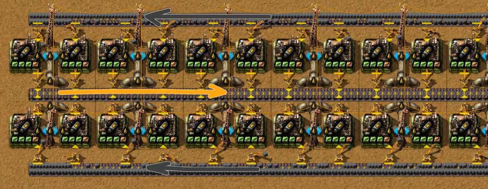

# Переработка нефти

:::danger
Это заготовка для будущей статьи, сейчас она не рекомендуется для изучения, а в будущем может измениться.
:::

:::tip Вся статья, кратко
Переработка нефти и сложна и проста одновременно. Придётся заморочиться с цистернами, помпами и сигнальными кабелями. Комбинаторы не нужны.
:::

** Нефть `Crude oil` является очень важным ресурсом. Начало её переработки открывает новый поворот в игре и даёт доступ к таким радостям как робототехника `Roboport` `Construction robot` `Logistic robot` и стимулирует развитие железных дорог `Locomotive` `Cargo wagon` `Fluid wagon`. Сопутствующим бонусом следуют [первый выход с базы](../HowToStartNewGame/README.md#первый-выход-с-базы) и первое разорение ульев мастной фауны. Скучно не будет, гарантирую.

## Выбор начальной базы

Старт переработки нефти начинается ещё до начала самой игры, во как, следует подобрать такую карту, с которой у вас не будет проблем в будущем. Хорошей картой является та, на которой имеется хотя бы одно, а лучше два, месторождения нефти близко расположенных к месту начальной базы. Тогда не придётся идти в ранние поезда и можно ускориться в робототехнику. Поезда это не плохо, но на начальном этапе игры, роботы предпочтительней. Тем более, в момент освоения нефти у вас будут и другие дополнительные задачи, и [как играть](../HowToStartNewGame/README.md#выбор-карты) стоит планировать заранее.

## Осваиваем первое месторождение

Так устроена игра, что на старте основные ресурсы будут располагаться компактно рядом с точкой старта. Нефтяные месторождения являются исключением, к ним нужно дотягиваться. Переработка нефти `Crude oil` является необходимым шагом к химическому исследовательскому пакету `Chemical science pack` и далее к робототехнике `Roboport`. После того как вы худо-бедно наладили [начальную кузницу](../RawResourcesProcessing/README.md#теория-плавления-ресурсов) и [производство паровой энергии](../PowerProduction/SteamPower.md#чертёж-угольной-паровой-электростанции), построили [первый заводик производящий всякую мелочь](../HowToStartNewGame/Mall.md#магазин-шота-у-ашота), наладили науку на первых двух склянках, `Automation science pack` и `Logistic science pack`, отбились от первых атак кусак и малость прокачались в плане вооружения `Submachine gun`, наступает пора строить автомобильчик `Car` и [двигаться в чащу леса](../HowToStartNewGame/README.md#первый-выход-с-базы).

Итак, для того чтобы покинуть базу и отправиться на поиски приключений с нефтью, нужен автомобиль `Car`, то есть закончить исследование `Automobilism`. Без коняшки покидать базу не рационально в начале игры. Далее `Electric energy distribution 1` и `Oil processing`, произвести достаточное количество труб `Pipe` и подземных труб `Pipe to ground`, больших опор ЛЭП `Big electric pole`, нефтяных вышек `Pumpjack` и разумеется достаточного количества патронов `Piercing rounds magazine` и гранат `Grenade`, иногда и пару турелей `Gun turret` не помешает захватить. Не будет лишним провести и первые военные исследования на убойную силу `Physical projectile damage` и скорость стрельбы `Weapon shooting speed`. Предпочтение стоит отдать огнестрельному урону перед скоростью стрельбы боеприпасами. Также поможет исследование усиленной взрывчатки `Stronger explosives`, гранаты в *Factorio* хорошо отрабатывают. В дополнение не забываем про поезда, особено если месторождение далеко, да и локомотивы `Locomotive` всё равно придётся открывать и лучше заранее накопить рельсы `Rail`.

:::info Наша цель
Получить продвинутую переработку нефти `Advanced oil processing` как можно скорее.
:::


План действий:

* едем на автомобиле `!Car` по направлению к месторождению нефти `!Crude oil resource` заодно протягиваем подачу электричества от начальной базы посредством больших опор ЛЭП `!Big electric pole`
* умножаем на ноль `!Piercing rounds magazine` `!Grenade` `!Gun turret` всё что шевелится по близости `!Biter spawner` `!Biter` `!Spitter`
* [строим нефтяные вышки](../MiningResources/Autotorio.md#нефть) `!Pumpjack` и огораживаем их турелями `!Gun turret` `!Firearm magazine`
* возвращаясь назад протягиваем нефтяную трубу `!Pipe` `!Pipe to ground` к месту строительства будущего нефтеперерабатывающего завода
* по возвращении строим нефтеперерабатывающий заводик `!Oil refinery` `!Chemical plant`

## Строим нефтеперерабатывающий завод

Планировать выход сразу на [75 исследовательских пакетов в минуту](../PowerProduction/README.md#начальная-база-на-75-научных-пакетов-в-минуту) не стоит, надорвётесь. [Настраивайтесь на 45](../PowerProduction/README.md#начальная-база-на-45-научных-пакетов-в-минуту) исследовательских пакетов, а потом будете апргрэйдиться, где-то [после запуска первого спутника](../HowToStartNewGame/README.md#после-запуска-спутника), ни раньше. Обязательно сразу же накопите 75 химических исследовательских пакетов `Chemical science pack` и откройте `Advanced oil processing`. [Примерный расчёт](https://kirkmcdonald.github.io/calc.html#zip=bVDbagQxCP2bPCVld7vTpQP5GOs4ray5YMzD/n0TaAudFkU8F1HcwCCew4hXpzVeHc6SOMeL27tmQIrNiCR8IfdGYnGHZsEUcqtFLUzOsVFqEbqVBMYlh4ZMGSlUwPu6r4uX8s7NGI/Ki8cPSowgR+V88d1Y2B5H5ebT5EH/KIuvWraO/91w82109JvW9bp4BZZhOD0tHhB76gJWdJ7gWxHQYc0k35i38Y8B5+jJpbFOqEUteCcbTrW1Pv/kJw==) по количеству химических заводов:


Выглядеть должно примерно так:


Обратите внимание как компактно соединить нефтеперерабатывающие `Oil refinery` и химические заводы `Chemical plant`. **Воду `Water` и нефть `Crude oil` нужно подавать между линией заводов**. Тогда как производимые жидкости `Petroleum gas`, `Light oil` и `Heavy oil` собирать с боков и объединять на концах в цистерны `Storage tank`.



```blueprint title="примерный чертёж"
0eNq9W9tOK0kM/Jd5To76fsmvrNAqkIEdbTITTRK0COXfdwIiZJfxscsSPIJCpewut6u7zWtzvz21+7Hrj83qtekehv7QrP54bQ7dU7/eXn53fNm3zarpju2uWTT9enf5aei2y7F97Pp2fGnOi6brN+0/zcqe7xZN2x+7Y9e+47z98PJnf9rdt+P0gSvC4TiM66d2eVz3f0+4++Ew/dHQX75xAlpGk37FRfPSrHL4Fadv2HRj+/D+CXdefAF2V+B9t59Qh+XTOJz6zSx0+ID2/4dOM9D+P9AzgKGWW8AZiCBnF2ol2c0FHhHoDAWeEGgPsc58Th2T04Kws1DglWVXEsPOGoBeyVDyrEWwIxS6dXzshovdI/wsFjtSSrlisUcu9putIxCxJ9VGFAm0zDPyHEZBGHly153NWOX5OYafMwg/e4vG8nOW52c4fg7AIFThvCpGWecLQH+iYowABhVjUjU5kc5cVnW5KMpf4WNPXP74jlG5WvdIx6gRqgNvVdgi/XkHxE5ox3vAD1D5Cyq7ItKfjwA/KsbEY3B7kc8q0yOqA48YqlIx/QkcFbdHBQNgEGsQrCpGUR0EB7hGKkavco0iDYcA8KPyF1XOU6S/wNdH4fbQgNRH8ZCGA98nCrdHhQpgEGsQjSpGkYajBdw/EWN0Kvcv0nD0AD8qf7oThEjDMSI+71q/iWCa5Lcl18rIIp55/ibnt962vCFPuN3bhdB687zuH9rN8oKwH4eH9nDo+qcJ43JVdLgAtI+PFxbP01cvd8PmtJ3+zs9GWqR8brzEd/KpYj6fPecb+SQj5+N+go9FdH7tA3Ve5wm6vPvQ42XrENxhef70Zm8R5zAEJ6zKYUD3dIWMca6ak8BZZo5flp+CSAzBSSpyGBXJU4C0kHkHeT0XUPwydJJy0DpmwUmK02r28lMGiSFwipzeM+QUC7aOyE1DSdga8HVQuFrKRe5kSQyBU+RqqUBO0UFrUAROkaulAjlFA61jEThFrpYKXweZq4MS5c7mWgVfvGb4pj5ekqrzOtEKZKBrOiJ7RdU1nUjBnxV22K2322W7nT4+dg/L/bBlGuD7F/Rt9/TX/XAaL0+dNd7NvSQZoDUTSahWLiH34xKqTtWwRRKqHmjYVPaCqmGLJFQjLCHzGwlNirTGzsooAc6ASkSWnyHSz8uoqPyCTEZV5RdEErDGAIbBUY/FFhVSCfBeZI0DPAVJ1ctlZH5cRtYElecR6ciaCJgKMoFJ5XqEasyAZSEZFs0b9swiz4ILnoyv9ZIJhtZo7tkupS1gaIEhJc8ydUC4lQLxAEihQAKSs3TLidedjZoLoa/g8wuSNK/npciYZxV4lQ3qFPnsAL36FQChVt8Z+Qs/ycRZzRP/14WYzZVzKnCZPh0wxEfnMAB3ZGQOIwBCMkma93xhRWDDFhGrCMm0RWBzCIxbkDn0Rv6mTzLBBis8JlrJZIVjw/SakQFhzfoA3DaSDKP8YZ9eiKR52ReKFhq7KBUrN1+A8MkcAiOrZA6DamZVKOZgAYZUmMFp5g+EYg4euLYlGQb5Cz+9EFHzxC8Uc0gqcJmYQwbCJ3NY5K/8dA6rZgxBKOZoAIZUmNFqBhGEYo6Cc8dHfVRLMfQAiKFAguY0Wa1sIYDBVZph0kyXVitbCOBhlV4IYEaVDrOqwjSihUhGY4S+gs/mMFm5ESLDT05jhKThe3l3oxkGTf+V5lA1uicNP8n3Qzr8rNmxpeEXzWY7F/7d+73kBPT5r3OL5rkdD+/fXqYmWF0uxU2+MZ3P/wLP44WT
```

Очень важно разместить цистерны для хранения производимых жидкостей, так как придётся управлять производством [через логические сети](../CircuitNetwork/SimpleExamples#управление-производством-нефти). Иначе, можно наткнуться на блокировку, когда какой-то жидкости производится больше чем других.

### Производство смазочной жидкости

Производство смазочной жидкости `Lubricant` вообще не представляет проблем. Одного химического завода `!Chemical plant` хватит даже для базы на 75 исследовательских пакетов в минуту. Строить отдельную цистерну для хранения производимой смазочной жидкости тоже нет смысла, в трубах до сборочных автоматов места хватит.

### Производство твёрдого топлива

Требование к первому нефтеперерабатывающему заводу также включают производство твёрдого топлива `Solid fuel`, которое требуется для производства электроэнергии, так как первой угольной электростанции не хватит. Достаточно производить и половины конвейера `Transport belt` твёрдого топлива, даже можно меньше, примерно 360-450 штук в минуту, что даст питание на 40-50 бойлеров `Boiler`, а это 70-90 мегаватт электричества.

Дизельное топливо `!Light oil` наиболее выгодно для производства твёрдого топлива `!Solid fuel`. Мазут `!Heavy oil` менее выгоден, поэтому мазут сначала перерабатываем в дизельное топливо, а потом делаем твёрдые кирпичики.



```blueprint title="примерный чертёж"
0eNq9Wtlu2zAQ/Bc9W4F4LulfKYLCB50Q0GFIctAg8L+Xios4baSQQ6B6tGGNZoac1Yrrt2JfX9y59+1YbN8Kf+jaodj+eCsG/9Tu6um78fXsim3hR9cUm6LdNdOnw7Nr/GFXl+d6Fy69bgrfHt2vYsuuj5vCtaMfvbshvX94/dlemr3rww+WMDbFuRvCZV073TVAldLaB7UpXsNFlX5Q4Sa9O/h3NkNX+2N5uri6PPVdU9b+6XksO18HmInpMGG408kdRv8Sbl823fFShyvF9br5wol/cDpP8HNMzAcTGZjMYAhEl15Hl4zropgu9RdGOXblU99d2mNEl3zXdfT9xHT6iZ7B1ohnYh3PCNErlvXyGWwTXw8eWw+LeFat4xmr4sJYTBhjiPMVttMYB2wztJJtImqb0VHbJGCbIWzDMoXYJleyTSOKJbhRKL4mKromBrGNrWSbjSurYsp4hXjPsN3GkQpABltYHn/Ik43KR57ynxj+3+5FIqTUSqRU3G4ZtRtJOilwt92T7tvB9WP48vvOzyywvKd97HftcO76sdy7eozA2SSWNo0lxViKCmFJGEvBEHANgnMEXIHgAgGXILhMWzweXTyFsBQgS42AcxCcEHAGgkPJq0DwtOSZaH2QVRqQjQIhKTNgoZFIyj5xTQNHUmbA+iAlAg5WNokkz4D1QSLJM2Blk2nPNyOi2w5JmQHrg7QIOFjZVGLyqpgFCkoeWGgUlDywRCqRZAFFi49CUkZg8VFIyggsPgpJGYHFRyHPNwKLjzJpiyeji4ekjMAqppHOksAqpvPOixn/F1z+t1cdzcEXCVZ9ITcHK8DOPxFWZh1Ur2rovRo07ugvTenqcGXvD+W5q933bf8fF1oXKOy7Sz8NIYg/zt0m7/h5VScIfIFI3AMm6xB5VeVo952mnNBePBGWZR0vr2kocThU90Z8LlQhpWTnckUi69B4VTMk2BsnbgOVde67qnINtsSJyglsMxNhTdZ566qGWjhXRPjDylRZh7xrOmEY2K2m7QGDTOfZwkmyEVljbJY0WjDInH2RoQKGw4sgOmt6zdKm15Q1oE300AAj5EX5NmsWmibfVsC0domhZcB4cRGEZw1A0xbCiqwJX6KHEphBLspXwCRvEURnzRoTPaSsuVWihwaYrN3kP97Kebji/m+vTfHi+uF2F8OCY5yM4UyQvl5/AxzjQUo=
```

Нефтяной газ `Petroleum gas` крайне невыгоден для производства твёрдого топлива `!Solid fuel`, [пруф](https://wiki.factorio.com/Solid_fuel#Which_solid_fuel_recipe_to_use). Однако может так случиться, что нефтяного газа напроизводиться столько, что заполнит все хранилища и будет блокировать переработку нефти, а следовательно и заблокирует производство твёрдого топлива, так как не будет производиться больше дизельное топливо. Поэтому желательно настроить некоторое количество заводов по производству твёрдого топлива из нефтяного газа [через логические сети](../CircuitNetwork/SimpleExamples#управление-производством-нефти), чтобы предотвращать переработку нефтяного газа.



### Производство ракетного топлива

Ещё одной потребностью от нефтеперерабатывающего завода является производство ракетного топлива `Rocket fuel`. Тут проблем тоже не возникает, простой чертёж, похожий на предыдущие не вызывает проблем. По центру организуем выгрузку производимого, по бокам подаём твёрдое топливо `Solid fuel`. Дизельное топливо `Light oil` проводим как-то посередине:



```blueprint title="примерный чертёж"
0eNrNmttymzAQht+Fa+hoJdAhr9LJdHxQUqY2eAB3msn43QvxhWmKzP57UfcuTpyP1WpP+sV7tj2c46mrmyF7es/qXdv02dPX96yvX5vNYfrd8HaK2VNWD/GY5VmzOU6fNn0fj9tD3bwWx83ue93EwmSXPKubffyVPdElX0UM3abpT203FNt4GGb/rC/PeRaboR7qeDXm48Pbt+Z83MZupKcYeXZq+/Hf2mZ66ogqtP1S5dnbCA3Vl2p8xr7u4u76DTsZ+QmtAXSJoQ2ArjB0CaA1hq4AtMHQFkArDO0ANGFoz0eTx9ABQAcMTQpggzlDQD6SA9lAQhKYkARkJIEZSUBKEpiSBOQkgTlJQFISmJQEZCWBWUlAWoJZSUBaglmp1f2GulCtbvnjPz9hTJXx5/qj1Xbt7kccipdzPIyUqfH2EyK+vEzf/jkaURzb/fkwPWXqTKdu/PTpL3rq40tW3/K9bvrYDeMv73be8adFjoZXb9Krt/9q9beqcYz7+nws4mGkdvWuOLWHeL+buw+rm1i/ft+2526abrTNg3teelDJcrNZdXMFu1n9B0FmUTfPuu2Sm01uTB7Coqcdx9OzlpvytGdx1hMjoDs2Yz4sMQxczMg8Ps4Mq5jNWnRizwxczMJ/sGVwLZv15eVaRoqWUsywitlqhplbLTtN7rlbbH2CYQFGSDDcGmNWjVIMDzBSawmrDFpjlApgJNZSYiOBUSrB0YKjvVH0V/VYYps/1lkMbfHatedmf+9sf7V0/QBeCnQDrt38mE/71QrEB659TqA+cNkemoHS6w8CGYNpY6VYNqo1GysS6CFcG7VAEOGyjUAR4bJLdo1M+7USyCpc+yy/pszYisV2AsmGazc2qaZ9GwTSD9NGqwDfOqxeWxLISly7tUBW4rKBHkYaizcrkay4dkskKy7bsmJ5tUdYB/hWgfHmBbIad/38GTC5dqcE0hzTPke4NMdFa+RUkV69wRU+roWlWOEzqnzUodhV4DivP1taLlGtaADXrAsfJ9YSF/z8r87fzgOjvU4EbwAYZpnhFThms/bbEzgY86haLGc+MKO8AQbZ1C4hw3AiWnwlGlg1p9Z5Cw6VvP12YjH0gZntvWh4ZdU6H8RC6wMzICjR6MqKvEDgCMiKvKBFAyFrD4ORysUPDOpQApNmogCFCmAkCmGw2NjH220nvtczqlq8cFq+bQpI0y8THgji27FlY6dLyJR2T0oBjSdh8cgW3zUsmpy8zSOlgRBLmmvAEdhygoxUKRK4He8dn0qkQjPhMgmZCZdpyEy4F4m/THgAR2denCDva83mW57NyAtbMzWYCdciOZgJN9BNPdvbpUgiZtpcgWMx02YrkoeZNjuRrsuEe5H4yoQHkfrKg2sFvSzA3UpNIuWVabMWSa9MuBHpmkx4KRIlmfBKokoy2eB8yowSJ1EpFyx+vp4LRs7t3f88+xm7/nrA8lS6oJ33moyzl8tvfYt4vA==
```

### Сжижение угля

Открыть технологию сжижения угля `Coal liquefaction` [очень полезно](../PowerProduction/UpgradingSteamPower.md). Это позволит превращать уголь `Coal` в твёрдое топливо `Solid fuel` для сжигания в бойлерах `Boiler` при производстве электричества. Таким не хитрым приёмом можно получить в два раза больше эклетричества, чем просто сжигая уголь. Правда, стоимость открытия технологии сжижения угля не дешёвая, 200 исследовательских пакетов включая фиолетовые, которые производственный исследовательский пакет `Production science pack`. Есть смысл уходить в сжижение если нефти на начальном месторождении добывается маловато, так как после освоения локомотивов `Locomotive` и [добывающих оутпостов](../MiningResources/Autotorio.md), угля обычно добывается больше чем надо. [Пример организации сжижения угля для производства энергии](../PowerProduction/UpgradingSteamPower.md#само-творение).

## Оптимальные соотношения

Оптимальное соотношение подбирается в ручную и зависит от вашей производственной ситуации. Можно только дать определённые наставления. Самые простые соотношения представлены в таблице:

| > | > | Простое соотношение | | > | > | Более точное соотношение |
| :---: | :---: | :---: | :---: | :---: | :---: | :---: |
| Количество | Строение | Рецептура | | Строение | Количество | Рецептура |
| 8 | `!Oil refinery` | `!Advanced oil processing` | | 20 |  `!Oil refinery` | `!Advanced oil processing` |
| 2 | `!Chemical plant` | `!Heavy oil cracking` | | 5 | `!Chemical plant` | `!Heavy oil cracking` |
| 7 | `!Chemical plant` | `!Light oil cracking` | | 17 | `!Chemical plant` | `!Light oil cracking` |

Эти цифры весьма условные, они подходят для расчёта производства всего в нефтяной газ `Petroleum gas`. В реальности, есть смысл обращать внимание на [калькулятор](https://kirkmcdonald.github.io/calc.html#data=1-1-19&items=petroleum-gas:f:14.1) и на [контролируемое производство с остатками](../CircuitNetwork/SimpleExamples.md#управление-производством-нефти).

Для сжижения угля картина примерно следующая:

| > | > | Простое соотношение | | > | > | Более точное соотношение |
| :---: | :---: | :---: | :---: | :---: | :---: | :---: |
| Количество | Строение | Рецептура | | Строение | Количество | Рецептура |
| 12 | `!Oil refinery` | `!Coal liquefaction` | | 60 | `!Oil refinery` | `!Coal liquefaction` |
| 3 | `!Chemical plant` | `!Heavy oil cracking` | | 15 | `!Chemical plant` | `!Heavy oil cracking` |
| 11 | `!Chemical plant` | `!Light oil cracking` | | 51 | `!Chemical plant` | `!Light oil cracking` |

Опять-таки, [калькулятор в помощь](https://kirkmcdonald.github.io/calc.html#data=1-1-19&items=petroleum-gas:f:14.1).

## Использование модулей

Модули разные бывают, модули разные будут полезны. В *Factorio* так устроено, что и нефтеперерабатывающие заводы `Oil refinery` и химические заводы `Chemical plant` имеют по три свободных слотов для модулей и не имеют градации по уровням, как не в пример у сборочных автоматов `!Assembling machine 1` `!Assembling machine 2` `!Assembling machine 3`. А это значит, что у нас могут возникнуть траблы, особенно с переходом базы из 45 исследовательских пакетов в 75, простое усовершенствование невозможно. Можно конечно поиграться модулями скорости `!Speed module 3`, но вариант так себе. Планируйте свободное место для размещения требуемых нефтеперерабатывающих и химических заводов при улучшении начальной базы.

При построении нефтеперерабатывающего завода можно ограничиться двумя модулями эффективности `Efficiency module`. Это даст не плохую экономию электроэнергии и невысокий уровень загрязнения в начале игры, когда приходиться на всём экономить и бороться с нападениями агрессивных соседей. Если добычи нефти не хватает на начальном месторождении, то можно добавить один модуль продуктивности `Productivity module`, но поможет мало. [После запуска первого спутника](../HowToStartNewGame/README.md#после-запуска-спутника) можно расслабиться и загрузить заводы модулями по полной. Хорошим вариантом будет два модуля эффективности и один простой модуль продуктивности `!Efficiency module 3` `!Efficiency module 3` `!Productivity module`. Маяки `Beacon` и прочие [извращенские штучки](../Additionals/NerdsVsGeeks.md#озабоченные-гигагерцами-и-тэрафлопсами) на начальной базе не нужны.

| Модули | Описание | Эффект |
| --- | --- | --- |
| > | > | Начальный этап игры |
| <nobr>`!Efficiency module` `!Efficiency module`</nobr> | самый экономичный вариант | 60% экономии энергии и хороший контроль за загрязнением |
| <nobr>`!Efficiency module` `!Efficiency module` `!Efficiency module`</nobr> | дороговато | 80% экономии энергии и отличнейший контроль загрязнения |
| <nobr>`!Efficiency module` `!Efficiency module` `!Productivity module`</nobr> | мало профита за дорого | небольшую экономию энергии и небольшой контроль за загрязнением, а также маленькое уменьшение ресурсов |
| > | > | Когда всего хватает |
| <nobr>`!Efficiency module 3` `!Efficiency module 3` `!Productivity module`</nobr> | можно использовать | 60% экономии энергии и хороший контроль за загрязнением плюс маленькое уменьшение ресурсов |
| > | > | Игра без фауны и загрязнения |
| <nobr>`!Productivity module 3` `!Productivity module 3` `!Productivity module 3`</nobr> | | безальтернативно для экономии ресурсов |
| <nobr>`!Speed module 3` `!Productivity module 3` `!Productivity module 3`</nobr> |  |  даст небольшую экономию энергии на единицу производимого продукта |

## Большая база

Большая база, маленькие производства. Не пытайтесь строить нефтеперерабатывающий завод производящий всё, как на начальной базе. Тут лучше воспользоваться принципом "*одно нечто делает только одно шота*". Исключение составит смазочная жидкость `Lubricant`, которую придётся комбинировать с производством попутного газа или ракетного топлива. Производить отдельно твёрдое топливо не нужно. То есть, строим множество мелких нефтеперерабатывающие заводы по следующим правилам:

* всё в попутный газ `!Petroleum gas`
* всё в ракетное топливо `!Rocket fuel`
* всё в смазочную жидкость `!Lubricant` и остатки в попутный газ `!Petroleum gas` или в ракетное топливо `!Rocket fuel`

И неважно какой входной ресурс вы используете, будь то нефть `Advanced oil processing` или сжижение угля `Coal liquefaction`. Стоит учитывать, чтобы запустить производство через сжижение угля, нужно доставить небольшое количество мазута `Heavy oil`. Это можно сделать дронами, хватит и пары бочек `Heavy oil barrel`. Также, есть смысл производить пар `Steam` для сжижения угля комбинируя привозимый уголь и производимое твёрдое топливо, отдавая приоритет твёрдому топливу. А ещё лучше запустить отдельное производство пара ядерным реактором `Nuclear reactor` и доставлять пар вагон-цистернами `Fluid wagon`.
