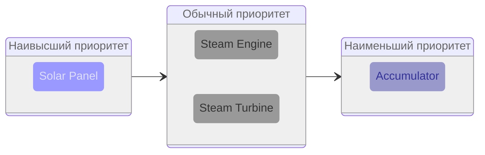
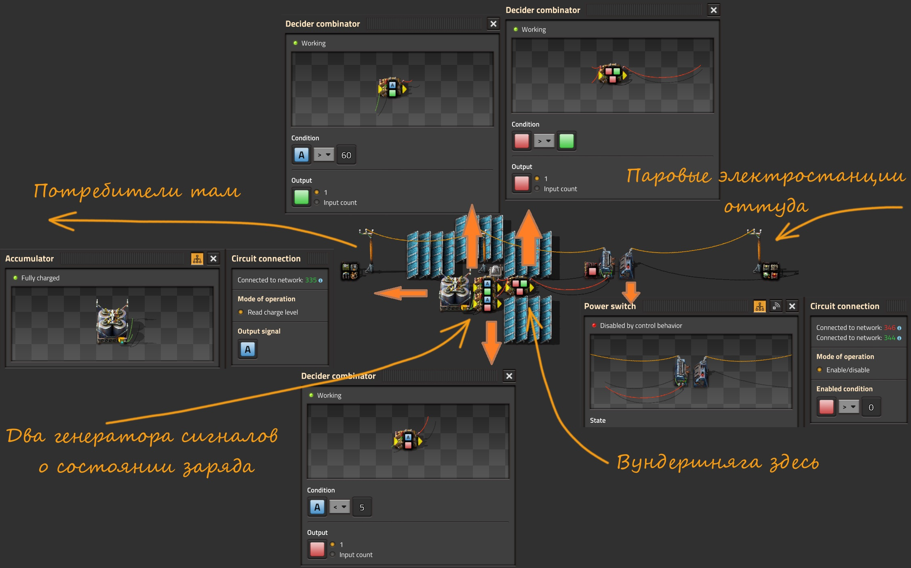
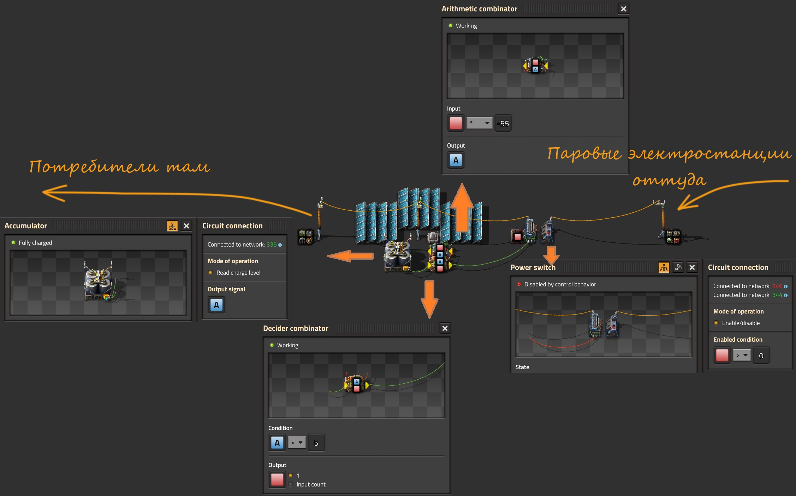
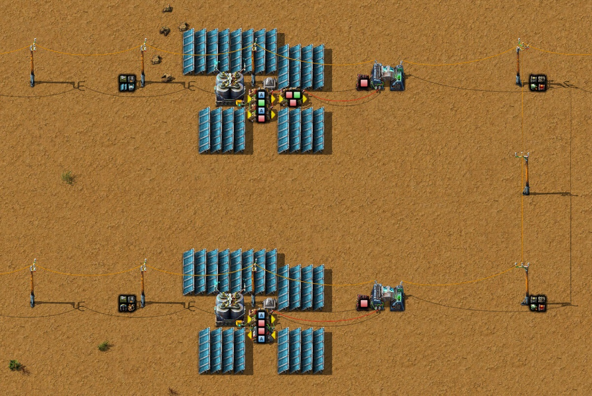

# Переводим паровые и ядерные электростанции в резерв

В начале игры *паровая энергия* єсмѣ наше всё. Вменяемые альтернативы появляются только тогда, когда удаётся накопить пару тыщ солнечных панелей `Solar panel` и чуть меньше тыщ аккумуляторных блоков `Accumulator`. До запуска [первого спутника](../HowToStartNewGame/README.md) про солнечную энергетику можно вспоминать от случая к случаю не возлагая на неё больших надежд. Но даже если солнечных панелей и хватает чтобы полностью покрыть потребности в электричестве и даже зарядить аккумуляторные блоки, **в ночное время всё равно запускается выработка энергии из пара `Steam`**, что приводит к сжиганию угля `Coal` или твердого топлива `Solid fuel`, [другие типы топлива надеюсь не используете](EfficientFuelForSteamPower.md#твёрдое-топливо-супротив-ракетного).

## Откуда берётся электричество

Электроснабжение в *Factorio* осуществляется на основании приоритетов, где каждый источник энергии имеет свой приоритет. Высший приоритет имеют солнечные панели `Solar panel`. Далее следуют паровые двигатели `Steam engine` и паровые турбины `Steam turbine`. И на последнем месте аккумуляторные блоки `Accumulator`. [Пруф](https://wiki.factorio.com/Electric_system).

:::info То бишь
Первым кандидатом на выработку электричества всегда выступают солнечные панели, и если производимой ими электроэнергии хватает для снабжения всего и вся, то дальше наши полномочия всё. Паровые двигатели и паровые турбины останавливаются, аккумуляторные блоки из поставщиков превращаются в потребителей и начинается их зарядка. Если же электричества от солнечных панелей не хватает или на дворе у нас *"тиха украинская ночь, прозрачно небо, звёзды блещут"*, то вот тогда *Factorio* берёт следующего кандидата на основании приоритетов. А на втором месте, вслед за солнечными панелями, следуют паровые двигатели и паровые турбины. У них одинаковый приоритет и соответственно производство электричества из пара будет равномерно распределено между всем паровыми агрегатами, согласно [максимально возможному количеству производимого пара каждым агрегатом](/blog/2024/06/08/steam-power-calculation). И только в самом конце, если уже ничего не помогло, будут изъяты все остатки энергии из аккумуляторных блоков, у которых самый низкий приоритет:



:::

Получается, как не крути и как не выкручивайся, хоть всю планету застрой солнечными панелями и аккумуляторными блоками, по ночам, когда мирные жители засыпают, выходят они, бойлеры `Boiler` и паровые двигатели `Steam engine`, которые пьют воду `Water` из наших труб `Pipe`, сжигают наш уголь `Coal` прямо с конвейеров и [загрязняют нашу окружающую среду](https://wiki.factorio.com/Pollution). Надо что-то делать...

## Простой костыль

:::tip Идея
Снести паровую электростанцию нафиг, чтобы не загрязняла природу своими выбросами по ночам.

А если всё-таки сохранить паровую электростанцию на случай перебоев в работе солнечной электростанции? Например, можно соединить какой-нибудь аккумуляторный блок `Accumulator` красным `Red wire` или зелёным `Green wire` сигнальным проводом с насосами `Offshore pump` подающими воду `Water` на бойлеры `Boiler` и включать насосы только если заряд на аккумуляторном блоке опускается меньше какого-то значения, например 50%.
:::

Реализация такой идеи с насосами, проста как всё в мире *Factorio*:


```bleuprint title="Чертёж первой линии бойлеров с установленными параметрами:"
0eNrVlsuOozAQRf/Fa2hhXgHUm/mOURTxqBBLYFt+RB1F/HvbRAPpbjPBs5sNwuA6Vfe6bPmOmkEDF4QqVN0RaRmVqPp9R5L0tB7sN3XjgCpEFIwoQLQe7UgqqMcQaE8ooClAhHbwgSo8HQMEVBFF4MGZB7cT1WMDwkxYCHXb6lEPtWLCYDmTJoZRm9BwwiwrA3QzLziKDd6UpQQbTg1c6isxEWYa04prdfpR6JUIpc2XtdZ5RvgLTQ8ShdamkjYG20cvAOhztaRDVTwdJxPwQ0G8cNn5LC9MQMj1yJ0asrfsjwr8lm3oaIloNVEn869b4s9ESD9tM1yq2i5kFtnRyGsx21uhdz/t+Em3HScbXiQeXuD/1IutPkjXvGM9DCEMBidIG3I2gMuBPFodiGYHKJD+0jAt7FbBydGRJVuycMLhVZNZrAOSf4GEioW9YJp2Tlz6vcqOiIdRBuSAH3zg8V/gsQNevJaPX8ovfVcqzf9hpXDkPhxdnbB4XBZ7XMB4NzorPdHrcdYwMoD7LM63kK6GwImv31nyregvdqdB6fQ73VM59jIj2+1zevD0Od+Pjj3R6w5stKAgQkIlCLXhyNp7h130woseb9OdvbLuTSVqKjkTKmxgUC/axMLtVWO+lFRPd5gAXUHIh5oCp4cyPhRpmeRlPk2fiBPnbA==
```

Также, вместо включения/отключения насосов, подающих воду на бойлеры, можно забубенить выключатель питания `Power switch` и управлять им в зависимости от заряда на аккумуляторном блоке. К сожалению, костыль сей так себе, хотя и хорошо ладит с паровыми электростанциями. При увеличении количества аккумуляторных блоков, придётся уменьшать параметр срабатывания, ручками, на каждом насосе. Также электростанция останавливается и запускается не сразу, нужно время на растопку и на выпаривание всей залитой уже воды. Кому-то это может показаться даже плюсом, с выключателем например будут очень резкие и частые срабатывания туда-сюда.

В общем, решение интересное, но для ядерных электростанций этот подход сравним появлению пятой ноги у тягловой клячи. На начальном этапе игры вполне действующая модель, да и позже тоже, для не особо притязательных игроков, [но у нас таких нет](../Additionals/NerdsVsGeeks.md).

Как же тогда по-человечески перевести и паровые и ядерные электростанции в резерв?

## Нудная теория

Пойдём сложным путём, нужно рассмотреть одну `вундершнягу`, которая называется то ли *триггер*, то ли *ячейка памяти*, то ли ещё как-то, суть явления не в названии. Нам потребуется сравнивающий комбинатор `Decider combinator`, и если у него замкнуть выход на вход сигнальным проводом, красным `!Red wire` или зелёным `!Green wire`, то это уже `вундершняга`, [вот такая](../CircuitNetwork/Combinators.md#простые-кирпичики).

И что это даёт? А даёт это то, что любой сигнал, при определенном правильном условии на комбинаторе, можно повторить и запомнить. Причём такая `вундершняга` может запоминать и повторять множество сигналов, а не только один. Соответственно, такой комбинатор, можно использовать для включения и отключения разного рода электростанций, паровых и ядерных, при помощи выключателя питания `Power switch`.

## С теорией всё, начинаем творить

Предлагаю собственно чертёж `вундершняги`, которая совместно с другими комбинаторами управляет работой выключателя питания.



```blueprint title="Чертёж c вундершнягой:"
0eNrFl+uOoyAUx9+Fz7rxVrXNZpPJPMZmYpCetiSIBnBmmonvvqC9i1Ps7O58aaTCD875cy5+oJK10AjKFVp9IEpqLtHq9weSdMsxM/+pfQNohaiCCnmI48qMZM2w8BvMgaHOQ5Sv4R2twu7FQ8AVVRQGTD/YF7ytShB6ghXgoaaWek3NzX6ak8Q/Fh7ao5Wfxvqx67wRKXIkpXdJsSNpeSZFdlJyIjX1GwhfvlFFdmPU4gzSvtMuV6JmRQk7/EprYSYRKkhLVaHfrU8rN1RIVYyEeaVCtZhdaNPP8AWs0YCXCht5AzOoGiywMrugX6gb3nMgZg9poKH5MUsv1KN6FGrpjqcy48hIvRUAfDRTv9Lc5za4fZN76I0K6J8Ds/65DUer4+tJmjS4sdBWKG3eBjMJFucvTvYfLfa1tSXlvbUjDeL8LGeo5fTQWu9KhhmRXZUNZQqEU3xgKaEqGeVbv8JkRzn48aBGa6QIL0LGuwsDpg8mKPE3reCYgBUUOYBuonbEiB0YmJC2alnvVRsj0ZpZ5EnPh6gwY/7JpqZmYJFneSsPB7rdlXXb+z9/sWyRWc84DuQzeCL66lY17YxIe5oMJHuABNehFBqPWezJ57nsMtVZXJbaXLa82YLhqrGQs2uyBWRsOpDWQOhaZ7/Poi/JjrzAMfYO1HNGlA+kxKfrhJiOM6I3W/xB4p7b7Is+HIqNqKuCcs055qs59yO78G9/P9LxffFQ5Jiowzu0aOL2heE8RZffouihyEkwlIdE+6L8pyo7X3ybeIFzlR3X408uReLMmUpGYTSvvi7iv1xf7wowKqzaZCoLs9+hZ3APwWTKC/G8nJzG9zNnMs+xafJPG5eypgzEw62KVIArH/hWdzwPtym8JQx0oyIAk6k2w6VV2QFWPryTHeZbmNWthAvHj4KzGFE+oW/6WGWMlt9YGRc3mfHn/82Mzm3TJ2UwcCxz2ezPv0Fpk13MbVtdfEF76FWH2SBWHibZMsryPArjLO26P1+3Kwo=
```

Справа (за изображением) у нас находится некая воображаемая паровая электростанция, показанная иконками на постоянном комбинаторе `Constant combinator`, который рядом с опорой ЛЭП `Small electric pole`. Соответственно, слева (тоже за изображением) вместе с воображаемыми солнечными панелями `Solar panel` и аккумуляторными блоками `Accumulator` находятся воображаемые потребители электроэнергии показанные иконками на постоянном комбинаторе и которые нещадно разряжают аккумуляторные блоки. Один такой аккумуляторный блок находится в центре изображения, с него и считываем данные о количестве зарядки всех аккумуляторных блоков. Аккумуляторные блоки разряжаются равномерно, это важно. Наличие парочки солнечных панелей тут не обязательно, они просто не дают чертежу замереть и питают аккумуляторный блок и комбинаторы, если всё это отключено от электрической сети.

:::info Главная фича
Солнечная электростанция находится в одной электрической сети с потребителями, а паровые электростанции в другой электрической сети. Паровые электростанции отделены от потребителей и солнечной электростанции выключателем питания. Если заряд аккумуляторных блоков падает ниже какого-то значения (5%), то значить у нас нехватка электричества в сети потребителей и нужна подпитка от паровых электростанций. В этом случае нужно включать выключатель питания и подключать паровые электростанции к генерации электричества. Если же заряд аккумуляторных блоков поднимается выше какого-то значения (60%), то значить у нас с электричеством всё в порядке и подпитка от паровых электростанций не нужна. В этом случае нужно выключать выключатель питания и отсоединять паровые электростанции. Означенными процентными значениями можно баловаться как душеньке угодно.
:::

Рядом с аккумуляторным блоком имеются два сравнивающих комбинатора `Decider combinator`, выполняющие роль генератора сигналов. В зависимости от уровня заряда на аккумуляторном блоке, они подают сигналы в логическую сеть. Когда заряд аккумуляторного блока опускается сильно низко в сеть отправляется сигнал красного квадрата, сопоставимого с низким уровнем заряда. А когда заряд аккумуляторного блока возвращается к нормальному состоянию в сеть отправляется сигнал зелёного квадрата, сопоставимого с высоким уровнем заряда.

Эти сигналы подаются на вход `вундершняги`, которая управляет выключателем питания `Power switch` в зависимости от того, какой сигнал пришел последним. Да, `вундершняга` типа всё помнит и если последним сигналом был сигнал красного квадрата, она "включает" выключатель питания и начинается забор электричества от паровой электростанции для зарядки аккумуляторных блоков. Если последним сигналом был сигнал зелёного квадрата, то выключатель питания отключается и зарядка аккумуляторных блоков от паровой электростанции прекращается. Обратите внимание как выставлено условие и выход на `вундершняге`, *Condition* и *Output*, они собственно и управляют выключателем питания.

Ещё можно увидеть постоянный комбинатор `Constant combinator` рядом с выключателем питания `Power switch` и который включает выключатель питания. Он нужен для того, чтобы выключатель питания работал постоянно, без учёта чего там `вундершняга` понапридумывает. Через него можно включать выключатель питания в ручную и его можно убрать с чертежа без ущерба для всех.

[Взято отсюда](https://wiki.factorio.com/Tutorial:Circuit_network_cookbook#Backup_steam_example)

Вот собственно и всё. Мы получили чертёж, который позволяет отключать паровые электростанции, если аккумуляторные блоки заряжены и включать паровые электростанции, если аккумуляторные блоки разряжены.

## А ведь можно творить и по другому

У аффтара всё хорошо с математикой или он что-то курил, когда писал про `вундершнягу`? Ведь схему можно сократить на один комбинатор! Зачем нам комбинаторы задающие пределы срабатывания для выключателя питания, когда их можно объединить математическим сложением?



А ведь действительно таки можно и вот чертёж реализующий идею с математикой.

```blueprint
0eNq1V+1uozAQfBf/PEEVvpPodFLVxzhVyDibxJIxyDZtoyrvfmtogSbmAundn6ou9qx3Z3bWfSeFaKBWXBqyfSecVVKT7e93ovlBUmH/Zk41kC3hBkriEUlLu9KVoMqvqQRBzh7hcgdvZBucnz0C0nDDoYNpF6dcNmUBCjc4ATxSVxrPVNLGQ5w4ekg8ciJbPw02D8n57F0hhTOR0ptI0UykzYC0diPFPVJdvYLy9Ss37HgNlQxAWDssuVGVyAs40hdeKbuJccUabnL8tutP7rnSJr8i5oUr01Ax4qbd4SvYkQ5eG2rpXdlFWVNFjY1CfpFz910CszG0BQ3sD3t0xB7H1drrL2WXoWX6oADk5cYARYCwT83q8svGI69cQfv7yp5/aoKr0+HXTYjUVTHHJAxmt6dCg6P2SZ/+Z8I+Jltw2SZ7RUG0HtjMkE2P7DAq63aEblL2XBhQs9qDag1lIbg8+CVlRy7BjzoyGstEMOoY7yYYCLyY4szfN0pSBk6gcAlQyaW92k5xIZxo0Qy0iluN7TE3dXKCxEifg6l0EGpJhfD7W9WVAAdTm0umJPDDsaialorNsyNENhDBWFM2wi2CeACe6MOqMXWzoOceJ1vK2SsXTWU7x1WxdR9mB4zv0Fn+Ju04+8wqnSnsD9TBbfQddvP41WySC7P5iQeWVrN3sPqUt+rK96oqcy4R5dMJlpQ7G9W2rXdyZWoIF044YDxteck8HjfLlD+eXQ7lpy7lB6uLGIKWtUsjX6FdSMEyR02if+yoN1VxZaXID9e5jfcxJeZLI56gLAiXcZZGtwsbLStsGv/XUVWgj+O17h1O2gAtfZAHnAN3DybZMAH49FJAma3BvSPpCNT48MaOVB4mcpoYSkE88xU4IiOe4Hd4ilDFzbEEg3KZ59jJJb+pm98B+Hum/dFLGixKPri3b5+oVQ3o3u01yI877NsOw29Mw5Ebf2d4Buny933LrHUTq67t6F8kj7xgW3Wdtw7ibBNm63UYRFl6Pv8BTplxOA==
```

У нас по-прежнему остаётся сравнивающий комбинатор `Decider combinator`, проверяющий минимальный заряд аккумуляторного блока и выдающий сигнал `Signal red` выключателю питания если заряд упал меньше 5%. А вот остальные комбинаторы, вместе с вундершнягой, заменяет один арифметический комбинатор `Arithmetic combinator`, который "добавляет" необходимую разницу в заряде до отключения резервной паровой электростанции. В данном случае со знаком минус. Тут нужно понимать, что мы указываем со знаком минус именно разницу, которую потом нужно сложить с минимальным значением срабатывания. То есть `5%+(-1*-55%)`, что и означает, зарядку аккумуляторного блока максимум до 60%.

## Сравнение двух чертежей

Довольно сложно сравнить эти два чертежа, так как они сильно похожи. Чертёж с `вундершнягой` обладает простым и понятным интерфейсом. У нас есть комбинатор для минимального срабатывания, отдельно комбинатор для отключения и даже если по ходу игры забыли как всё тут работает, без проблем можно вспомнить просто посмотрев на условия и значения. Второй чертёж, что с арифметическим комбинатом, не так прост в настройке, зато потребляет на целый киловатт энергии меньше. Играя в долгую это может порадовать и [нердов и гиков](../Additionals/NerdsVsGeeks.md), а вот у нормальных игроков может случиться нервный тик разбираясь не на трезвую голову как тут всё устроено.

Унификация двух чертежей:



"Думайте сами, решайте сами, иметь или не иметь..."

## Больше подробностей

Качайте [сохранёнку с игрой](../../website/static/saves/AwesomeFactorio%20-%20Power%20Production.zip), а также смотрите детальные разборы на YouTube канале:

[**](http://www.youtube.com/watch?v=Nfm9Njib4tE)

[**](http://www.youtube.com/watch?v=FfmslzAyOsc)
