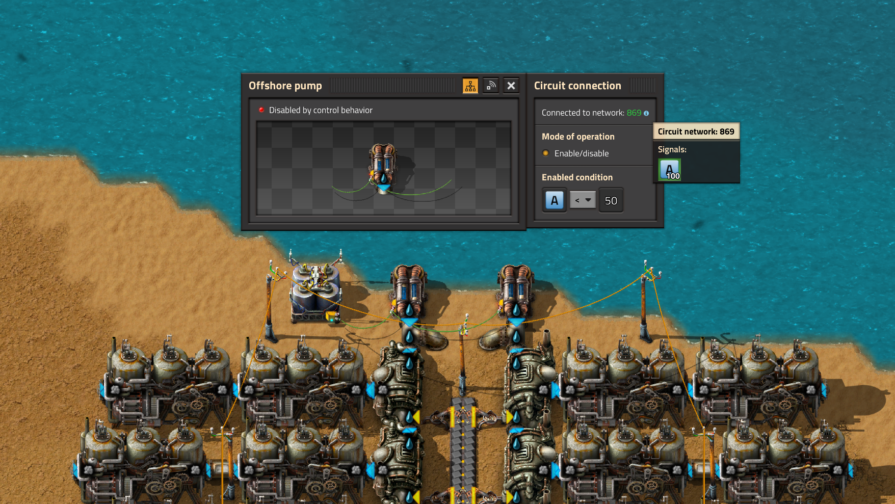
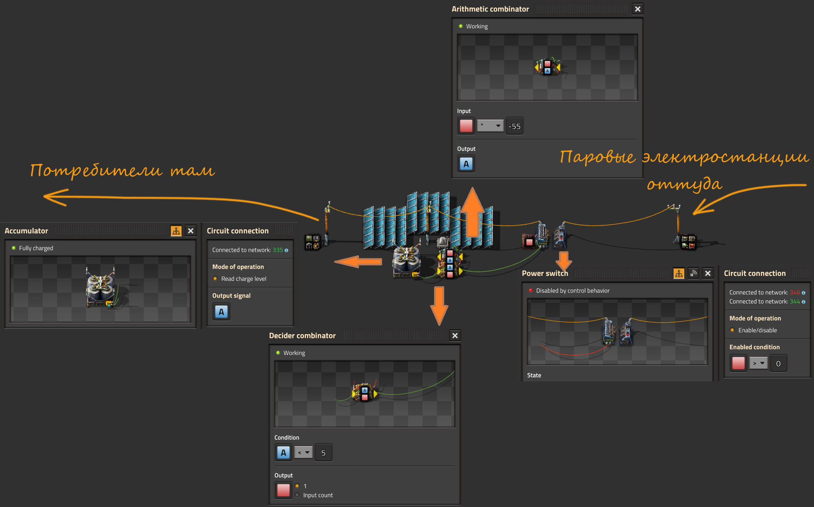

# Переводим паровые и ядерные электростанции в резерв

Паровая энергия, в начале игры, это наше всё. Вменяемые альтернативы появляются только тогда, когда удаётся накопить пару тыщ солнечных панелей и чуть меньше тыщ аккумуляторных блоков. До запуска первого спутника про солнечную энергетику можно вспоминать от случая к случаю не возлагая на неё больших надежд. Но даже если солнечных панелей и хватает чтобы полностью покрыть потребности в электричестве и даже зарядить аккумуляторные блоки, в ночное время всё равно запускается выработка энергии из пара. Почему?

:::info На самом деле
Электроснабжение осуществляется на основании приоритетов, каждый источник энергии имеет свой приоритет. Высший приоритет имеют солнечные панели. Далее следуют паровые двигатели и паровые турбины. И на последнем месте аккумуляторные блоки. [Пруф](https://wiki.factorio.com/Electric_system).

То есть, даже если ваши аккумуляторные блоки аж искрятся от переизбытка заряда, в ночное время электричество будет производиться из пара, на основании приоритетов. Sad but true.
:::

Получается, как не крути и как не выкручивайся, хоть всю планету застрой солнечными панелями и аккумуляторными блоками, по ночам, когда мирные жители засыпают, выходят они, которые пьют воду из труб, сжигают уголь прямо с конвейеров и загрязняют окружающую среду. Как быть?

## Простой костыль

:::tip Идея
Снести паровую электростанцию нафиг, чтобы не загрязняла природу своими выбросами по ночам.

А если всё-таки сохранить на случай перебоев в работе солнечной электростанции? Можно соединить аккумуляторный блок красным или зелёным проводом с насосами подающими воду на бойлеры и включать насосы только если заряд на аккумуляторном блоке опускается меньше половины (как вариант).
:::

Реализация идеи с насосами, проста как всё в мире Factorio:



Чертёж первой линии бойлеров с установленными параметрами:

```bleuprint
0eNrVlsuOozAQRf/Fa2hhXgHUm/mOURTxqBBLYFt+RB1F/HvbRAPpbjPBs5sNwuA6Vfe6bPmOmkEDF4QqVN0RaRmVqPp9R5L0tB7sN3XjgCpEFIwoQLQe7UgqqMcQaE8ooClAhHbwgSo8HQMEVBFF4MGZB7cT1WMDwkxYCHXb6lEPtWLCYDmTJoZRm9BwwiwrA3QzLziKDd6UpQQbTg1c6isxEWYa04prdfpR6JUIpc2XtdZ5RvgLTQ8ShdamkjYG20cvAOhztaRDVTwdJxPwQ0G8cNn5LC9MQMj1yJ0asrfsjwr8lm3oaIloNVEn869b4s9ESD9tM1yq2i5kFtnRyGsx21uhdz/t+Em3HScbXiQeXuD/1IutPkjXvGM9DCEMBidIG3I2gMuBPFodiGYHKJD+0jAt7FbBydGRJVuycMLhVZNZrAOSf4GEioW9YJp2Tlz6vcqOiIdRBuSAH3zg8V/gsQNevJaPX8ovfVcqzf9hpXDkPhxdnbB4XBZ7XMB4NzorPdHrcdYwMoD7LM63kK6GwImv31nyregvdqdB6fQ73VM59jIj2+1zevD0Od+Pjj3R6w5stKAgQkIlCLXhyNp7h130woseb9OdvbLuTSVqKjkTKmxgUC/axMLtVWO+lFRPd5gAXUHIh5oCp4cyPhRpmeRlPk2fiBPnbA==
```

К сожалению, костыль так себе, хотя и подходит для паровых электростанций. При увеличении количества аккумуляторных блоков, нужно уменьшать параметр срабатывания (ручками, на каждом насосе). Также электростанция останавливается и запускается не сразу, нужно время на растопку и на выпаривание всей залитой уже воды. В общем, возни много. А для ядерных электростанций этот подход сравним появлению пятой ноги у тягловой кляче. Как же по-человечески перевести паровые и атомные электростанции в резерв?

## Нудная теория

Пойдём сложным путём, нужно рассмотреть одну `вундершнягу`, которая называется то ли `триггер`, то ли `ячейка памяти`, то ли ещё как-то, суть явления не в названии. Нам потребуется сравнивающий комбинатор `Decider combinator`, и если у него замкнуть выход на вход, то это уже вундершняга. Что это даёт? А даёт это то, что любой сигнал, при определенном правильном условии на комбинаторе, можно повторить и запомнить. Причем такой комбинатор может запоминать и повторять множество сигналов, а не только один. Главное чтобы выход (Ouput) был установлен в единицу. Соответственно, такой комбинатор, можно использовать для включения и отключения разного рода электростанций, паровых и ядерных, при помощи выключателя питания `Power switch`.

## С теорией всё

Предлагаю собственно чертёж `вундершняги`, которая совместно с другими комбинаторами управляет работой выключателя питания.



Справа у нас находится некая воображаемая электростанция, показанная иконками на постоянном комбинаторе `Constant combinator`. Соответственно, слева, вместе с воображаемыми солнечными панелями `Solar panel` и аккумуляторными блоками `Accumulator` находятся воображаемые потребители электроэнергии (тоже иконки), которые нещадно разряжают аккумуляторные блоки (один в центре). Когда заряд аккумуляторного блока опускается ниже 5-ти процентов включается выключатель питания, а когда заряд аккумуляторного блока поднимается более 60-ти процентов, выключается. За это отвечают два сравнивающих комбинатора, к которым подключен аккумуляторный блок. Постоянный комбинатор рядом с выключателем питания нужен для того, чтобы выключатель питания работал постоянно, без учёта чего там вундершняга по напридумывает. Его можно убрать без ущерба для всех.

```blueprint
0eNrFV9tu2zAM/ZVATxtgF/E1FwwDiv7AHva2FYYiM4kAWTYkuW0Q5N9H2blbSeNsXV8MC5KORB7ykFqTmaihUlwaMl2THDRTvDK8lGRKfi5hUJWvoAaVKvOa4Q/Xg1IODE4ovliageY5DL5s/wsqxAAEMKM4w50Cvv6WBxBWSl0XJyAC5juM9tcBQTzC7VYy/bUmmi8kFfaqZlUB3pEbKHCFpIUdNQf5+pUbtiQb3ChzeCPTYPPsEZCGGw4tTjNYZbIuZqBwwR5Bl4Iqv6ISBMJWpeatM9YEceL0IfHIikz9NIoeks3G6yCFNyJFB6TQjRTdiDR5Fyl2+6cDlRyA0Hfoc6NKkc1gSV94qewixhWruclwLt/vnHOlTdZh5oUrU1NxIKdd4SvISQuvDbVhN7SDoqKKGnsK+U427bzEMOAN82sS2I/desQex1GA1O1uZcehpXqhAGRnJU4h7lM9PJ+ZeOSVK2j+h3b/Ux10dkenixCpdWOGVhg0b06FBofzk739O4t9tHbGZWNth4NofKAzQDo9kuOprF0RulmZc2FA3ZQgVGsoZoLLhV9QtuQS/Khlo7ZUBEcp470LtstTf14rSRk4gcI+QAWX9mq54kI40aIb0Epug2yOtqmVEyRG+hxMpYdItTLk729lZcjB1OScKQmog7OybqiYPDuOGB2IYKwuauEOgngPPLyQiGVtqrpH0j1ezCl3rgxPsyo4sqUZJ+fz6FGHveMzlwpaVA5zR6eedABN+nFzLNQOblIXN9bm7Rk5MKxJ6mqixqM9Rzem6Rb1IJ76DvV8PNXOtCueXu/gaEOgwa1WWZMu2VyVRcYl4uykrU/8jBqBDG/U7EvREwT9GJl8CiPbeqbBotzl9L+kb19Q+5PnImd4XlCvp/6VgtstzVeCIr4Z52K4hP1KbRL941L7LkGdGosmc53Z87btw+0pFl/yQtRPKtPoXfEN4n6OTeMP7WFmWODxWvd2LdoALXyQC2wQ7u5YZM0EYFOugDLrg3t7lSVQ48MbW1K5uGDThW4lSO4rV+HkE8tVciZ33/6v3H1krUp7P9fCsU03KwE2JKZHL3GPCDrD3VPyo3k57x9sL5giLWfjIB5NwlGaJuN0PN5s/gC6ZFC7
```

## Ссылка на первоисточник

[Factorio tutorial](https://wiki.factorio.com/Tutorial:Circuit_network_cookbook#Backup_steam_example)

## Больше подробностей

Детальный разбор смотрите на YouTube канале.

[**](http://www.youtube.com/watch?v=FfmslzAyOsc)
