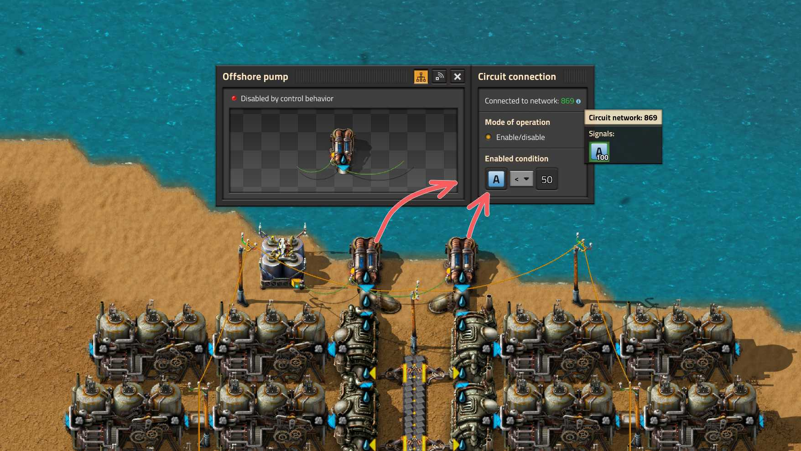

# Переводим паровые и ядерные электростанции в резерв

В начале игры *паровая энергия* єсмѣ наше всё. Вменяемые альтернативы появляются только тогда, когда удаётся накопить пару тыщ солнечных панелей `Solar panel` и чуть меньше тыщ аккумуляторных блоков `Accumulator`. До запуска [первого спутника](../HowToStartNewGame/README.md) про солнечную энергетику можно вспоминать от случая к случаю не возлагая на неё больших надежд. Но даже если солнечных панелей и хватает чтобы полностью покрыть потребности в электричестве и даже зарядить аккумуляторные блоки, **в ночное время всё равно запускается выработка энергии из пара `Steam`**, что приводит к сжиганию угля `Coal` или твердого топлива `Solid fuel`, [другие типы топливо надеюсь не используете](EfficientFuelForSteamPower.md#твёрдое-топливо-супротив-ракетного).

Почему так происходит? А потому, что электроснабжение в *Factorio* осуществляется на основании приоритетов, где каждый источник энергии имеет свой приоритет. Высший приоритет имеют солнечные панели `Solar panel`. Далее следуют паровые двигатели `Steam engine` и паровые турбины `Steam turbine`. И на последнем месте аккумуляторные блоки `Accumulator`. [Пруф](https://wiki.factorio.com/Electric_system).

:::info То бишь
Первым кандидатом на выработку электричества всегда выступают солнечные панели, и если производимой ими электроэнергии хватает для снабжения всего и вся, то дальше наши полномочия всё. Паровые двигатели и паровые турбины останавливаются, аккумуляторные блоки из поставщиков превращаются в потребителей и начинается их зарядка. Если же электричества от солнечных панелей не хватает или на дворе у нас *"тиха украинская ночь, прозрачно небо, звёзды блещут"*, то вот тогда *Factorio* берёт следующего кандидата на основании приоритетов. А на втором месте, вслед за солнечными панелями, следуют паровые двигатели и паровые турбины. У них одинаковый приоритет и соответственно производство электричества из пара будет равномерно распределено между всем паровыми агрегатами. И только в самом конце, если уже ничего не помогло, будут изъяты все остатки энергии из аккумуляторных блоков, у которых самый низкий приоритет:


:::

Получается, как не крути и как не выкручивайся, хоть всю планету застрой солнечными панелями и аккумуляторными блоками, по ночам, когда мирные жители засыпают, выходят они, бойлеры `Boiler` и паровые двигатели `Steam engine`, которые пьют воду `Water` из наших труб `Pipe`, сжигают наш уголь `Coal` прямо с конвейеров и [загрязняют нашу окружающую среду](https://wiki.factorio.com/Pollution). Надо что-то делать...

## Простой костыль

:::tip Идея
Снести паровую электростанцию нафиг, чтобы не загрязняла природу своими выбросами по ночам.

А если всё-таки сохранить паровую электростанцию на случай перебоев в работе солнечной электростанции? Например, можно соединить какой-нибудь аккумуляторный блок `Accumulator` красным `Red wire` или зелёным `Green wire` сигнальным проводом с насосами `Offshore pump` подающими воду `Water` на бойлеры `Boiler` и включать насосы только если заряд на аккумуляторном блоке опускается меньше какого-то значения, например 50%.
:::

Реализация такой идеи с насосами, проста как всё в мире *Factorio*:



```bleuprint title="Чертёж первой линии бойлеров с установленными параметрами:"
0eNrVlsuOozAQRf/Fa2hhXgHUm/mOURTxqBBLYFt+RB1F/HvbRAPpbjPBs5sNwuA6Vfe6bPmOmkEDF4QqVN0RaRmVqPp9R5L0tB7sN3XjgCpEFIwoQLQe7UgqqMcQaE8ooClAhHbwgSo8HQMEVBFF4MGZB7cT1WMDwkxYCHXb6lEPtWLCYDmTJoZRm9BwwiwrA3QzLziKDd6UpQQbTg1c6isxEWYa04prdfpR6JUIpc2XtdZ5RvgLTQ8ShdamkjYG20cvAOhztaRDVTwdJxPwQ0G8cNn5LC9MQMj1yJ0asrfsjwr8lm3oaIloNVEn869b4s9ESD9tM1yq2i5kFtnRyGsx21uhdz/t+Em3HScbXiQeXuD/1IutPkjXvGM9DCEMBidIG3I2gMuBPFodiGYHKJD+0jAt7FbBydGRJVuycMLhVZNZrAOSf4GEioW9YJp2Tlz6vcqOiIdRBuSAH3zg8V/gsQNevJaPX8ovfVcqzf9hpXDkPhxdnbB4XBZ7XMB4NzorPdHrcdYwMoD7LM63kK6GwImv31nyregvdqdB6fQ73VM59jIj2+1zevD0Od+Pjj3R6w5stKAgQkIlCLXhyNp7h130woseb9OdvbLuTSVqKjkTKmxgUC/axMLtVWO+lFRPd5gAXUHIh5oCp4cyPhRpmeRlPk2fiBPnbA==
```

К сожалению, костыль сей так себе, хотя и подходит для паровых электростанций. При увеличении количества аккумуляторных блоков, придётся уменьшать параметр срабатывания, ручками, на каждом насосе. Также электростанция останавливается и запускается не сразу, нужно время на растопку и на выпаривание всей залитой уже воды. В общем, возни много. А для ядерных электростанций этот подход сравним появлению пятой ноги у тягловой клячи. Хотя на начальном этапе игры вполне действующая модель. Но как же по-человечески перевести паровые и атомные электростанции в резерв?

## Нудная теория

Пойдём сложным путём, нужно рассмотреть одну `вундершнягу`, которая называется то ли *триггер*, то ли *ячейка памяти*, то ли ещё как-то, суть явления не в названии. Нам потребуется сравнивающий комбинатор `Decider combinator`, и если у него замкнуть выход на вход сигнальным кабелем, то это уже `вундершняга`, [вот такая](../CircuitNetwork/README.md).

И что это даёт? А даёт это то, что любой сигнал, при определенном правильном условии на комбинаторе, можно повторить и запомнить. Причём такая `вундершняга` может запоминать и повторять множество сигналов, а не только один. Соответственно, такой комбинатор, можно использовать для включения и отключения разного рода электростанций, паровых и ядерных, при помощи выключателя питания `Power switch`.

## С теорией всё, начинаем творить

Предлагаю собственно чертёж `вундершняги`, которая совместно с другими комбинаторами управляет работой выключателя питания.


```blueprint title="Чертёж c вундершнягой:"
0eNrFV9uOmzAQ/ZXIT60EVSCEhKiqtNof6EPf2hVyzCSxZAyyze5GUf69Y8h1MRtIL/uCsGwfe+bMnBnvyFJUUCouDVnsSAaaKV4aXkiyID82MCqLF1CjUhVZxfCH61EhRwYnFF9vzEjzDEafDv85FWIEAphRnOFOAZ9/yTMIK6Su8isQAasjRvPrgCAe4XYrWfzcEc3Xkgp7VbMtAe/IDeS4QtLcjuqDfP3CDduQPW6UGbySRbB/8ghIww2HBqcebFNZ5UtQuOCEoAtBlV9SCQJhy0Lzxhk7gjj+NPwy9ciWLJLoy3S/91pAYU+gKLkBNOkLFB+Bpm6gyO0cB1LQ4MToN/S3UYVIl7Chz7xQdg3jilXcpDiXnTauuNImbbHyzJWpqDgT06zwFWSkgdeG2pAb20FeUkWNPYV8I/tmXmII8Jr1HQnsx269YI7jKMAbH29lx6Glea0AZGslTiHuYzV+O5N45IUrqP/Hdv9jFbR2T64XIVLjxRStMGjeigoNDt9PT/YfLfbR2iWXtbWO8JodyURW8ZQMD2XNgtBNyooLA6pXblCtIV8KLtd+TtmGS/AnDRmVZSK4yBbvJtgxRf1VpSRl4AQKhwDlXNqrZYoL4USb9EAruI2xFdqmtk6QCNlzEBWfA9UqkH+6lVUgF1HxNVESUAGXRVUzkTw5TpideWCsyivRFQKHLJx1ZGFRmbIakHEPnQnlTpTxdUoF1l8Oc+ZvHCZoXro0ZX7pJwdOMtDxZ910OD52Od5adDgiA4alRr2fg1FyIKBnBh5Az7Ko79DFh2tVjNuy6A1mvuG3xi23aZ0J6UoVecol4hxFa0hwzC7cWwdH3A4Wj4Q91Tq4gRZ2hF4QDCR09gGEHgqdBotyF2d/yP6p0g7n3sXduHelbdfkd2Ii6o3TJURBOLDGRuFfrbE3/d8qrmgx16k979A29E/AqMsJk4EyOglv6HIQDXTrJPiHrcsS6zre6t5mRRuguQ9yjX3B3Y2KrJgAbMQVUGZdcG+LsgFqfHhlGyrXHTZ1NCnBtO8r5cRF0sFufF9NnH9gTZy+EcWv/1cUe3dL7xTAcc8CNxv89qt5tsJiQ21x8ab3iKBL3Lwg3+s3+On194yp11A4D6JZEs7mcTKejKP9/jdULWp6
```

Справа (за изображением) у нас находится некая воображаемая паровая электростанция, показанная иконками на постоянном комбинаторе `Constant combinator`, который рядом с опорой ЛЭП `Small electric pole`. Соответственно, слева (тоже за изображением) вместе с воображаемыми солнечными панелями `Solar panel` и аккумуляторными блоками `Accumulator` находятся воображаемые потребители электроэнергии показанные иконками на постоянном комбинаторе и которые нещадно разряжают аккумуляторные блоки. Один такой аккумуляторный блок находится в центре изображения, с него и считываем данные о количестве зарядки всех аккумуляторных блоков. Аккумуляторные блоки разряжаются равномерно, это важно. Наличие парочки солнечных панелей тут не обязательно, они просто не дают чертежу замереть и питают аккумуляторный блок и комбинаторы, если всё это отключено от электрической сети.

:::info Главная фича
Cолнечная электростанция находится в одной электрической сети с потребителями, а паровые электростанции в другой электрической сети. Паровые электростанции отделены от потребителей и солнечной электростанции выключателем питания. Если заряд аккумуляторных блоков падает ниже какого-то значения (5%), то значить у нас нехватка электричества в сети потребителей и нужна подпитка от паровых электростанций. В этом случае нужно включать выключатель питания и подключать паровые электростанции к генерации электричества. Если же заряд аккумуляторных блоков поднимается выше какого-то значения (60%), то значить у нас с электричеством всё в порядке и подпитка от паровых электростанций не нужна. В этом случае нужно выключать выключатель питания и отсоединять паровые электростанции. Означенными процентными значениями можно баловаться как душеньке угодно.
:::

Рядом с аккумуляторным блоком имеются два сравнивающих комбинатора `Decider combinator`, выполняющие роль генератора сигналов. В зависимости от уровня заряда на аккумуляторном блоке, они подают сигналы в логическую сеть. Когда заряд аккумуляторного блока опускается сильно низко в сеть отправляется сигнал красного квадрата, сопоставимого с низким уровнем заряда. А когда заряд аккумуляторного блока возвращается к нормальному состоянию в сеть отправляется сигнал зелёного квадрата, сопоставимого с высоким уровнем заряда.

Эти сигналы подаются на вход `вундершняги`, которая управляет выключателем питания `Power switch` в зависимости от того, какой сигнал пришел последним. Да, `вундершняга` типа всё помнит и если последним сигналом был сигнал красного квадрата, она "включает" выключатель питания и начинается забор электричества от паровой электростанции для зарядки аккумуляторных блоков. Если последним сигналом был сигнал зелёного квадрата, то выключатель питания отключается и зарядка аккумуляторных блоков от паровой электростанции прекращается. Обратите внимание как выставлено условие и выход на `вундершняге`, *Condition* и *Output*, они собственно и управляют выключателем питания.

Ещё можно увидеть постоянный комбинатор `Constant combinator` рядом с выключателем питания `Power switch` и который включает выключатель питания. Он нужен для того, чтобы выключатель питания работал постоянно, без учёта чего там `вундершняга` понапридумывает. Через него можно включать выключатель питания в ручную и его можно убрать с чертежа без ущерба для всех.

[Взято отсюда](https://wiki.factorio.com/Tutorial:Circuit_network_cookbook#Backup_steam_example)

Вот собственно и всё. Мы получили чертёж, который позволяет отключать паровые электростанции, если аккумуляторные блоки заряжены и включать паровые электростанции, если аккумуляторные блоки разряжены.

## Больше подробностей

Детальный разбор смотрите на YouTube канале.

[**](http://www.youtube.com/watch?v=Nfm9Njib4tE)

[**](http://www.youtube.com/watch?v=FfmslzAyOsc)
