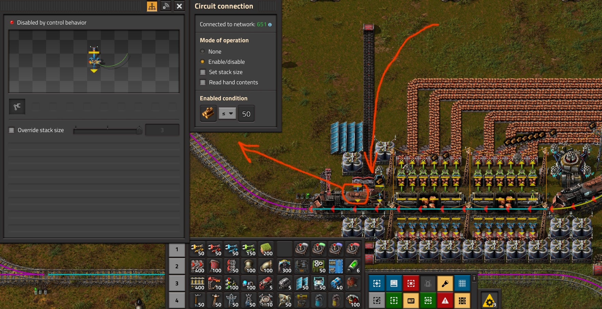
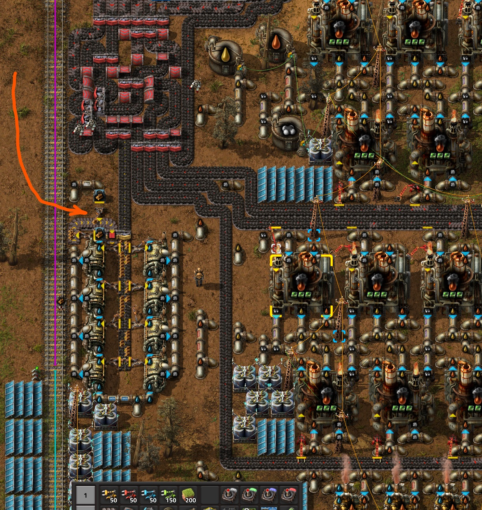

# Эффективность топлива для производства паровой энергии

:::tip Вся статья, кратко
Уголь `Coal`, а лучше твёрдое топливо `Solid fuel`, остальное не нужно.
:::

Единственно возможный способ производства энергии в начале игры является сжигание топлива в бойлерах `Boiler` и получение энергии из пара в паровых двигателях `Steam engine`. Также, этот способ производства энергии остаётся весьма актуальным вплоть [до запуска первого спутника](../HowToStartNewGame/README.md), и даже немного после. Можно использовать любой тип топлива, ну кроме древесины `Wood`, так как автоматизировать массовую добычу подобного ресурса невозможно в принципе.

:::warning На самом деле
Древесина тоже ресурс и в начале игры, когда автоматизации ещё нет, её иногда используют и в каменных печах и в твёрдотопливных бурах и даже в бойлерах. После запуска спутника вырубка деревьев под разрастающуюся базу зачастую несёт катастрофический для природы и окружающей среды характер, так что приток древесины может вызвать переполнение сундуков в логистической сети. Бороться с этим можно гранатами, расчищая места будущих построек, но со временем это становиться затруднительным и скучным занятием. Другой вариант, пускать древесину на какие-то нужды. Сжигать дровишки можно только в бойлерах, в печах и в поездах. Есть ещё правда, автомобиль `Car` и танк `Tank`, но тут наши полномочия всё. К сожалению, бойлеры будут постепенно переводиться в резерв, топливные печи заменяться на электрические, а поезда не шибко быстро ездят на брёвнах.

**В общем**, сжигание древесины в поездах и в бойлерах производящие пар для сжижения угля, это единственные вменяемые варианты избавления от неё, если скырба давит просто закидать сундуки с древесиной гранатами.

Избавляемся от древесины:

Исчё один способ:

:::

Несмотря на возможность производить солнечные панели `Solar panel` и аккумуляторные блоки `Accumulator` к середине игры, то есть до запуска первого спутника, полностью перейти на солнечную энергию будет затруднительно в силу потребности большого количества ресурсов для производства всего этого. Производство же бойлеров и паровых двигателей очень дёшево, довольно быстро, можно производить массового даже руками в рюкзаке, и самое главное, бойлеры и паровые двигатели в короткий срок могут дать намного больше энергии, чем солнечные панели.

Далее предлагается сравнить эффективность различного типа топлива, кроме вырубленных деревьев `Wood`, которое можно использовать для производства [паровой энергии](SteamPower.md), а именно, уголь `Coal`, твёрдое топливо `Solid fuel`, ракетное топливо `Rocket fuel` и ядерное топливо `Nuclear fuel`, других вроде нет.

#### Основные соотношения для производства паровой энергии

| `!Offshore pump` | `!Water` | `!Boiler` | `!Steam` | `!Steam engine` | `!Electric mining drill` | `!Transport belt` | Производимое электричество |
| :---:            | :----:   | :----:    | :----:   | :----:          | :----:                   | :----:            | :----                      |
| 1                | 1200     | 200       | 12000    | 400             | 180 `!Coal`              | 6 `!Coal`         | 360MW                      |
| > | > | > | > | > | > | > | Насос `!Offshore pump` производит 1200 единиц воды `!Water` в секунду |
| > | > | > | > | > | > | > | Бойлер `!Boiler` потребляет 6 единиц воды `!Water` в секунду и производит 60 единиц пара `!Steam` |
| > | > | > | > | > | > | > | Бойлер `!Boiler` производит пар 1.8MJ энергоёмкости в секунду |
| > | > | > | > | > | > | > | Бойлер `!Boiler` также потребляет энергию топлива со скоростью 1.8MJ в секунду  |
| > | > | > | > | > | > | > | Паровой двигатель `!Steam engine` переводит 30 единиц пара в 0.9MW электричества каждую секунду |
| > | > | > | > | > | > | > | 400 паровых двигателей `!Steam engine` производят 360MW электричества |

#### Таблица потребления топлива бойлерами в разрезе полностью заполненного конвейера топлива

|                           | `!Wood` | `!Coal`           | `!Solid fuel`     | `!Rocket fuel`     | `!Nuclear fuel` |
| :---:                     | :---:   | :----:            | :----:            | :----:             | :----:          |
|  Ёмкость одной единицы    | 2MJ     | 4MJ               | 12MJ              | 100MJ              | 1.21GJ          |
| `!Transport belt`         | 17      | **34** `!Boiler`  | **100** `!Boiler` | 834                | 10084           |
| `!Fast transport belt`    | 34      | 67                | **200** `!Boiler` | 1667               | 20167           |
| `!Express transport belt` | 50      | **100** `!Boiler` | 300               | **2500** `!Boiler` | 30250           |
| `!Turbo transport belt`   | 67      | 134               | 400               | 3334               | 40334           |

## Уголёк супротив твёрдого топлива

И первым делом сравним эффективность использования угля `Coal` и твёрдого топлива `Solid fuel` при производстве паровой энергии. Сравнение сделаем через производство твёрдого топлива путём сжижения угля `Coal liquefaction`. Данное производство требует небольшого количества мазута `Heavy oil` дабы запустить процесс, далее из ресурсов требуется только уголь, вода же добывается бесплатно, насосы `Offshore pump` липестричество не кушают. Так, *для производства 450 единиц твёрдого топлива, путём сжижения угля, потребуется примерно 633 единиц угля*, а 450 единиц твердого топлива имеют энергоёмкость 450x12=5400 мегаджоулей. Тогда как энергоёмкость 633 единиц угля всего лишь 633x4=2532 мегаджоулей. Если предположить, что приток угля у нас постоянен, как и производство твердого топлива, то за вычетом 8 мегаватт, которые требуются для производства 450 единиц твёрдого топлива путём сжижения угля, мы получаем 82 мегаватта от сжигания твёрдого топлива в бойлерах `Boiler` против примерно 45 мегаватт от непосредственного сжигания угля там же.

:::tip Вывод: используйте твёрдое топливо для производства паровой энергии
Таким образом, производство твёрдого топлива для производства паровой энергии заметно выгодней по сравнению с простым сжиганием угля в бойлерах. Выгода составляет примерно 100%, то есть за пол конвейера угля, переводя его в твердое топливо, можно питать электростанцию работающей как будто на целом конвейере угля. При первой же возможности, стоит переходить на сжижение угля для производства твёрдого топлива. [Пруф и пример](UpgradingSteamPower.md).
:::

## Твёрдое топливо супротив ракетного

Перейдем теперь к сравнению твёрдого топлива и ракетного топлива `Rocket fuel`. *Для производства одной единицы ракетного топлива, нужно 10 единиц твердого топлива*, не считая дизельного топлива `Light oil`. Каждая единица твердого топлива имеет энергоёмкость 12 мегаджоулей, 10 единиц соответственно 120 мегаджоулей. Тогда как одна единица ракетного топлива имеет энергоёмкость всего 100 мегаджоулей. То есть, если мы сожжём твердое топливо в бойлерах, которое необходимое для производства ракетного топлива, то мы получим на 20% энергии больше, чем если бы произвели ракетное топливо и потом его жгли в бойлере. И это без учёта дополнительных трат энергии на производство ракетного топлива и ещё откуда-то нужно взять дизельное топливо.

:::warning Вывод: не используйте ракетное топливо для производства паровой энергии
То есть, производить ракетное топливо, чтобы его использовать для производства паровой энергии ведёт к расходам энергии по сравнению с твёрдым топливом.
:::

Возможно, ситуация может немного измениться, если использовать три модуля продуктивности `Productivity module 3` и один модуль скорости `Speed module 3`, все модули третьего уровня вестимо, чтобы производить ракетное топливо в сборочных автоматах третьего уровня `Assembling machine 3`. Здесь вопрос уже в области здравомыслия, кто будет производить ракетное топливо таким образом, чтобы сжигать его в бойлерах? Я к тому, что к этому времени, уже перейдёте на солнечную энергию или мирный атом.

## Ядрёрнное, или может быть ядерное топливо

Сравнить эффективность сжигания ядерного топлива `Nuclear fuel` сложнее. Производство требует всего одной единицы ракетного топлива `Rocket fuel`, одной единицы урана 235 `Uranium-235`, а энергоёмкость составляет аж 1.21 гигаджоуль. Ещё стоит сравнить на предмет эффективности производство урановых топливных элементов `Uranium fuel cell` из того же количества урана 235 и сжигание его в ядерном реакторе `Nuclear reactor`. Я бы не хотел сравнивать всё это, вопрос больше в том, нафига вообще производить паровую энергию сжигая ядерное топливо в бойлере? Если вы достигли уровня, когда в игре уже есть ядерное топливо, вряд ли разумно использовать грязные и малопроизводительные бойлеры. 30 метров постоянного загрязнения `Pollution` для получения всего лишь 1.8 мегаватта энергии мне представляется чем-то не разумным, если есть возможность перейти на ядерную энергию `Nuclear power` или на солнечную `Solar energy`.

:::info Вывод: зачем?
Хотя возможно и эффективно...
:::

## Что в остатке?

Итого, похоже, что самым эффективным топливом для производства паровой энергии является производство твёрдого топлива `Solid fuel`. Нужно также понимать, что после запуска первого спутника, стоит [переходить на солнечную энергию, взамен паровой](README.md#этап-второй-и-корованы-ракет). По этой причине, использование ядерного топлива `Nuclear fuel` для сжигания в бойлерах не выглядит логичным.

## Больше подробностей

Детальный разбор смотрите на YouTube канале.

[**](https://www.youtube.com/watch?v=avZhWqnDwHI)
