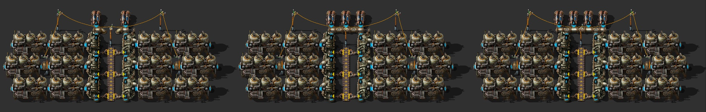

# Производство энергии

:::warning Статья обзорная и точка
Тут нет чертежей, пощукайте онные в предметных статьях:
[Паровая энергия](SteamPower.md),
[Солнечная энергия](SolarPower.md),
[Ядерная энергия](NuclearPower.md)
и прочих.
:::

:::tip Вся статья, кратко
Игра в *Factorio* делится на два этапа. Первый - *строим космический спутник своими руками из палок и чего-то там исчё за 8 часов*, второй - *мы верим, друзья, в* 🐮 *корованы ракет*. На каждом этапе свои приколы связанные с производством энергии.
:::

:::info На самом деле
Первый спутник нужно запустить за пять часов, иначе это какой-то позор... [Сперва добейся, потом советуй](https://steamcommunity.com/sharedfiles/filedetails/?id=2832606269).
:::

:::info На самом деле исчё
Существует ещё и промежуточный этап, между двумя выше означенными. Называется он: *строим завод, который построит остальные заводы*. [Подробности](../HowToStartNewGame/AfterSatelliteLaunch.md#строим-завод-который-построит-остальные-заводы).
:::

Паровая энергия это единственный вид энергии доступный с самого начала игры *Factorio*. Производство и строительство паровых электростанций весьма дёшево. Быстрота производства бойлеров `Boiler`, паровых двигателей `Steam engine` и всего сопутствующего является вторым плюсом. Бойлеры и паровые двигатели, а также сопутствующие опоры ЛЭП `Small electric pole`, конвейеры `Transport belt` для подачи топлива и манипуляторы `Burner inserter` для его загрузки можно производить даже рукамии "в рюкзаке". Производство же солнечных панелей `Solar panel` затратно, как по ресурсам, так и по времени. Генерация энергии солнечными панелями весьма слабое, потребуется много панелей и аккумуляторов `Accumulator`, которые не доступны в начале игры.

Двух паровых электростанций вполне достаточно, чтобы запустить первый спутник и победить в игре. Первая электростанция будет питаться одним полным конвейером `Transport belt` угля `Coal`, вторая электростанция получает половину такого же конвейера твёрдого топлива `Solid fuel`. У паровой энергии имеются и минусы, но в начале игры они не существенны. Во-первых, паровая генерация энергии потребляет ресурсы, которые нужно добывать. Во-вторых, бойлеры генерируют много загрязнения, паровые электростанции будут целью атаки местной фауны. С этим придётся как-то справляться, но ничего сверхсложного нет.

[После запуска первого спутника](../HowToStartNewGame/AfterSatelliteLaunch.md), нам потребуется намного больше энергии, добывать которую паровыми электростанция, становиться невыгодно. Здесь переходим на солнечную энергию, которая не потребляет ресурсов и не загрязняет планету. В уме держим ядерные электростанции, но переход на которые потребует много игрового времени. Нужно завершить несколько затратных исследований, освоить добычу урана `Uranium ore` и наладить процесс производства урановых топливных элементов `Uranium fuel cell` через довольно долгий процесс обогащения Коварекса `Kovarex enrichment process`. Некоторые игроки и вовсе отказываются от ядерной энергии в пользу солнечной.

:::tip Стратегия игры, кратко **
На первом этапе напираем на паровую энергию, одного конвейера угля достаточно, добавляем электростанцию на твёрдом топливе, половина конвейера достаточно, добавляем солнечные панели с аккумуляторными блоками по мере возможностей. Как вариант экономии угля на первоначальном месторождении, можно перевести [первую электростанцию на твёрдое топливо](./UpgradingSteamPower.md).

На втором этапе отказываемся от паровой энергии и переходим на солнечную с питанием от аккумуляторных блоков ночью. За ядерными реакторами особо не торопимся.
:::

## Этап первый или космический спутник своими руками

Производство энергии на начальном этапе игры заключаются в строительстве достаточного количества бойлеров `Boiler`, паровых двигателей `Steam engine` и снабжение их углём `Coal`, не забывая при этом про насосы `Offshore pump` подающие воду `Water` в бойлеры из ближайших луж. По мере возможностей и без особого спеха производим солнечные панели `Solar panel` и устанавливаем их в пустых участках разрастающейся базы. На аккумуляторные блоки `Accumulator` можно забить до поры до времени, когда ресурсов будет хватать на большее.

Основная цель на первые часы игры это освоить добычу близлежащих ресурсов, кроме нефти `Crude oil resource` и урана `Uranium ore` естественно. Построить [плавильню](../RawResourcesProcessing/README.md), включая стальные балки `Steel plate`, хоть как-то запустить первые две науки, красную `Automation science pack` и зелёную `Logistic science pack`. А также построить [маленький заводик](../HowToStartNewGame/Mall.md#магазин-шота-у-ашота) по производству только самого необходимого, без фанатизма. Энергии на это хватит от одной электростанции на угле. Потом можно будет [выйти за пределы базы](../HowToStartNewGame/FirstExpansion.md) и освоить добычу нефти `Crude oil`. Тут стоит начать возводить вторую электростанцию, на твёрдом топливе `Solid fuel`. Далее наша цель робототехника `Roboport` и собственно строительство оставшейся базы по подготовленным заранее чертежам, с наукой и разными 🙋 няшками.

:::tip Это важно
Одним конвейером `Transport belt` угля `Coal` можно питать [34 бойлера, что даёт 61.2 мегаватт энергии](SteamPower.md#чертёж-угольной-паровой-электростанции). Этого достаточно, чтобы пережить продвинутую переработку нефти `Advanced oil processing` и даже дожить до начала строительства дронстанций `Roboport`.
:::

:::tip Тоже важные подробности
Половиной конвейера `Transport belt` твёрдого топлива `Solid fuel` можно питать 50 бойлеров `Boiler`, но обычно используют чертёж на двух насосах `Offshore pump`, то есть 40 бойлеров, что равняется [72 мегаватт энергии](SteamPower.md#чертёж-паровой-электростанции-на-твёрдом-топливе). Если производить твёрдого топлива больше чем полконвейера, можно сыграть в 60 бойлеров при трёх насосах, что даст примерно 108 мегаватт энергии. Варианты с большим количеством бойлеров не эффективны из-за огромной длины на карте и сложности организации подачи воды `Water` с одной стороны электростанции.
:::

[Варианты организации подачи воды](SteamPower.md#расходы-топлива-для-различных-конфигураций-паровой-электростанции) в паровые электростанции на разное количество насосов:

Каждый работающий бойлер [загрязняет природу](https://wiki.factorio.com/Pollution) на 30/m. Что бы это не значило, это много, поэтому паровые электростанции являются источником сильного загрязнения, что привлекает местную фауну. Имеет смысл огораживать паровые электростанции стенами `Wall` и защищаться турелями `Gun turret` по периметру.

Начинайте производить твердое топливо `Solid fuel` как можно скорее. Тут напомню, что производить твёрдое топливо лучше всего из дизельного топлива `Light oil`, [пруф](https://youtu.be/avZhWqnDwHI?t=66). Используйте `Solid fuel from light oil` для этого. Сразу после открытия продвинутой переработки нефти `Advanced oil processing` добавляйте бойлеры на твердом топливе и паровые двигатели в процесс производства энергии. Это желательно сделать до запуска дронов `Roboport`, иначе можно попасть в блэкаут по части электроснабжения, когда строительные дроны `Construction robot` начнут возводить оставшуюся часть базы (надеюсь вы играете по заготовленным чертежам, ведь так?). А ещё, можно хапнуть проблем с электроснабжением и раньше, в зависимости от того как вы строите. Поэтому не откладывайте строительство электростанции на твёрдом топливе.

Солнечные панели `Solar panel` строим сразу как завершим соответствующее исследование `Solar energy`. Но без фанатизма, ресурсов они требуют много, выхлоп дают маленький. Массовое производство солнечных панелей можно освоить после запуска спутника, а полный переход на солнечную энергию и того позже. А в начале игры одного заводика, первого `Assembling machine 1`, где-то в конце других заводов, производящих всё первое необходимое для жизни, вполне хватит для начала. Примерный вид [первого заводика](../HowToStartNewGame/Mall.md#магазин-шота-у-ашота):

По мере возможностей производите аккумуляторные блоки `Accumulator` и устанавливайте их так же как и солнечные панели, в пустых участках разрастающейся базы. Начинать их производство нужно ближе к концу, примерно вместе с фиолетовой наукой `Production science pack`, которую исследуем после желтой науки `Utility science pack`. Да, жёлтую науку предпочтительней открывать перед фиолетовой и производство дронов мы запускаем как можно раньше. Хотя опять-таки, есть карты с исключением, особенно когда без сжижения угля `Coal liquefaction` вообще никак, тогда фиолетовая наука вэлком.

Если имеются проблемы с производством твёрдого топлива из нефти, то после открытия фиолетовой науки `Production science pack` можно открыть сжижение угля  `Coal liquefaction`, но одной электростанции из 40 бойлеров на твёрдом топливе в дополнение к угольной, обычно хватает для снабжения базы из 45 научных пакетов в минуту и запуска первого спутника. Нефти для производства нужного твёрдого топлива обычно тоже хватает из близлежащего месторождения (вы же подбирали карту так, чтобы не строить поезда для транспортировки первой нефти?). Также, можно выделить какое-то пространство рядом с базой и размещать солнечные панели уже большими группами и даже какое-то количество аккумуляторных блоков.

Теперь обратим внимание на конкретные варианты первой фабрики для запуска спутника, среди которых существуют и множество различных макаронных фабрик. В силу имеющихся в игре соотношений, основные расклады включают всего [два рабочих варианта](https://factoriocheatsheet.com/#science): на 45 научных пакетов в минуту и на 75 научных пакетов в минуту. Есть ещё вариант на 30 пакетов, но [это нам не нужно](https://neolurk.org/wiki/%D0%9D%D0%B5_%D0%BD%D1%83%D0%B6%D0%B5%D0%BD).

:::tip Зачем нужна начальная база
Наша задача не просто запустить спутник, а потом хоть кусаки приходите. Наша задача построить такую начальную базу, которая продолжит бесперебойную работу и после запуска первого спутника. Соответственно, начальная база должна быть точно сбалансирована и не вызывать желания снести нафиг весь этот позор. Также она должна вписываться в дальнейшее расширение нашей мега-фабрики и строительство сети железных дорог.
:::

Построить такую красивую начальную фабрику можно в песочнице, протестировав её, а потом играть уже обычную игру [по готовым чертежам](../HowToStartNewGame/README.md).

### Начальная база на 45 научных пакетов в минуту

[Расчёты по базе на 45 научных пакетов в минуту](https://kirkmcdonald.github.io/calc.html#zip=bVDbagQxCP2bPCVld7vTpQP5GOs4ray5YMzD/n0TaAudFkU8F1HcwCCew4hXpzVeHc6SOMeL27tmQIrNiCR8IfdGYnGHZsEUcqtFLUzOsVFqEbqVBMYlh4ZMGSlUwPu6r4uX8s7NGI/Ki8cPSowgR+V88d1Y2B5H5ebT5EH/KIuvWraO/91w82109JvW9bp4BZZhOD0tHhB76gJWdJ7gWxHQYc0k35i38Y8B5+jJpbFOqEUteCcbTrW1Pv/kJw==), требуется 127 мегаватт, **не включая** расходы на манипуляторы, подсветку ночью, радары, дронстанции, модули и прочее. Расчётные данные потребления электроэнергии сходятся с экспериментом. На картинке производим и потребляем 45 научных пакетов в минуту, плюс немного модулей эффективности для экономии энергии:

Таким образом, у нас имеется первоначальная электростанция на полном конвейере угля состоящая из 34 бойлеров с полным комплектом паровых двигателей, электростанция на половине конвейера твёрдого топлива из 40 или 50 бойлеров, пару сотен солнечных панелей и может быть какое-то количество аккумуляторных блоков на всякий случай. Вот собственно всё что нам нужно, чтобы запустить спутник на любой карте.

| Топливо | Конвейер | Насосы | Бойлеры | Двигатели | Мегаватты | Примечание |
| ---: | ---: | ---: | ---: | ---: | ---: | --- |
| 900 `!Coal` | 100% `!Transport belt` | 2 `!Offshore pump` | 34 `!Boiler` | 72 `!Steam engine` | 61.2 | Максимум на угле |
| 360 `!Solid fuel` | 40% `!Transport belt` | 2 `!Offshore pump` | 40 `!Boiler` | 80 `!Steam engine` | 72 | Максимум на насосах |
| | | | 500 `!Solar panel` | 420 `!Accumulator` | 21 | Солнечная энергия |
| | | | | | ~155 | Итого |

### Начальная база на 75 научных пакетов в минуту

Для справки рассмотрим [расчёты по базе на 75 научных пакетов в минуту](https://kirkmcdonald.github.io/calc.html#zip=dZDdigMxCIXfJleTZUpbSgN5GOs4u1LzgzEX+/abgbZXWRTxnE9Q3MAgnvyIu9MaLw6PkjjHs9u7ZkCKzYjEv5R7kFjcoZk3hdxqUfOH59gotQjdSgLjkn1DpozkK+AzaLhdFynf3IxxgvCHEiPIBHVjYfudkHQA0BmqWraO/9zRRksTX4El7GH9ui6A2FMXsKLDOS2tCOgYzSRvzdt4ypAa7uvq0tgn1KIWfJKNSbVQz5/8Aw==), иногда можно играть и в такую факторию, если быстро выйти на железную дорогу или карта модифицирована на большое обилие ресурсов. Здесь потребуется более 256 мегаватт, не включая прочие расходы.

Закладываем полный конвейер твёрдого топлива, что даёт 100 бойлеров, плюс начальный конвейер на угле, который на 34 бойлера. Итого, 268 паровых двигателей, которые могут производить примерно 241 мегаватт энергии. Этого маловато, в такой конфигурации ближе к запуску спутника нужно будет напирать на солнечную энергетику, включая аккумуляторные блоки для снабжения в ночное время или строить больше электростанций на твёрдом топливе. Если играть на обычных настройках карты, без твиков на огромные залежи ресурсов, ближайшего месторождения нефти может не хватить и без сжижения угля обойтись будет затруднительно. Напомню, что получение твёрдого топлива путём [сжижения угля предпочтительней](EfficientFuelForSteamPower.md#уголёк-супротив-твёрдого-топлива) для использования в качестве топлива для паровой электростанции, чем прямое использование угля для производства паровой энергии.

Если ресурсов вокруг хватает, то первоначальная электростанция на полном конвейере угля состоящая из 34 бойлеров с полным комплектом паровых двигателей, электростанция на полном конвейере твёрдого топлива из 100 бойлеров и где-то полторы тыщи солнечных панелей вместе с более чем тыщей аккумуляторных блоков.
| Топливо | Конвейер | Насосы | Бойлеры | Двигатели | Мегаватты | Примечание |
| --- | ---: | ---: | ---: | ---: | ---: | --- |
| 900 `!Coal` | 100% `!Transport belt` | 2 `!Offshore pump` | 34 `!Boiler` | 72 `!Steam engine` | 61.2 | Максимум на угле |
| 900 `!Solid fuel` | 100% `!Transport belt` | 5 `!Offshore pump` | 100 `!Boiler` | 200 `!Steam engine` | 180 | Максимум на твёрдом топливе |
| | | | 1500 `!Solar panel` | 1260 `!Accumulator` | 63 | Солнечная энергия |
| | | | | | ~300 | Итого |
|>|>|>|>|>|>|Произвести такое количество солнечных панелей и аккумуляторных блоков может быть затруднительным, если мы хотим запустить спутник за 8 часов. Налегайте на ещё одну электростанцию на твёрдом топливе и дополнительных заводов по сжижению угля. Заменим солнечную энергию на адекватные значения и добавим ещё 40 бойлеров:|
| | | | 500 `!Solar panel` | 420 `!Accumulator` | 21 | Солнечная энергия |
| 360 `!Solid fuel` | 40% `!Transport belt` | 2 `!Offshore pump` | 40 `!Boiler` | 80 `!Steam engine` | 72 | Максимум на насосах |
| | | | | | ~330 | Итого |

Получается, что нам нужно производить полтора конвейера твёрдого топлива (900+360), что тоже не мало. Есть также смысл рассмотреть [улучшение первой паровой электростанции](UpgradingSteamPower.md).

Отдельно отмечу, что вариант на 75 научных пакетов выглядит вкуснее по сравнению с 45, но его реализация требует решения дополнительных проблем. И как мы видим, производство энергии является одной из них. Решение этих проблем может варьироваться от карты к карте и зависеть от режима игры. Откровенно говоря, потянуть такую формацию начальной базы будет затруднительно, на большинстве карт.

:::info Альтернативный вариант
Имеется вариант, при котором можно получить в конце концов начальную базу на 75 научных пакетов в минуту и при этом не столкнуться с проблемами связанные с нехваткой ресурсов и электричества. Заключается он в том, что мы строим начальную базу на 45 научных пакетов в минуту таким образом, чтобы потом её легко улучшить до 75.

[Подробности](../HowToStartNewGame/README.md).
:::

## Этап второй и корованы ракет

После запуска первого спутника мы хотим играть дальше, ведь так? Поэтому нужно постепенно переходить на солнечную энергию, переводя паровые электростанции в резерв. Думаем про экологию и не дразним кусак загрязнением, а также волнуемся за [Тунберг Грету](https://ru.wikipedia.org/wiki/Thunberga_greta). Также стоит освоить добычу урановой руды `Uranium ore` и готовиться производить урановые топливные элементы `Uranium fuel cell` для ядерных реакторов `Nuclear reactor` через очень долгий процесс обогащения Коварекса `Kovarex enrichment process`. Ядерные электростанции стоит рассматривать как резервные, в помощь к большим солнечно-аккумуляторным полям.

Можно вообще отказаться от ядерных электростанций, многие так и поступают. Солнечные панели и аккумуляторные блоки в количествах от милльёна и больше хватит всем и на всё. Некоторым хватает и ста тыщъ чтобы закончить игру, игра начинает изрядно [тормозить на больших базах](../Additionals/FPSandUPS.md#как-решать-вопросы-с-производительностью) и основательно заколёбывает.

Альтернативно, можно пойти путём полного перехода на ядерную энергию, но в таком случае затруднительно контролировать грамотный расход урановых топливных элементов, [но это не точно](NuclearPower.md#начнём-с-теории).

Много рассказывать об этом не смысла. Просто стройте солнечные электростанции или ядерные по мере необходимости. Детали реализации смотрите в соответствующих разделах: [Солнечная энергия](SolarPower.md) и [Ядерная энергия](NuclearPower.md).

## Больше подробностей

:::tip Это интересно
[Таблицы расчётов - Basic Power](https://factoriocheatsheet.com/#basic-power)

[Таблицы расчётов - Nuclear Power](https://factoriocheatsheet.com/#nuclear-power)

[Кое-что ещё, но не очень много](https://wiki.factorio.com/Power_production)
:::

И вот вам [сохранёнка со всеми няшками](../../website/static/saves/AwesomeFactorio%20-%20Power%20Production.zip), чертежи в книге игры, разбор всех полётов [в этом вашем тубе](https://www.youtube.com/playlist?list=PLvB0qwWjZb4ILjgq3RQfSdaBsdfC877kL). Чертежи также есть во вложенных статьях.

Детальный разбор общих вопросов производства энергии смотрите на YouTube канале.

[**](https://www.youtube.com/watch?v=W_Qp5dzhLe0)
