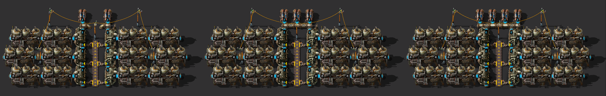
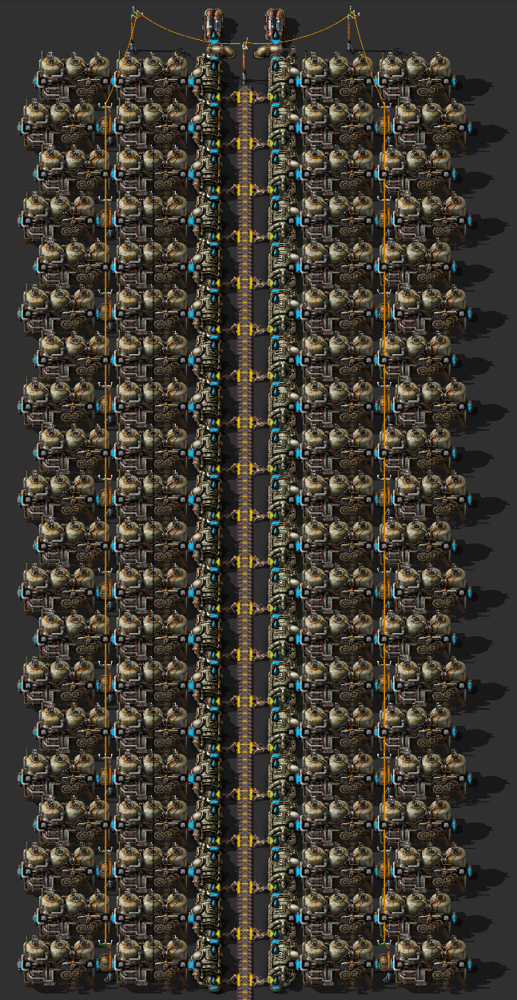
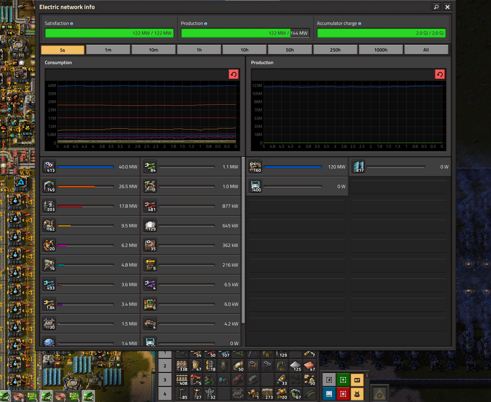
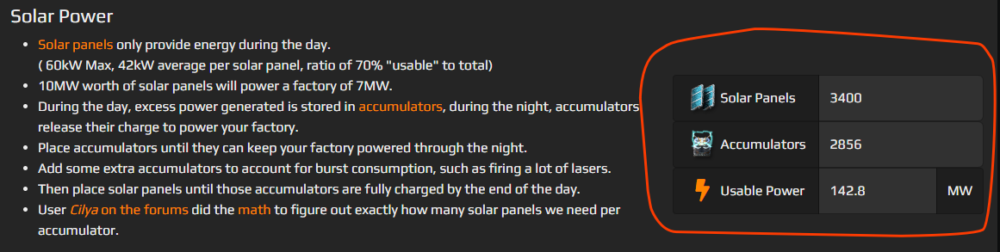

# Паровая энергия

:::danger Осторожно, не для всех
Производство электроэнергии из пара, путем сжигания угля, твёрдого топлива или [какого-то иного топлива](https://wiki.factorio.com/Fuel) в игре реализованно элементарно, поэтому [пишу инструкции для школьников](https://habr.com/ru/companies/itsumma/articles/551622/).
:::

:::tip Вся статья, кратко
Бойлеры `Boiler`, паровые двигатели `Steam engine`, насосы `Offshore pump`, твёрдотопливные манипуляторы `Burner inserter`, именно твёрдотопливные манипуляторы, обычные конвейеры `Transport belt`, которые жёлтые и конечно же уголь `Coal`, потом твёрдое топливо `Solid fuel` для второй электростанции, достаточно всего парочки электростанций. Жизнь паровых электростанций яркая, но не долгая. После запуска первого спутника, они уходят постепенно в историю, ну или в [резерв](BackupSteamPower.md), уступая место [солнечной энергии](SolarPower.md).
:::

:::info Нужно помнить наизусть
Адын насос `Offshore pump` способен залить водой двадцать бойлеров `Boiler`. Каждый бойлер производит пар `Steam` ровно на два паровых двигателя `Steam engine`. Каждый паровой двигатель производит 900 киловатт энергии. То есть, **на одном насосе можно разместить 40 паровых двигателей и всё это выдаёт 36 мегаватта**, под полной загрузкой топливом.
:::

:::warning На самом деле нужно помнить совсем другое
Одним конвейером `Transport belt` угля `Coal` можно питать **только 34 бойлера** `Boiler`, которые дают пар для **68 паровых двигателей** `Steam engine`, которые **вырабатывают 61.2 мегаватт энергии** (за вычетом энергии для питания манипуляторов загружающие топливо в бойлеры).
:::

Представим, что у нас есть простой конвейер подающий топливо, в начале игры это будет только жёлтый `Transport belt` и уголь `Coal`. Тогда бойлеры рационально размещать с обеих сторон конвейера подающего топливо. Также можно разместить два насоса с каждой стороны конвейера. Топливо подаём с одной стороны (красная стрелка), воду с другой (голубая стрелка). Обратите внимание, как располагать деревянные опоры ЛЭП `Small electric pole` - нужно раздвигать паровые двигатели, а не бойлеры (зелёные обводки).


И вот тут осторожней, полностью загруженный конвейер угля, жёлтый который, способен питать **только 34 бойлера, то есть 68 паровых двигателей, то есть 61.2 мегаватта максимум**, [пруф](https://factoriocheatsheet.com/#basic-power) (ещё какое-то количество энергии уйдёт на питание твёрдотопливных манипуляторов). Другие типы топлива, кроме древесины `Wood` разумеется, способны питать много большее число бойлеров с одного простого конвейера.

## Расходы топлива для различных конфигураций паровой электростанции

| Топливо | Конвейер | Насосы | Бойлеры | Двигатели | Мегаватты | Примечание |
| ---: | ---: | ---: | ---: | ---: | ---: | --- |
| | | 1 ** | 20 ** | 40 ** | 36 | Максимум на одном насосе |
| 900 ** | 100% ** | 2 ** |   34 ** | 72 ** | 61.2 | Максимум на одном конвейере угля |
| 360 ** | 40% ** | 2 ** |   40 ** | 80 ** | 72 | Максимум на двух насосах |
| 540 ** | 60% ** | 3 ** |   60 ** | 120 ** | 108 | Максимум на трёх насосах |
| 720 ** | 80% ** | 4 ** |   80 ** | 180 ** | 144 | Максимум на четырёх насосах |
| 900 ** | 100% ** | 5 ** |   100 ** | 200 ** | 180 | Максимум на твёрдом топливе |

Последняя строчка приводится для справки, строить электростанцию на 100 бойлеров является ошибкой. Такая электростанция занимает огромное место, да и питать её водой с одной стороны затруднительно, а значить дизайн будет так себе. Просто разбейте большую электростанцию на две-три поменьше. Да и предпоследнюю строчку тоже (четыре насоса) лучше разбить на две электростанции. Использование больше двух насосов запирает проход через электростанцию, без удаления/восстановления какой-то трубы рядом с насосами пройти будет невозможно.

Варианты организации подачи воды в паровые электростанции на разное количество насосов (осторожно, при клике откроется огромная картинка):

[**](../_images/PowerProduction/SteamPower.05.jpg)

Почему не рассматриваем другие виды топлива? - [потому](EfficientFuelForSteamPower.md).

Использовать красные конвейеры `Fast transport belt` или голубые `Express transport belt` любят разные там любители, *"но у нас таких нет, у нас все нормальные ребята"*. Если любители всё-таки читают, поясняю. Быстрые конвейеры угля, или два обычных конвейера, нужны, чтобы преодолеть ограничение на 34 бойлера. Но такой объем угля нужно ещё где-то добыть, а в начале игры это практически не реально, как и осилить производство быстрых конвейеров. Когда же, вы осилите добычу угля где-то на стороне, его транспортировку и так далее, эффективней будет уже сжижать уголь в твёрдое топливо `Coal liquefaction`, поскольку у твёрдого топлива намного большая энергоёмкость, [пруф](EfficientFuelForSteamPower.md#уголёк-супротив-твёрдого-топлива). При этом обычный конвейер твёрдого топлива способен питать аж 100 бойлеров, что требует 5 насосов. Как-то так.

:::tip Важно
Используйте только твёрдотопливные манипуляторы для загрузки топлива в бойлеры, другие манипуляторы дороже в производстве и содержании, [пруф](https://youtu.be/RQ80eZAnZ1Q?list=PLvB0qwWjZb4ILjgq3RQfSdaBsdfC877kL&t=529).

Не используйте быстрые конвейеры (красные) или экспресс-конвейеры (голубые) для подачи топлива в бойлеры. Такие конвейеры можно использовать для подачи топлива до электростанций, но потом распределять на обычные конвейеры (жёлтые).

Используйте 34 бойлера для паровых электростанций на угле и 40 бойлеров для электростанций на твёрдом топливе. Такие электростанции питаются от двух насосов и одного конвейера топлива, чертежи ниже.

Не используйте ракетное топливо для производства паровой энергии, оно не эффективно, [пруф](EfficientFuelForSteamPower.md#твёрдое-топливо-супротив-ракетного), [исчё пруф](https://www.youtube.com/watch?v=avZhWqnDwHI&t=224s).
:::

## Чертёж угольной паровой электростанции

Стандартный чертёж на 34 бойлера, что является максимумом для одного простого конвейера угля. Максимальное производство 61.2 мегаватт энергии. Подача топлива в бойлеры посредством твёрдотопливных манипуляторов. Обратите внимание, как проведена линия электропередачи между паровыми двигателями (раздвигать пристыкованные паровые двигатели, а не пристыкованные бойлеры).


```blueprint
0eNqlXMtu20gQ/BWBZylg9wzn4WMOe1vsAnvYwyJY+ME4BCRK0GMTw/C/LyUHTmxPRzUlIIdYEGua013N7p4SH5ub5aHfbIdx31w9Nnf97nY7bPbDemyumiAfdPb73/OZ87OP62HZb3fzWUizv/b99WrWj/fD2E+f6OyPz593X9bbfrY5rDbTJ6vrb8PqsJqtx+lfP3vol8v119lNv9w382a4XY+75uqfx2Y33I/Xy+O6+4dNPy047PvV9I3xenX86+a0ZPM0XTLe9d+aK3man71od7Rt8WzbT5cqcOnNYTv228Uw7vrt/tXCDrh6v70ed5v1dr843eePi/3Tp3nTj/thP/TP93364+Hf8bC6mZa5kheM9fd9XBz3cYLerHfDsy8emwlpIa790M2bh+m/XfjQPR3NegOmOJiGc2CuvK0lw/ILlpuw5s3dsO1vn7+iBWSPI/s65O4H8up6uVz0y+nb2+F2sVkvywt0Lwt0pwXGfrj/crM+bI/ekjB38qmwTnhZZzNs+jPO6sr7G9/GeglFrLsPBcT0yqrFfr24364P413R//nNjZ/BzoC1Gmp8Je3ZTfwpSI1NFKm552jfc9FChQNVtS5QxdVGqsqZSPVtKVIFJ5vEynvorPxXMj+9gKvhylC9JemNwa+2pJuLK+5INJP+r3mi0KakKvRoo5dYKBn2pv+RgFrEcG2ZrIxBy/l0GV9BlkC0Jl+2yG6q4wLYstBzcGLAdTUpF3NEYBIaBh3xPBMqodPZ8JF81jmZKGd8ROxzDHNAaKkuaF6I5HMpJ3axlBNdDbnem14il+PI5ZNRjXLkOm1CCa7jHgLfN/Wc20IFdcFIiNxz5b3BRWclIjGAhmeiAMGgfVvLDsm/YsdUlIVQoocXLviMzsorBxcNOEfGcoA22ZOBF5DA8x1R0HgPGR6YtIxBx4qC5gRZAkk1OddDu5m5wDIs7FoOzujVOqnJipAjOqZDA6EdUdCA0L6ioDGd0zEFjUD2UczBoOMFBU2hyZv4kYpdXlfFLkHY1ZHsMvrdQLLLGXBCPgWgXj9oDXehUAiOfLBAs7DgmcyAGd4xFQ0GHS6oaAr0mCqkrMUBZuSCz+iuQuLgjNY3ZDKWoX4ytmTgQUOFKERF4xJkuBJ5GYR2FRWNM3q06Cty7nu7irvJzRhNCwMHZ3SRMVZkRdARTCcGQmeiosGgU1tR0VjOSUJUNA6a5CeKORi04ysaFwsjmjiXNpdydqqiF3Sqk0h6GY1tIullNLaJnNQ7aHqQUg15sVjI3JPFQRO13DKpATI8C1HSgNDKlzQlfkwlkkgq8SNzE0dnNFiZmzg6o/vN5MTRQS1lDmTkQXOFHJmaBjovy4nJzBh0rqlprFPJtq3JutgpXsvNE20buYGicxaeq0mN2LloyzRkKHbHVDYgdqgpbUwPRaK20YxZyFAIxc4XVDfyPntP1ZK4rngsLzVEU+hYQ4QkWmupTUiiiYVHju4dNE0Q8RU8BiNCOvJJI5jHmCNq1PRIVDkodrqgzCkQZSqbxPsyUbg5pBptlyg3iNRs4ZGTSE2YKEu5AFRo4CDqiFpHA2Y6o3xEsbuKakeD5btQk4QDtqPcrNG2kRs2arTwarSNoDcc06uh2EJUOyi2VlQ7poccox1WUDhJcQjE7vhqR0uqzKl8klBUEIurYhp05iGOZJq3/EgyzRLrOnKur5hc17c1RMZCwgv5tIHmb+KZA2zUdMeUOyC258udIlOm+kmioWDmhpRq9WKem1Kq1S17ckypWAPqSUWxYrMIz0iKtcUE4owyEsWuERWr1dB1NcJHhQ4ApePmkLaN3CBSraazqxEWo96g2jYQm5EWo9g12mLbQ4y4WKBTCgkMh1DsC+TFUhRQdnNJRYWxhBqmCXQgIoFjmlidcOCYJlYnHMiZv2Azh1AjM0ZDgtQZCzaQC8zxNmo6ozQGseMFUuMiU6YCSnIo/z6JG1qK1Y1FbmgpVr8cyaGlYC1oJAXHgk0jIqM4Fo+ZzggnUewazbFYHV2skUWKx3aUm0eaNiZuHilW15lqdMegNxLTt6HYjPIYxa6RHtseYrTHgp1ZJIpDIPYF6mNxpV/dylyNX5mmKqZhhyOJZJrVCWeSaVYnnMnJv2BDh1wjQgZDIpMqZMEmcpk59UZNZ3TIKPYFQuQiU6YCSrUoRZbMTS3F6sYyN7UUq1/O5NRSwN9dk3JkwX7j3DJ65IRZzqgqQegaPbLRzmlbI5hM2G5ys0jTQm4UmS24Gj0y6AimYQOhGT0yBi01emTLOcLokTvMPoY5IPQFeuSC3PJYM6kWRzoqNfyCzkOUfKeI9T4k4fgVLThy0h8xz9UIksFgIAXJ0PhNlTnkxgxXRpAMQl8gSC4RZCqVVIuCfSVfMOKtN6CQLxix4Nh3IGDbTCqSPRZ69Z3cy/uTCuXpMWuaTuTKSWfterWiUrtfWT6F8yk/f5o/v5Pu6qeX+s2b5fVk6fTZ7LfDtM7d97f3/bn+enLDf/129+zBJD5mjclnF3J4evofYFtfrg==
```

## Чертёж паровой электростанции на твёрдом топливе

Тут всё то же самое, только 40 бойлеров, что является максимумом для 2 насосов. Максимальное производство 72 мегаватт, минус питание твёрдотопливных манипуляторов. Картинка по сути похожа на предыдущую, только длиннее:



```blueprint
0eNqlXE1PI0cQ/SvWnMerqf5ujjnkFiXSHnKIVhEfs+xIxrZskwQh/nvGsGJh6cKvHjdA+E1Vd1VN1evnvu8uVrfjdjetD93ZfXc17i930/YwbdbdWZfd4rc/+0UYFr9sptW42/eLMiw+H8bzm8W4vp7W4/wXt/j969f9t81uXGxvb7bzX77ejqvxanFxt/i8WU1Xi1/n37u+my4363139td9t5+u1+er4/MOd9txftB0GG/m/1if3xx/u3h8WPcwf2R9Nf7XnclDf/JD+6NVyyerXnzUAR+9uN2tx91yWu/H3eHVgz3w6cPufL3fbnaH5cW4Orz4cHj40nfj+jAdpvHJ78df7v5e395czI85k2eMzfcVXB5XcIbebvbT0x7cdzPSspZPse/u5p9i+hQfjlb9hOVwrHAKy7cX9S2UDPkZy89YfXc17cbLp39xDeSAIzsbcvyBfHO+Wi3nCLw87KbL5Xazaj/APz8gPj5gPU7X3y42t7vjXknsvXxpPCc9P2c7bcf3tyq2lzf/HOgNkKr5nhqA5ZVNy8Nmeb3b3K6vWsD5J69PQNeT7oZT7soA+Bssey1icDjqDjexHRqidbBFqHhjiJZ6KkJrK0IFTrISjR5Yk6ymnx7w2gPfx6YDSaut7z7BKeGX1Tr/bno4aEWKBTzq4K3ck4pXyx9FZ0DsdgNTiDFoOVUyZIivIFsgzlAjB2QxnaeCShT7AoWmeRsNFRLbhERUMQw5w9UlGJHLqcAp+eRKVqJ1CRkxzzMpA0KLuXl5zqBQ3xbW2MfcKqzekFVvLW9llaey6tHmFhqVVaEoaJEq/N8X9NSWJTxlwSDI1KvkrbnNfSr2egCaXa1dTX4vdOeeIDWbgjDYuxrMgyBU1OV21AVHoSmTWPBcDCfI8cBFXEIiLkSieQkBsjsxlRiDzobm5RGyBVIMZTZAi1mpoFIGsjhQaIq3UQyVENqESIxgILK3Ny8gcsCbF3UlI9O8CGQelTIYdP5A89KYCudmqPjWGyBa0kqQtIpcWvn29iUurZSxNQlX+aFBPjlDzkJRkDz3LoH4rRSIgoCZHfnupRW7ta9t1jAR3QvmQaaiTplrU6HQlGksVS6GoXExD1zEQWxBFqJ78QWy2xGlGIT2hu7FK2NTDniZfWtWczEjE1ReGRIzxQ6q3ma8EoKbQIxaIHK1dy8Ychnw7kVbySJE9+IhTr5QKYNBe7578blBveRehiYtXyx5BZ3NFC6vlMG1cHmlDK6FY909NLGXYkhaLAwq9TLxEElWB6IiQGZXoduXVvDO3ZBIkzmszt6/gC5QDKJXRttKMYheGcgqxyB6aGKsiQs5iDComelfoCOvWphijEFXS/+infcNg6HQYgdxA0UReq9ZSHGEusPeUA6xY82BmLhQ6Eh0MSB0MrQx6mpmoo9xFTOQyR0Uu36gk5G3L4O5MxLfPp8XQ4Y56HxChMswZYwV4TJs0OA4Gt4LpmYJeP6CwSCRe7kItlnE6TJqeOY7mkYQzw2SBN8O4mJvaVAnKF7RKQOvOIpYdEWD45hFVzD5lKMiz0FMgjhP9DUuYZYz4kQUOxo6G5e0nUuGupuwBaXoQ5c1Cyn+UHe4GiojthOeGMZQaLF3Nii0wzsbdTU9o+t1oLaRSh4QO/KdjWspJ+dWSVKTpxdvSTHo8EI8l2KamtZzKRY0OI6jd5iYNhi0v2A0BOFeMBClJoE4e0YN93Rr04ziuVWSpCiACQkw6gVFOjptFA4U6+i04S1wtKPD5svAqX0dRjIERu7rBky4zYgXUWyL4NdpI1Y0aBMddIYnkaIWnTZTRopb1B02iH7RnWDmMhCakP2i0Abdr76ajPBXoNMGSUzyoNgfkP5KUz8Zeym5/bUKQ4oJdLIhiUox0SbdRKWYaJNu4vh7wab8ZJAAo9HAaYAF49gScTKNGs6rgJtRPPdKUtvkYyaEwKAXmSIhRRuGM0VCija+ZY6EFGzCzJwYWDCaITNqYAmY5Yy2EcW26IFFm7GyQbkoAVtQimIUbagsFMWoOlwMmmBwJwoxmKHQhCoYhTbIgvXVZHTBgp09FCp5QOwPKIOl9X3RuVly0mbziyXFsFOOwqWYNulWLsW0SbdyLL5gU341CITBaKicQlgwkq0SB9ao4bxGuB3FtXeuzT5WQiaMekGxkKINw5ViIUUb3yrHQgr4ZWdOKizYF4sHRitcMMMZ4SMIbdEKKwOWGwyaxoItJkUvVs0+il1UvTVohcFNICYyEJnQCmPIYtAKayspjFY4YuYxKQNCf0Ar3FBbHvsj177Cw4khsaCDDSdUYmVtA6nE0q4uIq/oyNiuGcTCYBxwYmGIUXOOOJ/GzHa8WLgVvXNb5EKTaHSOUAuDPnC3eGiXjHD3DWho5H0DmOOcWjhgMceohR1mN6V4xKAtamFljHLeImXE7pnhlIyafRSHqHprUApjm+CJuQtEJnTCILJBJqyuJKESxoYVT2QMiPwBhXBDW3nsh1xq0jEu4GmFDVncJR3q7U1UVml3DpGXdEBzuwu4OBiLgsBJgwXbJvsJNGg1rwtuhe7cC7lU2qFr1wWDLjB8onpjGMMmaukQKS4Ri99I6YGxaIuEGthjVhNyRhDZoATWmoKIixQ9tpAMOai9GiNDDaqu4gpgbP2Tfb4Cge3qXxAY1/5qq5h45iI0qqdCWlDqDW2aSgxfoQ16KTEFDpvMOM0GNpi9VGzY3nqtbTtO61/6p9urz15c+913q/N5Zee/PV7XPV59v+H7j82/j078M+72T/4XCbm6XEL1qaaHh/8BV1FZiQ==
```

[Тут кой-чего интересного по теме](UpgradingSteamPower.md)

## Что в финале?

Двух электростанций будет достаточно, чтобы запустить первый спутник. 148 паровых двигателей от 74 бойлеров (34 на угле и 40 на твёрдом топливе) могут производить примерно 133 мегаватт энергии. Для удовлетворения потребностей [первоначальной базы на 45 научных пакетов в минуту](https://kirkmcdonald.github.io/calc.html#zip=bVDbagQxCP2bPCVld7vTpQP5GOs4ray5YMzD/n0TaAudFkU8F1HcwCCew4hXpzVeHc6SOMeL27tmQIrNiCR8IfdGYnGHZsEUcqtFLUzOsVFqEbqVBMYlh4ZMGSlUwPu6r4uX8s7NGI/Ki8cPSowgR+V88d1Y2B5H5ebT5EH/KIuvWraO/91w82109JvW9bp4BZZhOD0tHhB76gJWdJ7gWxHQYc0k35i38Y8B5+jJpbFOqEUteCcbTrW1Pv/kJw==) требуется 127 мегаватт, **не включая** расходы на манипуляторы, подсветку ночью, радары, дронстанции и прочее. Добавляйте солнечные панели по мере возможностей, чтобы уменьшить производимое загрязнение и снизить зависимость от добычи угля и производства твёрдого топлива.

Расчётные данные потребления электроэнергии сходятся с экспериментом:



После запуска первого спутника, можно полностью переходить на производство солнечной энергии, переводя паровые электростанции в резерв. Потребуется не менее 3,400 солнечных панелей и 2,856 аккумуляторных блоков для начала, что даст около 143 мегаватт энергии.



## Больше подробностей

:::tip Это интересно:
[Таблицы расчётов и прочие интересные данные](https://factoriocheatsheet.com/#basic-power)

[Кое-что ещё, но не очень много](https://wiki.factorio.com/Power_production)
:::

Детальный разбор производства паровой энергии на YouTube канале.

[**](http://www.youtube.com/watch?v=RQ80eZAnZ1Q)


Дополнительные материалы:
* [Проверка расходования пара произведённого разными способами](/blog/2024/03/09/steam-spending)
* [Улучшаем первую паровую электростанцию уменьшая потребление угля](/blog/2024/02/17/power-production)
* [Улучшаем первую паровую электростанцию в два раза](/blog/2024/02/24/power-production)
