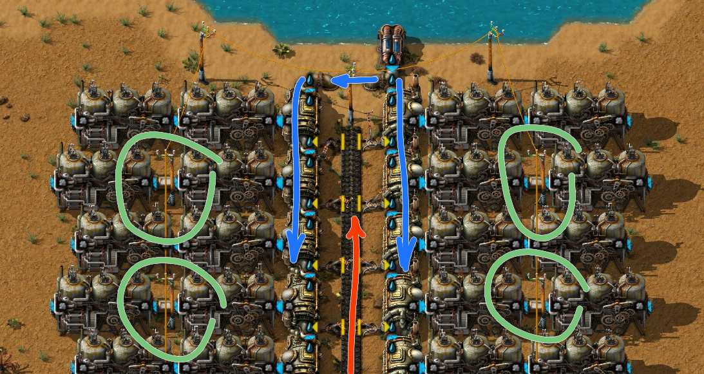
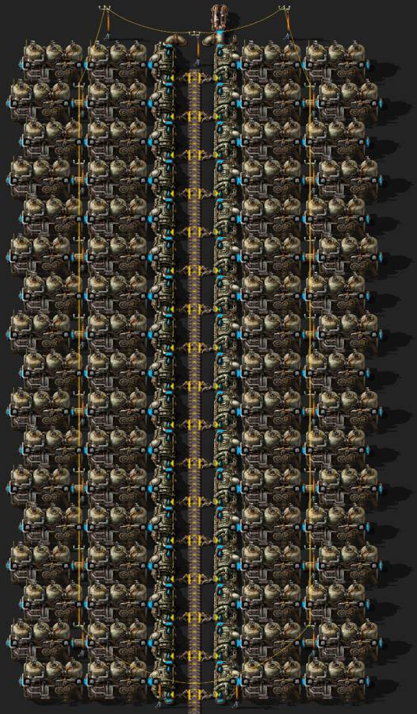
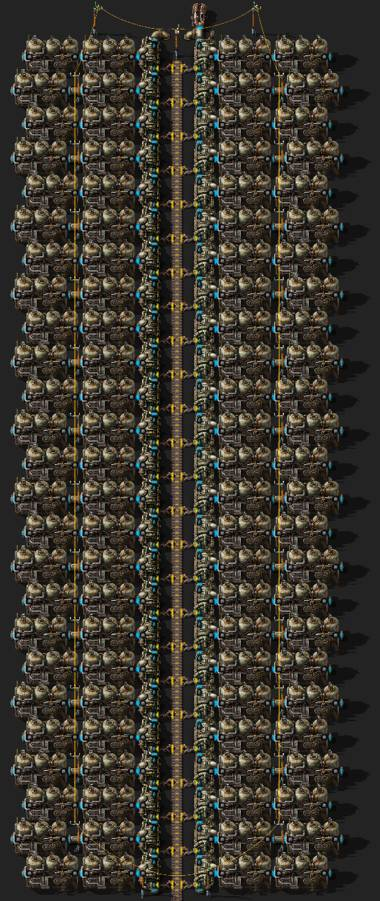
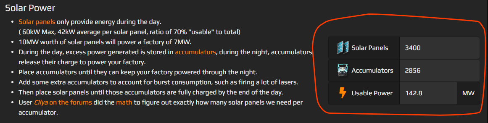

# Паровая энергия

:::danger Осторожно, не для всех **
Производство электроэнергии из пара, путем сжигания угля, твёрдого топлива или какого-то иного топлива в игре реализовано элементарно, поэтому пишу инструкции для школьников, начитавшихся [разной херни из интернетов, вроде этой](https://habr.com/ru/companies/itsumma/articles/551622/).
:::

:::tip Вся статья, кратко
Бойлеры `Boiler`, паровые двигатели `Steam engine`, один насос `Offshore pump`, твёрдотопливные манипуляторы `Burner inserter`, именно твёрдотопливные манипуляторы, обычные конвейеры `Transport belt`, которые жёлтые и конечно же уголь `Coal`, потом твёрдое топливо `Solid fuel` для второй электростанции, достаточно всего парочки электростанций. Жизнь паровых электростанций яркая, но не долгая. После запуска первого спутника, они уходят постепенно в историю, ну или в [резерв](BackupSteamPower.md), уступая место [солнечной энергии](SolarPower.md).
:::

:::info Нужно помнить наизусть
Адын насос `Offshore pump` способен залить водой двести бойлеров `Boiler`. Каждый бойлер производит пар `Steam` ровно на два паровых двигателя `Steam engine`. Каждый паровой двигатель производит 900 киловатт энергии. То есть, **на одном насосе можно разместить 400 паровых двигателей и всё это выдаёт 360 мегаватта**, под полной загрузкой топливом, что составляет 6 конвейеров угля. Короче, проблем с насосами у вас не будет. [Подробности тут](./EfficientFuelForSteamPower.md#основные-соотношения-для-производства-паровой-энергии).
:::

:::warning На самом деле нужно помнить совсем другое
Одним конвейером `Transport belt` угля `Coal` можно питать **только 34 бойлера** `Boiler`, которые дают пар для **68 паровых двигателей** `Steam engine`, которые **вырабатывают 61.2 мегаватт энергии** (за вычетом энергии для питания манипуляторов загружающие топливо в бойлеры).
:::

Представим, что у нас есть простой конвейер подающий топливо, в начале игры это будет только жёлтый `Transport belt` и уголь `Coal`. Тогда бойлеры рационально размещать с обеих сторон конвейера подающего топливо. Также можно разместить два насоса с каждой стороны конвейера. Топливо подаём с одной стороны (красная стрелка), воду с другой (голубая стрелка). Обратите внимание, как располагать деревянные опоры ЛЭП `Small electric pole` - нужно раздвигать паровые двигатели, а не бойлеры (зелёные обводки).



И вот тут осторожней, полностью загруженный конвейер угля, жёлтый который, способен питать **только 34 бойлера, то есть 68 паровых двигателей, то есть 61.2 мегаватта максимум** (какое-то количество энергии уходит на питание твёрдотопливных манипуляторов). Другие типы топлива, кроме древесины `Wood` разумеется, способны питать много большее число бойлеров с одного простого конвейера.

## Расходы топлива для различных конфигураций паровой электростанции

Основные соотношения для производства электричества из разных типов топлива:

| Топливо | Конвейер | Насосы | Бойлеры | Двигатели | Мегаватты | Примечание |
| ---: | ---: | ---: | ---: | ---: | ---: | --- |
| <nobr>900 `!Coal`</nobr> | <nobr>100% `!Transport belt`</nobr> | 1 `!Offshore pump` |   34 `!Boiler` | 72 `!Steam engine` | 61.2 | Максимум на одном конвейере угля |
| <nobr>450 `!Solid fuel`</nobr> | <nobr>50% `!Transport belt`</nobr> | 1 `!Offshore pump` |   50 `!Boiler` | 100 `!Steam engine` | 90 | Максимум на половине конвейера твёрдого топлива |

Предыдущие две электростанции вырабатывают примерно 150 мегаватт электричества, что вполне [хватает для победы в игре](./README.md#начальная-база-на-45-научных-пакетов-в-минуту). Добавив к этим двум ещё одну электростанцию на полном конвейере твердого топлива, можно [снабжать фабрику на 75 научных пакетов](./README.md#начальная-база-на-75-научных-пакетов-в-минуту):

| Топливо | Конвейер | Насосы | Бойлеры | Двигатели | Мегаватты | Примечание |
| ---: | ---: | ---: | ---: | ---: | ---: | --- |
| <nobr>900 `!Solid fuel`</nobr> | <nobr>100% `!Transport belt`</nobr> | 1 `!Offshore pump` |   100 `!Boiler` | 200 `!Steam engine` | 180 | Максимум на одном конвейере твёрдого топлива |

Почему не рассматриваем другие виды топлива? - [потому что гладиолус](EfficientFuelForSteamPower.md). Существует ещё одно соотношение, которое интересно знать, но использовать его в реальной игре не целесообразно, так как лучше перейти на солнечную энергию.

| Топливо | Конвейер | Насосы | Бойлеры | Двигатели | Мегаватты | Примечание |
| ---: | ---: | ---: | ---: | ---: | ---: | --- |
| <nobr>1800 `!Solid fuel`</nobr> | <nobr>200% `!Transport belt`</nobr> | 1 `!Offshore pump` |   200 `!Boiler` | 400 `!Steam engine` | 360 | Максимум на одном насосе и на двух конвейерах твёрдого топлива, что равно одному быстрому конвейеру `Fast transport belt` |

Использовать красные конвейеры `Fast transport belt` или голубые `Express transport belt` любят разные там любители, *"но у нас таких нет, у нас все нормальные ребята"*. Если любители всё-таки читают, поясняю. Быстрые конвейеры угля, или два обычных конвейера, нужны, чтобы преодолеть ограничение на 34 бойлера. Но такой объем угля нужно ещё где-то добыть, а в начале игры это практически не реально, как и осилить производство быстрых конвейеров. Когда же, вы осилите добычу угля где-то на стороне, его транспортировку и так далее, [эффективней будет уже сжижать уголь в твёрдое топливо](./UpgradingSteamPower.md) через `Coal liquefaction`, поскольку у твёрдого топлива намного большая энергоёмкость, [пруф](EfficientFuelForSteamPower.md#уголёк-супротив-твёрдого-топлива). При этом обычный конвейер твёрдого топлива способен питать аж 100 бойлеров.

:::tip Важно
Используйте только твёрдотопливные манипуляторы для загрузки топлива в бойлеры, другие манипуляторы дороже в производстве и содержании, [пруф](https://www.youtube.com/watch?v=RQ80eZAnZ1Q&list=PLvB0qwWjZb4ILjgq3RQfSdaBsdfC877kL&t=529s).

Не используйте быстрые конвейеры (красные) или экспресс-конвейеры (голубые) для подачи топлива в бойлеры. Такие конвейеры можно использовать для подачи топлива до электростанций, но потом распределять на обычные конвейеры (жёлтые).

Используйте 34 бойлера для паровой электростанции на угле и 50 бойлеров для электростанции на твёрдом топливе. Эта даёт более 150 мегаватт электричества. Этих двух электростанций хватит на всё, чтобы запустить ракету в космос.

Не используйте ракетное топливо для производства паровой энергии, оно не эффективно, [пруф](EfficientFuelForSteamPower.md#твёрдое-топливо-супротив-ракетного), [исчё пруф](https://www.youtube.com/watch?v=avZhWqnDwHI&t=224s).
:::

## Чертёж угольной паровой электростанции

Стандартный чертёж на 34 бойлера, что является максимумом для одного простого конвейера угля. Максимальное производство 61.2 мегаватт энергии. Подача топлива в бойлеры посредством твёрдотопливных манипуляторов. Обратите внимание, как проведена линия электропередачи между паровыми двигателями (раздвигать пристыкованные паровые двигатели, а не пристыкованные бойлеры).



```blueprint
0eNqlXE2P2zYQ/SuGznKgISmK3GMPvRUt0EMPQVDsh5IK8Bdsb5Ngsf+9opx6sxtN/OYZCLAiIzwNOR+aGT7rqbpbPfa7/bA5VjdP1UN/uN8Pu+Ow3VQ3VZR3bvHbX/XCh8Uv22HV7w/1IqbFn8f+dr3oN5+GTT/OuMXvHz8e/tnu+8Xucb0bZ9a3X4b143qx3Yz/+sXXfrXafl7c9atjVVfD/XZzqG7eP1WH4dPmdlWeu7ld9+MD76aHVM/jTZuH/kt1I8/1zG2H8vzl6fnf3exmb7573G/6/XLYHPr98RW4n73/uL/dHHbb/XE5yftye3j+UFf95jgch/4k/zT4+vfmcX03At9I/T/G9tt+LMt+jEvebQ/DaU+fqhFpKS6+a+vq63jZjlfPRZA3YK6eXe0Mls9nLD9i1dXDsO/vT7eEGWSPIwcbcnhBXt+uVst+Nd69H+6Xu+1q/gHt+QHt/Da0Z8jdsJvHaC5hxPqNfc2hiLZQcTOQ3Suxlsft8tN++7h5mNV1fiXgZfAEyOuiRTH54i5+Z5DKLkpjWXOnr3lOQBHYKJ2zGaU4q1U6ubgXuA9JZxT3xYneRKI5SdMZ3CmStubVp1cCz2F+51BvguvPzd9BG9CZ0Dsdfda5JMGqCy+RpYEkz0xkhaBdczkOdq8g50DEEggbaDud48xVE9FzcKLABUsoxTTRMpEKg454VIlG6O6i/Ui+qJxE5CShg+RjXAeD9o05Kzl7UsjzO+EtnvSjmLOe5DlPCkkRkfMkdcWBi/kT3mUdtQY/BdUeudfIjwLPa6sjwgAoeSKSCxA6W31B8iXLCA1naErdE4SD6xQ4R9pthAoeTxpZhIwsBCJXCQGSvGUCLgYdDbnKBDkH0lkibMC2M3GmpYmYOTit0m0sMRDSRMtUVSC0I3IVENobchVNOW1gchWB5KNcB4OOV+QqSrXWmjxJIE9qSU9SitSW9CRlxbEhYz5UoEex+Cmk9ujI1wjWrIqeCQOY5IHJVTDo9opcRbOMyBmaUhDFjoNTqtWYSLuFSsCYSSPDGgFdQ+QqPiGSd0IEXBDaGXIVr5RanTdE2B/lmt9Org2oithycErO30VDDAQ1wRRUIHQichUQOhtyFU05qSFyFQ/11RPlOhi043MVr1RryeRJ4GkK6UlKfZpIT9JWTPbSPVTvp87ip5jaE/ca8VgXLGUmDECS54bIVUBo4XMVzTIy1w/0SkGUuX6gV6rVTPYDPVQC5pY0MqwRkCOTq0CnV7ljAi4GnSy5ilJq5WyJsOCRWsO1ADUZpeF6gF47r2ycJQxip5QNU1Sh2IFJWEDs1pKxqBqKRMriMiYh40IodroiaRFtMyw+5bDzBRHSp5RSVYT0KW3RQjbWvWB8EG9wWVD5Esi3ioAqY46GUdkjkbyg2N0V2YtqH1yL0CUNj+sROqWCFUc2CV3CSEfC2ZrD2gPiHJHCuIjJzjAEUexgSGJc1JTXWiJuBLeUaw7qQnLdQddpeBZeIKoOptwCsX1DZDEothiyGFVDniHZOozG5yknArEDn8U4ldJo8ins5EE86VNBE5L0KXXRZMvdYaxWny0uC/JDG/LNgrXLJDCHxqjsjsliQGzPZzGqfQSueei0uilw3UOnVbaBbB86rFgMJBfXgY2DwJBxHUbGDQylEMRuLXRcp5VkrYVF6LBjOGm5tqEuJNc3dFpd0Foouag6qMILxGZIuSi2hZWra4ih5UqHScg4EYgdryDmilbWRYtPCXYmIZHzKdFq2cj5lL5oshkvWH8gWti5qPJJeq6A7bPIHCejsjMEXRT7Coauah8d10sUrW7quF6iaJVtR/YSBSsWO5KlK2DjoGNouhIw2RmyIYptIeqKVpJ1Fn6hBHBLue6hLiTXPRStLkgWsi6ojsQUXig2Q9dFsS18XVVDiSHsCnaYkCgnArGvoOyKVtYlk0+BxxOJ9Cmtlk2kT2mLzmRHXrD+QLbwdkHlZ5K4K2D7LDOHzKjsDHUXxb6Cu6vbB9dLFK1uylwvUbTKNpO9RAF/XEzydwX8IW/DEHgT9uNlhoUIQlsIvEo95hoL7TCB28l1DlURucZh1uAsBF5QE0zFBUIzBF4Q2kLg1ZQjDIEXOkFwwrgOCH0FgbfTdsLiSdiBhCO/iKF9V0c4T1JXTHbgsZ/Fi4XAC6qdJPB2oLaYE2VMcscQeEHoKwi8mmWQn8YIGhz5aQwNjv1BP7afJIE3gB8dsRdd52/6eG1DuHRQhTMzDV37CvNDXX0e96F8aex9qNt6jFvth3q69M10OQbw8/R07fN0Xf67buPpepyq4+meMlUnN12XqXosicp1mnDGl2wZlLm6UMIm1DJZF77BNCqzdTlonUZ+kip+k6XM1qV9OY3KbF1q49OoCFGKgmlUZuvy9plGZbYu/ldG02xd1DuNymxddvI0iufRuDfDsV8X6zp/va6uVrejusa5xa+P42Y/fPtM3R/bz5PV/dvvD9N2t9HlkPP4x2cf/fPzf04g7Kc=
```

## Чертёж паровой электростанции на твёрдом топливе

Тут всё то же самое, только 50 бойлеров, что является максимумом для половины конвейера твердого топлива. Максимальное производство 90 мегаватт, минус питание твёрдотопливных манипуляторов. Картинка по сути похожа на предыдущую, только длиннее:



```blueprint
0eNqlnU9vG0cSxb8KMedhMF39X8ccclvsAjnkEBgLyRo7BCiSIKlNDEPffaeHimTZU+Grp5PZY+Kpuqa6p6v6N82v3d32cTwcN7tzd/O1ux9PH4+bw3mz33U3XZbVv37rV2FY/bzfbMfjqV+VYfXrebx9WI27z5vdOF2R1b8/fTr9sT+Oq8Pjw2G68ulx3I73q7svq1/328396pep3fXd5uN+d+pufv/anTafd7fb9vd2tw/j9IfuZvnuafrS7n78q7txT/3C107tL68vf/mbL8vil+8ej7vxuN7sTuPx/EbcL37/fLzdnQ7743l9N27P33w9PH3ou3F33pw348X+ufHlv7vHh7tJ+Mb1f2vsnz2xbp6YunzYnzYXX37tJqV1DT/FvvsyfYrpp/jU7PhOS160Tg+32+168uTH83HzcX3Yb8cFRTf4F8m4LOlfJA+bw5JGLdckwhuJ9Xm//nzcP+7ul8TyG7G+u98cpy7M33CyoB2vmheumZcM5kXdvLAgnY33o9RrxpZ+MZyXbu2rKz1ia8WVxabshv67obrg2aopLt5254yeremNzUuSr4Pnu8H8j2qiqL2Om++nkn+MeoEcGiziURdf9m0EblcwBUBCY6sOxtDKqHKJRmXDSHudAQdIul6btNwQ30guTfUDM14h+8QZxusAxZRwg8spffeUmubJYIh3zIGRiHdMOV0LnZKv9hcfM8FoXTGvP17iPFTF2srca03ND5RaUdQcNcnPxl11phdqkv9RfHFAem9dmuSrvg3E2iRkyBeRmOxA6YRPdj8qLvs2U0GWFbcWSk3JEHzlQjYhvgwDF7IJcmtw+DyN3fsg9nkaVPb2dQmoHIh1SQiQdDSsS2bJJZHEDFXMvmwYqgGLKW5waYku96xSPBkHQ7xDDoyOiHdMWfB1idpfb1+XgNaFd6xLlHQxRupea2qJUlOSz5i5SR5KjGLhJnkssY+VX5covk0Dsy5xiC+SYyY7TFoMk52DfJuotCkoSVgKlJqSlKTIhSyUl6TEhSyW26ZsmKexe1+IeRpTrsS6BFLOA7Eu8QWSdoZ1iVdytSzEUAXt8/hQ/VFxMaYyNbi8kpll6lmlejLh8Q46MNvjHVQu+LpE7W+1r0sw68rAr0u8ki4WR91rTY2q23kl+SxcUdxDiVHhiuIey+lLpNclqm8TsS7x0L5Tycxkh0kXw2SH7eEVKm3yShJWqRKfV5KSypX4PJSXVK7E57HctnrDPA3d+xqIeRpTjvZ1CaicmHUJtA1Xs2VdouRqtTBDFbOvGoYquDc4cKNL23MduKeVtuk6iCHksa3WwRMxD0oHw+JE7XIkViegfekdyxOn2UsVx3U5qoDnB02OK497KEVyjquPewcyEY5fo2j+dUIsUqRi7vDE1IdqB3zukwr6l0qjpGqupWp+UjQ5rugnBfMnV/WTArq24hM3GAE4IPE6caPSzr5aQaWFWK5IwrS9Yb0iScOkAjNqQQujYdRiu4ZOuGGWte5Tzy/dm8UQ+KATKxH4mPQ3+MTVFYvaZe/sKxbUPuFXLBI1e6myuS5HlfYkaHJc4Vwi5lCuci5Y4u98plcsun8ZRFYwJtAzkCyoHQyUrICUbKDSK9GytUBVA0VLXQJXDhSQkeXqgQImwsFAyaIRQGCyqDTByaLSDCgrGCgbLKSsaEldZFBZ0MJoYGVlAPlrbphpKVzknl+qNw24LOpEgpdFpQ3ArN5lgphF7XsHMuu0zDJSBXVVLlE1P6clqokrqTssgUpcTd2BNYDEc7O6fxlw1mXMHQw5i2ob0FmXQf9S6ZXTsrVElQedlrokrjzosOwlc+VBBybC2cDPghGQCYAWlSYIWlSaQWhdwLQtDK3TkrrMQLSohQaK1gUwtLhhpqVwmXt+ad4sBpAWdGIhSFpU2oDS6l0mWFrUvnfAtE7LLAtVWtflqJqf0xLVwpXWHfiiIVdad2ANoPBErerfyiC1DtskqwxTi2oboFoH7rpVKr1yWrZWqfKg01KXypUHHfgiK1cedGAiXA1kLRoBBFqLShNsLSYtAwPXFkzaAtcW7V1kBq4F7TPAtdhmowzUENPeTx2oR5fqSQNcCzqQgGtBZQNcq/aXgGsx69w74FolnRRH1dNVNarOpx39Qp44kTFncsV0LOkXx8O1qm8ZuDZivmDgWlDaANdG0LdULqVkZiLc+/OaGvn+PORLId+fB8+zMMC12L0XAq4FlQm4FlRm4FrBpC1wrWgBxsC1oH0GuBbbUhTucAqvnZHC7f1qagayFnOgJ8BaUNnA1ar9JbBa0Lp3ULXqeThc1VxTo6p52mkz5IkTWGJEnjiBpfYSeKBW820geFrs7J1A0LSgMs7SgqdBBSZnUo9vYop96v2hSn1gsFKFPjRWcYIWPMPKzs+CwnZ6FhQm2FmPKRvIWe15HAluFrQOp2axmrFQx1Foj9LIPJxUL+K8LOg8Oy2LCSecldU6m+ykLGgbz8lquRx1uIQqxlTotJyVO1oCSzK5kyXAHDPRdKzqV4KNTZgjCDIWU844F4uBEJKpsgNWKMtMTU8rYmVmTGn1wUyV8MAKXsZpWPCu21lYUNhOwoLCBAdbMWUDBavtUhSCgcWsKzgBizF2Qh06oW0wFGYMqV7E2VfQeXbyFRTGuVe1s3bqFbSNZ161fW4pVJUB2+YW6kgJbYdfKlOYUzvOnSEB7sBLpXFX3WCCdnVYaa0SsCsqjbOuDiz3Vq7UgK3wK1PD03gfqcwmkoZT+YEq2oG8kx9wzBW7936wU66osh1yRZUJxtVFTNqAuGqIpx8IwhW1DwdcXQRjihpNat+p0RS0M8hxuhV0oLPDragyzraq3nN2tBW1jidbtTcGvKOKD9gLA546QUJ7V8I7pk6nd5wrdmMpvHc01KoaLATT6gp2kj+BtKLSONHqMDzOCwUSOfBHDZjKnvbmlBdmH0l7Mc0LVcwD3xzzgsOs6L23s6yosh1lBZW9lcqrf/8klvZ2pqdAB13NWhqv/o3kh777c/JB+6m336WP/fQwjR/6+eN0v9rH/Hq1ffT+8oXpP/sY5s/tUh/r/Lld6stw+Vzb5zh/bpf6dkTX3Iiz5kV0vti3szDmVrvat5MW5pafbYrluTXbki4WzFf79n7H3GpX+/b2wNxqV/vGVF5adW5dLJmv9o1ruLSaLW3rfG61q33bb5hb7Wrf6tpzK12cUp5bzZaWcF680WxpT+S51a72bdKfvdOu9i2SLq06t+TZc8NLa7oTm/P40Mbby48U9t32dgqN6dr844Lj/fPvEf5n/+c8IP83Hk/zvY1pSlRrnf7x1Sf/9PR/e3zNDg==
```

[Тут кой-чего интересного по теме](UpgradingSteamPower.md)

## Что в финале?

Двух электростанций будет достаточно, чтобы запустить первый спутник. 168 паровых двигателей от 74 бойлеров (34 на угле и 50 на твёрдом топливе) могут производить примерно 150 мегаватт энергии. Для удовлетворения потребностей первоначальной базы на 45 научных пакетов в минуту требуется примерно 130 мегаватт, не включая расходы на манипуляторы, подсветку ночью, радары, дронстанции и прочее. Добавляйте солнечные панели по мере возможностей, чтобы уменьшить производимое загрязнение и снизить зависимость от добычи угля и производства твёрдого топлива. Расчётные данные потребления электроэнергии сходятся с экспериментом:


После запуска первого спутника, можно полностью переходить на производство солнечной энергии, переводя паровые электростанции в резерв. Потребуется не менее 3,400 солнечных панелей и 2,856 аккумуляторных блоков для начала, что даст около 143 мегаватт энергии.



## Больше подробностей

Дополнительные материалы:

* [Проверка расходования пара произведённого разными способами](/blog/2024/03/09/steam-spending)
* [Улучшаем первую паровую электростанцию уменьшая потребление угля](/blog/2024/02/17/power-production)
* [Улучшаем первую паровую электростанцию в два раза](/blog/2024/02/24/power-production)

Как всегда, на ТвойТубэ смотрите детальный разбор производства паровой энергии:

[**](https://www.youtube.com/watch?v=RQ80eZAnZ1Q)
