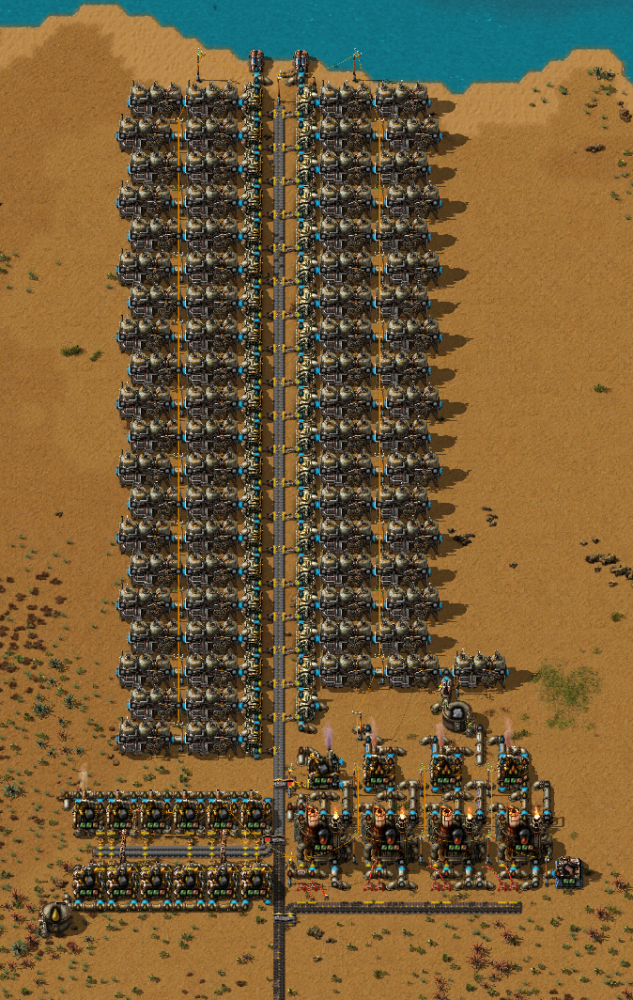

# Улучшаем угольную электростанцию

Наша первая электростанция всегда будет [паровой электростанцией на угле](SteamPower.md#чертёж-угольной-паровой-электростанции), так устроена игра. [Вторую паровую электростанцию можно на твёрдом топливе](SteamPower.md#чертёж-паровой-электростанции-на-твёрдом-топливе), производя его из дизельного топлива ** `Light oil` через продвинутую переработку нефти ** `Advanced oil processing`. Всё бы ничего, но первая электростанция у нас остаётся на угле, питаясь от начального месторождения угля, которое постепенно иссякает. Однако, после открытия производственного исследовательского пакета ** `Production science pack` (фиолетовая наука) станет доступна технология сжижение угля ** `Coal liquefaction`, что позволяет переводить уголь в твёрдое топливо перед сжиганием его в бойлерах. Перевод первой паровой электростанции с угля на твёрдое топливо путём его сжижения [может повысить эффективность](EfficientFuelForSteamPower#уголёк-coal-супротив-твёрдого-топлива-solid-fuel).

:::tip Вся статья, кратко
Возьмём обычную паровую электростанцию на угле и добавим заводиков по сжижению угля, а производимым твёрдым топливом будем питать исходную электростанцию
:::

## Предварительный расчёт

Наша первая электростанция питающаяся полным конвейером угля состоит из 34 бойлеров, её и будем улучшать до паровой электростанции состоящей из 40 бойлеров (максимум на двух насосах). Для этого потребуется примерно 360 единиц твёрдого топлива. С учетом потребностей в паре для сжижения угля и в воде для переработки мазута в дизельное топливо ** `Heavy oil cracking` можно рассчитывать примерно на 38 бойлеров, плюс один бойлер будет производить пар для сжижения угля. То есть, общее число бойлеров будет 39. [Примерный расчёт](https://kirkmcdonald.github.io/calc.html#data=1-1-19&rp=4&cp=4&min=2&p=coal&items=solid-fuel:r:360), плюс/минус колдовство и практическая пригонка говорят, что нам потребуется:

| Чего | Чего-чего? | Сколько | Зачем? | Примечание |
| :---: | :---: | ---: | :---: | --- |
| ** | Насос | 2 | ** | Водица для всего |
| ** | Бойлер | 38 | ** | Пар для паровых двигателей |
| ** | Паровой двигатель | 76 | ** | Выработка липестричества, где-то 68 с половиной мегаватт |
| ** | Бойлер | 1 | ** | Производим пар для сжижения угля |
| ** | Нефтезавод | 4 | ** | Сжижаем уголь |
| ** | Химзавод | 1 | ** | Производим твёрдое топливо и уничтожаем попутный газ полностью |
| ** | Химзавод | 3 | ** | Производим дизельное топливо из лишнего мазута |
| ** | Химзавод | 12 | ** | Производим твёрдое топливо из дизельного |

При такой конфигурации завода у нас не будет оставаться лишнего попутного газа и мазута, то есть превращаем всё в твёрдое топливо и производим электричество из пара.

## Само творение



и её чертёж:

``` blueprint
0eNrNXdtuGzkW/Bc9W4PmnczD/sgiCGS77TRWt21JwQYD//u25EHUtnnMquPBOC+DxPFUk6dPkedSZP+5uF2f+v04bI+LL38uhrvd9rD48u8/F4fhcbtan392/LnvF18Ww7HfLG4W29Xm/LfDsV9tlv32cdj2i6ebxbC97/+3+GKevt4s+u1xOA79M87lLz+/bU+b236cfuEXwu7h4fB9N/bL/Wmzn4D3u8P0f+2250dOSMsQwh/hZvFz+qPpzB/h6enmDZol0EwTzV1nt1mt18t+3d8dx+Fuud+t+xpm7K6Y0x8nM2z74fH77e40nidv7I2NXysP8r8etB/2fWvuXX204QXI8rhbPo670/a+CudfD/R+GKfJXX4nVsAjA27fAbcV8NSevmlOP7Mvy8fWy3K29rJK3edr7vDLyiUjdjAdDB0KCX3l2e1uWE8/qoFGCbLmEsayFg/u1aBfGNzd5Jq5jUNGbihjeNjOPpF2Dji0JaEj7ni/VosSIOikcTwMOjOOFyDHuzLw9jRu+3E5bA/9eBSwryRMyIBtR6FbGb02dnvl4XFcbQ/73Xhc3vbrY4MvSdjvrA4uCnAU16D3b1Vcw6AJrhkSOtJb/9URfG1tC9W9xLa3vhlwEN5aVvLBQ6YoSj54hA+u0zmwYAqnpJcX4Ogtzvv33CDfhOoe51zTDWbA0ty9JjCxiA+4oNkfMOjI7A8W8qmkcwIn2DXr4KwAV5g1FrKh7zRrLAZtNPEMBm0V8UwuELRT+CsI7Ql/fQtZ81cflOu3gQYcleu3gcau5JqQcXsl14Sc0DNcw95/0HANhDaKeAaEtvp4JldytSk+StWdLDgioLmMvQbidYTIUB4Vgo4QGcqKQ1R5sGgKHb8uY63BZX1AU/ODKUDKvuoHhYhopMnHThHR5Ig4QTSaHQKDtswOEaHqm9N5gZA1Rq+DE7LGGJhVFrNh1KyyGHRSRDQgdNZENA6CLhp/haBTx/irQ/w1GeUCDiXnySoXcKi6lJRcE7KypOSakJEmimvY+1dxDYNOmogGg84fiGjs251sipBMV93KUmFCGiGJzJ2SEVAqlY2SEVA+nXVFRtEUSoIJ+XT2Hwhpao6Qb4zpao6QAxPTSLOPmpgGaqNlTRUfhGaq+BnqKOaicwMhcyy6QmIWMsdimHUWsmGxmnUWg3aamAaD9oqYJkGdlqKpKoLQTFUxQZ2bknQreIIS9JJ1K3iCKkxFx7Uk5GWm05EtZQmPYRvmAabT0A3Fdoq4BsX2+sAmxbf72RQoGVfdz0wXiMgmJenlRSUxImaPpGQGlFmbTldxlK2hpJqQW5u5JoQNb2ruMIVLxlVFSGamEWnHN6IBjFUEOMljIhZNXR/FZgr7CWpumpkahHKGINlWV1xMXsJLzLoL2jFr1l0QuyjiHBDbdppAx2DYmmojis2UG5PBlF1OuaQ7bMheuaQ7bPRK1gkZm7FK1lkJj2Id6AUq1oHYRRPtYNiu+0C0U1NtTuGTCfX9zRkm3BHyTOOskhsdZhCn5AaUdBunK0fK1lByrZPw4gfCnZo/TPGTibbuD4mJd0QLZEW8EzHFp9NU/UFsz5T9I6YI9jr5VZTyTK+rPEYpz/SMvhG1o0bgiGJr1MQotkZOHDHNr9dUIlFsphQZMUGxVyqKI5bSB6WkOEKFKROUrJMyuKBknZTCBop1mBcEFetAbI2uGMX+gLA4VhSl5wDK5Pr+FhhxcZRyzqBUF0cs7QpKeXHEMvCoq1SK1ohKrkkZePyAwrjuD3Hyh/pBmsiojGULaGTG0WInXDQdARSbaQlEi3mXTp0VpUwz6oqRUco0I6N/BO2YNAJIFFujNkaxNXLjUDBsTV0SxWbqkgFqB5mkVBxHLKlPSslxxKpTSck6KYNLStZJOWxiWAd6QdawDsXW6I5R7A8Ij0NFcHoOoGxX398yoz0OUs6ZleLjgKVdWak+DlgGnnW1StkaOq4FKQPPHxAgV/1hCqCs8XV/YDTIogWKRoQcsN5m0fQFUGymLxCwZmnRSbeClGkWXTUySJlmYdSRqB018kgUW6NFRrE1YuSANXCKpi6JYduOqUsGqCNkO6UeOWCHhTulIDkEbPRK1knHhTsl67yER7EO9AIV60BsjSoZxf6ALDlU1KjnAMq6UD073jHC5CDknNYolckBSrusUUqTg8WuU9DVKmVrKLlmJbwPqJPr/pBvrDdVfzCMPlm2gEagHDrMGTR9ARSb6QuEDvMunZgrSLdTWV01MnQSHqObBO1oNbpJFFujU0axNUJlj10JYzV1SRSbqUt67JIZq9Qq+4INWSlW9gUbvY51vkiX2uhY57OEx7AO9AKnYR2KrVEro9g462x+gV1FC/royVfErudwzKaq+Nm6SERP8oi1TIuYebVMg/J565RMk6zhlUyTrqOa3z7CRk9Vf5jCMZtS1R9mWpN29CRbwCmiJ49dxEQoTWa7EIgdmF0I6r1ar6tFeilvVd414qW8FVOSGM6Ohbgo07/zlqoWnQlJ2uiO9YEX94/sxtXj9IDV9j9V7Ose9JwX3+2222fww/mXzPk/j2Pfb+d3vg7356fYp69P1fcx051Il7bO9hD//NTjuFt/u+2/r34Mu/H8e3fDeHcajt+mf7v/9T8/DOPh+O3NFbYP69Nw/+oO28Uz7mGa+vFy1Kk7/32zX42r4/kJi38tnrgJG3HCThOyGuxlqhYLEJtaLAzm2spTRB6rywTlKSKPFRiDroXopSQ8KDdmqQwRmYUjdC/w2rOPhrjAVx6jZZbOKI+xfqEjIH4J7TF6ZgEOrB2vvFodDv3mdj1sH5eb1d33iblLW32GefWM6QnDZW3rN/vjz+X3fvXj53Ii6fJ2NY79esI439t9WbP6h4fzcH5MY1hudvenKaKabFcdGK1ac+4Vg15dH1VunK/HYbGtWpvtAuKLysSLsoV1psLaw6b37RHrt4N+4HSEr6jhpUpyYk5GeKm6lZQnIzxW4FFezCIPV9cG8VIxLgVmFRRRom6lxgqa8wtZ2FvS/9rIXzrUlKE5Vy9HJ4aCnvaGokPHopHcMbuF9C6zYVAkP81AYtr2zlfimIa9LOlXmdkXfUfGm5n5tIHLpCfldiFolkqJ9k0Mivius26moFe3G4azxE6aaaGS0Eh6UjEMuic9qTAxprOkJ5V2jOnaTC2eQZE8qbR3I9fejQqzG9ncxqOCO3FuumzLSQ0C5fUoTmgQuJmE5e57vxnuVuvlfn2uJ7xbBHJvFYSzeP6wWw/3y4dTv14+jLvNct+fSx/9abN8XB2aYf304HH68+ufm/r4GQ5eYxrJvm6mjwHs4V/Z45cFrrnM3bi6+8+UG/3N03bEMK+L7z8+TM8M037aMNsLULoOLkqu096cU9dGaS87ybRRcjtLKm0UQLWTmyimHaDG1EYB8r7YRmkHqNfypYwCqLd9G6W9eUbXRmEuRpJRgA5j2+sMcIqvzQDT9t3Q9l3T9t3Q9l3b9t3Q9l0LFB3bvmuZgDC89OL2hygs/QW5YF894uV12/VU21ldKUO2yqwPv18PR6mE4/7CedYKPAzr8y9+Wdz3lwbKeLrY5rI5bS8Iu9Nxfzp+24/DbpweOP3qOM3uPMphW/2H6uCutHq3vnSlFiRlcK++xQNHPW9cwVfRs6qu4yI2duCoQ5vejsnsfCbJ4Iy+9lQjw7mYdWaYc+XGW1//rg5QO0kv/KSK4hgU0bpe1d9wCbNuUNXDQP8CxDK+vay4pKpBgfx1WYcOei9d8vddYyk/t0Amz62W5J0HKpCm6bneMCjSe/NWVd0DPdc7Vc0L9FzviZqXbIGgqnmBnuujDh3zXE/X/J1/d92N8a81N9Y9tx1qXjujsucWBkV6b5xgxpOeG4yqmgh6brBEBU+2AMWujvTc0GbXtbkqvusQGBRxpgyLZqUH6XN6M8lIu84yK0L4l3WW13W79TmwPddd/t5yy0yB0h7trDTwSaMtzGj9J482MvXcWUr/SaM1xGhn6fonjZapDc8S8E8abTsTCO2VhVIRzfCkr5RG3SWM8vh0wl15fNeV9FxvHvuHYduPPxtZ6is9091u8oz18N9T/7B63pL+3jebCfWGbLmiy/ID9l3TjsnypTECYp9ZNiui6NR6DjpR7WZan6bHuE/ymOQJdYdsR2XeDnoMlbeLY0xMFimiZF0WCXpMgT1mlu/9sx4DqIpcm7/Z6PJlzGMAtZFrrw7AVTyuzQ1KVeQ86TEzVVHTY8xneUwktCCyHROTSYoomcnSRJQCVe/jyzig+h3tDkPKbSSDIYU2ksWQTBvJYV0OwE4eQwJmB7aF/AuuaNpC6/6h2hW6/Lw6NGXIKn3zvTBnzWbOCsnQHCVgmjkwiE5TrENaWL6jCQfiMneqzkoX2OfPO+aGkJnaAUS/0nTT3w+nDSDRT6/s86K66k21H+CpS3tmKxU4DSaDnNVjQPTIrq+g41AkdeyoKZJaFp3RHM72CwzdMAexZ/IREN2wuxz2PrnLfAo7aur8SGbRPbtfgzYJ9AIT8rsLzLRkeVdtl3vu+1LsSmyo89vsSmwoUTC7QHI3Ab1cIGt4tmODMsxdrNGVFkF03W1bshV0R7pcJ+H5D0hMunqT3tsg8sWGD4gCqs+7SFmk1qq38QOt3NrzZAGCp+RQlo35bFY11+wbibz/x5sA3hZVq+23GLvrVI2332PsRtWG+z3GblVNud9j7E7Vovs9xu71Clybq+mZJDb0LhDNQSsclvFOV8mQ8XS35tgs4V1X7vVu+7j8vtre9/dLTIpb8YnqMwr/jI58BiCwm41bsi4gsJuNTEQBZKq5jeIYFOn9eq+6wchCd/t5Skjn39k76+iR9hsfWL9J/DM8+4xM3EUm+wN1RD7Ib7KaEQWgGd1e7YJhUCSfDVQz2slvoz5Tp0PHGBEovhmSETNpHeqt1xYk6K2BZ53L7DOAFlZ7hQxZdX8ayghAshqbY4wdgyIxIlJN4kT6LHVVk0sk36JTXbIEMmImvoK91ZHeGhWss+wzgNZwe/2NTJbvHMkIQFTl2tFRLAyKxIhEScEN6bOAqMqW5kyTJa5HkFEcfI9jur7RgM3Tq0TWNkE+DVyhdD2nbaM0f+bMuIySiNPeMkomTnvLKIU47S2iAPKja/9TRjHEaW8ZxRKnvWUUR5z2llE8cdpbRgnEaW8ZJRKnvWWURJz2llEycdpbRinEaW8RpXTEaW8ZRff1VpskPF0/RB4f1Q956ZPttZv72pZh0SkReseiM1Uxn1l0pkbmC4vOdCZ9ZNGZzqRPHHroGCGB9yw6w0cfWHSGnd6y6AxXvWPRGa76jkVnuOoNi85w1WUWneGqKyw6w1UXWXSGq47lKiX6cSxXDcNVx3KVkv44lquU9MexXDW621escFwqGO72lb8yN+luleoTlD0mJ41Y2WOyEp7ugj970Zl8fW4gnm8hXp/6yR6XRuWPfjw8v8JspnzKpjxFW7HEp6f/Ax+yBJs=
```

:::warning Категорически важная информация
Сия конструкция должна быть запущена руками (или роботами). Для старта сжижения угля нужно небольшое количество мазута. Его можно принести в рюкзаке, 10 бочек будет достаточно, заводик по расфасовке прилагается рядом с паровым двигателем на обочине. Или протянуть трубы от места где у вас много мазута.
:::

:::info Сколько мегаватт?
При полной нагрузке, электростанция выдаёт чистыми примерно 65 мегаватт, если модули эффективности проставлены.
:::

:::tip Какая выгода?
По сравнению с обычной угольной паровой электростанцией здесь мы получаем чуть больше мегаватт, всего пять или шесть больше. Стоит ли связываться с таким геморроем? На самом деле, выгода кроется в расходе угля. Новая электростанция под полной нагрузкой потребляет всего пол конвейера угля, тогда как паровая на угле потребляет полный конвейер. Профит 100%, можно построить ещё одну такую же электростанцию рядом, обе будут потреблять целый конвейер угля, а выдавать в два раза больше мегаватт, даже исчё больше.
:::

## Пояснения

К моменту нашей затеи уже будут открыты `Module` ([разные модули](https://wiki.factorio.com/Module)), поэтому в расчёт заложим по одному модулю производительности ** `Productivity module` в нефтеперерабатывающий завод ** `Oil refinery` и в химический завод ** `Chemical plant`. Также запихнём модулей эффективности ** `Efficiency module`, для сдерживания загрязнения. Все модули первого уровня, другие соответственно не стоит производить до запуска первого спутника. Хотя можно и без моделей, количество заводов будет таким же, только расход угля возрастёт, где-то на 50 в минуту под полной нагрузкой. *А ведь из угля мы могли бы сделать красных микросхем, которые ** `Advanced circuit`, и из которых сделать ещё больше модулей.*

---

Бойлер, производящий пар для сжижения угля, производит пара чуть больше чем надо, Требуемая мощность ~60%, оставшийся пар можно складировать в `Storage tank` (Резервуар) и отдавать излишки на один паровой двигатель через `Pump` (помпу). Смотри на рисунке в нижнем правом и теперь в верхнем углу. А можно и забить, лишнего пара будет не так уж и много. *Как вы думаете, производство электричества этим паровым двигателем превысит расход электричества на содержание обслуживающей его помпы? Ваше мнение обязательно напишите в комментариях к видео... подпишитесь и залайкайте всё на канале, иначе говоря подымите мне рейтинг на немонетизируемом ютубе, се ля ви.*

---

Данный чертёж производит чуток больше дизельного топлива чем надо. В случае его переизбытка остановится процесс сжижения угля на нефтеперерабатывающих заводах, но не остановиться производство твёрдого топлива. Как только дизельного топлива станет малость меньше и освободиться место в трубах, процесс сжижения угля возобновиться. Избыток дизельного топлива можно хранить в резервуаре на случай перебоя с поставкой угля, а можно пускать на какое-то другое полезное дело, а можно и вовсе забить на всё это, как было с паром. *Далее следует квэст: "найди на чертеже резервуар с дизельным топливом", удачи.*

---

Чертёж выполнен для игры без бонусов вместимости манипулятора ** `Inserter capacity bonus`. Соответственно на чертеже пресутсвуют по два длинных манипулятора ** `Long-handed inserter` загружающие уголь в нефтеперерабатывающий завод. При наличии [второго бонуса вместимости манипулятора](https://wiki.factorio.com/Inserter_capacity_bonus_(research)), достаточно и одного длинного манипулятора. Но эти исследования обычно пропускают, так как для запуска спутника они не нужны, ровно, как и исследование открывающее пакетный манипулятор ** `Stack inserter`.

:::note На самом деле
Хотя пакетный манипулятор и можно пропустить, он полезен для разгрузки поездов. Исследование `Inserter capacity bonus` также полезно выполнить до второго уровня, что позволяет увеличить вместимость простых манипуляторов до двух предметов, а пакетных до четырёх. При этом тратятся только красные ** `Automation science pack` и зелёные ** `Logistic science pack` стеклянки, которые можно накопить заранее. Правда нужно много банок, аж(!!!) 600, и конечно же время на проведение исследований, которое оттянет запуск первого спутника.

Чтобы запустить спутник как можно быстрее, действительно есть смысл пропустить пакетный манипулятор и бонусы вместимости второго уровня. Пакетный манипулятор очень дорогой в производстве, требует много времени на сборку, а работает всего лишь в два раза быстрее чем быстрый манипулятор ** `Fast inserter`. Дешевле поставить два манипулятора вместе, как на чертеже, чем рассчитывать на бонусы.
:::

*А исчё можно придумать другой чертёж, где вместо длинных манипуляторов будет один быстрый, сумеете?*

---

Конвейер сделан так, чтобы уголь подавался на бойлеры вместе с твёрдым топливом. Соответственно, когда производство твёрдого топлива станет достаточным, оно не пустит уголь по конвейеру к бойлерам. Приоритеты на разделителе конвейера ** `Splitter` расставлены так, чтобы твёрдое топливо от попутного газа забиралось всегда первым, затем твёрдое топливо от переработки дизельного топлива, затем уголёк. Это позволяет паровой электростанции работать постоянно, а сжижению угля не блокироваться от переизбытка попутного газа. Твёрдое топливо, производимое из попутного газа, выгружается на сторону конвейера, где больше бойлеров. Твёрдое топливо, производимое из дизельного, выгружается равномерно по всему конвейеру. Таким образом движение твёрдого топлива по конвейеру уравновешивается.

## Критика и антикритика

Идея перевести первую паровую электростанцию с угля на твёрдое топливо мягко говоря ни лыком сшита. Отовсюду торчат белые нитки костылей. Начнём с того, что исследование сжижение угля ** `Coal liquefaction` ([очень информативная статья в WiKi](https://wiki.factorio.com/Coal_liquefaction_(research))) стоит аж(!) 200 различных научных склянок, включая голубые ** и фиолетовые **. При этом данное исследование никак не приближает нас к запуску первого спутника, так как является полностью не обязательным и ничего другого полезного не открывает. А ведь мы хотим запустить спутник как можно раньше, за пять часов. Играя в базу на [45 научных пакетов в минуту](README.md#начальная-база-на-45-научных-пакетов-в-минуту) липестричества хватает от двух электростанций, а проблем с углём не возникает, если подобрать хорошую карту или вовремя позаботиться о вокзале.

С другой стороны, играя в базу на [75 научных пакетов в минуту](README.md#начальная-база-на-75-научных-пакетов-в-минуту) ситуация меняется. Липестричества нужно больше, может стать полезным не только улучшение первой угольной электростанции, но и её задвоение. В этом варианте игры запускать спутник за пять часов трудновато и можно позаботиться об ранеей оптимизации. Другой полезной шнягой может стать сам заводик после запуска первого спутника. Когда мы переведём все паровые электростанции в резерв, заводик производящий твёрдое топливо превращается в заводик по производству попутного газа. Тут нужно напомнить, что на стандартных настройках игры, нефти откровенно говоря не хватает. А наш завод, ранее производящий твёрдое топливо, теперь успешно может производить всё необходимое в помощь к основному нефтеперерабатывающему комплексу.

## Больше подробностей

И вот вам [сохранёнка со всеми няшками](../saves/AwesomeFactorio%20-%20Power%20Production.zip), чертежи в книге игры. Выпуск на ютуб подготавливается.
<!--
Детальный разбор смотрите на YouTube канале.

[](http://www.youtube.com/watch?v=[number])
-->