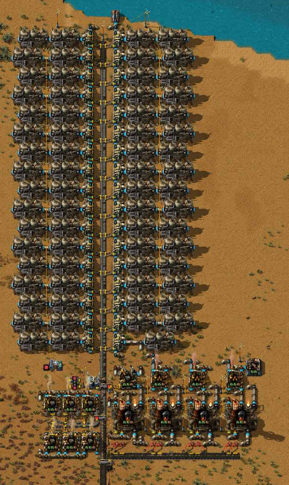
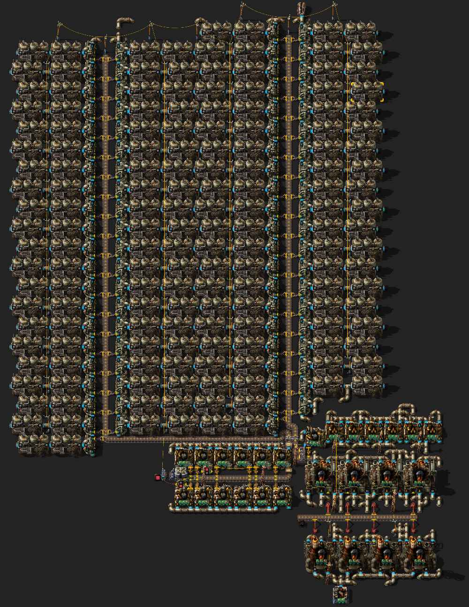
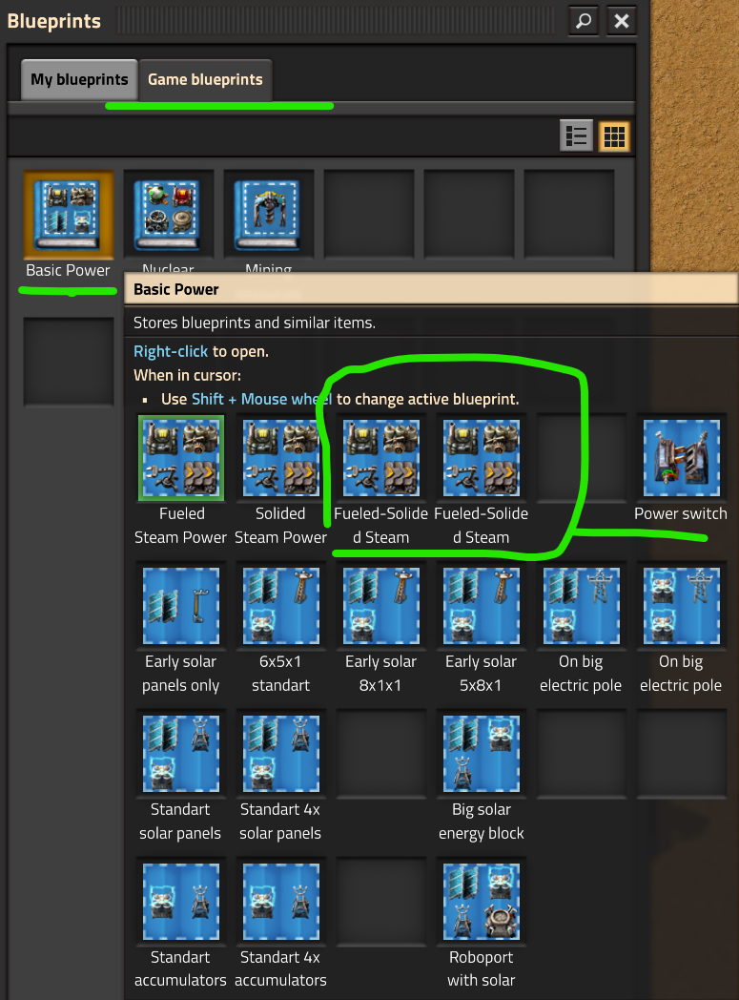

# Улучшаем угольную электростанцию

Наша первая электростанция [всегда будет паровой электростанцией](SteamPower.md#чертёж-угольной-паровой-электростанции) на угле `Coal`, так устроена игра. [Вторую паровую электростанцию](SteamPower.md#чертёж-паровой-электростанции-на-твёрдом-топливе) можно снабжать уже и твёрдым топливом `Solid fuel`, производя его из дизельного топлива `Light oil` через продвинутую переработку нефти `Advanced oil processing`. Всё бы ничего, но первая электростанция у нас остаётся на угле, питаясь от начального месторождения, которое постепенно иссякает. Однако, после открытия производственного исследовательского пакета `Production science pack`, который фиолетовая наука, становится доступна технология сжижение угля `Coal liquefaction`, что позволяет переводить уголь в твёрдое топливо перед сжиганием его в бойлерах. Перевод первой паровой электростанции с потребления угля на потребление твёрдого топлива [может повысить эффективность](EfficientFuelForSteamPower.md#уголёк-супротив-твёрдого-топлива).

:::tip Вся статья, кратко
Возьмём обычную паровую электростанцию на угле и добавим нефтеперерабатывающих заводиков по сжижению угля для производства твёрдого топлива и которым будем питать исходную электростанцию.
:::

## Предварительный расчёт

Наша первая электростанция питающаяся полным конвейером `Transport belt` угля состоит из 34 бойлеров `Boiler`, это максимум на полном конвейере угля. Её и будем улучшать до паровой электростанции состоящей из 40 бойлеров, что является максимумом на двух насосах `Offshore pump`. Для этого потребуется примерно 360 единиц твёрдого топлива `Solid fuel`. С учетом потребностей в паре `Steam` для сжижения угля и в воде `Water` для переработки мазута в дизельное топливо через перегонку `Heavy oil cracking` можно рассчитывать примерно на 39 бойлеров, плюс один бойлер будет производить пар для сжижения угля. То есть, чертёж не превысит 40 бойлеров для двух насосов. А вот паровых двигателей `Steam engine` нужно уменьшить на единицу, чтобы воды на всех хватило, точнее уменьшить нужно на половину от парового двигателя. Как же разрезать паровой двигатель на две части?

Примерный расчёт, плюс/минус колдовство и практическая пригонка говорят, что нам потребуется:

| Чего? | Чего-чего? | Сколько? | Зачем? | Примечание |
| :---: | :--- | ---: | :---: | --- |
| `!Offshore pump` | Насос | 1 | `!Water` | Водица для всего |
| `!Boiler` | Бойлер | **34** | `!Steam` | Производство пара как в изначальной электростанции на угле |
| `!Steam engine` | Паровой двигатель | **67** | `!Big electric pole` | Выработка липестричества, один паровой двигатель убран, так как нужно производить пар для нефтеперерабатывающих заводов|
| `!Oil refinery` | Нефтезавод | 4 | `!Coal liquefaction` | Сжижаем уголь |
| `!Chemical plant` | Химзавод | 1 | `!Solid fuel from petroleum gas` | Производим твёрдое топливо и уничтожаем попутный газ полностью |
| `!Chemical plant` | Химзавод | 3 | `!Heavy oil cracking` | Производим дизельное топливо из лишнего мазута |
| `!Chemical plant` | Химзавод | 6 | `!Solid fuel from light oil` | Производим твёрдое топливо из дизельного |

При такой конфигурации паровой электростанции у нас не будет оставаться лишнего попутного газа и мазута, то есть превращаем всё в твёрдое топливо и производим электричество из пара. При этом начальная электростанция не меняется.

## Само творение



и её чертёж:

``` blueprint
0eNrtXVtv47oR/i9+LOQD8U4GaIH+jsUicBwlEerbkeXdBov891JyYjkbTfjNnKLoQ7APayn2p5nhDDk3Ur8Wd5tTc+jaXb+4+bVo1/vdcXHz7dfi2D7uVpvh3m61bRY3i2PfrLbLZvfY7prFS7Vod/fNvxc36uV7tWh2fdu3zfmX48Xz7e60vWu6/IXqDWH/8HB82nfN8nDaHhbV4rA/5l/td8NDMlKs/3DV4nlxs3T+D/fyUn2A0heo43a12SybTbPuu3a9POw3zUfAoC6Abh7QXAAP7WEOwZcQ7DuEZb9fPnb70+5+Biu8w6oW922XyR+/oPQMtMOhEw1tZ5B9ge2rkSDYDryRiK4EGKtZPfuA5CcpGoTVBOIGzcNV9QX4bt9u8q0Z5aEAZ4dbTYZyd+p2Tbdsd8em62ehJyloiFqu5cR30phDnEyn71a742Hf9cu7ZtN/CqYJMMtgPdGsz8vVFUcqKtbQe1CnomXqVECBExMYtq5pvqsh4FSYSXx6Bzg3p9d8C4Vo0wq30BrSJK0lOq8IvkUGRAnR4jqOCc/xdRwDLq49ocgsaiapZtIWebPkpNw2EaQmyZw+ohWpNbVAgShCjZKARQJMS6bzj1zPGqExTNcjFHm3bN/DBmiEHHtqA4E9PLV9BJyXahApqoeojRLdCsRgJQkYEU/YWqSoHhKpVfCcjI261ew5GQQ2bL8DBLZsv8NaCNjBfscIOAfh+caJ0RZw47SYJokMiApYRQZECNHVuI5DwnOKr+MYsIb9DpJZw/Y7QNqs2O8gojPnRNM5FEw4L1EgitAgASPCSBdF0zkWnrsk9jsI3n3N9zsUlN5R/KkNA9b41KYgqXojUlTInfdWoltEuOadBIyIYLwXKSoWpfqAz8nYqEf+nIwBJ77fAQGHmu13mAgBK9jvMERwFDTbOEHaDGycHwFnNSlIDMgQUVaQGBApRA/rOCi8wNZxEDjCfgfJbGL7HRhtsZb6HYaIzqIoh22gYCJKsm8koZLsmyHCyChKXxssMo9O6neQvHu232GgslIM/KkNA4741IbV1qIoMWcgdz5JEnOGCNeSJDFniAgmiRJzBotSk8HnZGjUk+XPyRiwY/sdILDn+x1Q/S4F3O8ggqMU+caJ0ZZw4wQrdrXIgqhKZS0yIapUWWtczbHabG34eg4iW9z5IPl1fO8DpM6L3Q9FEStKYxuF0StJw9GkSvJwhggolRJlso0COxOU2Aeh2Fea7YRoqCymlGFPdCiyhWc6nUDJihJ1OmL0SjJ1OlIjFiQqpiMoCIlx6UTRmuBJGhx7uE1hmqRRZMX2RlBkzXZHtMeQDeyPaCJoUtry7RSkzuF2itXylBaZUqBYl2S9aUFGXNlBASa+smPIV00LJY+E5NcotkeCUqelHol2FLGiBLd2GL2SBB1NqiRDpy2FJspxayx8VyZIPRKafX4Lqsa67wy/CRVEtngXqga7UK0ohacxl99KcniaCuysJImnyR5UURZPgyGtxbtQ0bHnt6GiyPw+VBSZ34iqsUZUi3eiaiqIcvxWVJA6h/ei6hrsahaZEhWOOZEpkYLE21FRAfL7UVFkvCGV5pffkYpSJ25JVVRs5ESpb4WFHF6SuSNJ9ZLMnaICWC/KfiswkvfivlSafX5jqgrYMPE7U1FkvDVVBVCyoqSewlx+L8k7KCqw85KknqICnSBK6ikwpA14fyo49oHfoIoi8ztUUWR+i6qyGDLeo6qoICrwm1RR6vAuVWVBhRKZEhWOBZEpUYKMeKMqKMDI71RFkfFWVZpffq8qSp24WVVRcVwUJcEVuPVNkrmjSZVk7hQVckZRw6oCI/ko7lgl2U/8llWFFdcSv2cVRcabVhVYD0uipJ4Ct1RKknqKCuySJKmnqEAniZJ6CgxpE965io49v3UVReb3rmLIuuY3r0YMGG9ejdReXX7zKkgb3ryKFRR1LTEjahtnLbEiUoh48yooPH7zKgiMN6+SzPKbVzHalLh5lQjetOwAhoBRK8nWUaegiM5eILkWpb2x0F0rcfMqSS6/edVhI8RvXgWB8eZVB0pVtqscolZLEnhEDKe1aFc5BSbbVQ6e7IA3r2Kjroutd6YovVICIeoihIfPELravEOBlZpQr86CoCBgf4xpvVqSLdDUyRyi9lMKTMGHLZEQGh9FdQ0GKL4xOLYjsWfHxOBnY13VWECyi7bhi6PsYQhyYALMYVIkh/PCizi04QqvVCtNuiQ8W+PkBR7ntmQwqWjAltnHo+q6CDnZyXBEXr/a9cv1fnvX7lb9vvs07fWB62qA6Lv95vaueVr9aPPv84+O578f33/+9uty0F61eGg3ebn7/W7/fBjI+tF2/Wm1WUysjyf4LbtmGJQ/858yQ/n2bt9tx69l8g+rbiT/ZvH38cZpOAVQvXzP/6pFe7wdyH1YbY7NvEyuDHz/My/Ix59tv36aO4jvVbgv86yv2259avvbZre622Ryb/ru1FSX2/kn9xe4h7Y79rfT6YQA9+enjmO2uKl/Y/wfi8zb4kz5bf5O37yxPMexJA4kz2wSZSYpMHwqmhYckrIoWHCw3JkuNmpM5FG8ulrg1VC8OiUA+8BrnIXWggUQSxI5Ay9epBQZy3NiDrIrLs9FhXZesACCwgvw+kdSx1ieHVd4xeXZlsjzjOU58YTn8eWZpK5U4Lpaj0mMyQBWx2Ozvdu0u8fldrV+yvHEUs9h6s9W5Py5HReSZnvon5dPzerH8zJHgsu7Vdc1w7py/sbtzELa9s32dVG+vzowt3l4aNdts1s/L7f7+9PmfGru+bvD+n3b7n5ktvbd8+uCfrnK9OSVaP2vvFoNvM/+ZVilh2V6RjTMCl14U1BS1pM132ch3OeV/jPXZyipv6L9pu3zq/8r5rTMj/K5vvrGXvb/+X7Rd8MhxftTfzj1v59ujPoPh+fb0T+6fej22zx0GerNUcgDMSu2aQZbdW3/tG36PAaA5GrQY5xQf5OdzEfKTmdGuZ2kthym8f2hya7SSMbib4s3KbJGghDPNAuv1uvT9rQhhBLO6kT4jiJ65si5Sk0csoUTeaUr1T5741cGf9+MsutO47AtD5vVbjeilJ3vl4tgD11m7Pzlrn18GpzBUdk+/mGWC0EehDxmc1pE6EzbxVvDVo+rpqP1U7Nt13lEBjn1n2S36s+m6+N+094vH07NZjkY5vLQDBrSnLbLx9Xx/3TWrn575KHLD8q8/cgUyh+qyQUhaH6OB/RVgkFzgtTictWAVdSI8E4jLjowLdbrLosiOwJfA3+WreO7+KAde37mC1Wpondel1Qqwip1CR2+VApUqcQPfDCVioKUIqhSsRiz+IJKXfXkFVUqfakUS6UiXoJQteLplC1Gmro08vgc6t88KqpeED3agUOloWPxIJhYQij1dFzemkIilPIToS4gpNIu4EuNnUQoWXQwJYRSEuISFpMIxbfH2BIC4+0x/goLmPJSKQN3KZFTypoE6WkSS9A2SwqNuSUqlGwqJX62G6uumrpGk92E5Eyt+MRp7PUBml8x0Eje29QGbVwguWbkpg3LMEwNd1VoijjPD6cMNiRwhwUpuCh8MRPJbEJJohBUza+CgOalFFoFoeSlBCUazLyUQUsgJG2CAg1oBAquz5CjKggAMSNQcPxHCo5pBEmVmE0oSRSCrvnVLNAItEKrWZS8tOYThxlB8ZygVJrQtOXHm6ARFPvrUmlqY7TXpcAygmKvXSrNbNyXGaVQYjahJFEIxcN/UmlKNIpf18Q01eA1SZI4A0OQEsLjVZIKB0OQVHg42XEJ9ez7ZMfvafnNULEYkh9fOY+ziAMuYvMlYpGI8SzwJbj+EjFPxIJqI/UmXkZH6SWitxSWYN8BicXYufPmR2IvceMcX1XzkC1Qub1geopzRrOj4dHHSC1pHvI0r26b+/a0LWaHTEkKEZGlLqEwLMWxOHaMzQqWh6wQzl2Bc845VZ5HH8N+whXyLJZgtyiJ5ZBOkniR2v+gk2TTPMw2koz3Z3mYLHSoWHXNQ5sJeP4kW+bfL53rfV5uN+2fp+ZhdR7EryVzFGxABRu/BMsSbAQFe4nqvwSLCTaBgp3C2y/JQpL1NcdNi1DtxSuOuwJiao4jAGIatD5JvbVZ8no/Esvxgw+QT0EVlXqtti+Wh1SJz4jWI0mEhO5rphACox6kr7CQl1gL9vIkaBiDFtbVqLEsN06GkhwZ5SFPMTvrWBdProsl22S0B8bIHOMgLO6QI1GyiVTUaEZPnGaNRCxmzF2BtsjImFveSEQtrDBQIxGL1aKS3kVGtSjyRqKcVi9NvtHzO8kUtNPQxMDP2H88lSt+pT5h3y1GfgL/S+J/SeKJn8//kvhfkbjkRZbUQYQmKWHbHnUYoUmCM7VosGnt2ex3j8un1e6+uf/kiKGLrz2jY7MPsNwH1MwHONQzp4Xg4d08JEQQ7DXCzoc0V52foAgDU4SJ+wDPeoAt94OWtN5yGkIjSZ2dhWb0AdW8sbM1176SYYqWa18XVxx9gEN9cXrsPN8ZR8eOcRSR544d1+5SYoqWa3cp8h6gath7JwdPKcY2lZo3ekqjG0Oos6Rtsd90iilICItuDaEhHLo3hIbw6NYOGiKg+0toiIhuD6EhEro/hIS4futkcVP6ubOQ2kY+C8/ok3ingGWN1hLnjBQDXumNikknnkWONRMa75+IhgmNZ5WjZkLjW3WiY0LjL4iIlgmN91dMTiEGzTgNcnIHQWjc/iLT/gxufzEyoXFrTExrZLzQMjGtkfF2y8S0RoNbY2Jao8GtMTGt0eDWmJjWyOgLTExrtLg1JqY1MroGE9MaGU2EiWmN3IMpp4XczuTG/qsHU17IGvNm7BMoZ10BK6j6nt+S871a/My8DkR+05Wrss/tvlfjx7wwDR/DdHf4mOe58Qv5j5Wz4+fhVuXS+Hm4VcX6/DkNn934ebhVqRzqjRduuMihw3Ax3qyGtwyPV8PdaniT7XhlRppcfL0aafFnCsa71fDmnfFquFsNb3cZr4a71XAa/vkqjVdnSsa71XBM53hlhyeYV16HA031+Dc9XtlKVcNBX+b1ylfDOWLjN/34hBSvroY+y/OVG1C8r+zVVThj5is7/m28Gn5fDfsTRznW45V6dxXOchnvXuh8vQrn5413q6HyNF7ZcZjSWbrj76dvnq8ufwuX330/Z0iHk743pyb7yWMG+UdW31F1nNfJppT/M8l48/LyH8b6QCQ=
```

:::warning Категорически важная информация
Сия конструкция должна быть запущена руками (или роботами). Для старта сжижения угля нужно небольшое количество мазута. Его можно принести в рюкзаке, 5-10 бочек будет достаточно, сборочный автомат по расфасовке прилагается рядом с паровым двигателем на обочине по правой стороне. После запуска сжижения угля, сборочный автомат по расфасовке мазута можно удалить. Или вместо сборочного автомата можно протянуть трубы от места где у вас много мазута.
:::

:::info Сколько мегаватт?
При полной нагрузке, электростанция выдаёт чистыми примерно 60 мегаватт, если модули эффективности проставлены.
:::

:::tip Какая выгода?
По сравнению с обычной угольной паровой электростанцией здесь мы не получаем больше мегаватт, но сильно экономим уголь. Стоит ли связываться с таким геморроем? Новая электростанция под полной нагрузкой потребляет чуть меньше половины конвейера угля, тогда как такая же на угле потребляла полный конвейер. Профит 100%.
:::

## Пояснения

К моменту нашей затеи уже будут открыты `Module` (разные модули), поэтому в расчёт заложим по одному модулю производительности `Productivity module` в нефтеперерабатывающий завод `Oil refinery` и в химический завод `Chemical plant`. Также запихнём модулей эффективности `Efficiency module`, для сдерживания загрязнения. Все модули первого уровня, другие соответственно не стоит производить до запуска первого спутника. Хотя можно и без моделей, количество заводов будет таким же, только расход угля возрастёт, где-то на 50 в минуту под полной нагрузкой. *А ведь из угля мы могли бы сделать красных микросхем, которые `Advanced circuit`, и из которых сделать ещё больше модулей.*

---

Чертёж уже содержит всё необходимое для [перевода электростанции в резерв](BackupSteamPower.md). Имеется аккумуляторный блок `Accumulator` для считывания накопленного заряда и комбинаторы `Circuit network` для управления переключателем `Power switch`, который отделяет паровые двигатели от линии электропередач.

---

Данный чертёж производит чуток больше дизельного топлива чем надо. В случае его переизбытка остановится процесс сжижения угля на нефтеперерабатывающих заводах, но не остановиться производство твёрдого топлива. Как только дизельного топлива станет малость меньше и освободиться место в трубах, процесс сжижения угля возобновиться. Избыток дизельного топлива можно хранить в резервуаре на случай перебоя с поставкой угля, а можно пускать на какое-то другое полезное дело, а можно и вовсе забить на всё это. *Далее следует квэст: "найди на чертеже место под резервуар с дизельным топливом", удачи.*

---

Чертёж выполнен для игры без бонусов вместимости манипулятора `Inserter capacity bonus`. Соответственно на чертеже присутствуют по два длинных манипулятора `Long-handed inserter` загружающие уголь в нефтеперерабатывающий завод. При наличии второго бонуса вместимости манипулятора, достаточно и одного длинного манипулятора. Но эти исследования обычно пропускают, так как для запуска спутника они не нужны, ровно, как и исследование открывающее массовый манипулятор `Bulk inserter`.

:::note На самом деле
Хотя пакетный манипулятор и можно пропустить, он полезен для разгрузки поездов. Исследование `Inserter capacity bonus` также полезно выполнить до второго уровня, что позволяет увеличить вместимость простых манипуляторов до двух предметов, а пакетных до четырёх. При этом тратятся только красные `Automation science pack` и зелёные `Logistic science pack` стеклянки, которые можно накопить заранее. Правда нужно много банок, аж(!!!) 600, и конечно же время на проведение исследований, которое оттянет запуск первого спутника.

Чтобы запустить спутник как можно быстрее, действительно есть смысл пропустить пакетный манипулятор и бонусы вместимости второго уровня. Пакетный манипулятор очень дорогой в производстве, требует много времени на сборку, а работает всего лишь в два раза быстрее чем быстрый манипулятор `Fast inserter`. Дешевле поставить два манипулятора вместе, как на чертеже, чем рассчитывать на бонусы.
:::

*А исчё можно придумать другой чертёж, где вместо длинных манипуляторов будет один быстрый, сумеете?*

---

Конвейер сделан так, чтобы уголь подавался на бойлеры вместе с твёрдым топливом. Соответственно, когда производство твёрдого топлива станет достаточным, оно не пустит уголь по конвейеру к бойлерам. Приоритеты на разделителе конвейера `Splitter` расставлены так, чтобы твёрдое топливо от попутного газа забиралось всегда первым, затем твёрдое топливо от переработки дизельного топлива, затем уголёк. Это позволяет паровой электростанции работать постоянно, а сжижению угля не блокироваться от переизбытка попутного газа.

## Критика и антикритика

Идея перевести первую паровую электростанцию с угля на твёрдое топливо мягко говоря ни лыком сшита. Отовсюду торчат белые нитки костылей. Начнём с того, что исследование сжижение угля `Coal liquefaction` стоит аж(!) 200 различных научных склянок, включая голубые `Chemical science pack` и фиолетовые `Production science pack`. При этом данное исследование никак не приближает нас к запуску первого спутника, так как является полностью не обязательным и ничего другого полезного не открывает. А ведь мы хотим запустить спутник как можно раньше, за пять часов. Играя в базу на [45 научных пакетов в минуту](README.md#начальная-база-на-45-научных-пакетов-в-минуту) липестричества хватает от двух электростанций, а проблем с углём не возникает, если подобрать хорошую карту или вовремя позаботиться о вокзале.

С другой стороны, играя в базу на [75 научных пакетов в минуту](README.md#начальная-база-на-75-научных-пакетов-в-минуту) ситуация меняется. Липестричества нужно больше, может стать полезным не только улучшение первой угольной электростанции, но и её задвоение. В этом варианте игры запускать спутник за пять часов трудновато и можно позаботиться о ранней оптимизации. Другой полезной шнягой может стать сам заводик после запуска первого спутника. Когда мы переведём все паровые электростанции в резерв, заводик производящий твёрдое топливо превращается в заводик по производству попутного газа или ракетного топлива для поездов. Тут нужно напомнить, что на стандартных настройках игры, нефти откровенно говоря не хватает. А наш завод, ранее производящий твёрдое топливо, теперь успешно может производить всё необходимое в помощь к основному нефтеперерабатывающему комплексу.

## Удваиваем количество производимой энергии

А ведь можно пойти и вторым путём, не сохраняя количество бойлеров и паровых двигателей доставшихся в наследство от первой электростанции на угле. То есть увеличить наш заводик, чтобы он ориентировался на сжижения полного конвейера угля, а также увеличить и количество бойлеров `Boiler` и паровых двигателей `Steam engine` сжигающих больше количество твёрдого топлива. И вот вам примерные расчёты:

| Чего? | Чего-чего? | Сколько? | Зачем? | Примечание |
| :---: | :--- | ---: | :---: | --- |
| `!Offshore pump` | Насос | 1 | `!Water` | Водица для всего |
| `!Boiler` | Бойлер | 82 | `!Steam` | Производство пара |
| `!Steam engine` | Паровой двигатель | 162 | `!Big electric pole` | Выработка липестричества |
| `!Oil refinery` | Нефтезавод | 8 | `!Coal liquefaction` | Сжижаем уголь |
| `!Chemical plant` | Химзавод | 1 | `!Solid fuel from petroleum gas` | Производим твёрдое топливо и уничтожаем попутный газ полностью |
| `!Chemical plant` | Химзавод | 6 | `!Heavy oil cracking` | Производим дизельное топливо из лишнего мазута |
| `!Chemical plant` | Химзавод | 12 | `!Solid fuel from light oil` | Производим твёрдое топливо из дизельного |




Чертёж, чтобы поиграться:

``` blueprint
0eNrtXV1vGzuS/S96XEiD5jcZYAeY33ERGIrdToSVJY8s5U5w4f++3S1Z3U66zFMn92EX0FPcjnRcrCqyisXi6b8WX7an9vmw2R0Xn/5abO73u5fFpz/+Wrxsvu7W2/53u/VTu/i0eDm266dVu/u62bWL1+Vis3to/7P4ZF4/Lxft7rg5btrzN4eHH3e709OX9tB9YPmG8Lx5bhfLxfP+pfvwftdj9wDO/SMsFz8Wn1Yh/yO8vi5/gbBVCFuDcO8gVsf96uthf9o9zIH5d2DLxcPm0N6fP2HsDLbHsf0H2H4GOiigg1LseMV+eVpvt6t22338sLlfPe+3c0oOpqbkhEsbgk4RWQGdlIooNfcKsTZy0yjkK7qhm3EG7R8fX77tD+3q+fT0PAMdmyt0EQStzqUJhjRYp/ScGKqQijk0mezxZ/3lOexAYSdB0sm0ma6IMxMyyXLO2jmhyMEqkcfZ82W/2Xa/mvNxCXF2zpiiXT3yO5nnVvmmLmU0mnFbg2o0ep1GrYWRixJZO7nsGD6DoFjF5LLlHVrdEWyoLSg2VwWMihlqZAFn9ZkUyYMkX1baxKUqpHb+TDIHAdJN5s/psGsPq83upT0c56d70qnRGQ241oncOJ2Oh/Xu5Xl/OK6+tNvjxwuJpAhHoXkBzaNT3YzDdpBOA4psvRI51pfS3qnnEedNlBQOMFlFLCRvVoBPVgCLia6da655p+65lL/BXWyCZgU0UzdX79S4A3g4Prmocy3v4PzHKJHhiea1MldjlC9Vi2u3S75Uzc4kfNiANQkfNv994aILNP9Dw0UXbP4HQ8UDwRECF6sEHwhOkfRCtg+eSHox5Oo0iqmqPe00iqmqQngapUY54AyH/tHQDYRcrTlY8w5xrn7TEOkDJF00ivShwYpNlgqYRhi6o9AkRXpF+MUUGIjwiyHH6namVMcLTxhvldJlojiCIRciVkLIqVHESszZExdwBGdPXMARjJ80AQdTIBNwMORAVFkwZG0YGpdjL1RWE7dBGuDq8nIbpF/B5/21MMuppIhM7Y28UBnORrt5K1UBLZXKYpbKjkplQUtlz6wFoiIChSZZKuoLJX0YAHSa9JkOiJzxTOdXxHkTFW4dgKrDpeHWAayoXww1c4WTkkKlfF44HSgOT9Iw2xevT9JA5KCvkYDIUV8jAZETXiMRLZ7pGolodiLvwwZsGkXiB8590xgutGDHeI3lYgt4pNdQdXPJGUzDxaoowQU8cUU9IOozVxQ64bUSWYOZLpbIaiz6agk4ZtPoyyX9sRYCbfB6iRcOcoyxRBoByucUeYTHpqPxVPwM0ugDBScqMyriMajERARkEDrjZRN5yEVfNwHls42+cIJCGyKCgtBWEUFBr7dcEJK83nJBSHIBqwlCoBKZIARCJ339BIXOfAHFScold05QLd84cuuEHY8Zx+2dJF04bvNkJTjHV1FEET2X64LmClyui5orUuuCqItEwYnmykQpxWB6LUQShEH7RpEEGcxO3nBrQoNJbLk1oQGFp46pvJF6ZLmEsJHggiKDAz0gEhkcCJ2ImgoInYmiCghdFFUVye6T7gh1WUUyfmCyQmzMQZMVgstAcFyswZaB4LlYAy4DgSuzi+7AhS7RE5IipQU9IBMpLQhdFHUVSYOx4esqkhqjIeoq2Jij1ddVHHa1JDq8ruKkuxvR61MKVL6ApxQOu+1jYmTCqJMu1MREwYnKzHhURpVY9FEZhE4NXlcRh5yMvq6Cymf1dRUU2ukjKArt8QiKen2igpDo9YkKQrILKIIQqkQiCKHQRV9XAaFzQ9dVnHSMkLk9lMOq/pnbQznwRC1TeyhZF9QeykmnKZMOCm1dRRYxUrkuaq5E5bqwuTK1Loi6KBScZK7S6OsqDrofZYohkiAQ2iqSoABe33TcmoBVh4vn1gTwjKBQR1lOOiMoXEIonRGUpMjgQA/IRAYHQhd9XQWDtk2jr6ug0Aavq0h2t5N2Cm1dRTK+bZisEByzJisEL+82gYs1HpM4crHGg8JTRXfZHbjQJXpCUaS0mAfgDRZRGWNsvcFirIGIGjSWrquIajROX1dBx+yJuorFoIOirmKloUcipQDlS4qUArtlZ02mwqiTRk81pYvKRNglrlEZUyLeWTGJyiC0VdRVxCE7oq4CyueJugoIHYgICkJHRQQFvd5yQUjyessFIdEFNEEIU6JjghAIbYi6Cght+bqKcIxgHbmHMpjE5B4KO1GzjttDibrg9lCNBJf4uoooYuZyXdBchct1QXNpCCcm64KkC0/dUBTNhdNNjHUVC12nsjjfxJgEodAeT4JsAe0UqDXBZkziSK0JNoPCU0dZtkheQSWEViKB9AXP4EAPCI0+g0Ohjb6ugkJbfV0FhXZ4XUW0+5SBQllXEY0fiKwQHbMiK0SXgZCoWAMuAyFTsQZdBgJVdBfdIVKhS/QEhJziLaUFPQBvsIjaGFNvsBhrILIGPV1XkdUY9HUVdMxRX1exGDliTHhdxUo8kzhLxSSlAOUripQCu5ZnE3Wf3gpHajZRjeqiMpNVRGVMiXhnxSQqg9Aer6vIQw76ugoqH8Eui0ITbGMotIJuDPZ6LghJXp+5ICS5QNYEIUyJmQlCILTT11VQaE/XVazItkruobCqfyb3UOCJWub2UKIuuD2UdJqSC11XEUUsHO8saK7CEc+i5ioUuZKsC+r2omiuQnDPWofplSCfRaEV7LPWgXbi2JUsVh0uHL2SBc8ICnWUZZ3E88wlhFaCU7DPYh7gGoJ+FoUm+GdRaIKAFoVWMNDKducpaGXjM1khOGZNVgiSUDccCy22DDjD0dCCy4AzVNFddAfDhS7JE4yCGBD0AEMwA6LQCi5aWYM8Ga2sRoKNFh0zQUdrGwxawUdrhVMgZwlCWlA+q2CktQ34zgHqir010uipRnVZmQpSWlSJBCstCq2gpZWHTPDSovIRxLQoNMFQBkI7BUMZ6vWOC0KS13Nv7hBdwGmCEKhEJgiB0AQ/LQrNE9SaIimX20OZgknM7aFMAf2W2kOJuuBe4GGktwt6nqVWFpGjqQXN5TmeWtRcnuJdknVB3V6UzUVQ1ZqE6ZXgqkWhFWS1JoF24jiXTMRecMRxLhnsjMAF6ijLCGcELlAJoYkSnIKxFvSAQFDWotAEZy0KTZDWotAK1lrZ7jxtrWx8IisExxwVWSG6DESOtxZcBiLHW4suA5EquovuELnQJXlCVFAGoh5AUAai0AreWlmDPG+trEaCtxYccyJ4a43HoBW8tUZ6AWEieGtR+RS8tcaDLwqkrtgb6WWOiWpUl5Wp4K1FlUjw1qLQCt5aecgEby0oXyZ4a1FogqEMhVYwlKFen7kgJHk996IP0QWyJgiBSmSCEAhN8Nai0DxvrZGOEcg3fhis6k++8sOAJ2rcOz9EXXAv/TDSaUrheWtlETneWtRcHG8tbC6Kd0nWBXV7UTYXwVtrDKZXgrcWg/aNgrfWYPe1fMNxLpkGk5jjXDINKDx1lGWM9K5kLiFsJDgFby3qAQRvLQpN8Nai0ARvLQqt4K0V7W543lrR+IbJCrExG01WCC4DhuOtBZcBw/HWosuA4YruojtwoUv0BAVlIOoBBGUgCq3grRU1aHneWlGNluCtBcdsCd7ajCEraGuzNHCCtRaUTkFai13J85a6Xl+koVM96qIiFYy1oAIJwloM2Sn4aqXxOoKuFpSOYKsFkQlaMhBZwUoGOruj4o7k7NybPkTjK6IOqEAi6IDIBE0thux5llrhzMCTL/pImLzcfgk7PPPcaz5ERVC7pSih8QS1ooAcPy1oKY6eFrUUxa4kKoK6oihZKhDctNAVKh8IaloQWcFMi13I8oEjVfKYvBynkgdFp06qguQPVMrnJTQFKS1oe4KTFkQmKGkx5Egw0oLICkJayeKR56OVzB6JvA8csCLvA6d+5MhosakfOS5acOpHqo4uOgIVpkQfUHAAYrZPBAUgiKygoZW0l3gWWkmFiSChBQdMcNBaDFlBQWulcRMMtKB0CgJa7HqdTxz/rDR07s6ugJYV7LOYAjNBPgsiK7hnxfES1LOgdATzLIjMUIxhyBqGMczZM0c7K5mLCjii8RUBB1NgIQIOiKwIONJ4iyWufGLSOb5bRRLWcwfTmLyBO5fGfJ57T4eoCKoILh2jlMw3qkiQ3F13yFKhofiQhNGHhiNpweweGuqOoZFkrTPy2ep439OIrY771dfD/rR7mENzUzRkuIqr7eIgI44hDjIpBhnFQc67n75RCATWtwlhwAZvEgLtbKiKNza9DVXwBuejYerdkpcZptwtub3BW4NAq+sbg0BgfVsQCKxvCgKBC1udkqxlG7hmJnmP1bcDYaO11OVbbHJaB28HwKXEUo1A4HS3zHGsaHPmNFa0Pn4YC1o9K0KerQ21wImGNMCf2hU+lifozOrqOx9fGaGrVgpibQ1wTjHCrJpmTpGkpUapvGqOlkLNthGGEJWnyNCS1ymvevEopdoAq/6fYgXCK/w/pYq2vFGARZ0/+OpMyKYmnmIm5EZlTK8vMjsMGK8xO2nY+hIzKBteYXagkZkCs5XGzdSXJSUGvLyMKS/oq8sgMF5cFgerry2DsulLyyCwvrIMAlOtOBbDTnCWCs6fwFSZRS/QNN8USavzglJvrJAmer0zINbWimgVSZKRrCyM1REpJuZB0cMZpjhyvBYmQtRLYbEGkeA8V4TIRJ6LmrAoEhujMmGqbtFTzXnrR/rJ1SCqQSPZGoSDs20RwhPZNmjCnw7rsUQXNGGE03Bx5FX/TzX/rxMZpNpCmgqcY0sQme5b9hIiVcSFekNCtgy2x7A1NVwjiT3vzJnqsvQgONNkGSTrMSeKoitoDhStUqWarYdTYmt2Il6HXTQ0i0GJrWEuiEpsDY1BUmJrpl5WYmtOU4oSm75KIM0YzYG+b5TSKmajVy5wRTEbvXKma94V4XUzPWoO/b1XYitmow9KbMVs9FGJrZiNPimxFbPRZyW2Ig76osTWHNI0SmxN45pRYmsKDNq5o6k36OZ8NJp6g3LuqF46oZzzqjdQJCnPy7PQjoBGxdZwaymXExVnQiU+xmn3wfN2c5TOcycCbnbPp+Pd82GzP3RQ3RcPm6/fjotZdKaF1INqyHDRSxy8oqoRK4l+nLQa3H9rnzb36+3qebveHT86lZ0x+XLRPfQD6iyy324eVo+ndrt6POyfVs/t8dDlQaen1df1y+Ltg3f/Pq23Z0vs9ocuber+Z3Nsn14Wn/74a7F56P/oRbD28XFzv2l39z9WT/uHU5dSvV4/2310d7fZfe/GtT/8OH93fOr8+eW4vv+fxaemH/zs/5jXz4Nm3v3J50P3h7rBfe8k5P+o7aE/z6rdKNQe3rnY0+Zw2HcYx8OpnWj9W7v+/mO132xX94fuj292X2+qPqvaKlT9fjbflFtVrsOVm8zNj39H1V6han/zY51yg0K56ebHv6PqiKs6Nzc/1ik3qdvHIab6aPWvhgeB8RfDY6z3UdMbeC2eCVQWsd4MeK2RRQmiekh3lUKEqB7SXSteIkT1zPlakBMh6u/qDDWI6pmb9zWI+pstUg2iugm7FstECJwHUoLw9S7vXIOoemeoeWe9QS/UvNNXvTPUvNNXvTPUvLPechdq3umr3hlq3ukVnachSSvl/MLmq24bam7rmeYgCSw0BJi00E4a6zpttYez1qpll7Pqjj+GtGB/Oj6f5ms6k/a6D85crz1CopSO6INPUGEveKLfCIuxkza7p/Zhc3qqMz+EmiKiQlqlnwf8VSuieBnubRK9u8C9TRJEbIjeJsyk0RDQGBlY1HTVJaMT2xFXD0C3qXfVpVoYippuIydpdX7kEW7VEqVL2mmcbGWexAx3f4kQhej+Ak0KdNn5injJEA1kmDMnS0BjwQDoyou1gXu4N01yOFXzXS3AA+12tXQ36SdArkmV8WrEdYOU31cjfj7w2PYnS3114m8pSqzc//+yxKRDsa7lcNMyp+WsOMu7bi1vWtZqWXF0d91937Ss1bLi1O66Kb9pWatlxfHdtVpx07JWy56okwg86zGr9/JXyCJBQt0011aSjGTump7v+H6VrGNnmD9A1GIheIpA8Up10xJDRbyCUxCIEBYuoogQDi6iiBAeLqKIEIGodEBs/bHUtySmJl2C74GJEJkoOqC+WOCqgyBeajRUA6EGZuANvQhhYQIGEQLfXYsQ+O5ahNDsrlWOneosZ9nUpFMcZFzBigRWXbFzU5NnsoXc77qYuzuu7vdPXza7dReJP7ohMvNSpmWP0Xcl3n1pv62/b/r+jb8WL+f/f3n/8xDvH9oecrl43Gy76Pjzby/HD983h+NpyG7eounm667LqA5tr7SZJKiT/3l9GOT/tPjv4RenLvcaspQumZhTw6Qj+nn/Z3tYvfy5Od5/mz1Uvoz+dX6095vD/WlzvGt36y/bTsJLA8vbr7uvPFzxHjeHl+PdeTj9MzDg818d7NQlZD+N9Z+LbnCLs+h33WeO3Zcf19uXdnbI45qxvr8/PZ22gsX7o8yPRnw+HsKH8a+FYAPoLOl6Ii+9YSxpWrlHNIjZJE1auT+S0VdlDMTtFVTGSNy6QbHH5Wt92By/PbXHLkP+cMHwcVQFslyMuONkeeFnS7fidCh346RZ9cd2++e2mzSDGIv/6r5K+fCsgjLkIKnqIIW4JgQa0TbE9SYU2xDXhFBsS1xvQrEdcU0IxfbE9SYUOyD+FqqL5qR98CMcW8VJxJUodKyZuBKFYhfiShSI7RriShSKbSC7xZrdHHO1CpXREfefUGzPkEUaSQuB6pa5xLZLzBiuRC1m4cdJ1jfZHtrHza49/PioOPKrGvKkSHi/72LRdvPvU/u4Pv/3rV93UHSCFZ0/UrTQhH5Tu6D2jKo93fz7txRdYEXf/PvvU/uktfihU0cXICpbn8vO2c5d7Jzb+1xQf9r4TJ/+UO+D/vW+ZhBeP79td85w+vLD84+7oaJy1x9M3Z3D3aXOIJRXvNFt7S3SzZMmPdbgmc24lRYYm9Kk6Rra4IOSet2uEERV5v4gqnInAKKqe4yCr9oq63JfUFLmHrhxEHZg7tCYgGEbouXK+I/C7+0MuhYRgiU6sG5K/02lO6Ih66b031S6J/qzbkr/TaUHol3rpvTfVHokurduSv9NpSeYwMcIDD4JuJ1kpjnVLEbBMSQ5VPeTrJjlzbaeJIDe21UFtESblqgyFaO3vEgJw/Vw15c83MC81UYc7rg8bPe7r6tv691D+/AR5ew4aCyTj4m4BGggHt40uZmESp+U0he4vU20WP2C0ogh2UlzQ2l8bRDolpo7SiM4RMOc6peUYq4q0DOvORJVGeCGPlki9bRJRud4Ce8ZlKXMOIaorQJfmBTlyA3RvChKlDWX9axuQam/vTtVF+jsmPdKgVM1e+adTuDgg9qplatpxtn0ZfUm5kVUojNl4vai8dhoC9z+KcpX7xNP1eWz3iieqotmsUSnJ6in4hhsUVLPvAlM1F2AqX1MlDAizO0jYySY3EfGyDC7j4xRYHofCSM3DczvI2MYmOBHxrAww4+M4WCKHxnDwxw/MkaASX5kjAiz/MgYCab5kTEyzPMjYxSY6EfEMA3M9CNjGJiOR8awxDUpAzFOZE178VizALEV3Uxj5QDEVrQcj5t+EFvRcjzusEHsRLPsyP6h6CQcd++gvIpOwnFvjWFbTWWpOks0vbojGiipZgYWJbZmBmYltmIGJuXKoXmxdVKuHDYyLx8WPUPRxZuUa4Wmizcp1zhNF29SrkOTLl6UJaUa65xiBiblOqTp6E3KdUjT0ZuUK4fqNdrVLG/S0YvdbxtDdp450flb77dd5RpOe/6Wi2zZ6avT1zlWJB0mpn6ekZ1srnOGjoiifIWvaUuYnoq0BSpJ5Uk7nLoWKgpsmQBQICNpXhWelA5QpyhNVQfwgakfFmg58pEv8YnyUgU5UJ8ZLxiK8hWmIIT5UmjgA1YrXFbJwRAHrLbBJmdgDkd/BZ8fvINXO3nwXvlavPGlxyJkwF9ZLGJE4kTsV7XNzsGQmJcZgybJ8NmWPPaCv7VYwojMiQ84xsic/6DzJeIHQPLgndKnU9WnAdrSqk9HhqgR9OkYiTQXtXeCeSHksWf1XTXrPnpzx+1SyWznU45FfVftouibaiuqnbSRoPfRbj5MKdqo76PdfBhULXOMbKHmggx0Gl2zAanAouo0clM0ILeoNx6N+bIoYMQxkoSRYOI4WY6sPsfwVbkKzEYnypUbHEOSQ9NgNG4lIuSk9QajEVGUz8F8ebKemJY6C1Ge58yQ8VnsvQM543R88uDx3joZgyHkQ1cKDfPkCI5VpIGOouoyCXQUVVeyOvdkqq5CdfLJVF116uyTqbrq1LuEUqxiRLhbTMZIzDYMm9X17qFcnXj17qFcm3hl0j20fnlpn75sN7uvq6f1/bcuS1vZD1fU8tG1lvbpuUt6xrcGflkfDu3/3Tstn/ur7392Q+kF+CMuw9KUZfi8HH70cfjRuPHXw8/h/Hvb/+zK+HO6/D53P9sy/uwmP3dhcfi5jPj9P8vOMfqfwyBCc35Iw4M9P/RfXBrnhof+00sTmrNMzfAUL0/Dn+lc4CLvIHwXTIan/htL29jzUxyezOUpD0/u7SkMT+ksbf+NpQ3+/GSGp3h5csNTfntKw9NlxP03lq656CUOT+ZNS8OTe3vqFeL8WTvDN5YunEc+fGPp4uXJDU/58tR/o1PwWS3DN5benMc+fGPp7eUpD0/+8tR/o3s662X4RmeO89iHbyx9ujz54enyF4ZvdE/5Yrl+7OHiG8NnluGi+eEzy1DOf2H4d5kukvWviQrL/i0zk6eLjc5PfYvL8NR/Ztm/jmN4GqzSX5wf3KMpSztg2v6p+9csez4Kd3mKy54OYfikMf0n/dsn0+XJX578+H/9N65/YZBi2R9zT54uXjD8dtmX6YanwdJ9Qhs+fz5P0v41k9tT+3zYDNfkvreHl2G1CNEWX0r3T2eE6F5f/xcvTqrd
```

### Домашнее задание

Придумайте как перевести эту электростанцию в резерв. *Ваши варианты обязательно [напишите в комментариях к видео](https://youtu.be/usC4risyoao?si=4WLVNv9lRrnIvkPO), подпишитесь и залайкайте всё на канале, ну вы поняли, се ля ви.*

## Больше подробностей

И вот вам [сохранёнка со всеми няшками](../../website/static/saves/AwesomeFactorio%20-%20Power%20Production.zip), чертежи в книге игры. Надеюсь в курсе как открыть книгу чертежей? *Подсказка: кнопка бэ.*



Детальный разбор смотрите на YouTube канале.

[**](https://www.youtube.com/watch?v=usC4risyoao)
