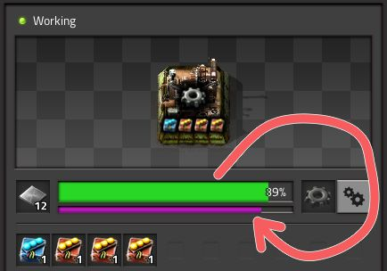
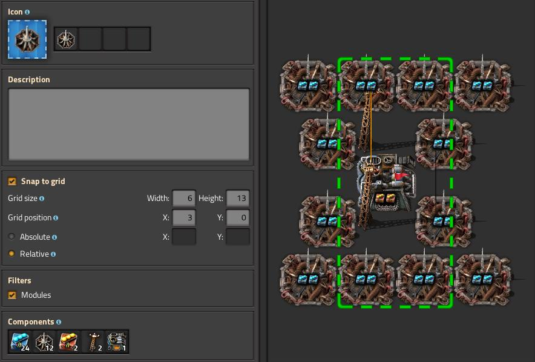
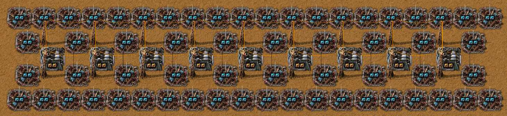

# Маяки и модули

:::danger
Это заготовка для будущей статьи, сейчас она не рекомендуется для изучения, а в будущем может измениться.
:::

:::tip Вся статья, кратко **
Высказывания на тему использования маяков `!Beacon` с модулями `!Productivity module 3` может стать причиной большой любви и душной ненависти со стороны игроков *Factorio*. Обсуждать эту тему сложнее чем выяснять кто вскопал Чёрное море и построил Аркаим.

По мнению Капитана Ачевидность, существует всего лишь два возможных варианта применения:

- маяки с модулями эффективности `!Beacon` + `!Efficiency module 3` + `!Efficiency module 3`
- маяки с модулями скорости `!Beacon` + `!Speed module 3` + `!Speed module 3`

Маяки с модулями продуктивности `!Beacon` x `!Productivity module 3` x `!Productivity module 3` **не возможны**.
:::

Есть также не очевидный способ комбинирования модулей скорости и эффективности чтобы и рыбку съесть и куда-то там сесть. Но это всё для [труЪ задротов](../Additionals/NerdsVsGeeks.md#народные-деффутаты), так как [труЪ извращенцы](../Additionals/NerdsVsGeeks.md#озабоченные-гигагерцами-и-тэрафлопсами) такое не поймут.

## Начнём с теории

Маяки в *Factorio* уникальнейшие постройки, которые используются для передачи эффектов вставленных модулей на соседние постройки, аж на девять клеток. Эффекты передаются только на половину значений, но эффекты от всех маяков в радиусе действия суммируются. Важно помнить, что маяки действуют только на постройки со слотами для модулей, исключая сами маяки.

:::info Простой совет
Самым очевидным применением маяков `Beacon` с модулями скорости `Speed module 3` является увеличение скорости добычи нефтяных вышек `Pumpjack`, особенно на истощенной скважине `Crude oil resource` в силу бесконечности добычи нефти. Применять маяки с модулями скорости на добывающие буры тоже можно, но зачастую не нужно.
:::

В целом, маяки могут увеличить производство, иногда значительно, однако потребляют столько энергии, что никаких ядерных электростанций может не хватить. Причем потребляют липестричество всегда, даже если вокруг ничего нет. А исчё занимают немало места чем усложняют чертежи и требуют дофига ресурсов на создание.

:::warning Важно помнить
При строительстве чертежей, кроме нефтеперерабатывающих заводов `Oil refinery`, маяки `Beacon` должны быть сдвинуты на одну клетку, относительно построек, таких как сборочные автоматы `Assembling machine 3`, химические заводы `Chemical plant`, электрические печи `Electric furnace`, центрифуги `Centrifuge` и проч.
:::

### Модули продуктивности

Самые интересные модули, `!Productivity module` `!Productivity module 2` `!Productivity module 3`. Добавляют *фиолетовую полосу продуктивности* в постройках и позволяют производить дополнительные предметы. Каждый раз, когда производственное строение завершает цикл производства, *полоса продуктивности* увеличивается на процент, равный эффекту установленных модулей продуктивности. При достижении 100% полосы происходит генерация ещё одного продукта без потребления ресурсов. А ещё, эти модули уменьшают скорость производства и увеличивают загрязнение.

**

 Модули продуктивности действуют подобно [исследованию продуктивности добычи](https://wiki.factorio.com/Mining_productivity_(research)), но на постройки в которые вставлены. Эти модули могут быть использованы только в машинах, производящих [промежуточные продукты](https://wiki.factorio.com/Category:Intermediate_products). Модули продуктивности второго уровня, практически бесполезны `Productivity module 2`.

### Модули скорости

По названию сразу понятно, что сии модули увеличивают скорость работы построек `!Speed module` `!Speed module 2` `!Speed module 3`. При использовании вместе с модулями продуктивности могут увеличить эффективность в плане числа произведённых предметов на единицу энергии. В качестве побочного эффекта увеличивают производимое машиной загрязнение из-за увеличения потребления энергии.  Как и с модулями продуктивности второго уровня, модули скорости второго уровня практически бесполезны `Speed module 2`. Положительное применение имеют только вместе с тремя модулями продуктивности или тремя модулями эффективности. Как отдельные модули хороши только в маяках, для ускорения построек снабженных модулями производительности.

### Модули эффективности

Существенно уменьшают потребление энергии, правда не бесконечно `!Efficiency module` `!Efficiency module 2` `!Efficiency module 3`. Минимальное количество энергии не может быть меньше 20% от исходного значения. Также существенно уменьшают загрязнение, но кому какое щё, все и так играют без фауны. Модули всех уровней полезны и имеют своё применение. Использование в маяках оправдано, только если маяк покрывает три, а лучше четыре постройки.

## Начальный этап игры

[тут](../HowToStartNewGame/README.md)

## Вообще без маяков

А зачем нам маяки, если сборочный автомат `Assembling machine 3` имеет аж четыре слота для модулей? И такое количество слотов тоже рождает разного рода варианты.

## Экономия энергии

Вставка модулей эффективности `!Efficiency module 3` в маяки даёт уменьшение потребления энергии и уменьшение загрязнения. Это хорошее применение маяков, но есть условия. Такой вариант работает только, если один маяк покрывает три, а лучше четыре постройки.


## Плавка ресурсов

Варианты расположения маяков `!Beacon` для электрических печей `!Electric furnace` весьма тривиальны. Мы уже рассматривали [простую кузницу](./README.md#модули-производительности-и-гигаватты-мегаваттов) и [большой литейный завод](./BigOreFoundry.md#плавим-руду-большими-кузницами), вот его простая повторяющаяся часть:

**

```blueprint
0eNqlletuhCAQhd9lfsNGvK+v0mwaL1NLokgQN91sfPeCbkza3QaL/5w4fOfAwfEOVTehVFxoKO4wilJSPdBW8cbWX1CkBG5QsGgmwOtBjFC8mT7eirKzHfomEQrgGnsgIMreVhWWphXsEtGggbD5QgCF5prjSliK27uY+gqVafi9loAcRtNuHlcflJ2S1copsWAjOC6WJWJD+6GZOqQRFOE8kyd86MQfoUdOenyAHjvp2QF64j744IGPPfDphu+x4VNPscNaK15TOXT4dwyrlkDeflbDpOydYcHlhUDm9J8csJ9v9M33x6REWb+wHj500p86UhmJWvOr4brkzvvDyD12wwLPNPLnNNJXYTC2Ow0v/+E/poTPx8Ci/XPCix/vnxRe/GT/rHDzL+trC9v+EQSuqMYFF+Yszs5hlqfnIArief4G41QIvg==
```

В результате протягивания это части можно построить основу большой кузницы ресурсов:




