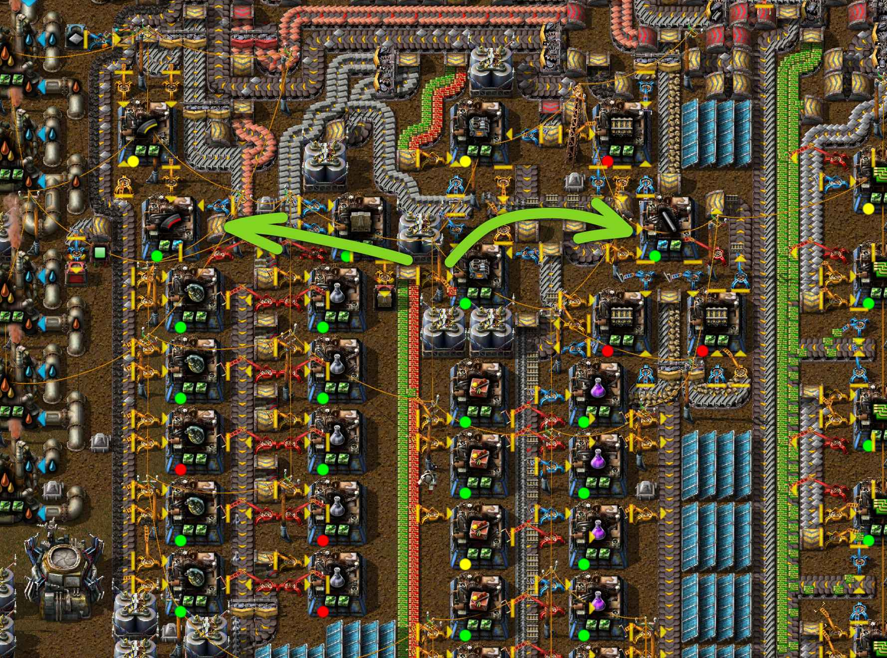

# Маяки и модули

:::danger
Это заготовка для будущей статьи, сейчас она не рекомендуется для изучения, а в будущем может измениться.
:::

:::tip Вся статья, кратко **
Высказывания на тему использования маяков `!Beacon` с модулями `!Productivity module 3` может стать причиной большой любви и душной ненависти со стороны игроков *Factorio*. Обсуждать эту тему сложнее чем выяснять кто вскопал Чёрное море и построил Аркаим.

По мнению Капитана Ачевидность, существует всего лишь несколько возможных вариантов применения маяков:

- маяки с модулями эффективности `!Beacon` + `!Efficiency module 3` + `!Efficiency module 3`
- маяки с модулями скорости `!Beacon` + `!Speed module 3` + `!Speed module 3`
- и совсем без маяков, просто модули в сборочных автоматах и проч

Маяки с модулями продуктивности **не возможны** `!Beacon` x `!Productivity module 3` x `!Productivity module 3`. Ещё имеется способ комбинирования модулей скорости и эффективности у маяков, это чтобы и рыбку съесть и куда-то там сесть. Но это всё для [труЪ задротов](../Additionals/NerdsVsGeeks.md#народные-деффутаты), так как [труЪ извращенцы](../Additionals/NerdsVsGeeks.md#озабоченные-гигагерцами-и-тэрафлопсами) такое не поймут.
:::

Маяки в *Factorio* уникальнейшие постройки, которые используются для передачи эффектов вставленных модулей на соседние постройки, аж на девять клеток вокруг. Эффекты передаются только на половину значений, но эффекты от всех маяков в радиусе действия суммируются. Важно помнить, что маяки действуют только на постройки со слотами для модулей, исключая сами маяки.

## Модули продуктивности

Самые интересные модули, `!Productivity module` `!Productivity module 2` `!Productivity module 3`. Добавляют *фиолетовую полосу продуктивности* в постройках и позволяют производить дополнительные предметы. Каждый раз, когда производственное строение завершает цикл производства, *полоса продуктивности* увеличивается на процент, равный эффекту установленных модулей продуктивности. При достижении 100% полосы происходит генерация ещё одного предмета без потребления ресурсов. А ещё, эти модули уменьшают скорость производства и увеличивают загрязнение. В общем, модули продуктивности действуют подобно [исследованию продуктивности добычи](https://wiki.factorio.com/Mining_productivity_(research)), но на постройки, в которые вставлены.

**

 Эти модули могут быть использованы только в машинах, производящих [промежуточные продукты](https://wiki.factorio.com/Category:Intermediate_products). Самое эффективное использование этих модулей показано на картинке в сборочном автомате, три модуля производительности плюс один модуль скорости.

 После запуска первого спутника модули продуктивности первого `!Productivity module` и второго `!Productivity module 2` уровня практически бесполезны, кроме использования в нефтеперерабатывающих `!Oil refinery` и химических заводах `!Chemical plant` без маяков `!Beacon` вместе с модулями эффективности, по формуле `!Productivity module` `!Efficiency module 3` `!Efficiency module 3` или `!Productivity module 2` `!Efficiency module 3` `!Efficiency module 3`, хотя и сомнительно.


## Модули скорости

По названию сразу понятно, что сии модули увеличивают скорость работы построек `!Speed module` `!Speed module 2` `!Speed module 3`. При использовании вместе с модулями продуктивности могут увеличить эффективность в плане числа произведённых предметов на единицу энергии. В качестве побочного эффекта увеличивают производимое машиной загрязнение из-за увеличения потребления энергии.  Как и с модулями продуктивности, модули скорости первого и второго уровня практически бесполезны `Speed module` `Speed module 2`. Имеют хорошее применение в сборочных автоматах третьего уровня `Assembling machine 3` вместе с тремя модулями продуктивности `!Productivity module 3` `!Productivity module 3` `!Productivity module 3` + `!Speed module 3` или тремя модулями эффективности `!Efficiency module 3` `!Efficiency module 3` `!Efficiency module 3` + `!Speed module 3`. Как отдельные модули хороши только в маяках `Beacon`, [для ускорения построек снабженных модулями производительности](BigOreFoundry.md#плавим-руду-большими-кузницами).

## Модули эффективности

Существенно уменьшают потребление энергии, правда не бесконечно `!Efficiency module` `!Efficiency module 2` `!Efficiency module 3`. Минимальное количество энергии не может быть меньше 20% от исходного значения. Также существенно уменьшают загрязнение, но кому какое щё, все и так играют без фауны. Модули всех уровней полезны и имеют своё применение. Использование в маяках оправдано, только если маяк покрывает три, а лучше четыре постройки.

## Простой пример

Самым очевидным применением маяков `Beacon` с модулями скорости `Speed module 3` является увеличение скорости добычи нефтяных вышек `Pumpjack`, особенно на истощенной скважине `Crude oil resource` [в силу бесконечности добычи нефти](https://wiki.factorio.com/Pumpjack#Tips). Каждый маяк даёт прибавку в 0.5 добычи нефти в секунду, поэтому располагать маяки нужно так, чтобы каждый влиял на как можно большее число нефтяных вышек, минимум на две. Применять маяки с модулями скорости на добывающие буры `Electric mining drill` тоже можно, но зачастую не нужно, профита как кот наделал.


В целом, маяки могут увеличить производство, иногда значительно, однако потребляют столько энергии, что никаких ядерных электростанций может не хватить. Причём потребляют липестричество всегда, даже если вокруг ничего нет. А исчё занимают немало места чем усложняют чертежи и требуют дофига ресурсов на создание.

:::warning Важно помнить
При строительстве чертежей, кроме нефтеперерабатывающих заводов `Oil refinery`, маяки `Beacon` должны быть сдвинуты на одну клетку, относительно построек, таких как сборочные автоматы `Assembling machine 2`, `Assembling machine 3`, химические заводы `Chemical plant`, электрические печи `Electric furnace`, центрифуги `Centrifuge`, электрические буры `Electric mining drill` и проч.

Зелённым цветом обведено правильное расположение маяков, относительно построек. Красным, соответственно, неправильное. Причина такого строительства заключается в большем влиянии маяков на постройки, если сдвинуты.


:::

## Начальный этап игры

Все модули первого уровня довольно дешевые в производстве. Каждый модуль стоит всего пять зеленых `!Electronic circuit` и пять красных (улучшенных) микросхем `!Advanced circuit`. Производить их в начале игры не составляет проблем, пусть не массово, но в достаточном количестве.

:::warning Избегайте модули скорости
Модули скорости бесполезны, кроме случаев когда руки кривые и рассчитали что-то не правильно, а переделывать всё в лом. Пример не правильного расчёта, который пришлось исправлять ускорением:


Или вот, специфический случай, когда легче с модулями (хотя тут тоже сомнительно относительно кривизны рук):


:::

Второй уровень уже дорого.

[тут](../HowToStartNewGame/README.md)

 Также, модули эффективности первого уровня `!Productivity module` очень полезны в начале игры, то есть до запуска спутника, так как позволяют экономить ресурсы не особо тратясь на производство модулей. Каждый модуль стоит всего пять зеленых `!Electronic circuit` и пять красных (улучшенных) микросхем `!Advanced circuit`. Два модуля продуктивности первого уровня `!Productivity module` `!Productivity module` вставленные в начальные сборочные автоматы `Assembling machine 2` дают 8% к экономии ресурсов не сильно снижая скорость производства, правда увеличивая загрязнение на 10%. К сожалению, загрязнение напрягает в начале игры, если играете с фауной и на дефолтных настройках. Но экономия ресурсов даёт больше няшек, так что придётся хорошо отстреливаться. Есть вариант заменить второй модуль продуктивности, модулем эффективности `!Productivity module` `!Efficiency module`, но вариант не айс, хотя и рабочий.


## Вообще без маяков

А зачем нам маяки, если сборочный автомат `Assembling machine 3` имеет аж четыре слота для модулей? И такое количество слотов тоже рождает разного рода варианты.

## Экономия энергии

Вставка модулей эффективности `!Efficiency module 3` в маяки даёт уменьшение потребления энергии и уменьшение загрязнения. Это хорошее применение маяков, но есть условия. Такой вариант работает только, если один маяк покрывает три, а лучше четыре постройки.


## Плавка ресурсов

Варианты расположения маяков `!Beacon` для электрических печей `!Electric furnace` весьма тривиальны. Мы уже рассматривали [простую кузницу](./README.md#модули-производительности-и-гигаватты-мегаваттов) и [большой литейный завод](./BigOreFoundry.md#плавим-руду-большими-кузницами), вот его простая повторяющаяся часть:

**

```blueprint
0eNqlletuhCAQhd9lfsNGvK+v0mwaL1NLokgQN91sfPeCbkza3QaL/5w4fOfAwfEOVTehVFxoKO4wilJSPdBW8cbWX1CkBG5QsGgmwOtBjFC8mT7eirKzHfomEQrgGnsgIMreVhWWphXsEtGggbD5QgCF5prjSliK27uY+gqVafi9loAcRtNuHlcflJ2S1copsWAjOC6WJWJD+6GZOqQRFOE8kyd86MQfoUdOenyAHjvp2QF64j744IGPPfDphu+x4VNPscNaK15TOXT4dwyrlkDeflbDpOydYcHlhUDm9J8csJ9v9M33x6REWb+wHj500p86UhmJWvOr4brkzvvDyD12wwLPNPLnNNJXYTC2Ow0v/+E/poTPx8Ci/XPCix/vnxRe/GT/rHDzL+trC9v+EQSuqMYFF+Yszs5hlqfnIArief4G41QIvg==
```

В результате протягивания это части можно построить основу большой кузницы ресурсов:


