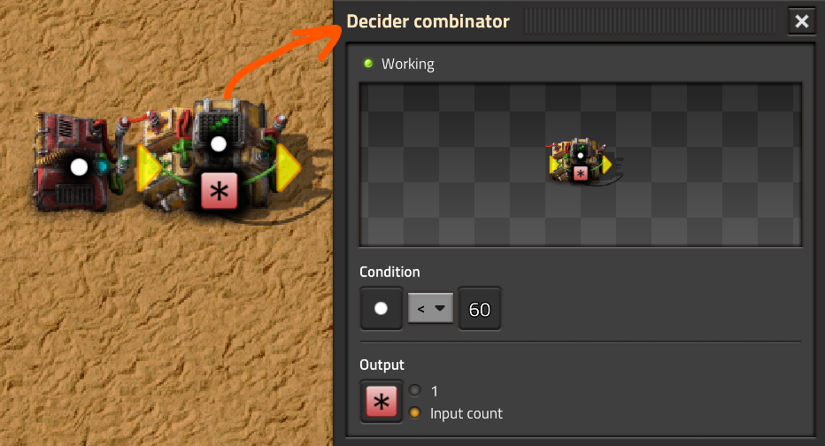
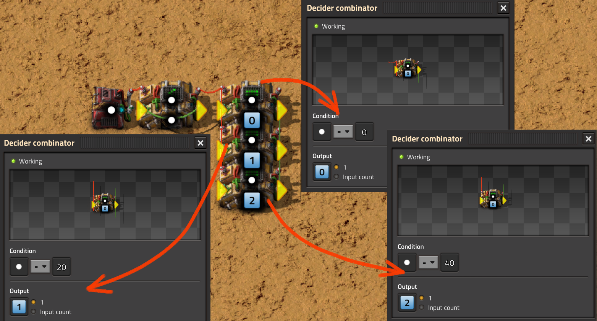
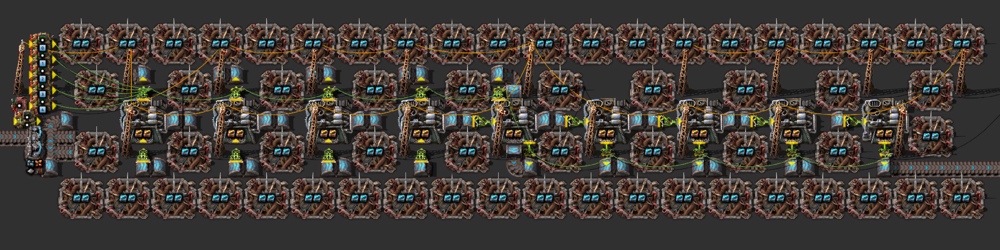

# Большой литейный завод

:::danger
Это заготовка для будущей статьи, сейчас она не рекомендуется для изучения, а в будущем может измениться или вообще исчезнуть.
:::

:::note Вся статья, кратко
Представим, что в нашей игре появилось очень много ресурсов, из которых мы можем произвести много `Speed module 3` и `Productivity module 3`. А также имеется есть очень много энергии, которой можно питать много маяков `Beacon`. А не построить ли нам самую большую кузницу на электрических печах, с маяками и модулями?
:::

Манипуляторы выгружают предметы из печей по мере их плавки. То есть, как только что-то выплавилось в печи, оно сразу же будет выгружено, вне зависимости от того количества предметов, которое способен перемешать манипулятор. Манипулятор не ждет, чтобы в печи накопилось достаточно предметов, чтобы взять их всех за один раз. Это плохо сказывается на скорости игры *Factorio*, если у вас 100500 таких манипуляторов. Когда мы [переводили паровые и ядерные электростанции в резерв](../PowerProduction/BackupSteamPower.md#нудная-теория), то познакомились с такой вещью, как `вундершняга`. Там она выступала в роли ячейки памяти, запоминая пришедшие сигналы. Тут её тоже можно использовать, отсчитывая временные промежутки, чтобы дождаться большего количества предметов.

:::tip Идея с апперкотом
Используя `вундершнягу`, заставить пакетные манипуляторы `Stack inserter` срабатывать только тогда, когда в печах `Electric furnace` есть достаточно предметов, больше 12 штук.
:::

## Начнём с теории

Напомню, что для ячейки памяти мы использовали сравнивающий комбинатор `Decider combinator`, у которого вход был соединён с выходом, а также на выход была единица входного сигнала. Для счётчика времени нам потребуется всё то же самое, только выходным сигналом будет уже количество входного сигнала.

### `Вундершняга` как таймер

Создадим простой таймер, отсчитывающий [кванты времени](../Additionals/FPSandUPS.md). Для этого берём `вундершнягу`, это `Decider combinator` с замкнутым входом и выходом. Нужно выбрать какой виртуальный сигнал мы будем считать, пусть это будет [белая точка](https://wiki.factorio.com/Circuit_network#Virtual_signals), хотя можно выбрать любой другой сигнал, а также и несколько сигналов сразу. Задаём в качестве условия `Condition` выбранный сигнал и максимальное его количество, по достижению которого, таймер сбрасывается и начинает считать заново. В качестве выхода `Output` задаём количество пришедшего сигнала `Input count`. Также устанавливаем постоянный комбинатор `Constant combinator` подающий единицу подсчитываемого сигнала на вход `вундершняги`. Следующий чертёж будет подсчитывать количество квантов *Factorio* и сбрасываться каждые 60 квантов в виртуальном мире:



*Factorio* старается симулировать виртуальный мир 60 раз в секунду реального мира, если хватает мощности центрального процессора. Если мощности центрального процессора не хватает, то игра замедляется в реальном мире, но виртуальному миру пофиг, в нём всё равно `вундершняга` будет отсчитывать количество квантов.


### `Вундершняга` как генератор импульсов

Создадим теперь `генератор импульсов` по таймеру, он нам потребуется для управления манипуляторами. Генератор импульсов, будет создавать определённые сигналы, в зависимости от значения таймера. Подключим три сравнивающих комбинатора `Decider combinator` к `вундершняги` и на каждом задами условия `Condition` связанные с нашим подсчитывающим сигналом (белой точкой). На первом пусть будет ноль, на втором 20, на третьем 40. В `Output` поставим разные виртуальные сигналы (0, 1, 2) с единичными значениями:



Что мы получаем в итоге? А получаем мы что в равные промежутки виртуального времени, это штука будет издавать разные сигналы, на которые у нас "подпишутся" манипуляторы, выгружающие предметы из печей.

## Объединяем с манипуляторами

А теперь собственно подключаем три манипулятора, которые реагируют на сигналы от генератора импульсов. Первый на сигнал 0, второй на сигнал 1, третий на сигнал 3.


Собственно получили что надо. Есть манипуляторы, срабатывающие в определённые моменты игрового времени. Всё что нам нужно, это подобрать такие числа на таймере и такое количество генераторов импульсов, чтобы срабатывание манипуляторов соответствовало выплавке достаточных предметов в печах. Подробнее про `вундершняги` читать в разделе, посвященному [логической сети](../CircuitNetwork/README.md).

## Плавим руду большими кузницами

А вот какие значения для этого использовать я вам не скажу, зырьте ютуб.  Шутка. Вот готовый чертёж:



```blueprint
0eNrVXP9u48YRfhWBf0sHzv4kjeQN+gaNYcgS7RCVKYGijFwODnIXFChwKALk7wJ9ggLXJEZ8ufj6CtQbdSndybK0lHZmWBv9xzZNcr/d+WZ3v50d7qvofLLIZmVeVNHJq2iczUdlPqvyaRGdRPVPy7/WH+tfT3pfFYMe9JbfL3+of63f9ep792P5ur5zf9zWf/Tq391j9/XP7uJ9fbv8vr5tXqj/WX9cvmmu6n/XH5Y/ujtvet/1lH0R9+p/1D/V79zdN73l35tS3GO/uPLuVi/+61OBH+s/6jv3SP3zuiL1/fJtfdtrily+Xv7g6vN6+farwtXz7aeafqroump39fu9qvXq/6xr6H5/qN+5Gx/c3/crsPefWtiUua6+A367/Nvmgdte/Zt75xf32I/ur/vVjbumtVE/ykfTYh6d/PlVNM8vi+GksWf1cpY5Q+ZVduWeKIZXzVX2zazM5vNBVQ6L+WxaVoPzbFJFN66IYpx9E53ATf94IZNsVJX5aHCxKIvhKNt6XQS8npfTYjAtt1+Toa/NJsNq+0V1c9qPsqLKqzxbG2B18fKsWFydZ6Vrz+b9cTbKx1k5GE2vzvNiWE1LV/ZsOs/XHvcqcsUNrOpHL91bafpCO5RxXrqmru6LfuSMXJXTydl59vXwOnfvr7x2VeqZuzdelTRv/nuRl/PqbK9B13lZLdx/NnVaPzEYT1cUNCRWw6Y3xM3F1WxYrqp5En3pXpkuqtkCUWi8LnL20tVtUVRnF+X06iwvXBnRycVwMs9u1pDFuoWrekPzo8zG25bM3ZWQ7tG8HC3yanUNN6fuZdE8fVlmWbH7vErdAzcNqTt0iE0tz7OhA/dRAC/0IxIaN1jVbj7LsvHgajpeTLKBbJzNgyCPI5iEhaACEDQLQQcgCBaCOY6gUxaCDUAwLIQkAEGyENIAhJiFAPFxCDdpsSAgAELxIAK6teJ1awjo15LXryGgY0tex4aAni15PRsCurbgdW0I6NuC17choHMLXueGgN4teL1bBPRu4PVuEdC7gde7hSBpKBHDs2ooozoQUeJ/KqL6j0WT6UpkSSJh8bMSJkUHhEGHhMFhvpp+0Q1fAROP/TwSiVhQ+rDeWwIu3AqqvCydlcbrRaBHZNoNqK8vf16mrazrAw2YiozitcuS2iVC2rV2PW/DEhIq8KwZokYTljVlTGnXRsYTrSmBhKpZ1pQBklULnjUlqV0x05qKgqpSnjUDdK0yPGsaUrsU05r2WOjMgynbMZUPI0DrKt7wLwPGDskbiVWA1hW84UkFaF3B67MqYFgAniOrh2HhKhvni6vBJp46m04y39yvdwCLLL/8+ny6KJuQp7KnPpSHYeCzwjoiAh9A5K7XGr8MvMgnVVa2xJ2Pyr5Fo/lgK/B8Gq7MrEd6eW2tiUpYPqsShkZgsKWw6lAK769N+gcJEVQtrAyRMfGsjKWmA8Jkl4tNcWSxqTtavCiLHc5McnA4k30A6R3SkvYdqINrF/V4lJ6VboB2Frx2hR8drB8mTsf06C+DvJhnpRv1DiPuOaPyO+NnBjbOSPDFeGfs2HPENq/x8gy7/bh/MIYhjqyJxZEYhzjilrv3tWhxQx2jnAO6cA4NaNcXh1xfqzbX1wLhhvAsbgiduqEbbnaI123ESwzxW6tGDvEKS7w2B4mHvvaqOK3Dedf6WXgXnfKu9zp80sa7wfC+tb7l8I6e63R8pMMb4eU9Ced9q2lPybvslne9w7uJ23hPUbzLLng3MYIO9Sx0qG7pSHboALmaeJ2mvc7K0gnos5UhXP2+dZUwPpuRonpbfPmsdywOZQS2g6rDM7LtN2sxkN5Z2aCmHtmJIDUKhdmJzjEaa1V50KrGO9cZ1IAuOpnIDXpAFwcncmcpk3obh1q7QCezlUnRjYsP09a3sa9xNsYCgToIlPZBJV4kwIdj7QNjei9G4MPAbnc/purZYkZqd7/7C0IIYlOsNwhRlQtU0GiVnemdYA7Ei3wF7QcrAsttCwza/b2Z+WySV/453T64qwlwIEVwUo10Uk3AkI8wfKUaQqmiveY+XWAtq+YqyDqk/dmtlijCHphNUbv4hpLxGKM21EkQJNlmdIjp2rfZEkFCVSzCEonaUCdZk7QZq1OmNUnJHltNJVnToDbUSdYkJXtoybQmaTDRvMEkSVEb6hRrpqRkD2V51kxpy0LDsmaKCJ+qA0OZbz5LJWr3nsQULaUDmEyRRpGtppKYMuFMyRTJlEUlQZCYIo0Vkjl7pikJlTd7QowIikmJowpiQGWTGNKnFyTRIZiTM8SktDCRMNlS4WwJi2VLoxJzaGyR8r+E4LJlEXYDrN0SVLaRJtktxSYCPYwLtotEoPaPPz05QMc/Ax1NZ7OsbC1CoL8k3StCriLdnu+oSIJpa+1qKR0XgLVeNiEZiACCtfA3Qd4OkpEpYry7psr2AbzRZADFzHi3pPECaIn2hukkhpSmEugclpHm4OGtcQQQ4GeNm1lPZI2koEzMY03EpKyOMNYEMHIUvKw1e2Hay5oQzAx+GmuClmCvmKwpUk5GIGuakWHgY825AYjEz5phfilAZM2SchsC7ZegN4DVIfsZ0e70KevTABsSyAbaFzlbm9okF5fcvXvTvnd/wDMkJkyzO8X8f6RXmngvscIgEytAonWUTI75uPSLKNrHRJIroiRJREmmiJKY2JN9IvfrNq2ySePZ8T/VlmgF0jLSPnxzkXNcUH7dJ2mBM67uk7TIGVP3KUzkDJ7I0UTHjmb2HE21OZoCRhaO19FsWwIJKFrQjytVFS3ox5SqChP000/kaN0mjjbj166j2VZHI80rwFW8ipBWAQlSKSqErIb0ibhWHXPdPoSgdT8c1EQ2bp2qFEH3g0WyqWMCiMGCEEKLoLEghNAiKCyIJIBg12KakNcFAguiESfkiZh2CJVBnJFHxbCIU/KoGAninDwqRoo4KY+IYWLEWXlUDECclkfFEIjz8qgYEnFgHhVDIU7Mo2JoxJF5VAyDODOPimERh+ZRMRLEqXlUjBRxbB4Rw8aIc/OoGIA4OI+KIRAn51ExJOLoPCqGQpydF4Jxur7dlLc52bofTYZOHLj//WlaXPZ7TgqXVW++FgH9XrML3Ztk11kjnq+zcr6WBonT86mwiUqlSc3NzX8BLFA9GQ==
```

И вот вам [сохранёнка со всеми чертежами](../_saves/AwesomeFactorio%20-%20Resources.zip), которые в книге игры. Но в ролике на Youtube всё разжёвано и показано больше интересностей. Заходите:

[**](http://www.youtube.com/watch?v=z7HcOThwafg)
