# Плавка ресурсов

:::info Капитан Ачевидность **

В игре присутствуют [три типа плавильных печей](https://wiki.factorio.com/Furnace): каменные `Stone furnace`, стальные `Steel furnace` и электрические `Electric furnace`. Каменные печи доступны сразу, одна даже будет в рюкзаке при старте игры. Стальные печи появятся чуть позже, освоить их использование возможно до момента [первого выхода с базы](../HowToStartNewGame/README.md#первый-выход-с-базы), то есть в течении первых часов игры. Электрические же печи станут доступны исчё позже, внедрить несколько электрических штучек, особенно для плавки камней `Stone`, можно будет с открытием фиолетовой науки, она же производственный исследовательский пакет `Production science pack`. Массовый же переход на них производим [после запуска первого спутника](../HowToStartNewGame/README.md#после-запуска-спутника). До наличия достаточного количества ресурсов (дофига нужно) для производства вторых модулей эффективности `Efficiency module 2` проку в электрической плавке немного.
:::

:::warning Будет много картинок и не только
Статья напичкана всякими подробностями от которых можно [впасть в объятия Морфея](https://ru.wikipedia.org/wiki/%D0%9C%D0%BE%D1%80%D1%84%D0%B5%D0%B9). Не теряйте бдительности.
:::

:::info Плавятся не все ресурсы, а только:

* железная руда `Iron ore` в железные плиты `Iron plate`,
* медная руда `Copper ore` в медные плиты `Copper plate`,
* камни `Stone` в каменные блоки `Stone brick`,
* а также железные плиты `Iron plate` в стальные балки `Steel plate`.

:::

## Самое начало

Начав игру будут доступны только ограниченные возможности по добыче и плавке ресурсов. Придётся добывать ресурсы руками, на право и на лево киркой махать, которая стальной инструмент `Steel axe`. Также и таскать всё что можно в рюкзаке `Toolbelt` между твёрдотопливными бурами `Burner mining drill` и каменными печами `Stone furnace`, а именно уголь `Coal`, всякую руду как `Iron ore` и `Copper ore`, камни `Stone`, даже древесину `Wood`, которая может сгодиться в качестве [топлива](https://wiki.factorio.com/Fuel). Хотя дровишки лучше пускать на опоры ЛЭП `Small electric pole`. Какая-то автоматизация по доставке угля от места добычи к паровой электростанции появиться где-то на пятнадцатой или двадцатой минуте игры, а первую полноценную кузницу можно будет запустить ещё позже. Много рассказывать тут нечего, особых чертежей не предусмотрено, просто ставьте каменные печи по краям ресурсных пятен и мучайтесь туда-сюда. [Типичное начало](../MiningResources/README.md#добыча-твёрдотопливными-бурами) любой игры *Factorio*:

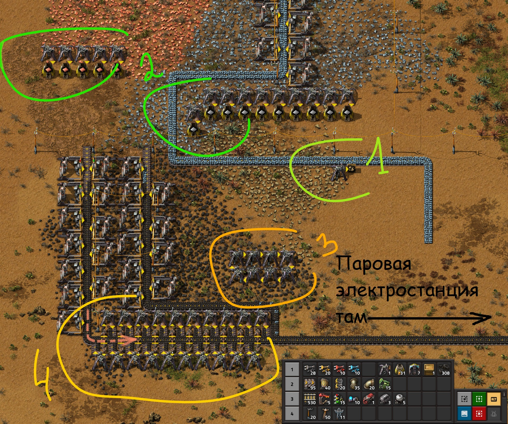

## Теория плавления ресурсов

Наука сия в *Factorio* весьма скучна. Нужно просто помнить соотношения плавки к транспортировке и просто копипастить предлагаемые чертежи `Blueprint` без особого осмысления. Кому скучно переходите к [следующей главе](#чертежи-для-плавки-руд), там будут готовые чертежи, а задротов и очкариков виллкоммен тута.

Итак, мы имеем на входе уголь (или любое другое топливо) и добываемый ресурс (руды или камни). На выходе имеем выплавленные предметы (плиты, балки или каменные блоки). У нас нет особых скоростных ограничений по поставке входных ресурсов, как и выходных (кроме ситуации с камнями, о чём позже). Печи плавят не спешно и вдумчиво, с очень интересной анимацией за которой можно наблюдать часами. А значить, мы можем организовать поставку топлива на одной половине конвейера, а поставку ресурсов на другой половине того же конвейера (синяя стрелка на картинке). Манипуляторы сгодятся любые, даже твёрдотопливные, чтобы загружать и топливо и ресурсы. С другой стороны печей организовываем выгрузку выплавленного (красная стрелка), тут придётся тянуть линию электропередач, так как твёрдотопливные манипуляторы заряжаться топливом из печей не умеют.

:::warning Далее приводятся схематические наброски
Реальные соотношения печей к конвейерам не соблюдены, не воспринимайте примеры в этой главе за чертежи.
:::

Визуализируем:

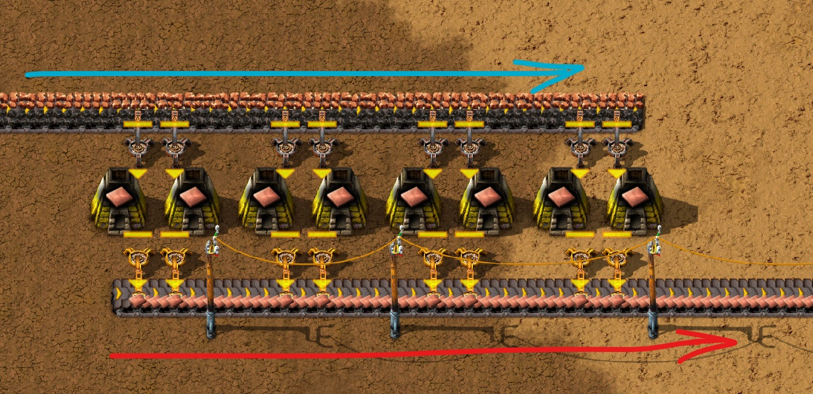

:::tip По поводу пол конвейеров
Пол конвейера называется линией, то есть каждый конвейер состоит из двух линий по которым подаются ресурсы. Это важно помнить, когда будете искать разные там балансеры (`balancer` или `tu balancer`), которые нужны для перемешивания ресурсов идущие на разных конвейерах. Но есть особые, линейные балансеры `line balancer`, которые перемешивают ещё и ресурсы на разных линиях конвейеров. [Подробности](../HowToStartNewGame/Balancers.md).
:::

Теперь этот же пример можно продублировать снизу с разворотом и получить выгрузку выплавленного чего-то на полный конвейер. Получаем эйдос добротной кузницы:


Можно было бы подавать ресурсы и посередине, а выгружать по сторонам с последующим объединением выгружающих конвейеров где-то в конце. Но так не делайте, очевидно что это ересь и за такое всем выдающим себя за инженеров в аду выделен отдельный котёл. Следующее от лукавого:

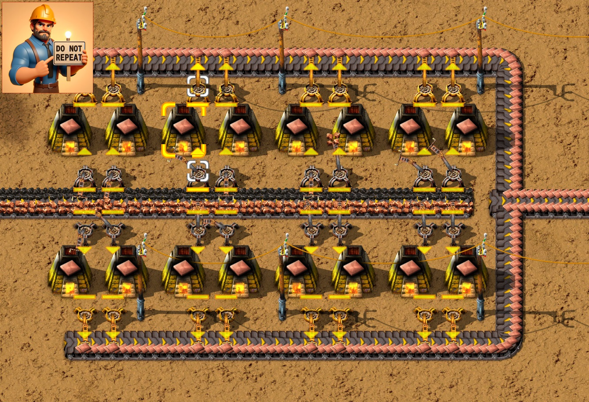

Но есть одно "но", если стыковать несколько таких вариантов и совмещать их по конвейерам на которые производится выгрузка, то можно нивелировать тлетворное влияние лукавого. Такой вариант выглядит не очень, но при определённых обстоятельствах сойдёт:

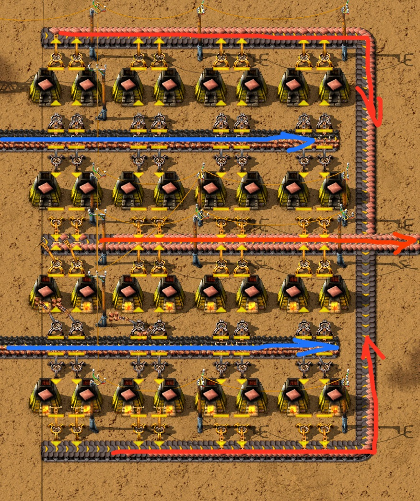

:::tip Не стоит пренебрегать твёрдотопливными манипуляторами
Твёрдотопливные манипуляторы `Burner inserter`, по сравнению с обычными `Inserter`, намного дешевле в производстве и не требуют электрической энергии. Они не сжигают топливо во время простоя, хотя и потребляют больше энергии во время работы. Также их можно произвести гораздо быстрее других манипуляторов. В начале игры старайтесь использовать именно твёрдотопливные манипуляторы везде, где это возможно и невозможно. [Пруф](../HowToStartNewGame/BurnerDevices.md#твёрдотопливные-манипуляторы).
:::

:::info Нужно помнить наизусть
Железная руда `Iron ore` и медная руда `Copper ore` плавятся с одинаковой скоростью. Потребуется 48 каменных печей `Stone furnace` или 24 стальных печей `Steel furnace` чтобы полностью опустошить жёлтый конвейер железной или медной руды `Transport belt`. Столько же печей потребуется, чтобы заполнить такой же конвейер выплавленными железными `Iron plate` или медными `Copper plate` плитами. Стальные балки `Steel plate` плавятся в пять раз медленнее чем железные плиты `Iron plate`, но требуют пять плит для выплавки. То есть любая печь выплавляющая железные плиты загружает полностью одну такую же печь плавящую стальные балки. Камни плавятся в соотношении 2 камня `Stone` к 1 каменному блоку `Stone brick`. То есть без зазоров на входном и выходном конвейерах можно расплавить только красный конвейер камней `Fast transport belt` в жёлтый конвейер каменных блоков `Transport belt`.

Исследуйте это: [все соотношения тут](https://factoriocheatsheet.com/#material-processing).

А далее, из всего вышеперечисленного следует, что **любой работающий дизайн для плавки руды на каменных печах и обычном конвейере, можно превратить в дизайн на стальных печах и быстром конвейере простым улучшением печей и конвейера**. Можно также улучшить и твёрдотопливные манипуляторы, если они использовались. То есть: `Stone furnace` **=>** `Steel furnace`, `Transport belt` **=>** `Fast transport belt`, `Burner inserter` **=>** `Inserter`. Про экспресс-конвейеры `Express transport belt` даже не задумываемся, до запуска первого спутника они не нужны, ресурсов банально не хватит.

Также не забываем про необходимый уголь `Coal` для плавки ресурсов. Половины конвейера обычно хватает, чтобы запустить спутник [на базе из 45 научных пакетов в минуту](../HowToStartNewGame/README.md).
:::

:::note Задача
С учётом вышесказанного получается, что нам нужно организовать кузницу длиной в 24-е печки по каждой стороне выгружаемого конвейера, то есть всего 48 печей на две линий конвейера подающие руду и топливо и выдающие одну линию конвейера переплавленного чего-то. Со стальными балками проблем не возникнет, просто будет две печки вместо одной, первая плавит руду, вторая железные плиты. С камнями исключение, их лучше всего плавить 24-мя стальными печами с быстрого конвейера выгружая на обычный, то есть по 12 стальных печей с каждой стороны (на крайняк по 24 каменные печи с каждой стороны). Анонимусы подсказывают, что при правильной организации игры, плавить камни в больших кузницах вам не придётся. Каменных блоков потребуется не так уж и много да и в основном нужны они ближе к концу, с открытием фиолетовой науки. А тогда будут доступны уже и электрические печи. В начале игры каменные блоки не нужны для производства науки, можно и ручками поработать, выплавляя нужные каменные блоки на одиноких печках. Они нужны только для улучшения каменных печей до стальных, возведении нефтеперерабатывающих заводов и защиты базы стенами. Опять-таки исключение для игр типа миров смерти, там плавка камней может понадобится в начале игры для массовых стен и чёрной науки, которая для оружия и обороны.
:::

Существует множество дизайнов, различной степени правильности или не правильности, самодельных и научно обоснованных... Короче, существует один правильный чертёж кузницы для плавки всего и вся и множество не кошерных чертежей. Рассмотрим далее только кошерные, картина маслом в потёмках:

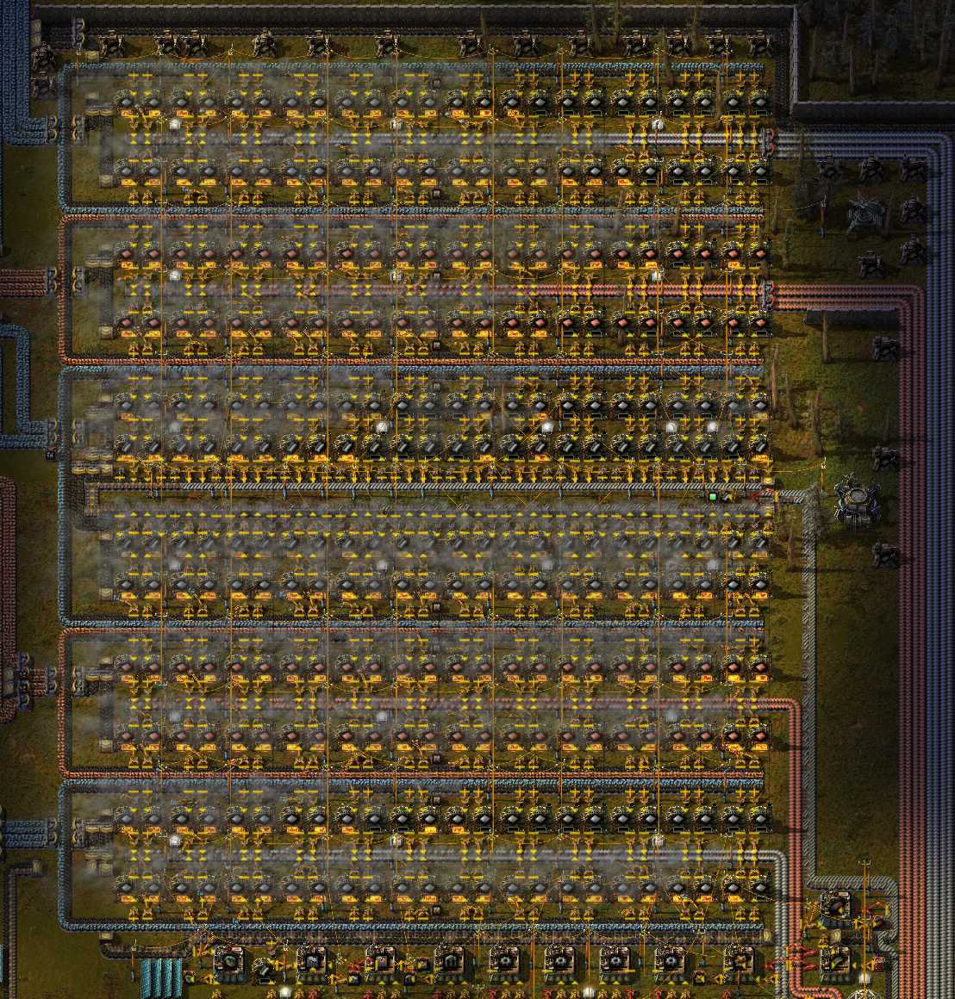

А теперь углубимся в детали.

## Чертежи для плавки руд

Просто напомню, руды это железная руда `Iron ore` и медная руда `Copper ore`. Для их плавки стоит учитывать, что предлагаемые чертежи стыкуются по вертикали и по горизонтали, если чертежи вращать и переворачивать. С одной стороны подаются ресурсы, с обратной стороны получаем выплавленные предметы. Уголь, и для каменных и для стальных печей, подаётся сверху и проходит через всю кузницу, но с учётом верчения чертежей можно как угодно организовывать подачу как угля, так и ресурсов.

### Чертёж первого уровня, каменные печи с твёрдотопливными манипуляторами

Вот они те самые 48 каменных печей, по 24 печи с каждой линии выгружаемого конвейера:

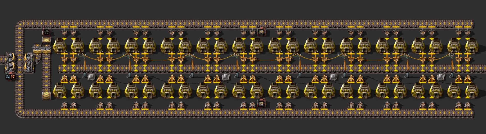

```blueprint
0eNrFnV+O20YSxq8i6GkX0Bjs/91zhr3BZhBoxoxDQEMJlMZYwxggiJEnPwS7JzGSeLFZx84VqBuFGiUzksVWf19lgYUBe2yLPxaLXdVF9let19PrxV296pp2M718PX1er2+6ZrVplu30ctr/a/td/6n/6XLyRXsxUZPtN9s3/U/9u0n/cffbv7f/7D9svx0+8cuk/+/wx8f+h/59/3P/fvtN/353iHeT4Ygfh099P+l/mPS/9P/pP27fbL/dvpn8pXpWBW0GzHDMHvNj/+kU9O6vX7SDIW9/N2VvyR/n3r7tfz45ZNL/ujdh+PND/274jw/Dzx+HX5+GT+8vYvt2Ops2N8t2Pb38++vpunnRzhc7D2xererh0ptNfTt8op3f7v626ebterXsNhfX9WIzvR8ObZ/X/5heqvtZ8eD1ZtnWF1/dde38pj44VgPHNt2yvVh2h4cZ9LDVYr45PNDeX82mdbtpNk29v+qHv7z6sr27va674WJy1zubrpbrZj8oXk8H1IWp4jM3m74aflTJPHPDWZ43XX2z/8zDlX0G10K4HuAjOMPgPGmrZeCBhLtH+G70bebt5uJmeXvdtPPNshs9gzv2xmx34KZbLr68rr+ev2yGo4aPftUsNnUHjeab5fCfD5i7XdSrg9F8NeZrz7jDku4IDNyR8PgIvx7Cr+4umnZdd4OfRummOOoSY6whjVUVQ9csXVG+0EVfKCqiFWsuFeAVS7eEM3RKZWc43NwjHmauZ+hsZlaBckY5N6vImMvmT5UYOpv6dUU5wxWdoRVjLps9tWbobPrUhnKGLTvDMuayCVRTQcgmUO0pZ6iyMwJjLptANRWEbALViXJGVa7niMlPRzaBGiYII5tAjWacEUPZGYYxl02ghgnCyCZQ4yhn+LIzmMkvsinOMEEY2fRsIuWMcgFqmMkvsgnUUkHIJlCrKGeUK1CryUcpHdXnj1IHNvs//WB1+poAfcSyVMSzc4GlIp6dCywV8aFcTFsm4gObrS0T8YGdaSwV8aFcTFsm4gObrR0T8YF+1UFFfCgX044pdwM7Fziq3A3lctcxcRfYycUx5W5g5wJHBSE7FzjqmTOUi2nHlLuBTXGOKndDudz1VNyx+d4z5a5nU5xngtCz6dlTQejLxbSn3vX4ckHqmbjzbEb2TNx5NiN7ZvLzbAL1TBB6Nt95Kgh9uZgO1LseXy5IAxV3bM4MVNyx+T4wFahnE2hgZkLP5rtAVaCuXIEG6l2PK1dxgYk7x+bMwMSdY/N9SMKlu2rcF7ES8lSG9xR169Wi2eSWNPyhXUdXbceoT9F2Nzy6dS+64VHuObQ0pU74sz+eF5d3m9Xd7snw9Hwms2A8usj2eKpRh1gCpc+jHIGqzqM8jNIpnkcFAuXPoyKBKrg9Eajzbk8VgTrv9qRwVDzv9qQJ1Hm3J0Ogzrs9WQJVcLsjUAW3E6M9FNxOjPZQcDsx2kPB7cRoD+fdripiuIeqwCLGu48FFjHgvS+wiBHvbYFFDHlf8j0x5n3J98SgdyXfM8IQ9VSP7taGEK1FZGU4h+eI//t3x4dKr5G3xjNA1bNaDYVqDqHHXzyriqnulGL9rITF3qmL7SheqFl7sH4UqLFiMh2gEDcYDBuyWD+KtTIZ3OnNG8cf5Ibb+WJxUS+Gz3fNzcVquahL59jfwbZuXnx9vbx7iAJdmavRE3mZCgwdJUKR2ambxvFPuQTUVOWHn1BhduqI0WF4oG4BlXBZS7WSqdVQS7VM/4XijUy8huKtTA6G4p1MD4biPTJKjuzOjpKAoYDMzAlaPH3RSSZaA/Gmwhxhy44wQkUZaqlQUobiDeYIBzhCqCZDLRXKyVC8l8m/UDwYeRXg54ihFIBKMlUaeNFWqCJD8UIZGYrXkJ+jL/vZYlEWA4CyMjEaetFOpkZD8V6m70LxQSZOQ/FY5EWgsjzQkYAatCyKEo1EOu86JVOhoXgtk1qheCPTWqF4C93GANRmB/oRUKOUR3mZpgq96CAThKH4KBNBoXihggvEe6yyDEBBdaAbAZVPeZRQqYVetJEpq1C8lUmrULyTaatQPPb8FoDSz2NVZABKP0ocEui865NMAAbiQyWTVKF4JdNUoXissvRAORiwytIDRSonCqHzbhDqtFC8l0mpUHyQaalQPFZZeqCyZPQhR0DM0ojNbx4oXKOSKahQS7VM5ITihQotFI9Vlg4oByNWWTqgSI1eJm1CL1qoy0LxlDCLznCRiTxHZ7jEzHmOTkGJiUZHJ9DERKOjgz0x0ejorJescGHTQ0tWyQnxAcN7gZgt+tEMkKSLd6AnohAPeiLRK24QWBOamSeR37iLdaXoBUzQSC2QD+aMNPRitPrc3qPF6N3ytq7S1ejJ7GcnW8xvV6Wlx5Dp82YkNo/Kx5wXPL2gBt6qQC/6geAoEGvmrj6RY+BoITCMChJmWsXRMaD4JTvMI0oJNKcZjyhNL6eBRhqBmjVnpKUXkEAjnUAnmzPS0wtmoJFBoMDNGRnZAIipEABpprUdD4BELyJhHsFkKEerPSBYCRTKGVcfKFDOTgFHyzq5KUBL9M45wyw9Buz5MTCMKm306BjQjl6BAm+Vp9ejQHAQ6MFzro4CQXiOlejlFuyCQWlJoGduowQa9szVG80O2hDOD9ohDLQJo4PWGIFiPme4pddEQO86et0GBHuByD939YG+bfr8bRsGgraZ2xbBjBtMOeMaSX9Cxgu2ohdUsFtllaDxIWekppdqQCONoKMiZ6QVdFTkWI5e1AAv2NNLHCCYjibvCtEUZtqNz9w2ChpOcq5OgoaTDMtV9MoD5l2n6IUCEEzPXb46f9vs7raNP3U6I+jHybkafItxtBiRS6iOf6kPutfTCw8gOAjakXKupB+8nDk/BjJh64Td1rsaH/CJl/bjOAyvpF3TIyd47Jpu2kzTtPZauMMv6i4j3DUX5Us3okX5Tri3K8r3wu1SUX4Q7kCK8qNwU0+UL90nE+RzW5gcvqkB+Uq4myPK18INElG+Ee45iPLtn9iC8PQc/88tCHWQ7uOH+soLt8ZD+UG42xzKj8Lt4VB+Eu6JBvJjJdzEDOUr4c5dKF8LN/JC+Ua4vxTKt8LtplC+dBcklC/dFAnlB2FpCu6HHYW90iA+yb40BMSnSihTAPFK9h0fKF4L25pBvBH2IoN4K+xFBvFO2IsM4r2wFxnEB2EvMoiXdv2CeGnXL7b9d1UJe2lBvLQTGMRrYQMsiDfC9l0Qb4WtpiDeCdt3QbwXdrKC+CDsZAXxUdjUCeKTsCUV/LKIStgzCuKVsGcUxGthdyaIN8LuTBBvhd2ZIN4JuzNBvLQPEsRL+yBBvLQPEsRL+yDBL2GphB2HIF4JOw5BvBZ2HIJ4I+w4BPFW2NsH4p2wtw/Ee2FvH4gPwt4+EB+FbW4gPgmb9DA89b1Png4raq8cTycFI9ySG8UbYWcdiLfChjIQ74TtcCDeC1u3QHwQNp6N4K9m+7f0lwdftjybLuYDbvi3vy3bF7NJPe8WryaL+uXwb7Ppy7pb7w+OyoY0TIdJV9Ho+/vfAHAnBSc=
```

Проанализируйте как подаётся топливо для печей и как организована подача электричества для выгружающих манипуляторов. На чертеже имеются постоянные комбинаторы с подсказками.

### Чертёж второго уровня, стальные печи на быстрых конвейерах

Получить такой чертёж из предыдущего проще простого. Заменяем каменные печи на стальные. Заменяем обычные конвейеры на быстрые, но не везде, только на половине печей.

:::tip Половина печей опустошает половину быстрого конвейера
Вам нужно организовать подачу руды на быстрых конвейерах только для половины печей. Остальные печи могут питаться и от обычных конвейеров. То же самое и с выгрузкой. Быстрые конвейеры удовольствие совсем недешевое и нужно задумываться о том, где бы на них можно сэкономить.

> На самом деле нужно делить не ровно пополам, а с прикупом на одну печь. Это избавит от иногда случающихся перекосов. А они почему-то случаются и образуют неравномерную разгрузко-погрузку. Правда это случается довольно редко и только на полностью загруженно-разгружаемой кузнице, когда все печи работают без остановки. То есть можно и забить на эту редкую ситуацию, всё равно стальные печи после запуска первого спутника пойдут улучшаться до электрических.

Ориентируйтесь по маркерам на постоянных комбинаторах `Constant combinator` на середине кузницы, которые указывают где нужно остановить или начать обновление.
:::

Также, заменяем твёрдотопливные манипуляторы на обычные, хотя можно и не спешить, если ресурсов добывается мало. Не забываем подать ещё один простой конвейер ресурсов на вход и вуаля:

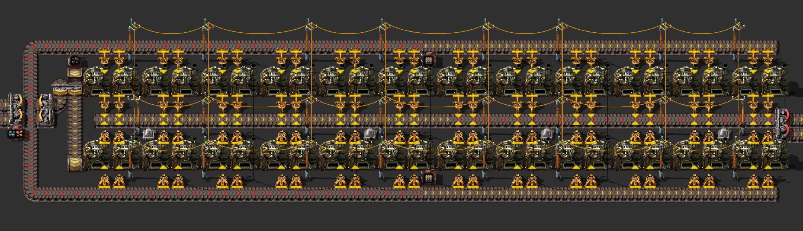

```blueprint
0eNrFXV1uHLkRvspgnhKgZfD/R2fIDbLGYiS1vQ2MegYzLSOGIWCzRp78ECAnMXbXQRyvnSv03CjsGWHVI5Hd9ZEB8iJpJPVXVSS/KrK6SL5bXq3v6u2uabvl5bvlTb2/3jXbrtm0y8tl/4/D3/pv/a+Xi+/aiwVfHH48vO9/7T8u+q/Dl38ffuw/Hv4aPnzrfwsfw7ev/c/9p/5z/yn86dPwkNGL8Mwv/ZfD3xf9z4v+t/5f/dfD+8NPh/eLP7AXzAq56P8Znvly+Ck8/0v/7TnQxz9+1wZVPjwoc9LlUfrhQ//52UOL/j8nJcL3L/3H8Icv4eevR10/Pxhy+LCsls31pt0vL//8brlvXrer9dAK3dttHcxvuvo2/Ee7uh0+vVrtu4tut2r3282uu7iq193yPjzf3tR/WV7y+2oWYd/V9fri1d2uXV3Xo2cF4dlmt2kvNrvxY5L62Ha96sYPqvuX1bJuu6Zr6pPpxw9vv2/vbq/qXTBm0uhqud3sm9MQebcMeBdSqBe6Wr4NP3JnXugg6qbZ1den/zma90SCgCVoUIKEJQhQgoIlSFCChiUwUIKBJXBQgkUlcAdKcLAED0rwsAQDSuAMFmFRETCrOcpqDtOao7TmMK85ymsOE5ujxOYwsznKbA5Tm6PU5jC3GcptDpOboeTmMLsZym4Bs5uh7BYwuxkcs2F2M5TdAmY3Q9ktYHYzlN0CZjdD2S1gdjOU3eKR3bPowqPEFiixhUeJLTxiAMppyRB0lM6SI+gok6VA0OGZt0TQUf5KhaCj1JUaQUdZKw2CjhJWIoR1KGGlQ9BRrkqEqw7lqkK46lCuKoSrDuWqQrjqUK4qhKsOXiEjXHUoVxXCVYdyVSFcdShXFcJVi3JVIVy1KFcVwlWLclUjXLUoVzXCVYuySReltYJnuI+ByhJQnQB9ZOZde1PvXu824TspN6aetkSAesg9bu667d2QFX0u75GrQ761W7XdxfXm9qppV91mNydSH0WGB7vdZv39Vf3D6k0Tngr/+qpZd/WOlL+93oQ/HmHuhlw3H6VuX0ab6NEBNO2+3gU5cym3VGPbRAo4ml/7vZ2jUI/M3t+u1uuLeh26YddcX2w363ounXZqx7ZuXv9wtbk7NpuxFdfyZUyUp2s9rKEntDaM1JTjvFyiKQ2nIZl5JAGYZ6fNkwCUnoZSNPvmGW40DUnMIxnAPDltnoWHr5wcvoEPVlTcmNgINg5QfJp3xtNak8+2pqVxgbl5JE43j00T1Aq0X5iZcyuOV9yqWL9YgC9smnqWxpdxOi3VmjS+jLNmKSSAL2zaHVggcrBp6llHs0/O20fjApsPjI4B5k0T1HF4BPPJERwo4UJsdDY2gp0ApzNnCTL9dAZliic3z99LU6c5jk5G4ae9iCOR8SyRlxoYmoY0H+adAcyb9jUODV5nibnIEAtj1puKex0dYg5QfNqLOE9rzflJhWc0pPlJheeAedOezQsAatqLeEmzbz7MexoX3HyY95punpsmqDfoCHZ+egQHDxkcs2BRL+ktoPk097yjNed8nPc0Mrj5OM8ZA+ybpujQimjXiMmuGTwLZ5Xg0akxZwBpnJzRncYaJwlNSqQNI0AhvOEzFgJRxPoZLEsy0XqCiTRWWEOA8oCF01zlo2IW4li2dnIsH32M8NGBzIFAYmdIOKpfmWzP+UDJOZBYl2JkvqDV8jzyZL9dN10qOTXqeUGB1TRYlYQ1UVhTksIUqSa2JagyheqQjhMTHaei8B6BlxPw0ZYeVZpMdqAcN8O81oLDudBUrwkB5wKTUBJOBiah8LxbEgpPvCWhDJx1SkJZOO2UhHJwziUJ5eGkSwpKMji/kYTicIIjCSXgJXESSsJr4iSUgheESSgNrwiTUAZefCWhLLz6SkLhK48kFL70SEEpBk+5k1AcnnInoQQ8tU1CSXhqm4RS8KwuCaUzZ3WcVnhs4LekI/vZ/z6tON51EkkoVoSXrtttvUtCiHhOkquiqR0nzWmUK5HBaDJ85mSSBo/USpzB01pI47M+ot4C0ZuhNBpVTGS8JGfRt4zcmErY6ItyroEypzNRRHM0PGMmdoNB9Paw3haenhP1RpZoY3ii3v7J8FmvbrdzW3BYImIYhKIcjhiGI/AKhhfwsojWhQZJj3AN663gNRhRb2QCwAWstympj4h4rsEXDiU+VlXCRd8zcWMRkyRsEkRW2NdnFGbQetpCxOWo3pbD63Gi3khsZXAwsghxGRwzRvUcGYUoMQIESg0VQs5WwsfDt0U4zeBwYg2cLiH2NEJcBocWasGIgvVGJsUMjlkOIS6DQ8uzQpPU7ICJ+dmBg8gKhxMn4ZwYrQsdMuNlcMxwGk7AEfVGZrwMDkZwhchZEVLMewV/ONTReV2FoRr1Xg6JrwyOU85n7gKkwVMLSuC1jYc20MFxygs4GUvUW8L7IuGI5FXm1kUivC6pk4qxIPBqiN/MVmENE2WBN3CzwYHFWzhrTuxzfC8sHLa8h2Wg4UYwBsuQsAwOv28gdYJgghbXz3Z9JuK6YDiLGdwSCpbBYRkafiVDbG2Yr87BytuSareYHwqeLTgawU0lRbSsSjCYys7Ddnn45RatU+BDaM524tKUh0+hOXuzRpQh4Fd2xAaS8As8IjDMZafgVtGwDA3LMCVVjBHKDSR+qP6qpIzGfgHXAZ0JJRrm4PetxJ6H47KDY6Zg8BtemvICJzMc5uBTZ842YxNlSGLst24+9sMHzJyhEhXW8It2Yo/CcdnC8UtY+NU+UXk4+Fo4fglfUtsa83D8VKgtVXxGIeGgbOGAKZ/weKJ0UNhx4KFg4zW1tN6W8BzbwvEMOmzGTjn/OLzOhCdqX1J2OzglSi+UVGoMvoMiw+UeVhAx4vfDCpo2cVaBkJlVG0RzFMs4DsD6aLBRPGOTfgorZ0d8CitnS3wKS2XsP09h6Ywt4Sksk7H/OoVlM7ZEp7Bcxv7jFJbP2ICcwNI5u31TWDxj12oKS2RsEU1hyYxdmykslbFFMoWlM/ZIprBMxobEFFbOFsEUlsvYjpfC8hnb4xJYhmVsREth8YyNaCkskbHlK4UlM3ZhpbBUwfHjlnh8pi6ZthBlFE2/LGkuYWzBMedUO1zBQedUGb7gqHOiDOLJK2NgWidYXnCKOlV5UXCOOlVGSd3sQ1s9qz5LlJ0JqwqObacaBFfOUnvcFJwIT1UeLp+lKu8KzpqnKu8LDpsnynCs4LR5qgyOFsASO8GJgnPsqcpLtAqWqnzJCflU5XVBKWzMGQ3u7VjFHy8DFM4UnMlPNcoWHMpPleHQilhqr/uC4/6Jynv4dDSi8p4XXCRAVV4U3CRAlSELCmSjtAhEG8rMEvVlwquCuwuoRmm0RJba66bgVgSq8hatk6Uq7wruW6Aq7wsuXLDEg/JZwY0LVBkcrXSldYJkouAuB6ryEi13pSqvCm6JoCqvC2peow4puLih4i9R6ieZyatIpdpjC472e94v/8+j/SQruWSD2l4ereAlDl7O8q7vIOrNOVrBS9Vb5FXXUvWWeTeDUOFVQfFujM6DgzjWr8cr5iTXeXeRUO0xaNEutZtt3i0nVL0dWudK1dvn3Z9C1FuwvAtUqPA87wYVKrxA612JrS5k3t0sVL3h0yapeuu8W1+oepccSBn1NsF/HfcJxGsFJXSplYODinB5F81Q4T1a2ErsZugyKwcHFcnRulmq3pmX41D1zrwdhwqvCqplo6NfPFSnx2vJJFRv5GDfTzzAycGLMOxmKzioUI94gtdf2K1WcLSCrrWycFCB7rWysO/HD4sitjp0p5WFfTz1OCl44QDdZ2Xh4KFMQeVq1NsE/5U4lVVi91vBjlk5tKg01gcvq9NS+3J5tb6rt7umHdRbr4Ke4Xd/2rSvq8Vtc3Ozrhfr+k34ZbV8ExbtJ7UcV9YHVikvjTf39/8FmB62iA==
```

:::tip Обратите внимание

Подавать ресурсы лучше на двух жёлтых конвейерах `Transport belt`. В начале игры, пока со всем всё туго и нужно экономить, лучше использовать два обычных конвейера вместо одного быстрого `Fast transport belt`. До запуска первого спутника экономия пространства ничто по сравнению с экономией ресурсов.

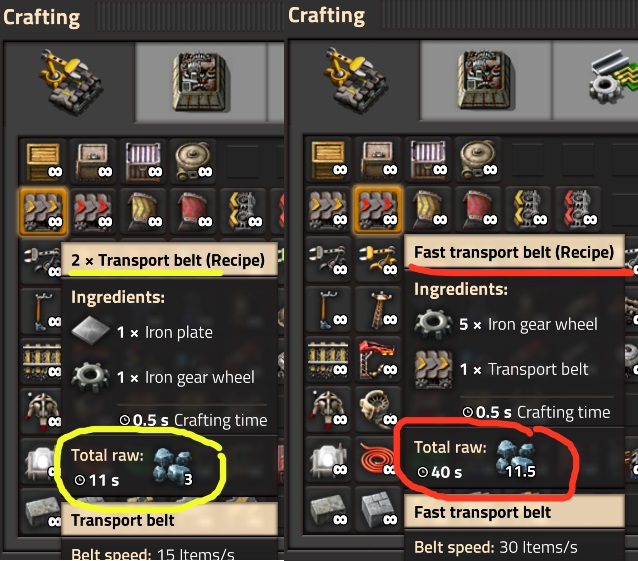

Просто сравните: за три железные руды можно поставить параллельно две единицы обычного конвейера, которые дадут пропускную способность одного быстрого конвейера, который стоит аж одиннадцать железных руд, плюс время на его создание.

Улучшать разделитель `Splitter` подающий ресурсы для плавки не нужно, он вполне справляется с двумя простыми конвейерами. А вот в конце чертежа, имеет смысл раскошелится на быстрый разделитель `Fast splitter`, который выдаст два простых конвейера выплавленного и которые обходятся гораздо дешевле одного быстрого конвейера.

:::

Важным подспорьем в обновлении с каменных печей становятся роботы `Construction robot`, с ними обновиться так вообще как два пальца об чертёж. Вот планы обновления:

```blueprint title="Upgrade burner inserters and furnaces"
0eNqNUdsKwjAM/RXJ8wZexnT7D59EpNM4Clta2ijK6L+bsg0GXuZTT9pz6SEd3Gzt1AVPtlFE6KDswCOzptpH3Cpr0Qk8dHB1po13/LQIJSCx5ickQKqNc3VzYpBq8uhYnEICbH7wp0RNF3xAuQzJbIxnQ5heJUydcTbEM2IzZQ9JWTgKPhvqq3ldk2omPpqx/Vlt8FnFH8+oP8jWf8jeig7azV/ar7XjELnluPp0XH0CjapQTGHfvyz63ouxgBfKXQ5tSCrsVtm2WG93WbHJizyEF8xKxjk=
```

```blueprint title="Upgrade belts"
0eNqFkN0KgzAMhV9l5FphOvHvPXY1ZHQzSqGmpc3GRPrua3HCYODuTn6+nHAWeJjRih6vRgkitNAu4JBZ0uiinoQxaIO8LDBYPcUezwahBSSWPEMCJKZYsxXkjLac3lAx+ARY76wPwnH6y0jq8QXt0XdB3zWt1k6OJNTXNck47Vl/zmQ++QvvP5L7LhaRaLew0i2sBJQI+2FyXieHSLvQf4bQpKbA11lRNXlVF82pbErv32HIfcI=
```

:::info К чему бы придраться?
Может показаться, что опоры ЛЭП установлены не оптимально, ведь любой школьник знает как ставить правильно. А именно, по одной опоре на три печи с симметрией, а загружающие манипуляторы должны быть всегда установлены с ближнего края загрузки:


Однако, хотя школьники и правы, но предлагаемый чертёж не увеличивает количество ЛЭП. А вот киллерфича тут такая, что сдвоенные манипуляторы легче прокликать [манипулятором типа мышь](https://duckduckgo.com/?q=%D0%BC%D0%B0%D0%BD%D0%B8%D0%BF%D1%83%D0%BB%D1%8F%D1%82%D0%BE%D1%80+%D1%82%D0%B8%D0%BF%D0%B0+%D0%BC%D1%8B%D1%88%D1%8C+%D1%81+%D1%88%D0%B0%D1%80%D0%B8%D0%BA%D0%BE%D0%B2%D1%8B%D0%BC+%D0%BC%D0%B0%D0%BD%D0%B8%D0%BF%D1%83%D0%BB%D1%8F%D1%82%D0%BE%D1%80%D0%BE%D0%BC) (аж на пол процента?). Это даст больше времени на другие дела, а кликать кузницу придётся полностью, обещанных выше роботов на момент обновления ещё не будет.
:::

## Чертежи для плавки железной руды в стальные балки

Для плавки стальных балок `Steel plate` нам придётся задвоить как-то плавильные печи. Это можно сделать двумя способами. Можно поставить печи в два ряда, на первом ряде будем плавить железную руду, на втором будем выплавлять стальные балки. Это хороший вариант.

А вот не хороший. Можно взять предыдущий чертёж и продублировать его ещё один раз. То есть сначала плавим железную руду и складируем на конвейер, а потом плавим железные плиты отдельно. В силу определённых причин не забываем про котлы в аду для плохих инженеров, так не делайте:

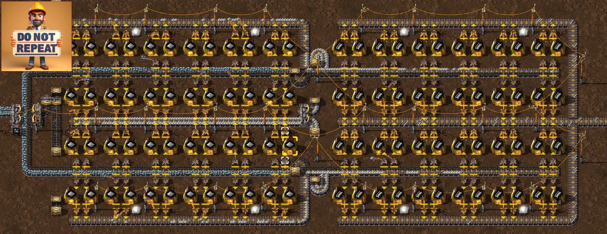

### Чертёж первого уровня, тоже каменные печи с твёрдотопливными манипуляторами

А вот собственно и кошерная кузница стальных балок, берите и пользуйтесь:

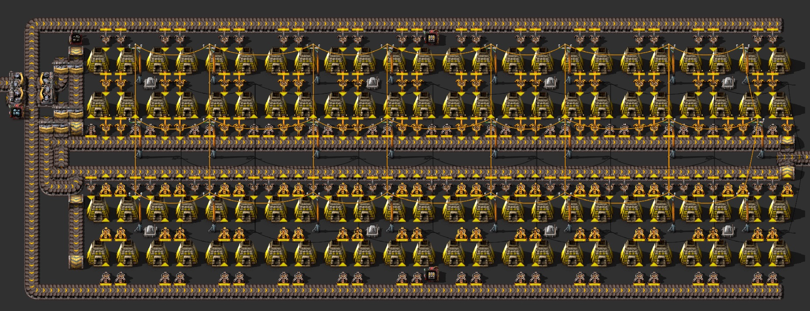

```blueprint
0eNqtXe1uW8cRfRWBv1qACvb7w8/QN2iNQJIZhwBNChQVNDAEtA36qwWK9knSpGmbtOkzUG/US8mNr6075DlH/RE4ssXD2dk9d+/uzJx5O7tc3S6ut8v1bvbi7ezV4uZqu7zeLTfr2YvZ/i/3v9//Z/+3F2e/Wp+f+bP93/ff7f81/PeP/Y/7r+//dHb/m/uv9n/bf312+Hn45/s/7/91/7vhI/8+2/8w/PHj/pvht7/ff3f/m/13DxjRnQ0f+Xb4tT+d7b852/97/8/9j/df3f/u/quzn7lPfErvvuUB5tv9f54Cff3zX60Hy/7wzrYDrPsk/PTt93/Yf//kQ2f3vx0Avx7+/Y/D1w0fPdv/9fDj8Fs/nP3MNzf++SO7fj6bz5ZXm/XN7MUv385ulq/XF6uDr3ZfXi8GJy13izfDb6wv3hx+2m0v1jfXm+3u/HKx2s3uho+uXy1+PXvh7+YnP3yz26wX55/dbtcXV4vRZwPw2eV2sz7fbMcfi9BXLhar8+vVxW78yXT3cj5brHfL3XLxOOyHH778dH375nKxHUZjDXg+u97cLB/Xz9vZAHUeQ/okz2dfDv/rc/kkD9/yarldXD3+zsPQPgIPDHgmwSMDHkjwxIBHEjwz4I4ELwy4J8ErAe4bCd4Y8E6Cdwa8kODeMeiVRWc46lmOeoakniWpZ1jqWZZ6hqaepalneOpZnnqGqJ4lqmeY6limeoaqjqWqZ7jqWK4GhquO5WpguOro/ZThqmO5GhiuOpargeGqY7kaGK46lquB4apjuRoIrobOcjU0Bp3laugMOsvV6Bh0lqvRM+gsV2Ng0OmX38igs1yNiUFnuRozg85yNRYGneVqZLjaWK5GhquN5WpkuNpYriaGq43lamK42liuJoarjeVqYrja6JMqw9XGcjUxXG0sVxPD1cZyNTFcrSxXE8PVynI1MVytLFczw9XKcjUzXK0sm7J6qTQ8FO6m8KKIlw2893y8Xb9abF9vN8Of0M1U+nj8A9S7u77N7e769nAL+fT73jP0cLW5u1jvzq82by6X64vdZnvqK/PDVw4f3G03q08vF59ffLEcPjX86mfL1W6xha5KrzbDPz7A3B4un/3oqvTlpIuKcVE6eUX1k3cmod5z/HIAWWzPl+ubxXaw/NRlmjV9DbftcFA9ZltnbBvfaBm2FUfYVo/aVjxlWzltWyBsy8dti5RtpylZEmFbPG5bpmwLp20juOCPc6FQXBhfKVm2EVxwx7lQKC6ML6QM2yrBBXecC5XiwvhKyLKN4II7zoVKcWF8oWTZRnDBHedCpbgwvtKxbCO44I5zoVJccKf3hYpzIfTjXKid3LE/uPTJH78klGfv309DnehO3hzh5g9ulww3N0+4+TitW6BsO73FtUjYdpzWLVG2nd7iWiZsO07rVijbTm9xrRK2Had1a5Rtp7e41nHb2nFad4oL7fQW1wkutONc6BQX2uktrhNcaMe50CkutNNbXCe40I5zoVNcaKe3uE5woR3nQqe40E5vcZ3gQj3OBe8oMtTTG4N3BBtqPWEdRYdaAOsIPtR8wjqKEDUD1o0Ycb1a7qzj8WigAcl6oHJNRg+VgCVVVMzqZFpdJmGbeOETLO92ETAagFQ6yfg254lf0yS8F5ObnsBP+neUUHJ02uLYDYDV7xmGXvFYEzZKG7l5c7FanS9Ww1dvl1fn15vV4lQu06MX1ovl688vN7cPb9g+uPnwWvVy8ssyZPf4+se0u2BQBYCqH7lgdfHm+lS2kgnWMLsALo1yP9CLFQtqlOiBznI8PsvDuvHDsh2Oi5MzPcr9QC9eTNsDBOUaABVZN7hycrH70Ac31Gk3JMx2YGEFjDvjaw8TqoAL3iFLq2J2RQAK444DHmujXAx0pv2JmY5zH8M8+jQ506P0DPTYb9kePQYFPNpGiReYGz7I7Zh0Qx/c0OYx+Gk3RMx24PEXEwYFrNFRlsXRBf9BhoUJVjC7gEdbhLjzwfnYhGrsTLd+fKaHteOTH2a6Tc90x2wHHm0J404DHm2j3AjUDeGEG9rghjqPMU+6IQXMduDxlzDuNGCNpgQu+AosrQTtPB8cXE0ojDsVeLSlys50rcdn+rDYU5ie5YbZDTzWUqdj1CNvuP//jfe4xga96/bZiec8Bx1wshfhPQYf5LwEZ+clLNdGWoLn8ioi7a1EnjJBL2UlNcFPr5eipBIYWFUJ/RtYTQnVG1hdCa1PY1HpDSd8X7wSujawghJqNrCiEho2sKRQroGVldCrgVWUUKmBVZV4oIHVlPidgdWVeNs0FpHKMIqPGVheiWcZWEGJPxlYUrzIwEpKfMfAyko8xsAqSvzEwKpKtMPAakpswsDqWr1watD228RXLBRefMVKHYMP2r39U+uni+7EN6qn8JP39o18o0KdIlY7o04R651R+MpGHR7cMgnVqFRVT6++rhVng57oTivPRuG5hNTGeqcHNgxjTmSPWi056omkFZOj8JkNItmOKNScVXrOqlb4jnqiaZXvKDyX/p1I7wTn2KibNZHBea1KH/NEcEEr00fhIxsztB2RqDmL9JyJkgKoJ0RNARSeSzB3tHcaG0C1J7Jr+gegJ6gMDddpeM+Gf01H+EAlQnd2ziiBD1doTyRNrQGF51LYC+2dwsbC7YmsmrIE6ommSUug8J2N5JuOCI6aM/YUFzgJD3oz5DQ86M0wcAUjgfZOYlMf7IkUNTtQT4iiHSh8ZRM3bEdQJ0Pn6TnrmsAI6AlOpYPeDKOncv7Zk2GIgc1iMSeSU+WgN0NOloPeDGNmc3BsR3A1JJWes6pJt6CeaJp2CwrfKe/QJ0Mwt6QDJ0NKd6PTmyElvNHpzRDMLunAyTBxFVv0yTCJojioJ0RVHBS+Ut6hT4ZgLkoHToaUskajN0NKWqPRm2H2bPac6YjM1YTRJ8McNbkh1BNJ0xtC4TPlHfpkmAubSmhPZNW0kVBPNE0cCYXvbCKk6YjCVWDSJ8PiNSEn0BMlaEpOKHykvEOfDEtis0LtiRRVp1BPiLJTKHxlc1ptR3A1nvTJsHRNIgv0RHWaRhYKj22GFdgMaxDrVUFH16jpeaGeSJqgFwqfxXpZ1DtgijSwGY4SZ4A018Fxx3JIAPmtUJumdoa6HtseK7A9cmIdld4em9hLIIE6tkGEr5j1og7cU+un4ZMID1qfxdQj0PdFTD0C4atofbWWehPtNQG7mMUEqig7MYsJhPdiahAIH8TUIBA+PqNc+x1/nhTyRufmabrMK3AZOIUeTxYTfED4ImbNgPBVzJoB4ZuYigLCdzEVBdQrf07N+eRSfVQWOBRbz1OcLMONXPaOo8cUxKQSED6KmRogfBIzNUD4LKY/gPBFTH8A4esztAGml+uDPMKhYnxYrnV6uTYxkQEcUxcTGcCeAU7MDgDhvZgdAMIHMeQOwkcx5A7Cp2cIHEwv1wcZi0Nl/zylSf2W6LMYPAfHVMTgOQhfxYg0CN/EiDQI38UwL9ihw4lhXhDeP0OIYnK5PmpxHOQJhuVaJpdrCGLAFhxTFAO2IHwSo6AgfBajoCB8EUOLIHwVQ4sg/HPUNKaX64NmykFGYp5ymF6uYk8ScExRbEqCwotdSVB4sS0JCi/2JUHhxcYkKHx+hurJ5HJ9FH456GEMy3VS+SRSzYUa/XziugvRzycqranSzyeqv1Cln09Ug6FKPyqoTKdKPyoSrUpVTxy1HgV65qlMqlLFUe4TGwh5HNHJ0EekWg9V+vlEpUTVYxf+0/AMl2uk4at44Z+QC/+YRBXTlDH4Lt7IY9aPsqRIMZoJ+5Glmr2g65Im9XljDnRNMOb0HNUKYUP4N+YkSNBYw85qha5pXaFrckFHKmo51rAbXS8LGtnV6lnLn5SATj4+bLJBUAKsC3S9KuZIRlPnJw0ia9iJriUFjcxqZanpT6VzkDVsubLTtI6v5QQd2QVlJ2PY1dF1lpiRZEuhftqfVRGhsoYd1apH0zpa8xd1ZBb0sqxhF7oGETSyqhWJpj+bIO1lDburFYGWdc3RNYCYI5sXVMiMYbdA1+eBRka1Ws/0ZxIE06xhZ7VazrSu0PVxoCMVbTdr2I2uXQON7Golm+XP7gQZOmPY3auVZKZ1ga4dwxzJdAzqJx5pnZbJRo3MapWX6c8iiPtZw5arrEzr+Loq0JFKX63pYSfn6JonyMjkvFoBZfgzOUUy0Rp2VCuQTOsSXXMEOjIL6o7WsAtdDwQaWdXqINOfTRCitIbd1eocyzrv6HoczJHeC5qZxrB9oGtlQCOjWjlj+jMJ8p7WsDNduQIOu6h1LOawFSVSa9hNrSMxret05QjmyOAE0VRj2MHTNRygkUGt6LD8GdQqiIAZrFZBRAxerYIArS8iPGg9rzUK2t2ek0A/0Tbi8IJuZCOn0OlLfWwU0dEX8SCw53uhJaPVRYr8LTdoJa9yCAKn5+SsT6yOd6UVVgJwipm+GgZHUujrXBD4WXnSky56SOe3kk5TbPR9KjgSXocNA06O769mkih5+oIRtJK/FASB43NSk6dWyGMGvZXnmVKib+XAkfAqUCBweU467JSLHrO2rdzClCp9lQWOpNHXTyBw53u2mSTKjr7bwawUNGhA4PCcDNTJFfKQKG2l86Uc6QsRcCSJvsQAgZ+V9TjlosfkXCuNLKE6NfSjOPMqGSBw4/vA2STqbB840Mri2K5wKLB/Ro+4yRVi58MmLKfjg5MnOAr1HOowePUc6jH4LKe3Kb3WUlEPpuBwqpI8N9lAJpWmZKQZWF1J85rGqlLulIHllYQkAysoWT4GVlRSZwyspOSjGFhSkoeBVZTMCQOrKukIBlZTYvwGVlcC59NYTYpGG1heCfEaWEGJmxpYUQlGGlhJifAZWFLYzMAqSizKwKpKgMfAakrUxMDqSihiGqtL9/sGlih8FCEJqETJq4xeVlB48VUrQqpQiRJTGb2boNZnTekHhS+a7g8KXzXdHxSeaznm6LkVW45h5mcnthxD4bkU9056J3PCKYU2P2oyQig81wqp0N7JmkwRan7RZIpQeC5hPtPeEWWQUPNFGSQQ3lMtWsbmY97xouIRar6oeITCUwnEY3zQO0lTVELNz5qiEgpPNRUcmw96p2qKTaj5TVNsQuG5ZP7Keic4TZwJNJ/rrUQ/lQPX7CzR3oma+BNqftLEn1B4rtlZpL1TNHEp1PyqiUuh8FwTJkd7R2zCBJqvNmFC4d8T92qzvtldrHfnV5s3l8v1xW5zqrTkqYeGlTLA7Lab1aeXi88vvlgOGMMHP1uuBn8fgg5vZzfL1+uL1eFv/3f9vVu8mVmDvDsA3q53sxeDocv1q8Vgg797eTc5FiprrtPv/WoXKHQqxC5QKDxXAkG/91MSKp3eYbjOUPQOE6kM1k6/91MaKp3eYSgNlU7vMIkrR6Lf+7l2UfQOk6ImD4bCcy2k6Pd+Si+l0TsMpZfS6B2GayHV6Pf+1DSlMdT8rimNgfCZa21Dv/dnUckMNV9UMkPhuWIP+r2f6zVFP5Vz1pTSUHiqJqTR7/1c/yn6qcz1n6KfypkrvKLf+4vTRNdA86meVJV+Khe1Lw7qHbEvDmq+2BcHhVf74qDeKZrAGmp+FcuHpsx/OX88oQ1Yq9vF9Xa5Pli5uhjMHf7uF5v16/nZ4mK7+vJstfhi+Lv57IvhqPdoXPOp9mHxt+BjLXd3/wXJYAvX
```

### Чертёж второго уровня, тоже стальные печи на быстрых конвейерах

Улучшим кузницу до стальных печей, усё как и прежде. Заменяем старое на новое, проводим липестричество по краям, подаем ещё один конвейер ресурсов и всё.

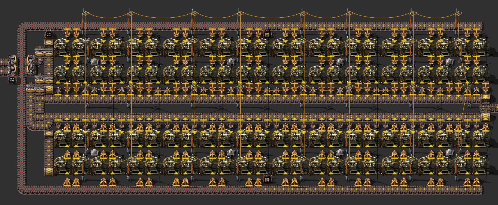

```blueprint
0eNqlXVtuXMcR3QoxXzYwNPr90Bqyg1gwKGksDzAaEsOhEUMQ4Afy5QBBshLFjyR+rmG4o/TlKOYdsYv3nLofgk2J93RVdVdXd/Xp6teLZ5ub1dVuvd0vnrxevFhdP9+tr/bry+3iyeLwz9u/Hn4//PDk7OPt+Zk9O/z78OPhl/bnP4ffDm9v/352++XtN4cfDm/Php/PDj/fftn++qv2w++HX9uP7T+/Hb5rv//T4cf2Tz/eoXhz1j76/vBL+/7w3dnh18N/D7/dfnP79e03Zx+Yj2wI79q5/bp9//3h94dAbz/8eNtk+/addAOs+Wj47PYfw2e33x5+evDR2e1XDfBt+/e/tebap2eHfw0/tt/6+ewDn8z45/fk+nCxXKyfX26vF0/+/HpxvX65vdgM1tp/cbVqZlrvV6/ab2wvXg0/fXpxvT/f7y6211eXu/35s9Vmv3jTvt++WP1l8cS+WU4iXO9Xq835pze77cXz1ehbB3y73l1uzy9348883OTV5mI//jK8ebpcrLb79X69Oup+98MXn2xvXj1b7Zo2j2q9XFxdXq+PY+n1ouGdexc+isvFF+1/rbcfxdbUi/Vu9fz4O3f6vdeCo1uI9y2Y1kIH08/BhKQOf7QwjJr9xXZ//vzy1bP19mJ/ueu24E6lXg4f7neXm0+erT67+Hzdvmq/+ul6s1/toFH4/LL94x3MzeDZdjQAn/ZsEmmbONImiW7Bky3key/YXq92zVRdWDM5QAotqiFFrXQLlmzBmnvnfnWx2ZyvNu3Xd+vn51eXm1WvCVveH4Pb1frlZ88ub+6GnHNL69LTXlP0NDBuCtPGQX1r62TfWtr7x6CYsAETNk0LS7vlGBQTlvZLm9kmMt0EGyZswUw+HRws7ZqWjQ7OYMK6SWEd73nstO0cPY/4R+eRNjF5s7S+O5U43jvZKOEC3QQ7u7uIdbCd7mDeO9lA4bCwacq0sHTcNGwccLR3Gnb29nTgNGkqcIYWO4PtDXhPe7BhZ3iPxU6TpxfOtHcaNlZ4LHaaMC0sHTsNG3U87Z2GjRWejp2GneE9FjuNnzY5753s7B2w2GmmF/mB9zw2DgQ6dhr76FTS5qZolzZ2p5LAeycbKwK7sXX1waZi3MTsbe7DPAu64Q1RApnQAjNUQoapq9P7lcBOACegmLAFE3Z6vxIqY1Q2kEXDoLORJ1rSWV0Njzpr8/7km7N2F7rRMbqwgSl6rEent0MxMHKy0S1GTM7pnVBMjJxsiIyZQWdjWiwMOhuEYsVsPL0ZSZT/sbElWUjOMr0PSYxvFXZqT56dJ0p9dJ5oE09uQT1154nE+F9hZ/7EBMHCztcJC4JleuORGP8r7MyfsPhXpvcciYl/hZ3VM+N/hZ2LMx3/int0XDdHKS3+5e5iNVM+ys7XGYt/ZXpLkyn/o08ssPhXpnczmYl/hY0hmfI/dubPTPzL7HydsfiXp5fihfG/zM7FBYt/eXoVXhjfyuysXuj4l/Oj88QQ/Ep3kiiM82V22i+Y8+XpRXJhnC+zE3PJM86rXRFELnNAqwB672rXV5v1XjqB9WPhTvQPvbPSe7e7aVv63ctd2+K/QA6m7+Q8xV/+P49webO/uhkyBg/bswITo3ss+0dTPYNUh0MNB0+PQXkCKj8OFQio+DhUJKD841CJgJowe8ahzITZCwE1YfZKQD1udmsMgeUnsIjxbuwEFj7gXa0TWJ7AyhNYgcCasn0ksKZsnwisKdvjo96VKdsXAmvK9pXAmrC9NQTWhO2tJbAmbG+JcZ8nbG+JcZ8nbG+JcZ+nbB+x6H6/oHQZYG5YYvHk3f0ib2gHgc9K+IzBF8woQTRK6sLWOcuzhCyr7IiGomgjC/SZESUFWwOCwjqmG/0j3di194h3QlEfH8L3pQ8sNVG2b9SsTlMfK83gCL5T/X1uj/Vp6ULp8gRd1iyHBdkLywiUTVpZvp4I5Y1mld7X0L+fkNtcvLqaIOTJgjnNml8QzLNkO1mswFLhZCjVVkTQMM0gvfUc40ieHUhASxdj1zl81ux/BPkLS0CTzVpZepgIFYxmW9bXMNgZLK1eDx05iQO3YumS6/ZQcJq9oCC/Z0lZsllpypQMFTVbVEHDBE5fBnDukDX7XUEwmu8ki1VZNpIIFY1mF97XMNoZvKOecxz5iwOXoTlH7TpHVO38Bfk9y56RzRpYbosMFTX5CEHDNINs0uuhIy1sOEVeuty/pRGzJgciyF9Ygols1spyQESoZDSZmb6GCVx9jQkZsmBOk+YRBPMsn0MWK7CUCxkqapJPgoZpBsOi5xxHGtZwFL10xXedI2VNwkuQv7C8B9mslaUmiFDZaNJwfQ1ncQV6PXQkwAzngMvmUN0eyk6T+hPkp/kBslkDe4QvQ0VNQlLQEFx9jc/TZcGyJrspCFbY43hZrMqemItQxWhyrn0Ni51xQN5zjiOLpjlG7jpGcZocryC7Z8/EZZPyl6BHHRUfpO1mc8XHV+NRlrgtcU6SNEDZwZLmtBGxNjKZlgVFL8q0LCh1VR/9R/nof70VTv5tNXSeNkjXSO9ngWfNH1e780cRLTtoRtQCAH+ctwXxPZ1fFU1B34eWoSKldaa1ThR+oPEznToVTVHo1KkIVSmtPam1G7EVEHxD41s63SmYwhlHpztFKM9obSqtdaDwE40f6RSlaIpEpyhFqExpHWmtC4XvaPxKZx8lU1j6LqQMRUUrw0YrZ5loNb5uh+LzGUPRFHzGUISKlNaZ1jpR+IHGz3SWTzRFobN8IlSltKajlTMUPh2tnKUTeJIpnKMTeCIUE61OEm6g1oHCp6OVi3TSTTRFopNuIlSmtKajlSsUPh2tXKUTZZIpvKETZSKUpbSmoxVWMeMkdSaKSrlVpt3KU26Vabfy4CUJwK08Fa0y7Qsei1YZcFtPpTVGgA6TtCrhPQQfZhH7MBX46hnjNkA9tJw/J3Rr0LL8RMCglNAjrETH1Kg4kddjhbAo5q2h4SnmraXhyxzyouuQF1vcdzEuQ+geQDmmuMVJW5g+THWLk7QbCG8Z+ETDM746zsuB8Izn2kDDM35sIw0f59AJe0P1SLIdmGrLEPvDlamIcZIlBHVivNt6Gp6JwJaemyLly/TcxFTKOMklgvCMLxt6qkhuDreyN1yPtNeBO9aGa5f+6hLj4Yaen5g6GicpTRCeidSGnp8S48uGnp+Y8honKU8QnvFlQ08VI46Mgu3YG65HDvBApFuG1B+umfJwen7KlIfT8xNVfaPS81P2DDw9P1E1OSo9VeSoKzOGws+ifnaH6x0rd6C2LUPuLwaoAh6Vnp+oCh6Vnp9y1RX3AuGpuh6Vnp+K1ZX3QuGdrioXCj+n3FV3uB4pygPPbxlKf7hShT8KPT+VqCuqhcInXVUtFF5ZDAuFL7oaVih81RWxAuGrmcNM7Q3XI2l4YN+14dpfDFSrK2aF6uR0NahQeK8rHYXCB13tKBQ+6opHofBJV/MJhc80V3Riq3VkUC9DFYZq0dWGQvWpuopNGLw3RldoCYW3DN3w5CTBayoNeUNV6nrsnKGvD+PZ2dPwQXmMAdbhn0W9NcgRgzezqLcWayOrSaxGN6q0pFywX6ryVAKDtzwHF+trq2bkSuXurVMeoICW8MoDFBA+aBnEoj0izRkGuy4pj15AS2Tl0QsIX2j+M2iWqmVDSz3ojPKUCHyJxCpPiUB4p2Vvi/bgS11gXeeC8kALtERUHmiB8InmnoNmyVomutiDRXkMBlqiKo/BMHivZs6LT/jwXHms67xTntiBlvDKEzsQPtC8f9AsUXsLQOzBpDxcBC2RlYeLIHzR3loQ7VHpewpY1wWjPJIEX7qyyiNJEN7Rdy5As3jtDQypBykalaGDIUWjMnQwDEl7Y0S0R6bviIBdV5QHvaAlqvKgF4OP/H0XzCxRfftFfHvOKY+HQUt45fEwCB+0t3VEe0T6fg7YdUl5kg1aIitPskF4+uUt1CxVe/NI6kHu8R86GCarPHQH4Z32ppRoD/qJLbDrqBd/Kh0MqSd/Kh0MwTd/Kr0zTFl760vswaJkFYCWqEpWAfguqPqWmmSPzN9Lw7qOYxvRwZBjG9HBMPNFskCzRO2NO7EHk5I2AVoiK2kTIHzR3hAU7VHpO4FY11GMoUIHQ4oxVOhgWBx9vxE0i9fedpR6kCMC0cGQIwLRwbAk7e1M0R6Zvo8Jdl1RUlhAS1QlhQWDr/zdUswsVX3TVHwi2ynZNqAlvJJtA8IH+mYsaOiovScrGjopiUGgJbKSGATCF+29XtEelb7JC3Vd4Eg5bDAMxiopRSC8095Klt7A5lg3kRY4qElKxwYmCSTBRPomNThU5tBtbMHamPNcnq1YG0VHgUFVUDJsQOmJR5TunxCx3UeBAvGI0v2THhKWUzyeIWF5xXsXElZQvCwhYUXFKw8SVlK8pyBhZcXbBhJWUbwiIGFVReF/ActpSuxLWFZR7l7CcorC8hKWVxR5l7CCopy6hBUVFdAlrKSoNS5haep+S1hFUWFbwqqKatcCljeKutISllWUgpawnKLosoTlFUWQJawwZwUBvWcW/Bxys81YG0m5jABVyEp4UPrC8oBR4KpZ/nTrZYdgZhQhsb2HokIZKjoso+m+QRSCar0lCO9Yui5oYfBxoxF/FAUOmhWioH3kn1ezQrHzEJJmuSkIRtcIRq1HVwxGgatmgdzXPpoZtVJ6HjX46F1Zn/Ynmm4J/RCtZlUuKOBYgiVo5ehZiiIKHDT7CEH7OKN2SLf72oC4K3OTWvdZ0+++pNm8CApklk2IWrmwfDwUWPOuuKB9MvyjbeKkmKxm7yYI5lhKHGi95FlSGQocNLtNQfs4o8RJ36veVePJbalhu1dFQ0qaLa6gQGb5X6iVaQYVClw1m/K+9tnMKPnR7b42IO6q05Sh+7oP8oVsNZkAQQHHkp1AK4MPMVV6SZJVuQtB+8g/BSdOijlpEiGCYJll7KDWKyznBQWumtRNX/tiZlQm6XpV89O7IjqlLTVc6HpVsZp8kaCAY+kpoJXBV5wKvdQoQZPhErSPMyp1dLuvDYh3pQ9a9/UX+iVp0mqCAjQXA7VyYdkMKHDVJAL72lfDPzAnTopVlVUUBHPsA3Og9apnn5tDgYMmDypoH2c8Ptf3qnhX+yb6fkKqJk3iVRA+s6/PoRYuc7KtAWujzmkDeg8tjqgWZCkJq3kPLYIPK41zsAFTxM3Jm4Z+lkfI7kRDP2WGakE/bIYCRzoFCALTF7dR4DwnbRf6eZ9hmAg5n2gKnWYDNal0mg0DtmZOaiz0N/GD4YUNfLSWTmWBmtBXS1FgT2d5QOBAZ3lA4FmZmdDf2g9DRdjWxxHpA3tWdXzr7aFSbvazqu/FOeJx1Wj5rBDYK3xWCASuczI5ob/nHAaRsN+MztCZF0wT9BUqOhKAb1JVemJ2nk5KgMBhTiIh9Heiw1ARdqGRf6sK1YR+uQoFznM266G/rRgML2wroiv05hrUpNKbawwYfN8q05MZVrHlZN8JArs5e8Vep8qZl+jpl8VRLXi2zmj4Q4Uh4zy2DtgGz412dBs8N9rTbfB7bUO3we+1LdsG/4rWeIsKtkG/ojXepIJtOLqNRLfh6TYy3Qbt55b280D7uaX9PNB+bmk/D7SfW9rPA+3nlvbzQPu5pf080n5uaD+PtJ8b2s8j7eeG9vNI+7mh/TzSfm5oP4+0nxvazyPt54b280j7uaH9PNJ+bmg/j7SfG9rPuQI2tIsn1sVP0hpgG05XgweF97oaPCi8srANCq8sbIPCJ121GBQ+66rFoPBFV4IFha+6EiwgfDa6uiYovNXVNUHhna5YCArvdcVCUHhlBQ4UXlmBA4VPurIWKHzWlbVA4YuuVgQKX3W1IkB4qkhOpr2WKpKTaa+lntXKtNcWr6tqgMIHXQ2CHvzT5fHE58ni2eZmdbVbbweUzUWDa3/3p8vty+XZq/WLF5vV2Wb1efvL5eLz1e76+HWxIdfWu8VZn9ObN/8Dfr9XHw==
```

Для печей выплавляющих стальные балки, важно подавать уголь только на ближней стороне конвейера, так как на дальнюю печи будут выгружать выплавленные балки. Обратите внимание на распределение угля в этих чертежах. Гуляющие по интернетам подобные чертежи имеют не оптимальную реализацию подачи угля из докучи не нужных подземных конвейеров `Underground belt`. Тут предлагается исправленный вариант с меньшим количеством подземных конвейеров (красная обводка):

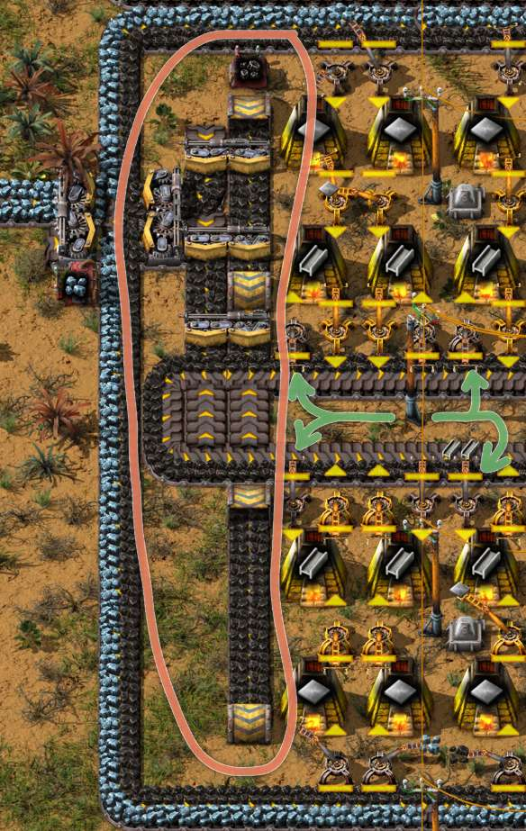

Также можно заметить, что в печи плавящие непосредственно стальные балки загрузка топлива происходит посредством обособленных твёрдотопливных манипуляторов `Burner inserter`, которые не стоит улучшать (зелёные стрелки).

### Альтернативный вариант с раздельной плавкой

Иногда возникает идея разделить плавку железной руды `Iron ore` и стальных балок `Steel plate` и такое возможно сделать. Идея проста, плавим железную руду обычным способом, а выплавленные железные пластины передаём на такую же кузницу где будем уже плавить стальные балки. Но увы, самый лучший чертёж реализующий эту идею будет хуже уже предложенного. Он занимает большее места, которое очень важно в начале игры, а также требует больше предметов на строительство. Чертежи не привожу, только общий скрин для каменных и стальных печей:

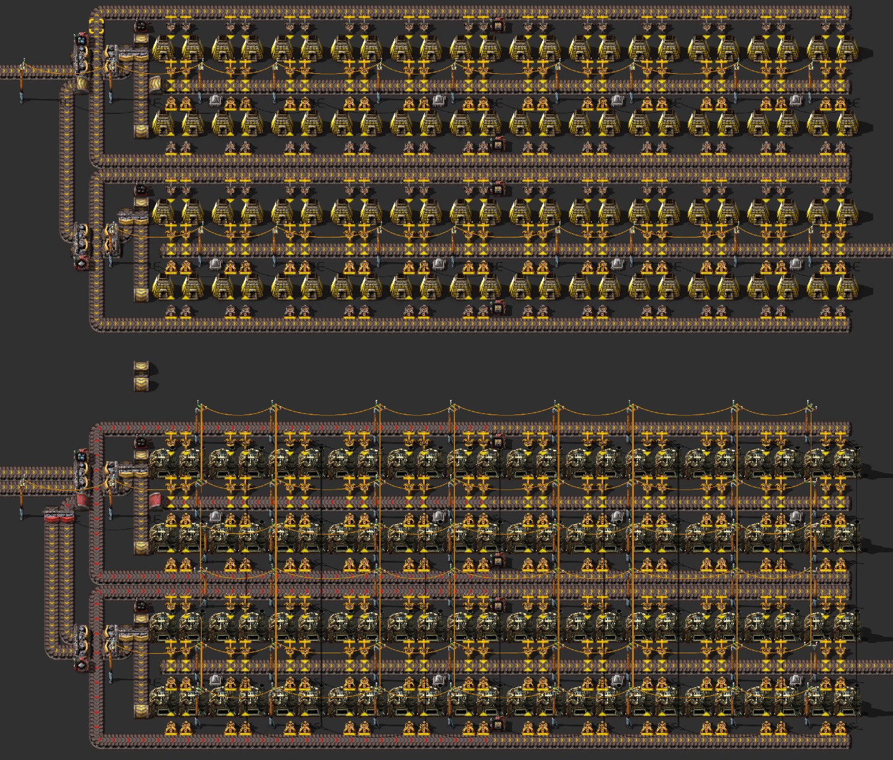

## Плавим камушки

Тут по сложнее, как указывалось выше камни `Stone` не плавятся один к одному, а значить наши твёрдотопливные манипуляторы уже не будут успевать загружать и камни и топливо. Точнее успевают то будут, но и работать также будут постоянно, а это значить что профита нэма. В плане стальных печей, не успевать будут уже и обычные манипуляторы. Потребуются либо быстрые манипуляторы `Fast inserter`, либо бонус вместимости манипулятора `Inserter capacity bonus`, [второго уровня, который даёт +1 всем манипуляторам](https://wiki.factorio.com/Inserter_capacity_bonus_(research)).

:::info Как же поступить?

Да просто забить на эту фигню. До запуска первого спутника камней плавить нужно как кот наплакал. Расчёты даже самой тяжёлой базы на [75 научных пакетов в минуту показывают](https://kirkmcdonald.github.io/calc.html#zip=bZDdasMwDIXfJlf2RZtlYQY/jKaomYj/kOWL7ulnj1JoNnQQ9vnQQfYGCv5ie31MUvzbhKNFTn6ebk0SIPmqRME+bhMrxeqhaY6gnJOtyJSQbAE83M0tJuSdqzKeybvBL4qMEM7kcjVNObDez2Q1cfggf8hiiuSt4X87rKb2E73a4tZlin0kUPWfoEpyd5V+dTUsI6Zvfbg6O5pNYRLktFvJLW3VRtjhmxM9sGQ8SHuyqCvzU6a20H+qPx6Qt+HR0A8=), что нужно плавить менее полтора простого конвейера камней. Причём выплавленные каменные блоки идут только на фиолетовую и военную науку, которые вместе не встречаются, кроме нескольких исследований, не связанных с запуском спутника (квэст: какие это исследования?). То есть, когда этот вопрос начнёт реально заботить, будут и бонусы и электропечи и всё остальное.

:::

Далее привожу чертежи, начнём с самого не нужного, который вы точно никогда не будете использовать:

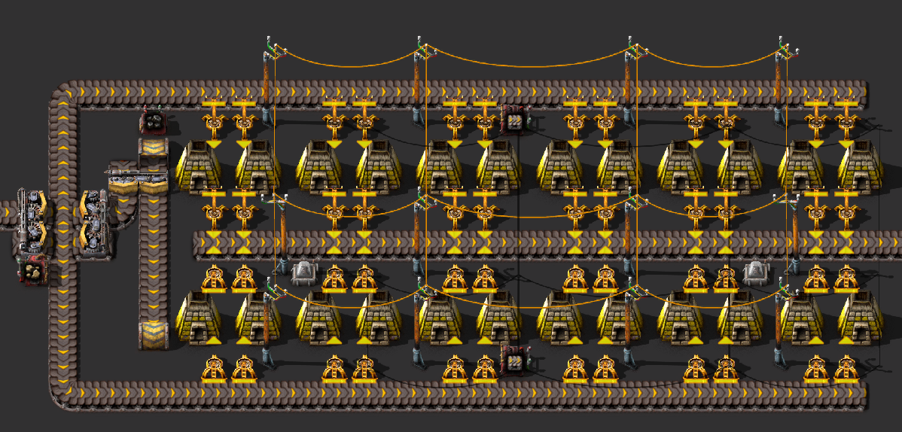

```blueprint
0eNrFnNtu20YQhl9F4FUL0MHOksuDn6Fv0BiBpDAOUZkUKCqoYRgoEvSqF0X7JGlSF21zeAbqjbqU3Ji1dsn5Rxe9SALL4sc9/bvDf4a5CRarbbFuyqoNzm+C58Vm2ZTrtqyr4Dzoft392H3ufj+fPa3OZjTr/u7edh+7T92fM/vX21n3x+6X7sPutf3Ox/6Xn+2n77q77q/ubvdDd9dfFEWz3Zvuvf3Wz7Pu3cxe/Wf3afdm93r3ZvaVeqKixFLsJQfK++7zMeft108r25Kf7tvSU9UTM7y5+7J/m3tnP/7UXz7rfus+2G/133wXhEG5rKtNcP7tTbApL6v5qh+A9npd2J6XbXFlv1HNr/qf2mZebdZ1054tilUb3NpLq+fF98E53YaTF2/auirOXmybar4sBtdq7rWDayL2/RZNufxucGV8exEGRdWWbVkc+rz/4fpZtb1aFI3tiq+3YbCuN+VhRdwEFnUWRXb8w+DaXqTME2Nv8rxsiuXhK/tuPWJrgK1zjB0h7Axjxwg7xdgGYScYO0HYBmOnCDvG2BnCjjB2jrA1xiaFwAmEI8rUoDIJkSaB0iREmwRqkxBxEihOQtRJoDoJkSeB8iREnwTqkxCBEihQQhRKoEI1olACFaoRhRJ6diIKVaBCNaJQBSpUIwpVoEI1olAFKlQjClWgQjWiUAUqVGeyMM6O/q0Ll8twiRsXPahwa8PS5rKp7b+ckCp93Hm7tu6j33rbrrd9UH58O/IE4c4Q6/5OmbPhDyLsnxnaedWeLeurRVnN27qZaHuyb7u9rm3q1bNF8XL+qrQX2W++KFdt0bAeQZa1/eUes+2f1GjwCHLhbPGDsstqUzT2PhMRmm/OYh7ITIIMMBvx6Gw8yHNzNV+tzoqVXRb2gedsXa+KiWDxMBtVUV6+XNTb/eDHFObqwnWjFGiyHm1yxhvFaQnlPBBNgWIF9E2N9S0mdDoGsZ5jOuz0GjsjmWtGYs1vdR+tjLSaJ5BBcOcbSJ5AKJ0EAQKh0e0qTgDSqNTiFN34yDya2+GJdfI2eOzEcDfEmKfAQWDpmyaeAimaAhlAgTS6uxhcgTSxIZokJCKXBA0iwdGNw/AkqLLJkeRJcBAd+0CABNXo9mLgM0olY1Nip5god84HcEip0W3D8CSiJmMGw5OImowZEkAianQjSyB/82ETyFl+20AS61XZevobfREdKQY0ksXeuWcoYxku8+AMq8sPbu7jLicuaCIzc48myQlPeS3OBh3/7yOHC5rJLOKcBc/R0Nsz96lCHwZ8IEKjTx9Io/GwDxSh0ZcPFKPxoA9k0PjAB0rQiMUHStHj0QfK0APbB4IPCA8oU+iR5QMRGugOdnM62n9ODnS/ZP648W2mRfv7cdtdO1EmO4t6r5MBl6XZmC03Mjiv5Qm4QTPbnILbNRObidKCx0PhTN3lorwgD54rueFzPzaPHYY8C8nErng6f/wwtZpfrcezhPt7uFBalNBkDkokymgy4TF40POWYG7AY5+JTUT5V+ZQpKL8KxOeyb0z18q2Son7J0X7J3E+vee5KOHL6w0pJcr4cukExnq81UNKg6EflxuJUtTc0YhFOWou3YiS1Fx6IspSc+kpGIFz5xO1ELncXJRWZ44GVJxCGqWfYD06N7AsPFhdIaXmwnlHLUrlc/sTiXL5XDpqVDJXEBnwwYzLTUTFB9zRSEXVB1x6xozjVDoVx9GgNgV2c12rvJdN77Bn2rnEoWoVhR4cULmKQg8OrcFHe+ZS1BH4pM/lxqJaD+5oGFGxB5cOyRM9OLBCFfTgEFaq9McfZ1ZlhSv98cegi+tYHK3/UsdSVp4yFopI5mEwO6PxKhmKnNvkoOiEXeLhQ8V46YUPZfBKBx8qwcsPfKgUz/b7UBme7vehcjwn7UEhBSY0Puwx4WlZH0rj2VIfKsKTkz6ULDlHzEppI6PHrP0jTkRvd3DbnopSgly6LH3HpeeidzyYdIMm9ZjzaQg1tZlcLbOfmaMRyfxnJj0+wYCOnTadx58jY2SeMbMjicw0ZtJT1N5lLp0MdaOZ3FzmGzNf81Ay45hJP6Hq0rkk9wkRr+uSyF4U4nZG9qYQl46m9pnLJzGoH83kJjLfmDkaqcw3ZtIzmW/MpOcy35j56pSSF7seT+3/WexKzEKdgd3LW5rMuh2KUG4ks8CZExvLLHAm3Zxggcduc7Df3n3uYJrIDHBmb1KZAc6koxVE3PWTo8Y6j5spmQHOfJ2SZAY4k65PMK2d69KflIEKhBR6ZEEVQgo9sjKDOsvMtZOgTjiTm8oca+ZoZDLH2kG/CA8H2vng/xgJg9Xc0uxn39TVZTgr5s3qerYqXtnPwuCVPRkPF2f2yT/XaRbnUZInt7f/APvVLw0=
```

Как говорится, найди два отличия, от тех чертежей, что предлагаются для плавки руды. Ещё один не нужный чертёж:


```bluprint title="Чертёж для плавки камней камней"
0eNrFXNtu20YQ/RWBTy1ABXvjculv6B80RiDbjEuUogSJChoYBnJBn/IQoF/iOnWRNIn7C9QfdWnZshLvUnPGD30xdOGeOTPa2bnsrs+So3pVzhdV0yYHZ8lJuTxeVPO2mjXJQdL9sf69u+7+Ohg9bcYjOer+6S66L93X7uPI/7nw79evuov1a//muvvSf33tX152V92n7sp/ddUP03q0ftt96D6v34+6y5Ef/7H7un67frN+O/pBPBHajrq//ZDP6zd++Ifu+iHOxY89UD/q5smvo+7P/gkP8tpDesSr9Ws/+qN/db151Yu56Il2//pBXnQP3iON1PhGhh/7ymNcepT3Txuv6LtbVW81vWW0ftd9esDnzg6eiR/uB/Z8Pvtn+ucukzSpjmfNMjn4+SxZVqfNpO4t276cl96kVVtO/RPNZNq/ez5ZtuN2MWmW89miHR+VdZuc+/HNSflbciDP070Iy7Ys6/Hz1aKZHJc7YxVp7KzZHaOpY8ZHi+r4152R5vwwTcqmrdqq3Ch+8+bls2Y1PSoXXpVBldNkPltWm0l3lni8sZb6SZYmLz2p4kl23hP7DlHxEZ1HTJOTalEeb55QAXwN4ysI32zx+8nSTpp2fDybHlXNpJ0tgvhi1yJpP6xdzOpnR+UvkxeVH+MffF7VbbkgTb3jmf/yBmbVu77cmXWHIXtnsD0kZA8L4wsIP9/iV82yXHgzhUCF2zPtHEpTFBDNAsZ3EL4UNDvke+wg7z16OZ3U9bisvVi/LIzns7oMQtpv529TVqe/HM1WN9NViVTK/DAkCHb0e+40i8Cefq8JTYChmdzsMznsgiLDiMI+eM+ZJoDohPvWfol7Ibb4S9wNsdVfCdh95ID7eG/UKpXKhDxISZrVxb6Ii3siFgIU7olYDFD3nrgXWxXYwqoyMKDvCCgeCHh0eH+YVFIDvbKU6aKKYt90ycFfcweSZnGH/JpYUFAFgo3FAy1oBrZ7DKwlDSfbh6PAtUgVZjiUG5lKrUJrkdaIXbHwpSHvxiKXzmi2VvtsbRGOYMWSI9hYvNKOpr/cpz/kV1j4MALBxiKHQdNd5YoBH+mDtS5CDmIUydBuX51iEEdz2MJrEEdzWBg1NEdz++oTgziaw4KDydm9ByMjdB0fUkQg711tOa+rNpL29YXcHbFvNDehJsC9i618ErE4Xfik4mR/iX7D8Vv09C5vma3a+arPUB5Kk5E2V7DMvlUj2LtQAFA+BKQBoGwIyABAeggoA4DkEJAlA/lEbQgoB4AGje0AoEFjFwDQkLGtAICGjG3pM9svzkNACgAaMrYF4oWWd4mZ0aTWnqGtRGaLSsDMWHwVia/lL8aasozaRwQQFV7traPZWEVsbEOYBWJjAZkgFwi2jP5+Id65ZPFWJN4KwN72Zml+kmusRx2bC7lBOOYYR8Tvto1SIrbFetNR/XOEI7aW5Q7BNhh2gTWKY/o7xLeEhjg6xLeEwrAV1h6O6o/Esm2PksgR8i2BYWdYozaqP9RkKDCOOaeFSsR2WOcxqn/BaQzSOBaC0xgkYkusMRjTv1CcJhuRo+Y02YjYBmtoRvXPOE02IkfLabIRsXOsyRjV33GabESOBafJRsOWQmBdxpgBpJCc7heVpeK0v6jgGuv/xU1gOA0wKkvEw5wFwS3WAoybAIlVLgNZOvgAz3Y1NA+qmEfv923PclG3+aQo+EVoRimV5M5ZE1iCoUngVXpE+ooFTmSu8d6mDR/EMWDVSCSY4T3TCEG0rCMSzNknkG4lfH+EQiqTSuOCp5Ckwzu/EXMU3/GuJ9P5cGVqIgucEmDBSLOsknhzOqyrQis6IkGNN70jBA37HE5oEm2OsfWb36nMZPg4G1rkEU3CaN9HTJKDVRiRoMO3BSIEC7BMohHUAt9uCBNED2ZQCfLPaYTm6ubAWL8P7edq+Oil1vjGScQkBixtiCbJ8A2ZCEELlh5Egjltsd8plWKLvXb4nlFE14J9mCE0kTanfVJpRXASGQFWNDTLGonvfIXNQT1yAeYnRvOz35wmwfAlWJqEjLnfb+P7/VUT2e6XxoKZLNFMOZh/EmEdP//MQ/lnHs0ZDLoxQNMgE2B2RoSV/JwqZJhNVh4NUpkCEyqiFpp9nvehhP/zPK/MDJjQEQ2UgWkYEdaCyRMRNucnT6FJucnwo0Evc2C+Q9SiALMUGqwV/IQgaJx4SmklmA0QNUBjOBH2ETGceOXGsO8ZUiXwb+5RJfDv7lEl5Oxrd1QJjn3xjiqhYF9kI0rIBfsmG1WCZF9Bo0pQ7DtoVAmafXmMKsGwb49RJWTsq1hUCZZ9F4sqgXeSgAju2JePqBJYN4SI4E6wTjAQwSXreAARXLHOBxDBNWtjnwhuWDv7RPCMtSVPBLesPXkieM7aSieCO9ZWOhG8YO2AB8AP0001drDzz1LSpJ54MP/ZT7PmNB1Nq5OTuhzV5Qv/YZq88HXdZrSTJi9U7kyhbWHPz/8D0gi02A==
```

:::warning Большой варнинг насчёт манипуляторов
Твёрдотопливные манипуляторы не справятся даже в самом простом случае, камней нужно загружать много. Для нормальной работы этого и следующего чертежа нужен бонус вместимости манипулятора второго уровня `Inserter capacity bonus` или быстрее манипуляторы `Fast inserter` загружающие камни в печи.
:::

И наконец, чертёж для плавки камней. До запуска спутника будете использовать его всего один раз:

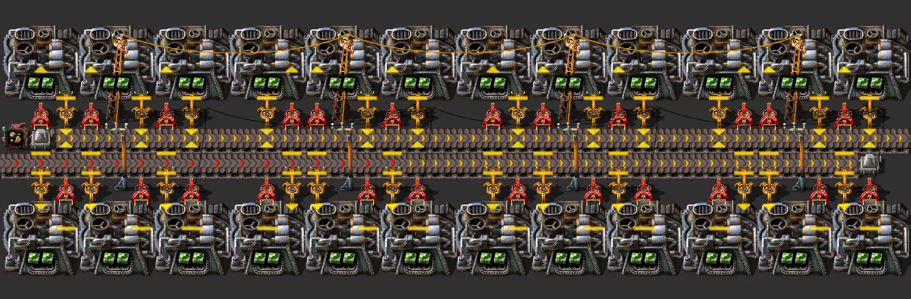

```blueprint
0eNqtW1tu20YU3QrBb9GYFx/jNXQHjRFIMp0QpSiBoowGhovERb+CImi+C3QLblLn0TjqFqgd9VJOTNWlxHuG+TFEiXPOvddz5pCXnAt/kq/SRZkVlX984Z+my2mZLapsXvjHfv1680u9rv869h4VgSe9+u/6ur6tP9cfPPpzTceb5/X15gUdrOvb5uc1fXxT39Qf6xv66aYZVv9RrzdXzVH9Z/1p84p+ufJ+8uSRFl79e/2aAK7om82vNLQZ9Lb+UH/YDvy8+bl+R8M+ezRy3RxuXngEf0vnvdhc0Xm3BL395NHH6yaw+h8aRCz05boJzlMBIa49GvucMN4QyqtHBSX28ktqXzJ7t/mNhl1tXtYf/5fH17wpEhpOA5t4PtE5zXlvvua4ZX93dxId3Xj1exr1dvOcUn7f5LY9gUrij/xsOi+W/vH3F/4ye1KM86b01bNFSjXPqnRGZxTjWXN0Nl5WQVWOi+ViXlbBJM0r/5LGF6fpj/6xvBz1IqR5Oq3KbBqcrcpiPE13hivG8GU1L3bHaO6YYEKkP+yMNJcnIz8tqqzK0rvctwfPHher2SQtKZv9MY/8xXyZ3c3KC5/AAq30UTjyn/nH1hyFDQuFsGx+Tc/OaHR2TtDBbH66ytNANbk2gT9gVBijGM6oIUYZD2c0GKMZzhhijHI4YwQximQ4Y4wxhsMZE4xRDWe0CKOydjijFBhl9A0oJUb5DVYdqTDKb7DsyHbdaZynGhdVMJ3PJlkxruZl52J3vxDEW9bTrGzImjNIbQRSlfP88SR9Oj7PCIGGnWV5lZYsV7s3lel81Vx3yB1HO+mMv13FHphhV+hqb+iqC7tdr5azcZ4H+Xi2OOw4DW4XUrsOZcUyLakch+OL9uC0q0s+L54ET8dUnNPgIKbexfxPzqaLIUHqKbB6WgRbQtiqXSBm6Wm2mgX3ClrM8x7XvqtMkWZPnk7mq+1M1XaUqJMuIon/CyT0L1AKKJNMsDJpBNti2AauTBs9rzIhS0Zt3HtkpCKkChFWhRjBjjHshJd/3Jc/IkRpoBi1QLBDDFvy8jc9+WtIYZhpaEhhGsN2UJiCFKZDnAEzGA1pDzMYDWkPMxjN1J7om3sWNiopDxgVGV+oRlLILrMyiBgFZiVGItiYlRjFKrZIeoptNDydhYWms0GuPwVmJSZEsDErMYgMBWYBBpGhwCzA8GQo+izAWHxmhNDMCCHtYSYTQtrDTCZU8AIl1OEr6ViOpDRdC1ToIFDMb0JIoJjfhJBAMb8JI7wyAqtMzJOS7JFSCNwyKouZTGgRbMxkIsHJfwd1T/6RRGLELCBSCDZmAZHm5R/15W+QGDEriUIEG7OSCFbYTvQshUUxzoCZTARpDzOZCNIeZjIxU3t9DbFYoma1E2mHWTWX0lp3OVUMKRHzkVgj2JiPxIZX6b77ljjE5zLW94qBS1KVYGt9HB98cHqwzZ2wCBK8LXg/uS2rPJbXQ9a7qF2PiwRcCgWVIpEwgcYI1IO+PNDqtV130F16TzSv3LKv3AauhsCqEcIEEiPgPbxoe7n7KoE/vGg7uSyJJAlaijZoXiksTGAhAivwGsVQjSyszrYBzktBwQQxRoDfM7YdYV6NYM1KzC0srNm2U84jYGpW9WjW8u4RZZ/pWFyZmOlYXJmY6UjhIE0BTTspJGpsUh4wNm1POllwgQqwVBpmkCAD/iREJOA/g/ewUdieqS9F5NSEZxYCvrAVFmRInDrcTHDr1OLmgUtcsQIzCil5TyTb1vG+SSKVUz+eWQjt1JBnght00RLqwKIVdr51ISVTjbq30JFTW55Zi9ipL88EZz76EL0lcHj2ITFdKOHUdecVQkmntjsTXOF9DgsWRzs1zJnxG6eOORPcoQkUgcWJnLrpzPhjp3Y6EzzhddpMnz6V5QH1mgryLs5OXLx0tXRqzTPBHVSItdPkzos6PN/a6Rx3+Fbc+QKG1MapQc+sUujUoWeCOzweAe93dMyb6LJ3oie8N3V3Ikz2QVmnXjyvpka47WSRjYu5vuFtpNtmlmGkym0/yzBS7balZRipcdvVMow0dNvYMow0ctvbMow0dtveMow0cdvhMozUuu1xGUQaCrddLsNIpds+Fz7pyd1JRNBuYh35+ZgWcvruO/KzkZePq9TL03P6auSfp+Xybt1OaMpZFSfG6shGl5f/AhuHhH4=
```

На этом плавка топливом заканчивается и переходим к электричеству, которое экологически чистое, если модулей в печи понапихать соответствующих.

## После запуска первого спутника

Тут наступает наконец-то эпоха липестричества. Все имеющиеся стальные (каменные надеюсь уже заменены) печи заменяем на липестрические `Electric furnace` и вставляем по два модуля эффективности второго уровня в каждую печь `Efficiency module 2`. Поскольку для электрических печей не нужно топливо, подачу ресурсов и выгрузку переплавленного можно организовать внутри кузницы. По синей стрелке на рисунке ресурсы подаются, по красной выгружаются плиты.


```blueprint
0eNqtW1tu20YU3QrBb8mYOw8+vIbuoDECWaYdAhQpUJTRwHCRuuiXURTNd4FuwW3j1G0e3cJoRx1GSakmlHjP0DBgQybn3DuXc+bMHHGuwtNinS3rvGzC46vwLFvN63zZ5FUZHof25eYH+96+Og6elNOAgs2Lzff2lb0L7Lv21+vNz/bN5sbd8Tawf7s/7+zv9t7+Ze83L+x928T+at9vbtpP9jd360/uyk3wbaCPksD+Yl/aO3fxJtj86Fq2bf6wD/YhcLfe2z8D+7YN7QK+aTEDd4GOZLD5bueCA3xrH56ULs/bj5luE/2U2ua2bflZaoH9Z5uh+/vG3rkLbYR37ue9u3vbx83tkzKchPm8Klfh8ddX4Sq/KGdFW6Lm+TJztcmbbOHuKGeL9lNTz8rVsqqb6WlWNOG1a1qeZd+Ex3Q9GWycFdm8qfP59Hxdl7N5ttNcMprndVVOq3q3meI2WxazZrehvj6ZhFnZ5E2ebTv+4cPzp+V6cZrVrj/7s56Ey2qVb4fOVejApkqpIzMJn7uEkiPTRnEZrNqr2fm5a51fOujpojpbF9lUtr1t8/4sosQiivERFRRRxuMjaiyiHh/RYBFpfMQIikjJ+IgxFtGMj5hgEeX4iCkUUaTjI5LAQkaPEBKbdcQjzDqETTviEaYd6uadVnaaWdlM59XiNC9nTVX3TnafJgJNH6Ke5XUbrL3Dsc2BNHVVPD3Nns0uc4fgmp3nRZPVLEmbV8tlVn8Slnm1blcIBAnbrjJ9ASBhjfoCQl2f9BZS79PlvhrKvTWUfdjdxJmXq6x21TyM6gZGb47ddFhU5cX02cx16Wx6EFPtYv4vU90XIUaqILAqJAg2YdjdlLbIzvL1YvofAZdVcVj0P1amzPKLZ6fV+sNAV8kkoZO+hYXgPUoaeJSSgGLIBCqGlAh2imErVv+7jPf1X8NDucuUNZSlQaoQYVWIEOwYw47xysRYZRAiSo1lnyLYBsJWPO51Ge8ZewriHjbVK4h7CsNmcm9IRpQH9zAZURD3MBlREPcwGVEe3BNYZRJYqCQdEConfIYmJESfWCmEjISJjBYINiYymuDHQAn0GLRkUYnSASpphVQBExmNrEgJExmNEJQwCdAIQQmTAI0TlDQ2MhLeyDBDIwPiHiYyBuIeJjKG4AmK5OGVdCwmRKpvgjJMGqqBYhuIhpjeGIiGmN4Y3saQxFD/8Y0hEUQLg2wMBSYlBlmPCkxKTApXRmD7jAgho8AkIEJWqgKTgIjHvS7jPWMvQrgnMCmJEO4JTEoiHvfE0G4iwrknDDbCIO5hUhJB3MOkJPLgnoQqEwtYrIQ6IFbtUlrJPqWKISZiChMje0aBKUzM2zOKIYWJ8T2jwBQmBpakMsVUIEaWpJ1BLlnY+JK0M3oVqzK8JWln9ao9zzD1srhZVUgQFewy5WF33FstZkWBeLuqb8vcR/BE4o+RoMeYKC9vnVci7eWt87ANbookWGUinrGVDgzwJPYy1XlVSLxMdR52yut/PND/VHhZ3qwcU/KyvHnYOPc6k5c1wlLlZXnzstdeljcP24N7mLikTO4NiUsae5nqvCokXqY6D5vJPTHQfxICVSlJB1RKJSe9UcjLWWeVgoT0staZ4LyVKCWDhcaXopRCnCBhvIxzZiEiL+ecCR57GdJM8MTLkWaC84hIemh87LxrxB4fBhsfRF72Oa8QJL38cya4QmcpkgdmKdP7kgSRB0UV+AiMl7/OrFLkZbAzwT2+wxBgcZhfYtAgl1IvY51XCCm8nHUmOPGMj6E9BUFv0whQC6Tysr6Z4B6eTYQNNOglGwHKDfSWjQDlxuM1G6HB4vBYKMzgEEy9LHZeIZTw8tiZ4EwWyqES7LxXw9QtoQ7oVtz7vgQp5eW0M2uhvax2Jji+URSgqCjeTlEMioqKvfxuZiESv8Mm2ox4Bzv1O24yJqYWfgdORsUkvyMno2JKv0Mno2Iqv2Mno2Jqv4Mno2Iav6Mno2JGfodPRsWM/U6fjIqZ+B0/GRUz9Tt/wo55sr3J4XcHQCdhMXOTt/vfV054JkF78CIoskv3r0l4mdWr7VyduKeQyjjRqYrS6Pr6X5GZHTk=
```

И для плавки стальных балок `Steel plate` из одного конвейера руды `Transport belt`:

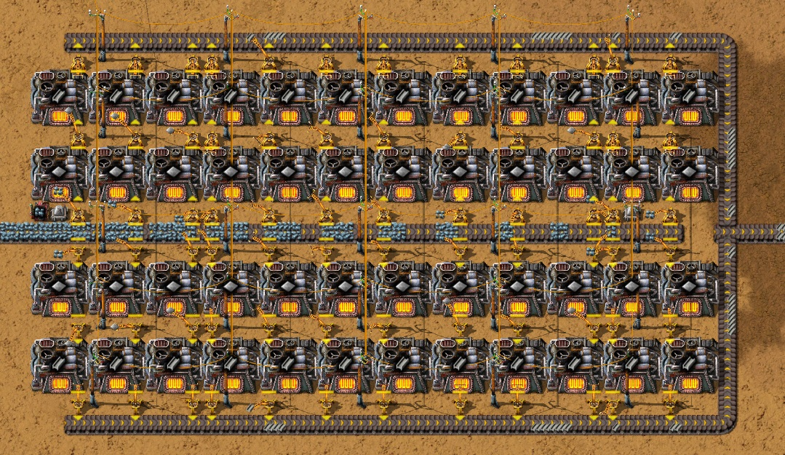

```blueprint
0eNqtXe1uGzcWfZXB/B4F/BiSQz9D32AbFLIzSQeQR4Y0DjYIvOim6K+0WGx/F+grpB9u0+ajrzB6o+VoUsnwkvY9l0aABLI0h5eXPAwPea78sjxdXbYXm64fypOX5ZN2e7bpLoZu3Zcn5fj97pvx4/jrSfF5vyhksftq9/X46/imGD9Mf/22++/4bvcqfOJ9Mf4Z/vkw/jxej3+M17uvxuvpkfHH8ePu1fRq/Cl89D/hnVfFvwr/SBfjD+P345vw5qti9114cnrml/Ht+LYIH70efy/G91PTocF3E2YR3lCPVLH79403AuD78e3nfYjz9adI50D/Dm33enryVmjF+NccYfj33fgmvDG18CH8+Rg+Pfdx97oYfw6Nhd69CUDfjh8C1PUUWngZAEOjZVV2Z+t+W57842W57Z71y9WUweHFRRtS1w3tefhEvzyfXg2bZb+9WG+GxWm7Gsqr8Gj/pP1neSKvqnsfblft2bDpzhZPLzf98qy98bgiPN5t1v1ivbn5mCY8th3adrW4WC2Hm0/WV4+rsu2Hbujauef7Fy++6C/PT9tN6FCqz1V5sd5288R6WQaohdb6kanKF+WJcY9MaONJtwk93X9i37Fb0AqBVhC0RqAlBF0j0AKCNgC08hC0RaAbCNoh0A6CbhBoC0F7BNpA0FIg2DWGjfBRYXyUCCEVRkiJMFJhjJQIJRVGSYlwUmKclAgpJUZKibBSYqyUCC0lRkuJ8FJivFQILyXGS4XwUoL/TyK8lBgvFcJLifFSIbyUGC8VwkuB8VIhvBQYLxXCS4HxUiG8FBgvFcJLgfFSI7wUGC81wkuB8VIjvBTgBhbhpcB4qRFeCoyXGuCl8mle1jFsm5ZQsc333zPFij36JIe207vt06dTM88D9uJ8/eRy1S7U1JtYkw5rUj5Ak0cWd/223Qzhh3dqrYaUuyN/t+fL1Wpx6M7FetXerbjmBvq2e/bl6fpyM8nE2lROPY6pI0GLXkDR1xIahoOAyRiGWmFNmgdoUpNyd9RQtNzVNFSLoRp0Ph1FVGQ+helpROWa6JTCaH8QJjkj4Wg5wzhYN1BHDmoipyOe1hGMjkagg39UL/HFxNiq0bHBNxjzD2ojI2dGkXImMRoajXVEP0BHaMyX2Cw2BuuIeICOWHi+yTvmW5i+VlaNj843GvMlSBiM+Yd9f07OaMwX2LJvBdaRB9iCWYkO/lEixAbfVr6Ojbyl0V4YLGEY7cUDbCAtjfZCYR3hbew9CduysGlxOw62lSTshoUtSNieKXZq9sRxgil2MpqUmNixipI7p9hi51MDtzenrqmksbFlw2lM8BB7UDMFT8ZQGKbgyWjSYoKHmDuHCR4iasMWPLE5tRfQYc9bSRvV0c4zRQ9/NBqBiR5a3hrJFD0ZHVGY6CF2RLNFT2wC7OVu2ISGCeBiE6CpmcInI28GEz7EvFmm8MnoiMOED7EjDVP4ZHTEs4VPdM5NKjtsfyvpoltgLzDxQ8ubl0zxw8+bV5j4IXZEM8VPRkdqtviJTYC97A2jH5W+3mACiJg0yxRAGUlzmAAidoS32dckbM/CJsUthWCBGxq4ZIHXNHDIIXaYl0STDuQRq0HwI28nS+Gw7IfF2fr8tOuXw3pzd/j2dguBQQFk2KxXX5y2Xy6fdwEhPPa0W4WZTbIr3rQMnq0vJ2uovGFZfHwV7cPtI/7V8vzi7uRMoUehLMdFSM214/gIqeDgbdz/j158ZnuOQZEYM+Q/OwpTIrgE9S4tIZj3zIMxa477kQpec/yPVHDDcUBSwVH5TRxKVH8TYRuOY5OaCs+xbBLBId+ZAlc/yHimwNVPKfBIgDaUimUGpcbMcoNSwQ14tEBMiOW4TKkxO47NlArecHymVHDPMZoSwbUATztoQwkZziS4TEGOMwkuU5DlTILLFOQ5k+AypQ143kMcSsvxxlJjdhxzLBW8AQ9yiAnxHNMtMeZacFy3VHDJsd1SwRXHd0sF1+BRFm0o65rj56XGbDiGXiq4JcpSca8sJdq8hAFz23A8x9Tue47pmAhuBHhyRkuI4R0SEWNWLHBi5Jp3C+/49g1pat41fFabBjzmaBKUwq1axxOZiFvHqemCtJJxs5YkurWOhxHJsBvefXtWzj3vwj2nTStAyZ9KmJWgyE8CKf69emzC7I0a06VqJb2JThrQknXQzFl5r0EhnUyX4V2nZwVvQdGbDN7xr9AjYz27J6bLzEoJER/rhneLnpUuDwrLVLpAP9ZB3uQETzRkyXsnqlO82/Ks4DUoe5LB1/x799hE9fOC5HyYqFEXmQTdVweJkpUuC0qLZLoc72I8K/gG3Lsng/f8K/bIWM/uikpJGR3nRvCuw3NS1UhwV59KVcPbavsUnGbBJaOrOXBOpuBYhuf9OEXhmMWLrs4YeGb1Ylab4IWpU6mE8SsWXcT6st8VelMpFfVbSg8WLibj9sxaxZyke2axYlabYLViOmFggWIaiF+TGJ0xs/Cc9paV0nV81jBrE7MSDxYnpvPFrEfMCh4sSEwFrwS/BjE+2G5eHoStVB0tRVSCWYuYkS8lwGLEdL6Y9YdZwYMFiOngmTWHWcHziw6jE2xWqdPGsFKmjk8wsPgwnS9mvWFWvsCCw2TwklljmBO85BcZxgfbzyuJja8kEqw1TOeKWV6YlSuwvjAdPG+HrVNwrCrCdHSswkFnUnAs+/B+nKJwnuOodMTvmxIcRyUVHCz5c4nbO6X4VX7ORjg7bfXi2zylWN8nSU0I6xslqeAGlDXJbFuOQZMapeMYNKngDcegSQX3HIMmEVyDtzXJwdPgbU0aSHFMmNTuao4Jkwpe88VhbLWYjxKSWkEbjueT2hfL8XxSwVF5mZwrDcflSY3Sc1yeRHDil1ipexdNyHYkwUUTsh1JcNGs+dWuMbp8OkNJKh/IjiTBNRqyI0lwja4tKNCTc8VxjKPUKBuOcZQK7jnGUSK4ERzjKBUcvO1MDp5RHKsoNUrNsYpSwflXnXGi78/PksqXaDSS9y6txnK8qNSkOI4XlQrecLyoVHDP8aISwYnuIXHvNtJKjvuUGqXiuE+p4Jp/UBSjyx2ngdTvcTL3Zttw/KjUhFiOH5UKDlZyp1PQcL5Olxql53yfLhHcsaq39+BROJYVd87r4/nAMDx6/BUzVblahsfDzz5b98+qYvr1IsWqfR5+VJXP28127lkja+eVa2qvrbdXV/8Dql9LAQ==
```

Тут мы нарываемся на проблему связанную с лукавым которую рассматривали выше. Поэтому выплавлять стальные балки электрическими печами лучше по пять к ряду, например так:

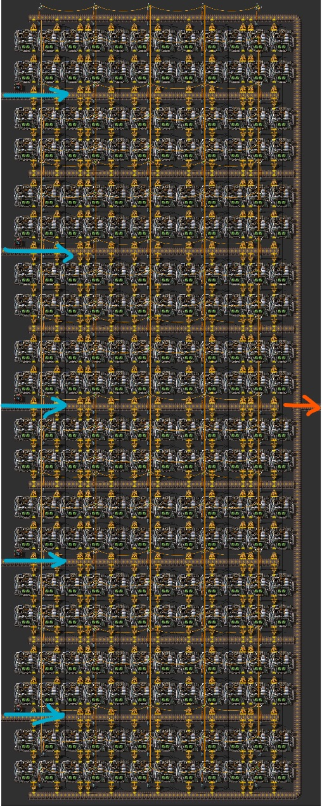

Откровенно говоря, дизайн электрических печей не айс, там ещё деревянные опоры ЛЭП `Small electric pole` присутствуют. Их менять придётся на средние опоры `Medium electric pole` для массового производства, хотя с древесиной обычно проблем не бывает. А ещё по размеру электрические печи не совместимы с предыдущими... В общем проблем с обновлением будет, планируйте заранее как будете обновляться, ещё до начала игры. Но это самый маленький и удаленький из возможных чертежей, остальные хуже по площади, а размеры уже имеют значение, особенно когда нужно сто-пятьсот таких полос построить.

Чертёж второго уровня для плавки одного быстрого конвейера `Fast transport belt`:

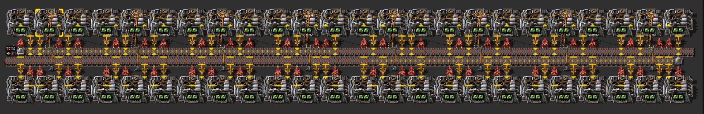

```blueprint
0eNqtnd9uG7sRxl/F0LUULLnDf36GvkFjHMj2OhEgS4IsBw0CF6cpehUUBc51gb5C2p4AJ02TvsL6jUrFp/UqWWvnt7s3cWR5+ZFDfvNxuEPyzeR8eVtttovVbnL6ZnJZ3VxsF5vdYr2anE7qn+7/VH+pfz49eb6anZiT+x/v/1j/XL8/qT/v//nX/Y/1+/s/5A9f6n/nj/nH5/of9Yf6Y/0hf/Vh/1D9t/rL/dv9p/rv9af7v+Rv3p78/sQ8cyf1X+uf8vNv8y/u/5yf3D/zz/qX+pfnqwz87lfoB+RHrPt39cfvsE7q/zxA5p+f6vf5i0/5/5+/1uzjr9W+f/d8NZlOFhfr1c3k9LdvJjeLF6v5ct/q3etNlZu72FXX+S9W8+v9p6v5zW62285XN5v1djc7r5a7yV1+fnVZ/W5yau6mnSVUy+pit11czK5ut6v5RdV43CoeX2zXq9l623ys1D62Wc53zQfl7mw6qVa7xW5RPbT+64fXP6xur8+rbW7P07WeTjbrm8XDkHgzyYXNrLHP3HTyOv/XuPTM7XFyHW7231dXV/n5xatc+Ox6fXm7rGZ23959zb/BtAizSGNglgzTj4EpDLMcA9MxzGIMTE8wTQpjYAaGKWNgRoZpxsBMCDPGMTBNwUDdKKCGgY7iiQxyRSaM4opMyUBH8UVGGOgozsg4BjqKNzLMHflR3JFh/siP4o8Mc0h+FIdkmEdyo3gkyzySG8UjWeaR3DhzI+aRZBSPZJlHklE8kmUeSUbxSPbRI91cz5fL2XJ+vema6ebmtpb16GiW69WL2ct5nnNfzharm2q7y3/QUWr42ojLxXZf9/3fSBvGo1/Zxy+7+Wo3u1hfny9W8926HaI8rPgBRK5xLma3XS9/OK9ezl8tchn5wavFMldYFR1drDebavu/8ORifbuPHw0Kj5rxzXcFWBzpfFdEeXfW2l2P3vKb6K7NisURK9q20h/d4tEBUBwOgLZIpSD1NLCepdHV03TX04J6FpHWs8TkamKoyFUKaUGiLXh0NdfV5eL2evZ/N7dZLztD3YcWrKrFi5fn69uv5JQwNd6etWF50hJPWxJ4X3jaF4SdRaAt0LGzWe4To14IOwuB9RRDSne0dMv7kQqWlDpLl92WRuy01BaOlF7S0r3OCt1eVgL3IsVRL5L9kndTE1ybIxFEQyqSkkjpVNpcQYe3SQkOb6eST5NiZ8c6IJ8H5elsUZLSqbQ54ZYO1NKOtIBKmvOkdCo3LuhGiXSPkkjqSeXGJVI6lRvfg48lHCVeyUfbaWmP+EjlxiM+UrnxPfhYUEvj6ezBCnj7dDbEabZlmxB5RFAqRD6Q0qkQ+Yi7I9LYxatmtCamzoEfwIz2oJ4qWwRDSqdCFAhpIxWJQEgbqUgE0fWg6+5Bx8ebwPEWCB8jFaJA+BipEIWIXVe0R11XdoYpTHOU2+a6gpKa3SFQRNSkmhQRNakmRcsHJdWkWHIMQzGEWIkKUSSz3EiFKKrC0IPXmk+NxHA0P6atUKoUMWIIKhcx4fES6EJWKnAzqC4lgyGoOCXO3kAlJZW60dktgEmwQahCJYchqEwlJVu7Y5mEF40OXvi3CN5+om6KqbWhTfESpy4Vq5QwBFUsU/CANVDJMoUuYg3dS4OmsNgmBbZJiTEMxsD09RFjYP76hDHwC2HjPR4/urUlHxTjB9PWe2wTzFtPtco08tW07s7LUXeXHaixaWqlOGsF1HHYdyuXMZjDXrB9MIe9wxh8CcrTxT7TyCc7WrBV2N1jm1hsEzxp9lizDF9r8gbbnZMYC43F82aPhcbqeOu6394Yi3nrsGZZzFuHNcty3jr6KsdYHW+dV9gd89ZhzbKYtw5rluW8dYLtnrAwOndUGPdaa8ROrYutylhiFjssZyUOfx2Ws5LHv46mSphSFwC77oVCU+IptMNyVuIptMNyVnJ6Y6UpOb2x0pSc3hLx+NEtNEv38p4RzFvBciaYt4LlrJHipPV44o97vH0cEFrfURpdspMRRSwmmMCCdU0wgQXrmvAYWLCuSeAgDoPg6FiwlAmeWAuWskZa1FEDKVTGcQZjlXF4Yi1YZZwuSbGZrS9PmYTy9qBUp6uuwxglxuixmaE4NE83pVzADSlwQyJviMENSbghhjbEF7oc0tg9SD3l7UGpyurab3bWoGx3actTbdVcX+K2JNwW0ZneK0yPudssVVldzt1mprtuyHvM3SaGsiERYwjGwNRt5tnrMIKSugp9aeRPqfu2pH0bLLYJFrHAeYtFLAg3Fvb9wWFHVxx1dNL6TtUEjw2GxTJwUmMda2RfaVPxnyQDz99IkfZvxKFwwmIZ8UQ6YRFrJGBpE/OfsnvEC9EJi1jEAXDC+hJ5omQzp145fvASVsIixtOxEhaxqORtqRg/PXhrqd154lXCIsYzrxIWsUQn0gcJ6tKWrNqqL8r0q1R09y/Pv0pYqngCVsJSpczAioqQK/ElqpjwkMdLVBFLFU+8ilSqbIGpGz3GwNSNAWPoJDdK5/ixRY/UZgfHj+WJV1GwTTBvo8MYnrrMaI+6zND6dtMWPUhd4k7hpLbYYJzUVMes0a07x259scp8q2gUReHl5VjgluPpcjQYg+dtBKov1rghWf/Khvghaf9KDF3OZPCK8ROHpPcrq5uG5PfrMCzZWhSwR7Zkb1HAomJ1QhsUQmu50AYstJZsIgrY1VqyiyhgteAHXR2AKE0UqIaH8qiGp9ZlNUuOgTrIZVfaimypD1haSp2oBoWolob3Kl0steSQqIOMe6U5yA5dj7WJHBB1kLeuLJ7Q1mMZKXtsRwi4g5XbERTSSo6AOshQV5qDMNNjSWpkUCn9l5ej/suY1s0HVjhvPRYsQbzFgiWIt1iwpMdmBCxYotyM0L0+aoVsrvdYk4TsrvdYk0S3UOwV0Rk5IOog2V1XU0cmvQ7LhePMdPT1lEXnRjmsSejgKIc1qcfJUc5jEym3G3S/+bLonCiHNckRZjqsSY1cKKUmOXdck2xq1SSny0R2injMI45i5fEkMHVYebwuMHVWYQgemDq82OjJDNdh5fFkhuuw8qBDogTLBTolSrBc9DgmSvASnvKcKOl+pWXRQVGClQedFCVYeQJ+rSr+uC+U1k0BNnDeCg67AuGtYF0KhLeCdSno3rOKQi6CLv4Upygq6s6GP0g4d08VxlMeBHvvWPS+vcn2P0I/mt73Nw1Btb1vcBqCWva+w2kIqvS+xWkIqut9j9MQVN/7JqchqKH3XU5DUGPv25yGoKbe1zkNQE1F7/uchqCa3hc6DUG1vW90GoJa9r7SaQiq9L7TaQiq632p0xBU3/tWpyGoofe1TkNQY+97nYagpt4XO/VHLYui981OQ1BN76udhqDa3nc7DUEte1/upEU9e/ijjPB4k+10spznMCX/7jd50j092d8RdLKsXuVfTSevqu3NQ0wSc8SV8nxfUumTv7v7L0hVXAY=
```

Отметим также, что не все линии нужно делать на быстрых конвейерах. Вспоминаем как мы обновлялись на стальные печи, тут усё то же самое, простые конвейеры прилагаются.

И самый последний чертёж третьего уровня, для плавки одного экспресс-конвейера `Express transport belt`:


```blueprint
0eNqtnVuOW8cRhrdC8Jlj9P2iNWQHsWDMhbIJcMgBhyNYEBQ4DvJkBAb8HCBbcGIrkePI2QJnRznUKMMD+wy7vuKBAVvykF1V/6m//m6ypuv19GJ5N7/ZLFbb6bPX06v57eVmcbNdrFfTZ9Pdd/d/3v2y+/HZ5NPV2cRO7r+6/9Pux933k9377l/3f9y96/7wdvefye7f3cve7/7R/eWn3dv7r3Zv92/Y/W33y/3X+7/t/r77+f7b7idfT/4wCZ+Yye6vu+9233c//Hpy/5f9It2rfuiWe/fpqjP6zUezH60+2Hm3++k3dia7/z6Y6/778+777gc/d39+3/3zS/fqB3fvv/m/Lx8W+efjC95Odv/q3vND97Jvuz+9//CDd3vXp7Pp4nK9up0++/3r6e3i89X5cg/O9tXNvENlsZ1fd69YnV/v/zb/8mYzv709227OV7c368327GK+3E7fdEusruZfTp/ZN7P2Isv55XazuDx7cbdZnV/Oe293grcvNuvV2XrTf5uXvu1meb7tvzG8eT6bzlfbxXYxfwDgw19efba6u76Yb7p4nvZ6Nr1Z3y4ekuf1tFvszPv0SZxNX02flfpJ3FvpPLjd/3T+4kX37sXLbumz6/XV3XJ+5vbR7v3+lUXHLPrTLXpm0ZxuMSCLLp9uMTKL4XSLiVm0p1vMyKItp1sszGI83WJlFt3pFq1BJk0dwSSrOmaEqmNZ2TEjlB3L6o4Zoe5YVHhcHaHw2MhMjlB5bGImRyg9FtUeV0aoPbYwkyMUH1uZyRGqj0PVx+URqo+zzOQYex7HTI5QfZxnJkeoPo5VnzRC9XGs+qQRqo9j1SeNUH0cqz5xhOrjWPWJI1Qfx6pPHKH6eFZ9wgjVx7PqE0aoPp5VnzDGkYtVnzBC9fGs+vgRqo9n1cePUH08qz5+hOrjD9VnuV59fvbF+epqfnW2WN3ON9vuBcc+J9jvvTqzV4vN3tr+FWHIwqHYHF019lcdWqfK1gmNdcKhLFzPrxZ312ePWN+sl8c/p/gY8Wq++PyLi/XdZv+pS8gz7+vzIUuWY+sQtsHJMLEtTDz31DBPg8jTx09LnvQ0Yk8dy9eQZJ628jVknGcuHMszM4th5sNwqhUOi2ewyOjnXAOWaLinFnkarcjTx4+QnvTUYU9tZp56maep5WnAqWbj8ZKW7MzHwVSLnIE2MFhkDLS+BQvXNsvqb5Rp2+PHak96WrGnpiBPk5F52qq/yeJUM+lIqnWpm8rMp8FUS5yBJjJYuPAZlsxJJnymlcyJ084wiU4i2rnaSuaUZeu06m8qNNUOn3kOpVqXujnOfB5ONcxAV9m+IhsZLK19RbbcU5ay2ck8be0qs+eespTNInK50krZHHGqlXIs1cqsuJkvg6mWE4alsH1FljGwtPYVuXBPWf3NVeZpa1dZDPeU7SqLlXlqWp46nGq5Hkm1LnVLJ6B1MNUKZ2Bm+4oiY2Bu7StK5J6y+ltk8pZbQlwy95TtKgsXvmyOpEiXcjXNgimDKSJjYG4V+8oZmFiqVS58qTILMuFLrWSunHaJSXSV0S616maNsnVapKgJp2yyx1K2zKzxs2AHy1rlFExsY1FFBzsXWxuLyreVkbHCGtm+Mrb2ldZwfsUAfZURLPqmrx7nW3RH8q3LX2vNLLjBfLMmcGgshEbGxGia0PDtZajQV9n+MqSmr3yDGSL0VaZvofW1gbX4e4PDl21DKbfPYWvzLAx/eWAtp2Ng+wxrZXQMtokNF7xgoK8yxfO56SvfacJvvKyVbTWbX3lZi79DcP7Ydwgfalx4It84F72HuHA1hF+IWSdTw+Y3YrbXSLTvL9+er7Znl+vri8XqfLse/kbsMfXcr13t8qFbZLtZLz+7mH9x/nLRrdC97cVi2fkn6l3v941fru/2vwJgUd/65frmZr55cgmHm9B/s4R/83wYSdfqwD8Kpv81mG7QiNcYSdDIoQYJFo9PpsPw4lETQYQRJBJBgBFkTQQBRlBIBB5GUDUReBZBry9JsLhjEfQ7kOQROBiBIxEYGIGKyQZGgJhsYQQqJlsYAWGyKzACDZMPRoQRECa7CiPQMPlgRBZBIEw+tKHIIggaJjuoaEGjzQ5qc6+7iCwuhCloIoCi0+s6IosLI0iaCKDw97qRyOLCCBCToaIFFZOhokXEZLiriComw11FVDEZymZETIbCH4kmO6jJUaPJDmpyJJpsoSZHjSZbqMmRMNlCTY4aJluoyb1GJ2AEymavC4osLoMpkd21hXKZNLtrCwU/aTTZQk1ORJMt1OSEmAzlMqmYDAU/ISZDTU4qJkNNziomQ9nMiMlQ+DNiMpTLrGIyFPxMNNlCTc4aTbZQkzNhsoGanDVMNlCTM2GygZqcNUw2UJOLhskGanIhTDZQk4tmd22gbBayuzZQ+ItGkw3U5EI02UBNLojJUJOLislQk3uNXcAIlM1eQ9eL89utxAKUtaqiMxTmXreXNAy4iakqTkMB7bWCScOA+4BeK5jUAtTpqtFpA3W610EmC6P3CwTCMLLegjCGgi1Aua5Vb0EUg+u1k0ktJGjBYgtM61yvzQxbEMbg9SgJYwjYQoQxRL0FYQyc0wFayHoLQpQ4px20UPUWZChZzmkPLVi9BRlKlnPaQAuc0xZaCPoYhM8h6mMQWsCcLgWilPUWhDFgTpcKLVS9BRlKDnO6QJ12Vm9BhpLDnC5wJ+C83oIQJczpAjXOYU4XqNMu6WMQopT1MQgtcE5DnXZVb0H2HDznNNRpb/UWZCh5zmmo097rLQhR4pyGKuqj3oIQJczpDHXaZ70FIUqY0xnqtK96CzKUAuZ0hioarN6CMAbM6Qx1Oni9BWEMmNMZalzAnM5Q40LSxyB8Dlkfg9AC5zTU6cA5DTUuGn0MMpSi1ccgtMA5DVU0er0F4XPgnIYqGqPeghAlzOkEFShiTieo07HoLQhjqHqUZDFo+sZcglKdrMYI1NKEmZ2glibM7AR3HJoOst4dCkKgosYI1LvE+Q33HYnzG+47UtEABSVP01PWu5hCZiSDPu9eBDKYSC9Zz3Ph4k4DD5RsTU9Z7yIPoZFAYIJbghzJ4nA3kBW/qdG7z0MIT9YYgWpHesp6EQhhqmRxuJvR9JJ1mywGT9HodIQ6XRyBCQoo6SXreS5cXKPOEapz0ahzhOpMesp6EQhhymRxqMmaXrLeHThCeDSaHKEmV6LJEcpmJZocoeBrOsh6N/gI4dFocoSaXIkmR6jJlWhyhJpcNZocoCZXjSYHqMmVaHKAmlyJJgemyd5oNDkwTfZGo8khQyNEk0OCMBFNDhkurtHkECA8Gk0OERohmhwChIlocohwcY0mBwfh0WhyYJrsLdHkwGTTW6LJwcPFNZocDIRHo8nBQiNEk4OBMBFNDhYurtFkXyA8Gk32FRohmuwLhIlosoea7DSa7KFcOo0meyj8jmgyvNLLO6LJ8FIy7zSaDG/d8pp7wxy8nMyTe8McvNLLO6LJ8MYz7zSaDG/d8pp7wxy8nMyTe8McvNLLe6LJ8MYz7zWaDO8N85p7wxy82suzOYS9CwbTCdMWo2zI26Ot8MQAPTZesHev3SnOK+YLxn4g7fmCns8+O1QooYkDv2+vz5dLMjIwDI1yez4441I2o+lA7acedGAj2A9MO+FBBz6r6UA+2VMIsnFph3CexIex+HAl2Sn4KAYXZoiPcHJhs1CEzPAJY+CjmGAIC0XALHbhGIvzIIujYeDZEcATjjx0vvXkFTMPnWNPQTj00Nmmr4zFh6uwTgFaMfywQHyYSh/uBTolrCybuJibz4Sz2CaID2axjUdYHMMgi4XzEm1oIZKYFh8uSTrhcSrmJlrPnkISji5t7lUSY/Hh6plT8FHMUqwQH5kWm9LEh2mxGePEkTiLDdyrJMxik46wONlBFmemxWaME0+WabFpVg7ZGMbeJTRPLqQYcgrLQYYsHuPEkWXnYtM8DmSkuL27Ik5xno+wqnAjoZjeWGGVy5TFPfCGWDw4oc4X4eTU5rmmWPagxzjXFMefAjzXFC/Dp1lxSmD4jHF0UQx+rPBzA+Hkx9osFAVpce9aglPwUcxghSwumMWlHGFxjoMsroaBN8a5pgqHtjbPNZWzuMBzTZWxuDTlvjIWlzFOHJWzuMDPDSpT6TzGQaEKByk3P6uoChYbiA9mca5HWFzcEIuDcNpkbp1rgmFanEc41wTDWZzZuSYYGYtzauLDWJz9GPjIZlBm13Sez6DMHgLNtDibMfApmGLmGMXKMMX4lLzMdkTBMi1OI5x4gpVpcWpWDuHUylSbCynGNMNyYBmLUxgDaOFM59DEhylusmM4rxjt7OAz4VqcYHGyWIuTPVIoahosFMJZl6l1rgmOaXEc4VwTHNfiyM41wcm0ODYrjmMsjnEMfPiOOkaIj+xcHJuFwjEtjm4MfDiLI2SxwyyO7giLrfGDNPZMjMMIB5vgZWIcWweb4BU0Zgeb4GU0Dk29Z81bvV/vOAVoTuOQID5MpsMYJwUvnAAfm89EMQE+QHwwjcOx5i1rB7u3gqx7q/fLEk9Bwrq3ep3/JzxP3r3V+6UA2WMIQho3dyuse6vXtH0KPoqh8fCoEIRD45ufHLDurV639in4KIbHw90K7t5yPhyl8WD7VmDtW70G4hPQk7VvOd9q3wpRdjRudpCGyI/GR7s5nz8g0y13sbyb32wWq3079vL8Yr7s/t/vOhOzyX6w/GQ5f9n9r9n05Xxz+9CGXWzI1eUSqk81vXnzP8C/85o=
```

И для выплавки стальных балок `Steel plate` приведу только последний чертёж для плавки экспресс-конвейера руды `Express transport belt`:

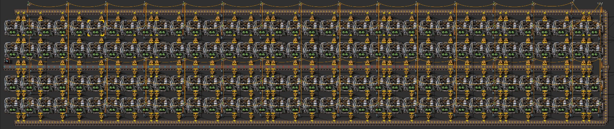

```blueprint
0eNqtne9uJNdxxV+F4OehcP//2WfIG9gLg7ualQlwyQU5K1gQNnAU5FMSGPDnAHkFJbYSxc7qGWbfKLdnZM1EupesX92GAUNcck7drtvndE/3qaqvL1/dvt++e7i5212++Pry8+3j64ebd7ub+7vLF5f7P376p/0P+z+/uPj13dWFvfj0+0//uP/z/tuL/cf2f5/+Yf99+4/v9v97sf9L+7OP+/9sP/zP/rtPv99/t3xg/+/7Hz59s/y0/4/9Xz/9of3mm4u/v8ifOXux/7f9H/fftt9+c/HpXxeU9md/anjf//quRf3nH+MuKDGYFurTN/tvG8a/7D8uv7xogO3H9jd/Oa5l/18tyF/bH/3w5Grav35/+NOP7X8/7L+72P93w/lTO64/tP/6ePjF98ufX24ub17f3z1evvjV15ePN1/cXd8u6dl99W7b8nKz275tf3F3/Xb5afu7dw/bx8er3cP13eO7+4fd1avt7e7yQ4O4+3z7u8sX9sPmeZDb7evdw83rqzfvH+6uX2/PPu4EH795uL+7un84/5gXfOxxt93eXr27vd6dfzJ8eLm53N7tbnY322MGDj989Zu7929fbR/aAf0E8LNj3ly+u3+8OZ49X182qCsf/Gdxc/nV5YvsPostxuc3D+1ID39xOLCfQbvTId09bh927d+eBPU/Bw0dUE/W69B6g2y9Dq03kvVatN502vu317e3Vz+dd+/ub7dP4x+Xfre9+eK3r+7fPyxnhk0bZ+zLTpxMDsGgQygA2lcEXUW7eQIV7aY1ZMEFLdgSKvrMsB3BTgybUNJHhi3j5AlVtouElD6wFWNWngJ0WNlIufAy9HhpCTE9026LmMl01gqpyYTWIWoypXWImkwCHaGmYxroCDUdkysno+YJVbaLhJqOiaDD1DwF6F8w/cLN3OOmI9x0THAd4aZjgutk3HRMcD3hpmOC6wk3HVNBj7jJVNB7WaaZCvpAVsxU0CNuMhX0nJvmCW42qoe8cdb0uOkJNy1TXF9Eu2rZbaevZMVMx4ORrZjpeCCstEzHA2GlZdoayBXTMm0NhJuWqWCIsl0MbBcTWTHT1pAp461/gvFNQOLC+O6dciBXTAufGiBuMsWNQm5a9kgCcZPpeCTcNExbI+GmYSoYCTcN06so46bJbBcJNw1TwYi5eQrQ4Wajelq42b1TjoSbhiluJNw0THGTjJuGKW4i3DRMcRPiJlPBhLgJn3PKvmkapoKJ3M0apoIJcNNVpoKJcvMsQIebjeq5bJzr3imnQo6DKW4SfdM8QxXtajZkxUzHs5WtmOl4dmTFTMezJ9hMW3Mg2ExbcyTYTAVzku0iey2VM1kx09ZcMOPdU4+U86YsjO/eKedKjoPpeEHchC+ShNw0aFcL4WZhOl4INwvT1kK4WZgKFsLNwvSqyLhZEttFws3CVLBgbpb4BDcb1evCze6dciHcLExxK+FmYYpbZdwsTHEr4iZT3Iq4yVSwIm4yFaxRlmmmgpXczWb4lp5wMzMVrJibuTzBzUZ1a+rG+e6tciXkzPDtvRF91zyDFZoZLFkzdAUYJ1tzgmsm1MzQbWAINzM0Bhhy4czwdb1BHIXv602WbaWDW0m+XWYL11wx+Z9yRzUtsXYhf9+JQXxBLhvoCyI0TRWCy2iaoE+KmIJcokYpQtMEtZaYg1yComgJTRNULyujaYJmKWIFcgmKosU0TU/ZpRbaW7fwtHsHbYlJyCWowQ7xFGqwE/IUarBDPIUa7BBPoSoSp5CLUBWd7ItohKpIXEEuQlUktiAXqX8U8zQ+6Z1qvLfBbFzo3kxbYhhykfpVZd9HI7wzJWYhF6G2y9xCZ7DCNROGRqjtHjEUiq0nV9IIxdYjnkJVlFmEzmCFW0m+gEYotmcmISn9n7JnLXJi40L//u00cQ+5ALWd2IdcgCIcZDwN7K2WJdYhF6C2B8LTAMWWWIhcoNUBhKcByleQ8TQEuJWEp7DiykbM0/CUqep4ic6bxuYuTyPiKRThiHgKRTgKeQpFOCKeQhGW+YjOYIVrJgyFRVg2EobSgqmIH/D6px7wPnmmE9Y+UZzV3YFkVOCy7T1zFP2iMLVXwPeTnMUD/FJk+rj8dvvmzRLnywZ+9fb+8/e32yu37Es3pmMx7RoxPYp5OhNmYgYWM64RM7KYbo2YCcU8VSnNxMwsZlojZmEx/RoxK4tpVoh55pKSxDz582diMh2ya+hQZjpk19ChzHTIrKFDmemQWUOHMtMhs4YOZaRDZ8bHmZiZxVxDh3JhMdfQoVxZzDV0qCAdOnMqzcS0LOYaOlQci7mGDhWkQ2fWh5mYgcVcQ4dKZDHX0KHCdCitoUOF6VBaQ4cK06G0hg4VpkNpDR2qTIfiGjpUmQ7FNXSoMh2Ka+hQZToU1tChynQorKFDlelQWEOHKtMhv4YOIcfe6WFFED2sqEUFHmXgFTakyrK+Iwb2jRLCWn17p9xtJGPCxvvU7VYhM+uddUsSHoOH7XuEsEHfYyePOl8tnTw2PsR+fiJsWSM8kAR7qAhhs77RSe42U1hSPuim4EyBLUOEB1FhfwwZrDX6RhO5W3a+pHtQd+6she0ghAfhYM8GIayHTQSEsEFf6Z+71cTLLg7KiZ2NsGZeeBAJFnELYScqrXO3mnNJ96Cc09kCa5aFB1Fhga4M1hl9pWvu1r0t6R4UvjlnYT2q8CAcLBoVwnpYxSiEDfpSw9wtZ1p20bm8CYM+WS7Cwj3hgdBKMiFs1pd75W5JyZJy580m2NLPT4HFU8IDqbBSSAbrjb7kJndd90vKnQ+b0K+Jc0IzX4b88rR6RQjrYSWFEDboix1y30W9bGX7hrUJvvbzHmHdgPBIEvSwC2Gz3mae+/bVJekuNOKGPnGFNr9Et7pCZ7IMVmHwe+orw48e/MXgtwmxfwYFasMVHomDTlkhrIeuTSFs0Bsr88iwdTRthTTIe4QWReGRJGiXE8JmvaOtl6BoNotvaEl8S+UmlP6dstT8R7e7QguXDJbb/nwRJamdRaV/3UXWv9OTuiQ7HqcCFybLKw1RVf3Q1MWgNETNxIxKQ9RMzKQ0RM3EzEpD1EzMojREzcSsSkPURMxklIaomZhWaYiaiemUhqiZmF5piJqJGZSGqJmYUWmImomZlIaomZhZaYiaiVmUhqiZmFVpiJqIyQyLZ4+9ZmJapSFqJqZTGqJmYnqlIWomZlAaomZiRqUhaiZmUhqiZmJmpSFqJmZRGqJmYlalIWoiJjQspjV0CBoW0xo6BA2LcQ0dgobFuIYOQcNiXEOHoGExrKFD0LAY1tAhaFgMa+gQNCz6NXSo6ErDiuhhRdWVhlUZ+ElZlgGJu+u73dXr+7evbu6ud/d9E9PfTozlivz/I7QzrIHsHu5vf/Nq+9vrL28aQvvYm5vb3fZBNHzxfPDh6/v3yxRLezZ48WU3+xVOGfzlwvup8czUJYUNzGclhY3MZyWFTcz1JIXNzPUkhYU+JCks9CHJYL3QNWgrhLXMGSSFdcwZJIX1zKsjhRU2jKdJiMw9I4VNzD0jhc3MzyKFLczPIoWtzM8ihLWGuUuksJa5S6Swjnk9pLCeeT2ksIE5L6SwkTkvpLCy15OZ5jYzG4QUtjAbhBS2Mk+CENYZ5kmQwkKDgBQWGgSksNAgIIUN7G29FDayt/VS2MRem0thM3ttLoVVVZssOikBV30tFK78zGc3GFn/5Jc34YBKqwkSYBD6/W3petIFot/YhkBBc9geHnbUBHEwiH5CfOn1x2lfLtpJtIn9Duj+zGQHjsnCYyqaIAYGgcPjh+dS0PD0BCtbbdDw9Ce7hzSI0wTJMIjXBEkwCJwpP97cqC5D69PrUJ+38TE1ivkuxc5MdiBBUPeDhsce6r7MYHf2bGm4C1WzWijXUcVjKNdRxWOon1HFY6if0cMnfKPNjZprsYP6GTXXYgf1M+qHz/fEYhEfn5Zrcbeg10cNhx2U66i5Fjso1xFOpB+eS0nDYQe1M2k47KB2JgcfSQ9TorneOqidScVhqJ0pqst6u/RqdPU5N3p1PfQ+aa7DDkp1UnEYSnWCA+vH51KFbx5GQFnDUws1P2t4aqHmZ8211kIRzhoOWyjCOcD3P8PN1VxrLRThrGGnhSKc9fPru4rTFMyXducf+nf+WXOttVCqs+Ze2kKpLnCo/fBcKioOQxEuKg5DES4aDhsoeUVzHTZQ8kqEr16Hm5vUjRG69Gp09bVd0EP/fvnMrPTm+nEnyQzU6TNrkjQCFOlS4fvpUe7PTEfSpUKFPnMeSSNAeT7zBUkjQLE8swhJI0ClrHDw/XhDI14qlMkzq5A0AtTIqp973xWEJjDBLILQv8OvBdonhrmvMDNn6xZlJhiDIxQYwULTxyAZwTi81AyX6nGEBCMEHCHCCBFHCDBCgnab4YZmdcOY7jNwFw6X6WDLJsbunXAwBWfHw+xwyjJlD9iXNMq/tXipFi6VU9bACJiyBSqkxZQtUCGFrqWSnt3QhJcKFdJmHAEqpC3qLkl9UTi0j1paADVR6N6/B4spW6AoO3yVLVCUhX6n8qwoO0zZAhXSccpChRT6nsqzCunwxbRAhXScslAheduxXJ4i1LHf2NLbqRGqe/8bHL7KZijKDlM2Q1H2BjpUR+eQtMnYs+ruMTMzVHePmZmhunt8Mc1Qaj2mbIZS66kbeLih+GKaodR6YlLMUGV9VTeO6wvLoVHf0hNtE1P/9j2QirYMpRgNDs1QhYWdxdJzr8pCQEO3oayiUaEJKioaFZqgdKFRoQmqVsjQUT/cvKJuJdinzKHH4tIlr1Gmf3OLRoYmKLaR8DFBnY0WFhyMso46giUosRHxEUosGgmaoN5FxEeodzHBso7h5qFx2lDvIhp7D/Uu6sfed8l+7Be6tGZsZO/feCcDq15GWU/kWhihVic07B5qdYLD7scpQOPtoXAmNN4eCmdC4+2h3iXER6h3CY63H29eVbdG7XPv0Ip26fi5ibl/b5rJtTBCrc6Ij1Crs4NlYqOsZ3ItDFCrMxqPDbU6ozH2UO8yGmMP9S5nWIw33DxyLYTlYCGjwfVQ74p+cH0ZjPJeBCSU3Mjev6suaHg9lNiChtdDiS1weP3wfCkB1lUOgRD3oHAWxD0onCWrWyd3T7xjT+l20vXv7oqu5FR4LLqS09GmsqmIZ5Wf+ulyoVpdo+SpmE7XKHkqptc1Sp6KGXSNkqdiRl2j5KmYSdcoeSpm1jVKnopZdI2Sp2JWXaPkiZjRGF2j5KmYVtcoeSqm0zVKnorpdY2Sp2IGXaPkqZhR1yh5KmbSNUqeipl1jZKnYhZdo+SpmFXXKHkmpjW6RslTMa2uUfJUTKdrlDwV0+saJU/FDLpGyVMxo65R8lTMpGuUPBUz6xolT8UsukbJUzGrrlHyTExndI2Sp2JaXaPkqZhO1yh5KqbXNUqeihl0jZKnYkZdo+SpmEn1eCL0H09EpxpEfziALlyBjajyCKjCRlQjIDxM8+xxSG9UtT/0ldkk5152w1nY9Gi4bgcb7AyBvL7BTu73zFiSGlsikov9JATYlma49ghboAyBJhqH5H5ngyWx0deWhNJPQoYtN4ZrL7BRxRCo6ts75H6x9ZLYGBodvO0mIdAGzaO1B9qSeQhEmzAPgby+dD33a2uXHYqh8cr3eSVsumXts2uPbA77GGiiwDj36wmXxMbQeOX7vJJ50M5KXYdrL7AwdAhU9UWVvSQcK6yX0q1NCn1eRQMLK0drj7QocQjkYDHcEMjri+E62fyxPHWpeWnZ7PMqBlhINlw7LWAaAiV98U8vCcdKwKVOoSWhz6uYYeHMcO0FFp0Mgaq+YKOXhGPl0+Kp3qTY51WixQ6jtSda7DAEcmzY+RjI613qvWwey14Wu23LZp9XKUCv93DtEfqOh0BJ7zvuJeFo0V9siC0JfV6lDN27w7UX6CQdAk34MXtJ+PEsiLnxKvV5lakfc7T2bKGrcQjkoMNuCOT1DrteNo+u1sVw07LZ51Wm7cyHa6cNzIdASe886iXhaC9cDCAtCX1eSf1ez29ggf6dIVDVu2C6ScjHsyD3OVVUU62We4/u6otqFvkwGWz43ZnvRT9ELBav9L3MxAxK38tMzKj0vczETErfy0zMrPS9zMQsSt/LTMyq9L1MxIS+tNOToJmYVul7mYnplL6XmZhe6XuZiRmUvpeZmFHpe5mJmZS+l5mYWel7mYlZlL6XmZhV6XvRx0zGKH0vMzGt0vcyE9MpfS8zMb3S9zITMyh9LzMxo9L3MhMzKX0vMzGz0vcyE7MofS8zMavS9zIRE/rS0ho6BH1pcQ0dgr60uIYOQV9aXEOHoC8trKFD0JcW1tAh6EsLa+gQ9KX5NXTI6mp+Sv/xRLK6Kp86gJMNbzz5Xpb+gX0gy3wvYyCn9r1U+8uHUYvlY2D3SLKhjSfPy3jNcKjUGEg/VKp/8AfDz8jqkRwc8T1eNxzqPQYqar9LPwEHs8/I5pEcHC8zXLes2djJ6zIGsmqvSz8BB6PPyJmRhG4t+ywFhAMY7bNngIfDJsZAUe1z6Wby6BYa2TuSrKnY6ZnJeN2ZeVzGQEXtcekn4GDwGVk7kocN6IfrFnqvzLOZDFbtb+kn4GDuGbkxkrBDWH2WAsEzb8sYKDBvyxgoqr0t3UweHUIjS0cKiflaxuvOzNcyBtI3te0n4GDqGdk5UqjM0zJct9BvVZ7NZLRqT0s/AQdDz8iBkYSurPwsBWTDCE9+ljFQYH6WMVBU+1m6mTy6gkY2jiTs45WevcJH2ENvDKTvoddPwMHIM7JwpAjH3g/XneCg+zGQVftY+gk4mHhGroskdGLFZylAO3ONgQLzsIyBotrD0s3k0Qk0sm6klJh/Zbxu2PNnDFTU/pV+Ag7mnZF1I8nG/Lnw7MYJfVXh2etStmrvSj8BQ+NOyk7z6GW5Semv3KvghokA3bXOnueIessk0l3r7BmPEDwRcAvBMwE3EBw82zt7jCQErwS8MHDiwToNcpeCWwKeILgj4BGCewIeIDhhqIcMJT24zh7oCcEJQz1kaCEM9ZChpOPWyYclBScMdZChlTDUQYZWwlAHGVoJQx1kaCUMdZChlTDUQYZWwlAHGVoJQx1kaCUMdZChlTDUQoZWwlDLGJoNYajNEJww1CYIThhqIwQnDLUBghOGWg/BCUOtg+CEodZCcMJQayA4YaipEJww1ECGWsJQAxlqCUMNZKglDDWQoZYw1ECGWsJQAxlqCUMNZKglDDWQoZYw1ECGIo9JhQxFjpMKGepILVCFDHWkMqhChjryNKhChjrybKhChjrSh71ChjrSC7pChqIeQhUyFHUUqpChjjC0QIY6wtACGeoJQwtkqCcMLZChnjC0QIZ6wtACGeoJQwtkqCcMLZChnjC0QIZ6wtACGcom7UGGesLQDBnKZupBhrKZepChgTA0Q4aiOXsZMhTN2cuQoWjOXoYMRXP2MmRoyJoJjFLwohmcKAWvmsGJQnA2ZQ8yNFrN4EQpuNMMH5SCe83wQSl40MwMlIJHzcxAKXjSzAyUgmfNzEApeNGM+pOCV82oPyF4MppxeVJwqxmXJwV3mil3UnCvmXInBQ+aKXdS8KiZcicFT5pJcVLwrJkUJwUvmgFvUvCqGfAmBEfT+QJkKJrOFyBDkW8oQIayiX2QoWxiH2Qom9gHGcom9kGGEk+Rg56ijKb4QU9RRlP8oKco6/o6HcA/vDxWV7aPvrp9v333cHO3fOr2un28/dvf3d99sbm4vd5tL263X7Z/2lx+uX14PC6l2JBr+9Icqk81ffjwf9op9Dk=
```

Отметим разницу, каменные кузницы на стальные обновлялись простой заменой с увеличением количества конвейеров подачи ресурсов. С электричеством так не получиться, кузница растёт в длину с ростом количества подающих конвейеров.

## Модули производительности и гигаватты мегаваттов

Однако, для любителей модулей производительности, есть более или менее рабочие варианты с использованием маяков `Beacon` и модулей третьего уровня. Но помните, что липестричества маяки тянут немеряно, даже если простаивают, может не хватить [никаких ядерных электростанций](../PowerProduction/HugeNuclearPowerPlant.md). Примерный расчёт следующего чертежа показывает, что на выплавку одного экспресс-конвейера `Express transport belt` руды, нужно где-то 34 мегаватт электричества. То есть, на дюжину конвейеров потребуется более 400 мегаватт энергии. Любуйтесь:


```blueprint
0eNqtW+tu2zYUfhVBv+VCFMVbnmFvsAaBL0wqTJYESQ4aBBl6wYABwVCgvwfsCQZ0bYMla9O9AvVGo+zMcmra4SH9J7ZM8Xw83zk8PORhLsNJvpBVnRVteHQZzmQzrbOqzcoiPArV++4X9U19PgqeF6MABd2r7q36rD4E6l7/6V6rW/3lRn0N1D/6tXv1UT/cqZvulbrpO6g/1LfuTf+k/lJfune65U3wc4DTZ3Ggflfv1Qfd+ibofuul6Nc+aXm3y45/Pgj8pr6qW/2K+rgaiLrvrtVN0IvsXndv9Xhed9fPCz3O64eRPgx0NbRbdbc1tED9uxqh/vyiPuiGL/r7/RLs7kHDXuZq+Br4uvt1/cJNoP7WfT7p197pb/fLhtte2zAKs2lZNOHRj5dhk50V47zns72opCYya+Vcv1GM5/2TfFnVsmlGbT0umqqs29FE5m14pUUUM/kyPEJX0dNCcjlt62w6Ol3UxXgqN7onFt2zuixGZb3ZDdt2q/Jxu9kxvTqOQlm0WZvJFQHLh4uTYjGfyFrrs+4/kWPNkpZXlU228rLLUIsYJTF/RqLwQn+lz0gvW+M2fWtTSTkbzcvZIpcj3GvXj/M7hMQGgfggYBuExAchfRoBCeGDQGwQqA8CtUHAPgjMBiH2QeAWCJz5IAgbhNQHAcU2EMgLwmJWI+Y1q1FiA+E1rRG2gfCa18hmYlOviY1sZjb1mtmIbq1fCx3+67O61J+rFcwUEtdunC5BZ1mt163lG9q4/68xRbXo179tULZ7vTOBrR0aP9awqrVyGvZcC39S0WH+n46bdpQVjaxb3WICxLu1M4kWLhwiwX04TGI3UGEBWi7aXagIYjkkyAEslyTWlkOCgSyXYDcSEy/LpW6g2M9yBGQ5Lg5hOQqwHIJZjjmRyKmX5bgbKPOznIBZDh/Acji2txwnIMth5EZi7GM5nLiBIi/LYWzPIhMwFlOQUzB2CKcgTiQy4kcidUP1ylAwg9F7iAwFc4C3wDIUDAshlB9AndQtQaF+3pJuR5emyrN2B4908JItrNMs73sdhTPZHwG19WLZ1p+TFMVS3GoYJ1WdlbUehH41l6e9Vku/2vrdNNwhLs3lLFvMR2v7VGVuzobXS1iyJKiQ2dmLSbmo+zOalEYMH5uAMCzlXvOCPDwgBaTc6WOX2zBFahJNAJkFh4mmUJNsJNXYYJIkSoXRJLAYM6jhYxJAjBmyXDveBJw3vI83GpHExBuJYbwlB+CNIEA+REG8EXAI2EgoTbyJiBAjbxiWR9JD8JYCeIthvBE4b2gPb9oOhBl5ozDe4kPwxsDKMbJPORIJs3IclugcYl0gApDowNYFGoN5o/vWUzNpFD1V9Nmb2PQ4JqmJl1RskwhS7IKBYRgpHCNB61kTW2EQB4yhFmWHQV0wBAyDuR2/0t0oT29uKHdRjMEUG+b4MnkeF+1oWs4nWTFuy3q/Tuh7AG0ILaSty/xkIl+Mz3Va3XdbJehWtdnNuuhUU9suq5eAuuy0rCpZ7xSRgIusWyLw1bGxMDZENM3i9Kf9WXQCMhJDENnxTvuYIjFL3Dw79vFshuHbKfRYre9zd8ZNKwBL3bRDFtrt3twyYm+vjYqvnS9QiOwU5gtuh7UDipMvcPh+hOzxBe1b3Li1Zo7lH+LlCzyG2Au2unJAXECcg3yBO57Ech9f4Bi+VxD7fIFH3BgXuFtthws/X4DEBZ7CfAESF3gC8wXHIk7i5QvwuDCUVAy+oH1LGOMCd4sLA5iTLwhIXGCwjFhA4gKjIF8QbnGBeWXCAh4XhkqKyRf4jm22cIsLjPn5AiQuMFjuKBzLMn4ZkHA4F9mX4BEW0XjH/BUO2yTEYCutEBALwTJwFENCARVA4U5nILDdMYqdjkQYEATDSkZDXLMRDjgApY9Ci1Ea8ToiineJpV5id46WQS4II6f7kBxyQ9gNQkCuCDtBWF3rXBeZ3CAQ5JKwG0QCuSXsBoEh14TdIFLIPWE3CAK5KOwGQSEXhd0gGOSisBsEh1wUdoMQkIvCThBJDLko7AaBIBeFn4Y4XjX34tb/RhSF+VivBfq3H8riLAr6g8wgl+f6pyg8l3WzWgQ5SplIGE8FpoJeXf0H3XxqYw==
```

:::warning Маяки должны быть сдвинуты на одну клетку относительно печей
Обратите внимание как размещены маяки относительно печей. Такой сдвиг даёт б*о*льший прирост бонусов от маяков, неважно что вы размещаете рядом, печи, сборочные автоматы, лаборатории, химические заводы, всего что имеет размер три клетки.
:::

Конечно, маяки дают какую-то экономию входных ресурсов, но хватит ли на эти чудеса электричества? Свои расчёты публикуйте в комментариях к видео, как говориться подымайте индекс интересности на [канале ютуба](https://www.youtube.com/@AwesomeFactorio). Также учитывайте, что увеличится и загрязнение и на очень много больше чем экономия ресурсов, примерно в 10 раз. Кусаки и другие представители местной фауны вас обязательно полюбят. Вот ещё [пример](BigOreFoundry.md) большой любви местной фауны.

:::info Это интересно
Обязательное использование маяков, а также их категорическое отрицание является частью двух непримиримых философских течений в игре *Factorio*. От выбора одного из течений во многом определяется и стиль игры на завершающих стадиях. Это когда физический процессор (даже 7950X3D) уже не тянет расчёт ста мильярдов расстрелянных лично игроком разных плевак в виртуальном мире.

*Нерды* выступают за обязательное следование канонам инженерии и правилу "что требует меньше ресурсов, то есть труЪ". *Гики* напротив, утверждают, что "чертежи должны быть оптимизированы под математику *Factorio*" и не важно насколько они противоречат аксиомам инженерии. Обычный игрок, не доходит до таких пограничных состояний. А вот задроты, как правило, начинают свой путь с нердов и постепенно склоняются в сторону гиков, по мере разрастания их убогой базы. [Детали подобных расстройств тут](../Additionals/NerdsVsGeeks.md).
:::

## Что ещё бы посмотреть?

Есть ТвойТюб, есть сохранёнка...

[Сохранёнка со всеми чертежами](../../website/static/saves/AwesomeFactorio%20-%20Resources.zip), все чертежи в книге игры. А также детальный разбор на YouTube канале:

[**](http://www.youtube.com/watch?v=z7HcOThwafg)

Дополнительные материалы:

* Обновление по подаче угля в кузницы для плавки стальных балок\
[**](http://www.youtube.com/shorts/eeA8oLBHNjk)
* [Средние опоры ЛЭП в чертежах плавки стальных балок](/blog/2024/03/27/smelting-resources)
