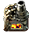
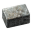

# Плавка ресурсов

:::danger
Статья пишется прямо сейчас, возможны неточности и конкретные изменения
:::

:::info Капитан очевидность
В игре пресутсвуют [три типа плавильных печей](https://wiki.factorio.com/Furnace): каменные ** `Stone furnace`, стальные ** `Steel furnace` и электрические ** `Electric furnace`. Каменные печи доступны сразу, одна даже будет в рюкзаке при старте игры. Стальные печи появятся чуть позже, освоить их использование возможно до момента [первого выхода с базы](../HowToStartNewGame/README.md#первый-выход-с-базы), то есть в течении первых часов игры. Электрические же печи массово вводим в эксплуатацию [после запуска первого спутника](../HowToStartNewGame/README.md#после-запуска-спутника), до массового производства вторых модулей эффективности ** `Efficiency module 2` проку в электрической плавке немного. Хотя, внедрить несколько электрических штучек для плавки камней ** `Stone` и стальных балок ** `Steel plate` можно с открытием фиолетовой науки, она же производственный исследовательский пакет ** `Production science pack`.
:::

:::info Плавятся не все ресурсы, а только:
* железная руда ** `Iron ore` в железные плиты ** `Iron plate`
* медная руда ** `Copper ore` в медные плиты ** `Copper plate`
* камни ** `Stone` в каменные блоки ** `Stone brick`
* а также железные плиты ** `Iron plate` в стальные балки ** `Steel plate`

Скорость выплавки стальной балки равняется скорости выплавки требуемых железных плит, но чтобы получить полностью заполненный конвейер стальных балок, нужны пять полностью заполненных конвейеров железных плит. Камни плавятся в соотношении 2 к 1, то есть без зазоров на конвейере можно расплавить только красный конвейер камней в жёлтый конвейер каменных блоков. Остальные ресурсы плавятся в соотношении один к одному. [Все соотношения тут](https://factoriocheatsheet.com/#material-processing).
:::

:::warning Нужно помнить наизусть
Железная руда `Iron ore`, медная руда `Copper ore` и камни `Stone` плавятся с одинаковой скоростью.

Потребуется 48 каменных печей ** `Stone furnace` или 24 стальных печей ** `Steel furnace` чтобы полностью опустошить жёлтый конвейер железной или медной руды ** `Transport belt`. Столько же печей потребуется, чтобы заполнить такой же конвейер выплавленными железными или медными плитами.

Из всего вышеперечисленного следует, что **любой работающий дизайн для плавки руды на каменных печах и обычном конвейере, можно превратить в дизайн на стальных печах и быстром конвейере простым улучшением печей и конвейера**.

```blueprint title="Upgrade planer для печей и манипуляторов"
0eNqNUdsKwjAM/RXJ8wY6hV3+wycRqRpHYUtLm4ky+u+mbIOBl/nUk/ZcekgPna2duuLJNooIHVQ9eGTWVPuIW2UtOoGHHm7OtPGOnxahAiTW/IQESLVxPndODFJNHh2LU0iAzQ/+nKjpig+o1iFZjPFsCNObhKkLLoZ4Rmzm7DFpF46CL4aGal7XpJqZj2Zsf1YbfTbxxwvqD7LsD9lb0VG7/Uv7tXYcIreaVp9Oq0+gUWcUU9gPL6uh92oq4IVyl0MbkgrFZpeXWV5kZb4uyhBezDnGNw==
```

```blueprint title="Upgrade planer для конвейеров"
0eNqFkN0KgzAMhV9l5FpBZaD2PXY1xuhmlEKbljYbE+m7r8UJg4G7O/n5csJZ4OEmLwe8Oi2J0INYICCzoilkbaRz6JM8LzB6a3KPZ4cgAIkVz1AASZNr9pKCs57LG2qGWADbnfVRBi5/GUUDvkBU8ZL03dJqHdREUn9dU4xmz/pzpo7FX3j/kSZecpEJsYVVbmEVoGXaT5PTOjlkOqT+M4WmLCW+q49t37Rd07dV18f4BmG3fcA=
```
:::

## Самое начало

Существует множество различных дизайнов, различной степени правильности или не правильности, самодельных и научно обоснованных... Короче, существует один правильный чертёж плавки всего и вся и множество не кошерных чертежей.

Начнём с каменных и стальных печей. Дизайны как для стальных, так и для каменных печей идентичны. Нужно помнить, что такие печи в отличие от электрических потребляют топливо. Уголь (для работы печей) и руду (для плавки) лучше подавать на одном конвейере, соответственно, половина конвейера это железная или медная руда, вторая половина конвейера это уголь или другое топливо. Смотрим красные стрелки на рисунке. Выгрузка выплавленных железных `Iron plate` или медных `Copper plate` плит осуществляется на один конвейер, с каждой стороны которого находятся плавильные печи. Смотрим синюю стрелку.


:::tip По поводу пол конвейеров
Пол конвейера называется линией, то есть каждый конвейер состоит из двух линий по которым подаются ресурсы. Это важно помнить, когда будете искать разные там балансеры `balancer` или `tu balancer`, которые нужны для перемешивания ресурсов идущие на разных конвейерах. Но есть особые, линейные балансеры `line balancer`, которые перемешивают ещё и ресурсы на разных линиях конвейеров.
:::

С электрическими печами всё сложнее, или проще. Заменять их особо нечем, топлива не требуют, подавать питание нужно по проводам. Тут тоже из всех дизайнов, правильный только один, там где подача ресурсов и их выгрузка происходят внутри кузницы, так сказать. По синей стрелке на рисунке ресурсы подаются, по красной выгружаются плиты.


Откровенно говоря, дизайн электрических печей не айс, там ещё деревянные опоры ЛЭП присутствуют... Но это самый маленький и удаленький из возможных, остальные хуже. Я долго им пользовался и пользуюсь до сих пор.

## Чертежи для плавки руд

Рассмотрим уже конкретные чертежи для плавки железной и медной руды и получения соответствующих плит, железных и медных.

:::tip Не стоит пренебрегать твёрдотопливными манипуляторами

Твёрдотопливные манипуляторы, по сравнению с обычными, намного дешевле в производстве, быстрее производятся, и не требуют электрической энергии. Они не сжигают топливо во время простоя, хотя и потребляют больше энергии во время работы.


Применять их полезно в начале игры, для подачи топлива и ресурсов в каменные печи. Особенно полезны для подачи топлива в бойлеры. Пока у вас ещё не налажена добыча ресурсов, манипуляторы большую часть времени будут простаивать, вы их быстрее создадите, даже руками, и быстрее установите без протягивания линии электропередачи. Улучшить твёрдотопливные манипуляторы на обычные обязательно следует при улучшении каменных печей на стальные.

:::

Стоит учитывать, что предлагаемые чертежи стыкуются по вертикали. С одной стороны подаются ресурсы, с обратной получаем выплавленные ресурсы. Уголь и для каменных и стальных печей подаётся сверху и проходит через все линии плавки. Типичная картина рассматриваемых чертежей:


### Чертёж первого уровня, каменные печи с твёрдотопливными манипуляторами


```blueprint
0eNrFnV+O20YSxq8i6GkX0Bjs/91zhr3BZhBoxoxDQEMJlMZYwxggiJEnPwS7JzGSeLFZx84VqBuFGiUzksVWf19lgYUBe2yLPxaLXdVF9let19PrxV296pp2M718PX1er2+6ZrVplu30ctr/a/td/6n/6XLyRXsxUZPtN9s3/U/9u0n/cffbv7f/7D9svx0+8cuk/+/wx8f+h/59/3P/fvtN/353iHeT4Ygfh099P+l/mPS/9P/pP27fbL/dvpn8pXpWBW0GzHDMHvNj/+kU9O6vX7SDIW9/N2VvyR/n3r7tfz45ZNL/ujdh+PND/274jw/Dzx+HX5+GT+8vYvt2Ops2N8t2Pb38++vpunnRzhc7D2xererh0ptNfTt8op3f7v626ebterXsNhfX9WIzvR8ObZ/X/5heqvtZ8eD1ZtnWF1/dde38pj44VgPHNt2yvVh2h4cZ9LDVYr45PNDeX82mdbtpNk29v+qHv7z6sr27va674WJy1zubrpbrZj8oXk8H1IWp4jM3m74aflTJPHPDWZ43XX2z/8zDlX0G10K4HuAjOMPgPGmrZeCBhLtH+G70bebt5uJmeXvdtPPNshs9gzv2xmx34KZbLr68rr+ev2yGo4aPftUsNnUHjeab5fCfD5i7XdSrg9F8NeZrz7jDku4IDNyR8PgIvx7Cr+4umnZdd4OfRummOOoSY6whjVUVQ9csXVG+0EVfKCqiFWsuFeAVS7eEM3RKZWc43NwjHmauZ+hsZlaBckY5N6vImMvmT5UYOpv6dUU5wxWdoRVjLps9tWbobPrUhnKGLTvDMuayCVRTQcgmUO0pZ6iyMwJjLptANRWEbALViXJGVa7niMlPRzaBGiYII5tAjWacEUPZGYYxl02ghgnCyCZQ4yhn+LIzmMkvsinOMEEY2fRsIuWMcgFqmMkvsgnUUkHIJlCrKGeUK1CryUcpHdXnj1IHNvs//WB1+poAfcSyVMSzc4GlIp6dCywV8aFcTFsm4gObrS0T8YGdaSwV8aFcTFsm4gObrR0T8YF+1UFFfCgX044pdwM7Fziq3A3lctcxcRfYycUx5W5g5wJHBSE7FzjqmTOUi2nHlLuBTXGOKndDudz1VNyx+d4z5a5nU5xngtCz6dlTQejLxbSn3vX4ckHqmbjzbEb2TNx5NiN7ZvLzbAL1TBB6Nt95Kgh9uZgO1LseXy5IAxV3bM4MVNyx+T4wFahnE2hgZkLP5rtAVaCuXIEG6l2PK1dxgYk7x+bMwMSdY/N9SMKlu2rcF7ES8lSG9xR169Wi2eSWNPyhXUdXbceoT9F2Nzy6dS+64VHuObQ0pU74sz+eF5d3m9Xd7snw9Hwms2A8usj2eKpRh1gCpc+jHIGqzqM8jNIpnkcFAuXPoyKBKrg9Eajzbk8VgTrv9qRwVDzv9qQJ1Hm3J0Ogzrs9WQJVcLsjUAW3E6M9FNxOjPZQcDsx2kPB7cRoD+fdripiuIeqwCLGu48FFjHgvS+wiBHvbYFFDHlf8j0x5n3J98SgdyXfM8IQ9VSP7taGEK1FZGU4h+eI//t3x4dKr5G3xjNA1bNaDYVqDqHHXzyriqnulGL9rITF3qmL7SheqFl7sH4UqLFiMh2gEDcYDBuyWD+KtTIZ3OnNG8cf5Ibb+WJxUS+Gz3fNzcVquahL59jfwbZuXnx9vbx7iAJdmavRE3mZCgwdJUKR2ambxvFPuQTUVOWHn1BhduqI0WF4oG4BlXBZS7WSqdVQS7VM/4XijUy8huKtTA6G4p1MD4biPTJKjuzOjpKAoYDMzAlaPH3RSSZaA/Gmwhxhy44wQkUZaqlQUobiDeYIBzhCqCZDLRXKyVC8l8m/UDwYeRXg54ihFIBKMlUaeNFWqCJD8UIZGYrXkJ+jL/vZYlEWA4CyMjEaetFOpkZD8V6m70LxQSZOQ/FY5EWgsjzQkYAatCyKEo1EOu86JVOhoXgtk1qheCPTWqF4C93GANRmB/oRUKOUR3mZpgq96CAThKH4KBNBoXihggvEe6yyDEBBdaAbAZVPeZRQqYVetJEpq1C8lUmrULyTaatQPPb8FoDSz2NVZABKP0ocEui865NMAAbiQyWTVKF4JdNUoXissvRAORiwytIDRSonCqHzbhDqtFC8l0mpUHyQaalQPFZZeqCyZPQhR0DM0ojNbx4oXKOSKahQS7VM5ITihQotFI9Vlg4oByNWWTqgSI1eJm1CL1qoy0LxlDCLznCRiTxHZ7jEzHmOTkGJiUZHJ9DERKOjgz0x0ejorJescGHTQ0tWyQnxAcN7gZgt+tEMkKSLd6AnohAPeiLRK24QWBOamSeR37iLdaXoBUzQSC2QD+aMNPRitPrc3qPF6N3ytq7S1ejJ7GcnW8xvV6Wlx5Dp82YkNo/Kx5wXPL2gBt6qQC/6geAoEGvmrj6RY+BoITCMChJmWsXRMaD4JTvMI0oJNKcZjyhNL6eBRhqBmjVnpKUXkEAjnUAnmzPS0wtmoJFBoMDNGRnZAIipEABpprUdD4BELyJhHsFkKEerPSBYCRTKGVcfKFDOTgFHyzq5KUBL9M45wyw9Buz5MTCMKm306BjQjl6BAm+Vp9ejQHAQ6MFzro4CQXiOlejlFuyCQWlJoGduowQa9szVG80O2hDOD9ohDLQJo4PWGIFiPme4pddEQO86et0GBHuByD939YG+bfr8bRsGgraZ2xbBjBtMOeMaSX9Cxgu2ohdUsFtllaDxIWekppdqQCONoKMiZ6QVdFTkWI5e1AAv2NNLHCCYjibvCtEUZtqNz9w2ChpOcq5OgoaTDMtV9MoD5l2n6IUCEEzPXb46f9vs7raNP3U6I+jHybkafItxtBiRS6iOf6kPutfTCw8gOAjakXKupB+8nDk/BjJh64Td1rsaH/CJl/bjOAyvpF3TIyd47Jpu2kzTtPZauMMv6i4j3DUX5Us3okX5Tri3K8r3wu1SUX4Q7kCK8qNwU0+UL90nE+RzW5gcvqkB+Uq4myPK18INElG+Ee45iPLtn9iC8PQc/88tCHWQ7uOH+soLt8ZD+UG42xzKj8Lt4VB+Eu6JBvJjJdzEDOUr4c5dKF8LN/JC+Ua4vxTKt8LtplC+dBcklC/dFAnlB2FpCu6HHYW90iA+yb40BMSnSihTAPFK9h0fKF4L25pBvBH2IoN4K+xFBvFO2IsM4r2wFxnEB2EvMoiXdv2CeGnXL7b9d1UJe2lBvLQTGMRrYQMsiDfC9l0Qb4WtpiDeCdt3QbwXdrKC+CDsZAXxUdjUCeKTsCUV/LKIStgzCuKVsGcUxGthdyaIN8LuTBBvhd2ZIN4JuzNBvLQPEsRL+yBBvLQPEsRL+yDBL2GphB2HIF4JOw5BvBZ2HIJ4I+w4BPFW2NsH4p2wtw/Ee2FvH4gPwt4+EB+FbW4gPgmb9DA89b1Png4raq8cTycFI9ySG8UbYWcdiLfChjIQ74TtcCDeC1u3QHwQNp6N4K9m+7f0lwdftjybLuYDbvi3vy3bF7NJPe8WryaL+uXwb7Ppy7pb7w+OyoY0TIdJV9Ho+/vfAHAnBSc=
```

### Чертёж второго уровня, стальные печи на быстрых конвейерах

Получить такой чертёж из предыдущего проще простого. Заменяем каменные печи на стальные. Заменяем обычные конвейеры на быстрые, но не везде, ориентируйтесь по маркерам на постоянных комбинаторах. Заменяем твёрдотопливные манипуляторы на обычные. Проводим электроэнергию, подаём ещё один конвейер ресурсов на вход и вуаля.


```blueprint
0eNrFXW1uHLkRvcpgfiVAy+BnkdQZcoOssRhJbW8Do57BaGTEMARs1sgv/wiQkxi76yCO184Vem4UzoywGklkdz0yQP7Ylu1+1SzyscjqR9a7+cXytl1vun47P383v2pvLjfdetut+vn5fPjH7m/Dt+HX89l3/dlMznY/7t4Pvw4fZ8PX/S//3v04fNz9Nf7wbfgt/hh/+zr8PHwaPg+f4j992j9Edhaf+WX4svv7bPh5Nvw2/Gv4unu/+2n3fvYH8UI4pWfDP+MzX3Y/xed/Gb49B/r4x+/6+Cof7l/m+C4P1ncfhs/PHpoN/zm+RPz9y/Ax/sOX+Oevh3f9fN+Q3Yd5M+8uV/3N/PzP7+Y33et+sdx7Yft23cbmd9v2Ov6PfnG9/+nV4mZ7tt0s+pv1arM9u2iX2/ldfL6/av8yP5d3zSTCzbZtl2evbjf94rI9eVYxnu02q/5stTl9THMfWy8X29MHzd3LZt72227btcemH354+31/e33RbmJjRhvdzNerm+44RN7NI96ZFv6FbeZv4x+loxc2mrrqNu3l8f8cmvfEgoItEGhBwxYcaMHAFixowcIWDGiBYAsKtOBgCxq04GELArQQYAsStCAFaEIFlHJSwiYCakLBJlDSSQ2bQGcOaWATKLGlhU2gzJYEm0CpLR1sAuW29LAJlNwywCZQdiuY3R4OqDC7PcpuBbPbo9RTMLs9OoEomN0eZbeC2e1RdiuY3R6lnoLZ7dEJRD2wm4GOElsFBB3ltBYAukO5piWCjk4WWiHoKMO0RtDhdb1B0FHqaougo6zVhKCjbNIOQUenA41w1aFc1QhXHcpVg3CVUDYZhKuEzgQG4SqhbDIIVwneISNcJZRNBuEqoTOBQbhKKFcNwlVCuWoQrhLMJoSrhM4EFuGqRblqEa5alKtW1STO4gi9S4HqGlCTAX1g5m1/1W5eb1bxd1bmyjz1RIS6zz2ubrfr231W9Lm9B67u863bRb89u1xdX3T9YrvaTJm0B5Pxwe1mtfz+ov1h8aaLT8X/+qpbbtsNK397uYr/eIC53ee65Unq9mXSRZRJ3Cbzbr97Jwn1wPauv2k38ZWncmu5weB5SHoaKQDNU6PNowfK3lwvlsuzdhnHxqa7PFuvlu1UfuzYuX3bvf7hYnV76EuyjbT+ZcqUBN5ajL+14rjyUZ4t40rSPKQwjWTYzYsvNt48C3bKo0RZqlNE40wjiZL9QsCL0/iLO543zbQ3PQ/JTiMFoHnjc4ETANQ475zktU9Ots8xuSCmkTTQvHGCOoOOYB+mphUXGulCagQ7y39xP049Ryxvepr2Jo8Lp0mwHJIHmjdOUBfgfjGj/RI72sd+8cmZxQN88ePU8zy++Ong6Xl88dMB3QN88ePTgTfgGutR0ss+XdZR9Yrr+cdy7trLI2Qcn0U8j4xuOsx7HhnddJj3ABnd+FzjYTI6N07G0MQIpoRIkTEAZHTjs0jgkdFNh/nAI6ObDvMBIKMbn2sCHLycGu2X/QwpdOwYl+wYgDBufBoJTMJMrwUCkzDT65OAEGZ8PgjAUo7GuSeFYDWQpgO9FDw6kGNAKaCFNNFCjQ5jsqPDOPJCCt8oJV8m7QEbIDIT7255LlUMl/I4QZoB5YAWqokWerh3xGjvHGYYFdJdgxBnnINS8ohjp4OylDzi2MCAAohjJ6YGWKei5ck0qHiCHliBJgVsw9ZkH3XO01SDqnKoT75Y36yX3TaXITsZD4rjhxOqjcHSadMfp0mTsEAu/ZEG8lnvUVKPJXhv7bLOSMNK5K3tyFsnnaIUnOTMDQml4cxrFsrAWb4slIVTj1kognNcWSg88ZaF8nA+KQsV4CRXDkoLOC+ThZJwYiYLpeCsRBZKw2mJLJSBt81ZKAvvm7NQBG8as1AO3jVmoTy8Y8pCBXjLlIMyAt5RZKEkvM/JQil4UZ6F0vCiPAtl4EVkFsrCS9ssFKEfTU/Xd/J/n9A7PYSSSOU1jG+w63W7yUKodDZQGlezXJSsRYfxNTYEz0aAP5TS03Y83q+lv5JKRETxaIHG85UtXf/x3GQVAq9G3j6tvdcIvIbhDbzkZLrFwstiJjAhDpGwQxwCL2B4X6M+EMkP3XumSqJGpb8VSvuUyMvF9XqqOSIzzROieDrdXvD8Q4jkKXgYXsHbIt6o5Koq4FmYEFViINghiCzx9PwTE55qdB0iJ7bZfxZvVPoTrCRErXi6P2Q2CZErBgvDB3iLzBtITsAbZiYwRFk4QjlEUhzg+OoQTXGA53sH0ReOVs7C+QZmpxKcE2ECI+z08ATvoEM6cHgqUJOE0fnsKFLby0maGHWS85lHIq6Hp2iP0NfDAYYrPiF0IHkNJ7WYwAhlPTzBeyTiejg8earRO4mkxOIQbYVo4gYvPUIdb4H5yFu5BaaHGAyHEw+ds4PDSRBwfpQ3KpkKFA9v1IIqPNbIdIguPNfIhIcPyDp40g/wCVkHx62AC7+Y3YvrwJjA8GF3BwePAJ92d2j8U0LUaNJEWvu0D+fCNVolhWlKwOffnYHbBR+Adxa2oeEvHKzBpYSBv3cwgXEuK9gr8HF3p2EbrkaxJ5JSpz0VlJJx1Lr0qPXMMO/0ZJhXAqc2GnsUfk+Nk7ANCX9O441UqeCPa0xg+NoKCrBX4LBMHrYBU5ng4IDfS0ME23Dwp09mR3v4QygTGOYuweELv4WG4PB1ogwq0IuKjCIxTs1KhUabdOzHL6YhOALhN9MQHIGYCiNCNySKqTciDQPjZIbDAX4PDcFhTXHjMMnpOKxCjSo3yYGDYLpR2kcOpFcSGia3hcODhtfYFg5zTDWURXdtiqmNsgEGhgOzhYOmhgOzhYOmhrls4fCgYS5bOMxpWBRv9Sj9MoJ4peGYbeGQYHBaw6HN1Fz3ul/IMkhiam7G2C9kOTZ0mSqF2wRTcB8EhWSIOBGJgddvJHzx+/UbXZ+5fUMZKrjsIffuruAKhhyWL7jvIIcVCq4gyGBZUXDeP4clCw7857BUwen6HJYuOPCewzIFp8tzWLbgwHcOiwpOV+ewXMGZ5BxWyQHgHFYoOJObwSJRcAA2hyULjqTmsFTB+c8cli44AJrDMgVHLXNYtuDoYw6LCg4Z5rBcwbm/HJYvOGGXwwo1SwrHivlO1NhgXrMqK26q59qouW+fa0NX3FbPtVFz5z7XBiyz5Q4mQoXBXGBXcYs/1yu+4h5/ro1QoeS999VTeXxO06i8qCgbwGyQlxWFA7g24GvMmKPKw7eacYFNRa0DrldsRbEDro0aJW5yuB4V5znZmvKuovYBt1G+ooQD10ZAdbPMkcWUCp0ofbnAsqJeA9MrQVWUneDa0BVFIbg2TEVVCK4Ni2ppuR1NqPqXC+wqCllwveIrKllwbdTIdZOT3vHcQU4JqYWoKGxBzKv8ZUV9Dq4NhYpreSNLMxVDnmBgU1Hvg+sVW1Hwg2ujRr+bHLJHaXlOi6aFqygxwm2Ur6gxwrURUIEsc2RJWNLLBZYVNUuYXsGLXHkN29AVVzk+99X/8ypHLU2ZGprrKlumhubCwypi7lCFVcRcYF9WOobrkFBW94YJr2q0w6nJ+v6URU6CqZUsq1bDbU9hqR0uPCwXZo4iBcuFucC2rH4P1yFUVsCHC18jEk4Pz4OmPadt01CJLAcHGqhGloNjJfPGJYfu0zTz/iUnYWBVVoiI6xBdVkWJC2/KCh1x4W1ZpSMuPKHqWm6nwnpgLrAvK87EdUgoq87EhDeiQqybnMyORx1yIkWNVcqCJ2esVBYcWrj3TcHbIebtUwRvh7AKWfDsjpXIgmOTcRU62vTwzGrINVYyC56YsZpZcFix8H26zBFk4dt1ucCqrBAX1yG6rIpYCv5lc9wMn88vlrftetP1e5TlIsLFv/vTqn/dzK67q6tlO1u2b+JfNvM3cVt9fNpL40LcNwQlvFZ3d/8FzVZnVw==
```

## Чертежи для плавки железной руды в стальные балки

Обратите внимание на распределение угля в этом чертеже. Гуляющие по интернетам подобные чертежи имеют не оптимальную реализацию подачи угля из докучи не нужных подземных конвейеров. Тут предлагается исправленный вариант с меньшим количеством подземных конвейеров.


### Чертёж первого уровня, каменные печи с твёрдотопливными манипуляторами


```blueprint
0eNqtXdtuW9cR/RWCTwlAGft+8Tf0DxojoGTGIUCRAkUZNQwBaYI+pUDQfombS9tcnG+g/qiHomPT1p6z1xr3IXBk66wze87M7NvMrJfT89XN4mq7XO+mj19Ony6uL7bLq91ys54+nu7/efe3/e/7Hx9PPlufTexk/+/9T/tfh//+s3+9f3X33eTuq7tv9j/uX00OPw//fPeP/a93Xw+P/DbZ/zL88Xr//fDbP+9/uvtq/9M9hjeT4ZEfhl/7brL/frL/bf/f/eu7b+6+vvtm8ol5ZEN485Z7mB/2vz8EevXpZ+tBsm/fyHaANY/c27fffbv/+cFDk7u/DoCvhn//+/C64dHJ/l+HH4ff+mXyiS3m9OcP5Pp0OpsuLzbr6+njP7+cXi+freerg652L64Wg5KWu8Xl8Bvr+eXhp912vr6+2mx3Z+eL1W56Ozy6frr4y/SxvZ11H77ebdaLsy9utuv5xeLkWQc8u9xu1meb7eljHnrlYrE6u1rNd6dPhtsns+livVvulovjsO9/ePH5+ubyfLEdRiMNeDa92lwvj/bzcjpAnVkXH8XZ9MXhf+ujOLzk6XK7uDj+yv3IPsB2OuwyYDfQPIMWOEkDg+057MhgOw47vcU+mPVuvt6dXWwuz5fr+W6z7byg3L9geG633aw+P198OX++HB4afvOL5Wq32EJecrEZ/vEe5uYQd+yJlzxpfcTMKMNyyigMtuGw61vs88GpF9uz5fp6sR201AEXbNkaQtaDhIys1jLCnqBLwjJ+fAChhGXc2mYSnPFrm0jwSKk5ddWcGGHJUGwzJWw3GFvG2SwZjW1lwMlw7CjXI+Ox41zP9dTsKNcj46XzlLC2KyzlbWQAdsw0asiI6RjXM2SEc5TrnaBLamZcz5AR01ET3Qm6tGhjvM2QEdgzi1dDRkzPuJ4hI5ynXO8EXVIz43qGjJiemuhO0CVhKW8jI7BnVpiGjJiecj0ywnnO9bprzEC4XiUDZmDmudpdYQbC1yoZfoMn90i1fLBFOnlB+ugN08NjBXTrFAgfr2TYD8TsWskoHRJjK91lciAcvJIxPxRG1O4iORDr2ErOIJHxbvbEgphXKxmfo2NU3F0gR2L7WMloHwMjand5HBkfI+eOSEyphYz1kXC4QgbnyDhc6S6NI+FwhQyRyTCidhfGifCxQkbcREynhQyRiXC4Qsa0xDhc6S6KE+FwhQyRiZnUSndJnBgfY8+IiUVrIUNkYhyOjGmZcrjucjgTDpfJEJmZSS13l8OZ8LFMRtxMrCIzGSIz4XCZjGmZcbjcXUVmwuEyGSIzM6nl7ioyV901Wm7DFaODSwLcO7e6vlotd9KViD+BeU+DoQX6zp9uhj3R9tl22CM9RW7N8gP42R/7sM3N7urmsON6+DovXNw2L6X+eFNTGwFHOpxyjyBFAimPIiUCKY4iZQLJjyIVAmlc4xVHMqMar4ZAGtV4tQTSqMarI5BGNV4JGzejGq+4jddxheMmXsf1jVt4HVc3buB1XNu4fddxZePmXUaVbQ1u3iWPI+HmXeI4Em7exY8j4eZd7DgSbt65o3HcvnNH47iB547GqQSMd2vLCN3bGioFI7Polc52efeK8P8/yj1N1EIPce1J5sfoeundChbK+FCmcUXhdt8qU7cCsrqzJzkfozoIkg5SE1WZxPXA+NroJ858OV+tzhar4fe3y4uzq81q0XnFUS3rxfLZl+ebm3vrGhats2DKk+a7ki5lLGLazzp08NsWxVo6tI3wnb+D2VaSOZ/kfICpUCKSVSzw28M7ye0ALcp+GI/ft6jBRIeQPXPBN63qJN3j+L7V/PKqk2UlqiEodieCGiL2bVJfqIQh9cOfy4otkzC8Qn9lP/qVB7OxPs9cNO2vXBV7tLboHvQa19XnSaIGmGIkIjnFxlEYnlfsHAWoAI3PlP74MG8wfRf1SbGdFYaXWRs2adyGy8wGP9hwbtqwL4r9syA6NoecZNhI+gyYNxjfR7KKTX17eMGBMd30nTR4+ivb0a88mI2NbuZSaH7lEBQnEoIaQK/prxQCNIfU/kIhZP6URBhc4Y9JBCTIGWp/po2QL9T+RBstf3LTHltkV1M1jBrv4A02DoupbJvGGz1/UiQIDs0dte+/EXKC2p9jY+IPr4SxZSw81b5jRnYdVero9x3sxaZhGZXbW7CoOHdr6yBBvlL6S4MELaJKf2WQHH8SKIzN8yeBAhLkBaU/TSfIC0p/lk6JP5sUxsYun4obN91h9ZSH1VOJTdNNhT8KFQSH5ovSd94M+UDuz6rZ8oez7bFlcOWU+46Z2YVTzqPf9xCWansPnwN/pCyMH/KT3F8LZGjFlPtrgZz5Q25hbEV3eumhEy7tfbyD0E+u58mrbydffS/Xws23LVZ3aAoOxnHJAdgHOLmuHz0XtO9J20QKyrJOcPiRPXYUBU1UqVZhBc2YoLkvaFEWRYKCVvaITxK0GkrQQApawRMv3xfUKUsKQUE9ezQnCko5k2WdqYJ7/L4z1aQsyAMFzewRnigo5UyGdaYKno11nckZoyxngwR1xrJHb6KglDMZxwqKOZOxfUGDshgMFDSSx1yinFRxT2HFhFyp5r6YRVeDBIpZyeMwSUzL+FFl3chCblT7XmSVNTygmJ48xxLFpOp3WBey2EFD34Vs0tXAgGJm8tRIFJMq1WFdCLvrL30XckZXQ4KJ6Sx5uiSKybhQYV3IQS5U+i7kgq4GAxQzksdCophUcQDrQg5yodx3IVd0NQygmFVXdoChY8kAOXSVQDVtOEkBM5iYysQ1i6F7HTooe9AlZhms2UvUnfQYJD3OnWYbICc9oL6zrqUXKHPRNSMzkmVXHZ6Fvl8wOl2A6FbXkAxEV3YQA9HpxIWTgyzTTrFy0cxCcE+a7wu6lmXgaKKuZxmIrmwyBqJnXVcwEL3o2oKB6FXXFwxDP8mYQG3UjtvofaLnIYVqsNPmHbaLVtc8DByR03X7AtG9rt0XiB50/b5A9Khr0AWiJ11HLRCdT/WLo3Z6TFU9JIHNQjvdz8Wia+MFjqjq+nhh6MnoGm+B6FbXKQtEd7pWWSC61/XKAtEDm+5VR830TSh12c5Cat69O6adRGUjUkqqDlggeFZ1jgLBi6p1FAheVc2eMPBsVO2ZQHDLGqgfNdBjIu0hX20Wcntdmp2qJRQ4Hq/qCQWCB1UXJxBc13cJBNc1XgLBdZ2XQHA6oXJ803RMlj1kpQ0G2l6QZl17Jmw8TF+LwsYhJk2msHGoOFVLJRDcq5oggeBB1bYIBGcrLsv4jumY7XtIrZuF0l6JlqRqlQSOJ6t6JYHgRdXdCASvqn5EGHg1qoZEILhVdSQCwZ2qhxAITieVju/DjgnDs2CGfVg7udSdJPAAqYd5JBIhTXdcZbpFBfK0uxKenD0LzjSPYs/pK+PJlgVnPNlw4N4Y1c1OwcB110YVuWfwRndrBILrLo0KBq5relClbu06shqx+buukQHWLptrZeJJcytkjjH4uXRXRGA3fN0NEQhudanSkmlwpDKVFNaTidfY1+PoZAopc9SleIsKTqpbKlBYNmEcVHBR3X2BMlddarqkYI5IJnLCOksmumMK5vhkAimz16XUiwoOqvs+UNhIJuiDCk6qW0RQ5qwrBRAVXFQXhKCwlSwswBRMEcpYcpLzVlfCICmY45AhJznvyYIIUMG6u1FQ5qgrvRAVnFRXraCwbCEHqOCiusAFZa66khGRV8io7mYxYYMlC1AwBQcdcxMos5K5SVSwjrkJFDaShTOggnUETqDMWVeiIyq4qG65QWErWfCDKTga1d05yOZldaVFkoKZRKBKznHRc3VKoHqD5rIdlDiqCqJE5SbN1T0oKlldBSpXlQ8ASlxVZVwiD53RZBdgomLdWio5tTEpO5Wc2ZJXFZ+Jyg2abARQ1MhVsoHKTZoUB1DirCqZE5VbNAkToKiVq7/DlEsl25AzWraqQj9JuUweTSEntOy5qkFQuUGTKAJKHFXliaJykyYHBBSVrHUElVs0iSWgxFVVVCkpl8qBISe0YrkKTUy5utwXUGKvKgUVlRs0mTSgqGTXMlC5SZOeA0qcVQWsonJVJGWgqJWrhsWUy+StFHJCq1ZVdispl0pUISc0rH9MJie0GjQZR6DEUVUsLCo3afKXQFHJymNQuUWTFAVKXFUlziKFtdGkWGFcv8aq6qVFUZ0ue+oobDddKmC9ZXKgbCEYto4ifxDK3ssyE9oWBi6t5K2qMzaEpAJPGHhWtuNTEdEFU/QsI7lNCSFUsQYuFcVxarOGZwFpEhYFqyDcEJAcz1khIHmeHkJACjxbg4AUeWIEASnxvAgCUuYpCAQkBSOAgFT55vttJGf4/vUCkqV7xQtAjm4VLwB5ui+7ABToPukCUKSbkgtAie7sLQBluo22AFToLtoCUKVbVreBvKFbSAtAfL9mAcjRjY8FIE93GRaAgmrZAXF0Ba9bMAUMXJeVC0quYxcDJVeQi4X212O5xbDRB5ZoDIRVLILa4w4fQTrW6FV+WLAe2lAILShC4DnHhPbgISgoxwQdsIxj4Edi6cdAWAUXmTDuj6Aia3378KZNTrutQwgKJrK24JElIsM0G1lWMhBWQVEmjFvBUCYgsQRl4FBZtjIQVkFdJoz7I5jLmiZfjh132i0iQlRsUwTBWd4yTLOJJTEDYRWMZu1xJ57QTJow0kfwmbW+/aE9yKGLTbv7QkgKOjNBByybGfiRSGozEJXnORNGzdOcCUAkyxk2zkxSnoGoPP9Ze9BZT3/WsvXBd+5b4bQbOYTMs58JYpPkZ6BWSSY0EJWnRRMGTbOiSSEu60nRWl99MKL7/jLt7ggh85xobQUUkhIN+z6F5EcDUXmyNGHQPFeaAERSpYHjJDMQQFSeRE0YtJ5DrWnp5dgNQbivKjyFmiA2yaCGabWSdGogKn9W1x50panVpPhW9cxqra9eRGK1UHliNWHwJK8a+G1IkjUQlWdcEwatI1zzmJQ6vjWorXk0Wro1r2Bbi0ZZRA+OhWOKqiS615VPg+gceRT7laOucBZE58jZLImedSWTIDpHMZVJ9KorlsPQLcc65Ul0ZZkUiE5R6JCuepKfcLFZX+/m693ZxebyfLme7zbjdUgPXjDY9oCx225Wn58vvpw/Xw4Aw1NfLFeDrIdZ9eX0evlsPV8d/vaPALhbXE6loH17ALxZ76aPBwUvh5g7CGBvn9w2BxJU9T6glqhKLTLiUKQ+lQw4liomIeMNx/NDhhuqB0cho42S+gcEp1JyyVjDsQGRoYZqy5HJUEMRBGXSQ11UZWiC4Lq0Qah7X3RZR3KDgRcdkwsGrksLxMCp5h0nDCkYuNURpGDgunZVILjX0aNg4Eq2EgxcSVaCgSu5SjBwJVUJBq5kKsHAlUQlEDjV78OSHsqRDJEeGnS9dkBwryMMwcCDji8EA486uhAMPOmYOzDwrCPuwMCLjrcDA6862g4InOsNQnooRRlkSA/VNQoBsb2KPwPDDir6DAw7qtgzMOykIs/AsLOKOwPDLioeCwy7qmgsIGyqnQjpmAwTUCX9Mqn6HYDYXkVhgWEHFZ0Ehh1VbBIYdlKRSWDYWcUlgWEXFZUEhl1VTBIQNtN6pJB+ma2K1AHDVpVtg9heRemAYQcVowOGHVWEDhh2UvE5PMR+MjsegT+enq9uFlfb5foAsZoPWMPf/WmzfjabLObb1YvJavF8+LvZ9Plie318uNiQq8vZ5xpLuL39HzdDQNE=
```

### Чертёж второго уровня, стальные печи на быстрых конвейерах

Получить такой чертёж из предыдущего можно так же как и раньше. Заменяем старое на новое, проводим липестричество по краям, подаем ещё один конвейер ресурсов и всё.


```blueprint
0eNqlXdtuW8cV/RWBTwlABXO/+Bv6B40RSDLtEKBIgaKMBoaBXNCnFCjaL3GTpm2u30D9UeeItkRbs89Za/shCCSL6+y9Z9bZnH2bV7Pz1c3iartc72ZPXs2eLa4vtsur3XKznj2Z7f95+9f9H/t/Pzn5fH16Yk/2/9n/tP+1/fff/e/7N7d/P7n9+va7/b/3b06Gn0/2v9x+3X79Tfvhj/1v7cf2v9/3P7S//3n/U/unn+5QvDlpH/px/2v7/P6Hk/1v+//tf7/97vbb2+9OPjGf2RDePuf22/b5H/d/PAZ68+nn6ybb92+lG2DNZ8PHbv8xfOz2+/3Pjz50cvtNA3zT/v1v7XHtoyf7fw0/tr/65eQTn8zxzx/I9elsPltebNbXsyd/fjW7Xr5Yn60Ga+2+ulo0My13i8v2F+uzy+Gn52fXu9Pd9mx9fbXZ7k7PF6vd7HX7/PrZ4i+zJ/b1fBLherdYrE6f32zXZxeLo8864LPL7WZ9utkef8zDj7xane2OPxleP53PFuvdcrdcHHS/++GrL9Y3l+eLbdNmVOv57GpzvTzspVezhndqXfwszmdfzZ60/7fnPFtuFxeHP7hT7gN4R8MHBt7T8J6BDzS8Y+AjDW8Z+ETDGwY+s/C2MvCFhi8MfKXhMwNvDY2fKHyat5biraWJayniWpq5lmKupalrKepamruW4q6lyWsp8lqavYZir6Xpayj6Wpq/huKvo/lrKP46mr+G87s0fw3FX0fz11D8dTR/DcVfR/PXUPx1NH8NxV/H8rdS9HUP9J1GpojrKoFMUdYbApkiq7cEMkVT7whk7puxJ5ApavpAIFOk9JFApujoE4FMEdFnHLlQHPQEBwvFQU9wsFAcDAQHC8XBQHCwUBwMBAcLxcFAcLBwB1OCg4XiYCA4WCgOBoKDheJgIDiYKQ4GgoOZ4mAgOJgpDkaCg5niYCQ4mCkORqcOQzUNXvcQvRoxC4gPnBsCibuz9e70YnN5vlyf7Tbb0WhQurNB+9Ruu1l9cb748uzlsn2k/d3z5Wq32EJRyYtN+8c7mJsh0muPApJPu/I+MPmm/eH2xbZ98Nl06Cp/uGBN77cCbW52VzdDLPTxw5IQ++xGse6eU7pCP1B5ub5ebJtxRiNV0uoXCOY+IiXBVFyr4UQqaZUeKHl9ebZanS5Wzbjb5cXp1Wa1GA1mHbbOerF88eX55uZup6Q4ty487T3HEvLmEXkdZr40br7kMZgJKqdAaBVHtIr0KviRVTDzHNpClO5CEHQYQmGiyBgdrJuwIEgHOwHD0GGE5NngOGaEVtlCapkyrlbGdvt9AEmC8YRWI+TLgd2mJo2+LHKdW+972zRHQuQRZuWEWTBMWBDb7cZPwBRCqxHy5UovhJUXoi1rGRYi9xaiMIwYYVYBGTHhPgvEiDrhPQtOiDrC8sJ+76rv+87jr54f/SXscVYY/TpWcK7VkbdDgahWJzxzgZhWJxxzwYlWR94eheVZDSM0q/Pa3HJwPZpVnGZ15MVQIZbVCadcMZJN+ORKkGzkxVFZp1OqvAbDe669WG1I3UXAiVBGXgsVIkKZ8P0VIkKZcP0VJ0IZ4XbFv1+VET611zuk1IQ3vnM0AIyfgnG4Vn5MK89uUSdv0eEdYcrcRvu0+yz8yFHsmMwRMqGZMiG013OdgsmwVrmOaVXIlchZXom7N0WM/WXACZFHeGUtRIg84TSthQiR4xQMTog8RnO+hsK9extWrMaEr3/K3AM+yMJeX62WOynk8251rEGQkzr8V6Rly2rIKkEeEWlM9SConrqgFQP199q+H+3rVgMRMeWHGrtHm6Arr7MMtpOw+3I7LpwoLZTzXDxRxAnqQGDthqAapec22bk33QO+dR/GvFZnl1ej5W2i6ImLCYo4mQsKijhFHc2rUkx1iJPMvTV9U1YuFicJ7g0XjBNxyOiXiEOGv0Qcr45b1W645G5v+9wWpBszsUeFCFDUSRQ8cmEnESeBXDOTWySrI0+1eyQeFqediee+nzewvnBxI1HwSgWOJJhgqCCHCGOpKIcI47Txido/G7flbWfjuff9w0fwVHhBFDtQ8QURBvQgdWpvhKQNMdT++a2tSzu/NTOWvhkzFSAQxS5UhECEqdSZXIKJhjqTizBWe5auwgmurW47xc196J/koqMOwqLcnjoIizAB29N5anPEqD0Jd+1YDhs6ur4NE3WKFWXO1ClWhCl0OUS+P8Y8Ohh8dGD+uGsKDcnbWNVHusc6dA8gyeifYLEnsFR+OJ+91eH9Tdi+BfvU/8J1VBYAnCxR+b3m+IeaP9BlKdZ2t0qKdCmIhJToIg0JKdOFERJSoesVJCS+RkBAUlQJSEiWzsxLSI5OmEtInk5SS0iBzh1LSJFN2EpAic11SkCZzTBKQIXN/ElAlc23CUBEyr+MGrtYNvkkATk2/SQBeTbjIwHRaRgJKLKZDwkosRkJCSizSQAJqOi/YTjIiZaP+JbkoScc5+WBLxYgqNXVv3ascl8Au1wL9a+2Ok2EHFyBSn1HsqLx+52UWBjtAdYJJ4KjxP5528yL7SkUc0dtkBgbGNIGmYvvyzYgGgaO4EApK2Pg+8wBZmBnmBzPA7jH2mmxYPV9FkIysDMMzx7gQCk9ZeBEGjgwoidS9MilVWQDMzyzkZQyUwYOpIEp8gVSdDD946cMbCmeeU7KoxIFxMCOM7ClyOdI0T2XF5MNTPHMklJSTs4a0sAU+QwpOlheXScNzPDMVFJKyskZ0slRhQyGdHLOcplU0cCO4ZkhnZyjnJwhnZxjyGdIJ+fATO2kk3MMzwzp5Bzl5Azp5BxFPtLJgTUOZtLJeYpnpJPzlJMzpJPzFPlIJ+cxJ2cmnZyneEY6OU85OUM6OU+Rj3RyPlMVCLJ9mQkopIvzjIurpIdjRjBU0sGBBRWT/o0ZuVBJ9xYY91ZJ78bMXaikcwuRqlaRjZsU02pQGRnXVknPxgxbqKRjw8ov6qRfY4YrVNKtRcatVdKrRaeY2oMK7qlKI9m4QTH/B5WRcWmV9GhRM14IFRwrY5p0aLEoBhWhMjIOrZAOLRnFHCRQ8GSp4i7RuMkpJiqhMjIOrZAOLQXFwCZUcKz5adKhpaQY/YTKyDi0Qjq0VBSTpVDBK1UIKBo3G8WMKlDGzDi0Qjq07BQjsFDBIYdWJh1aDophWqiMjEMrpEPLmlldqOCZquGUjVsUU79QGRmHlkmHVoxiqBgoODYAIk86tOIU48lQGRmHlkmHVoJi+hkqOEO5HEnBk2K4Gio4RrkwuSsKU1KRZZeGjBRzpTIZ//uHRcjc1ajAAwauv1UBfYJ+YB5qIK8qaInC1qlBVeYLzhSOKvCAgSeVIQLS/OpqVlX2gGYpqpIZUPKqkjz094enqk8eZAUnQ1tVVQ4I7lR1MyA43VT5UPMShOp+a+YhdHumPFeikkldoqr+BQTXla2A4FlVWAKCF1U9CAheVRUb4Fh0fqylHd2cZehjH/p956HfA+WtVdV2gPo4VfUFCO5VRRMgeFCVNYDgUVWNAIInVb0ACM73UcexDXqYDjB0UbcNmvsbtKgqC0B9qir3D15FoEvZg+BWlVQHwZ0qFw6Ce1W2GgRn54E8pJq7+/NuWMLQWD4Pqdtc7l3U5LVBbZIm9QxiZ03KGMQumqwuiF012Vjwig+jSZiC2GxbafVjO/Mwe2Lo1W87szsW0FN3oZCvH+o2FPLt41VZSxA7ahKLIHbSJARB7KzJ2YHY7OCfMnoiOgziGAYXzEM2/Z2puS8F1EZ1YwqKrbkzBcXW3JqCYmvuTUGxNTenoNjsNIgyehw6zDYZxkG0ndkdq+GpO1XIdw9zq0oh3z1BlbsBsasmvQJeUGU0aREQ22oyFyA2O8Ioj56DDoNe5j4NO7N2d2b0mnQGqA2T4wlUtNdzt6bkD95sk0kNz5QKZU/KztyD5EhshrGWxGYYazhspnooVRKbYGwqJDbL2PTBq+w9xgojhTw3fOV+sydMhaDPUSUkR+VT1D8hY09IyiZy1S1KPmX9MJ/ceVG3HSqF+lNR5cyEocY+VVWWDNtJ2ZAt6tj2YebCvJsO1B3F7I+KkajWd8mamZw3iyoc+CFGgsJR14ouKpzI/nBQ4czPWhIULrrWcFHhSvZrYwozF8m8GwnVV7hYXau2pHBxZP80qLDnJ1cJCgdd67SocCT7mUGFEz9gS1A461qZRYUL2V8MKlz5OWB9hY9qfqjWYknhyvb7YgpXx48rExRWtvqKCgey/xZUmL+GTFI46VpvRYXJG8lQhfkbyiSFq64VVlA4YFfHHCXRIIWDsfyMutIX0OlaU0WFPdcvCuob6El6grpR1Soqapu4Bk5Q20yP+xO0LareTVHbynVUYtpaQ88k7GtLzWqpU++qYB3X4ghq6+nBiYK2QdXdKGobuZ5DUNtET3cUtM2qdkNR28I1AYLaVnoEZV9bZ1T9f5K2juzKw7R1jp6TKWira8gTtQ1cmxyobaSHeQraJlWHnKht5vrWQG0LPXFU0LaqWtYkbbG7Xgr5lvKWHova19Y7VQ+ZqC03nR/VNtCzWwVto6qpS9Q2ca1WoLaZHjAraFtUXVaitlXV+yTBBUOPv+2riY0kyYFbhfAR7TUFe4LXP6FiT9B13IDi6zpuQMkTd2sbCssOeQVhi/pON9u5BWTIAQ1V8CG6eXTdgqQQKnurmxWu8QjRcNe6gUaJlgxvg7BOfelbz9bD2t21w8TcbN3Nk4XouWvfUE0CGR0GYSN3KRwKm8hIJwib1VfGdZezbY+75pFk5zH0qRMLd2kcqgk7OA+DTYa9Uk4kOn9PjLGjts6HPoiUmq371EmOu1UONQoZsgNRA3XnHIpKDvUCUZP2RrruUg73hw4tA9nMY79tIKRM3UmH6lG4IA6IWskb60TOZKO9sq5v53QogG/faGPqls2FbKlL60CLZMcFVEBUT11ph6IGLkAAokbthXfdlWwb41AwXuex9BmDVTQU8t3HDk8BUQt5H57MmKq9EK9v53hX/hxLny2Fu9cdtEbhrnlHUfVHSmewJ+iPlM5iT1AdKVHxo67UriP79H0tgSmjeFv75boX8ISS6aIqCanQ1UoSUqXLgASkauj6GgnJ0oUrEpKjK0IkJE+XWkhIga5hkJAiXRwgISU66y4hZTafLQEVNlUsAVU2C9sHisawCU4JyLK5QwnIsWk5CcizGS8JKLDJJAkosnkaCSixKRAJKLPZBQmosIF7CaiyoXEByOrvnnXQzLJo9XOuHDS5LFr+W1Mgn8B/a/LkE/g+CEc+ge+DsOQTyJA8uoEyLbghBS9c0B8VnL4T8eEJmODOqNMKb3V4FOoWQtzR0TR+eBSoDE3j+8wF+gTP5THAdXY0dx+eAApOXtyGCp5owclXs6O5a8lXsyvqbE+PAgOl7rJq/dRAdDynSU/gDZdLAtfa8/wlHYx3XLYKFZz2vZb0W57nL+lgPO17DekJfOJyeqjxaf4a8q3vC5c1RAWneWpIZxKMOi/Zf/GUQ4q5nyeLgeavIZ0MX89iSG8QPJdXBdc60Pw1pJMJkcvcooLT/teQziTw/CXf+nxli7FjNGi0ukvN93OMMfC8Jr0BWOxiyFNM5PlLOpnoqJQ3KjfrfivpuY6KXC426+vd2Xp3erG5PF+uz3ab0Q6Wxxo0CzSM3Xaz+uJ88eXZy2UDaJ96vlw1Ywzb69XsevlifbYafvsu/L9bXM6klMXrAfBmvZs9acu3XD9bNAHs66fdUEqMisl2qJGSYrIdip2pogZ032jm5aEScz07oMTMFJBKej66sKaG0ZdkOdTU9AsEInPTUCVdITMNpJLeCiyvIU8+KSrm+qESJ6o4BZU4K6YFohIXxbRAFLtqS2G6uzy9LTfqF09E6lYi0imRJTbgulLXEZEeAiy0IY9R1OVEpN/JUTHVEMXWXAeGYmeqpAm1tOYeMFRi7h4wUOKiuRUMlLhYbSlW/01SDwV1/RKhWDTXhKGaeMX0RRQ7UOVj6LpGxUxHVOJElaahEmfFpEhU4qKYFIliqwvhuru8WGnSYqyamZSgFtiEk0yeH6pTTLpEJfZU8R4qcVBMs+xJ/HR+OJQ+mZ2vbhZX2+V6gFidNaz2uz9t1i/mJ5fLZ89Wi5PV4mX75Xz2sh1vD58utu0Bl7PPtb0fXr/+P9DJYrk=
```

## Что ещё

[Сохранёнка со всеми чертежами](../_saves/AwesomeFactorio%20-%20Resources.zip), смотрите в книге игры. А также детальный разбор плавки руды и меди на YouTube канале.

[**](http://www.youtube.com/watch?v=XXXXXXXXX)
