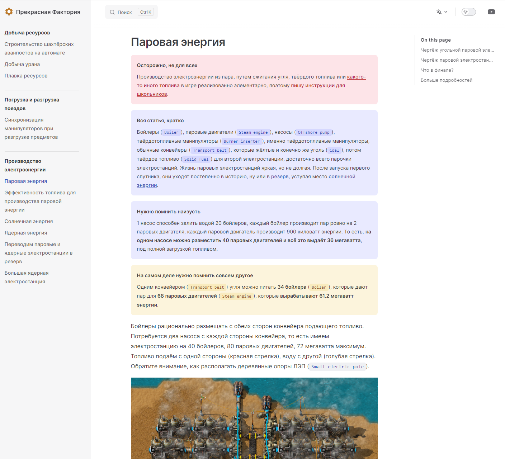

Давно присматриваюсь к `vitepress` на предмет использования в качестве нового движка для сайта. Получается неплохо, но есть и проблемы.

Больше всего раздражает, что `vitepress` уже второй год в статусе alpha версии. К сожалению текущий движок, `vuepress` уже устарел морально, а новая версия также, как и `vitepress` никак не релизнется. Не всё хорошо в королевстве `vue` наверное.

Также, не все фичи из `vuepress` перенесены в `vitepress`. Нет увеличения изображений, непонятно как работает `<img src="data:image/*`, иногда просто глючит. Зато интересно реализованы `assets`, более компактное оформление и на глаз работает быстрее.

Посмотрим, что получится в итоге.
