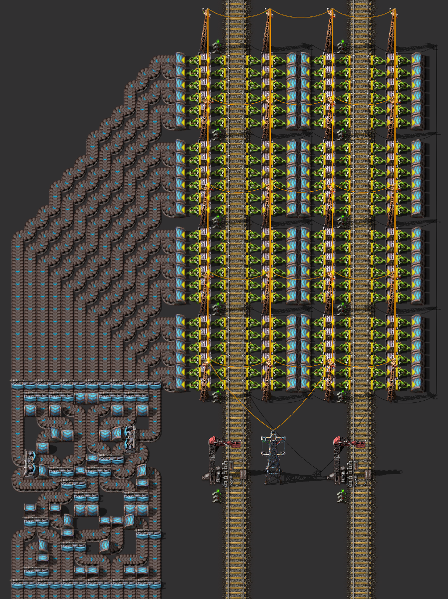
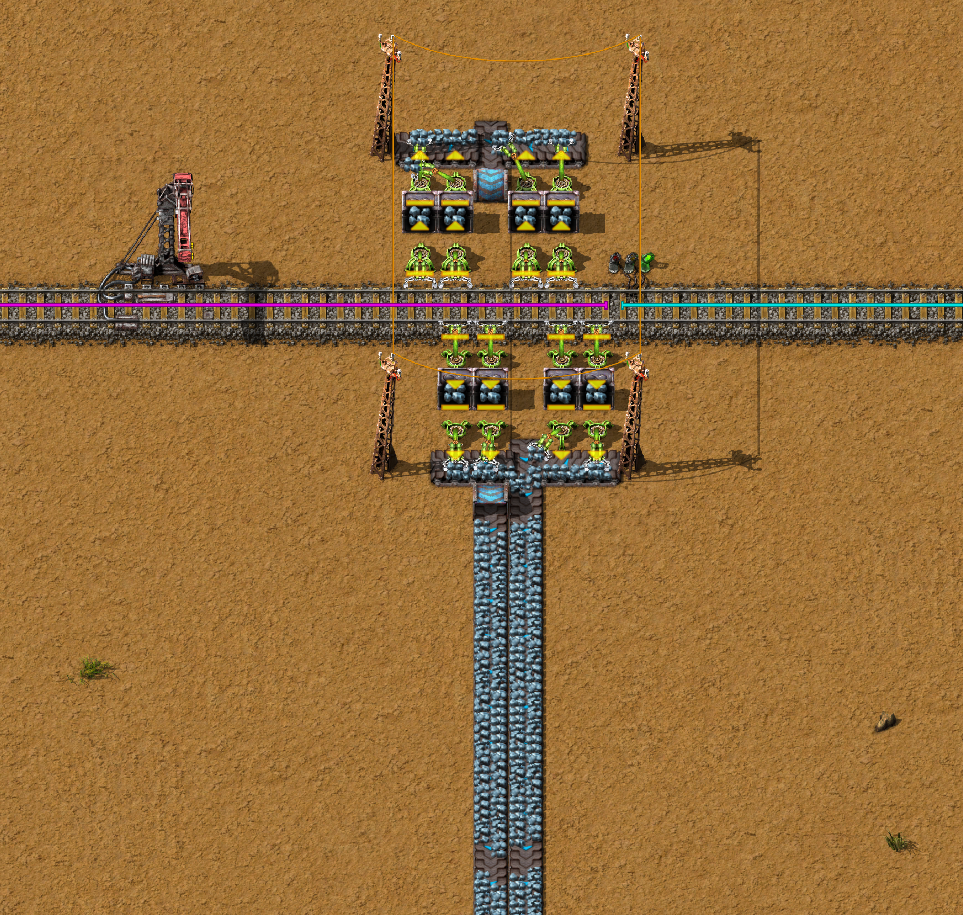
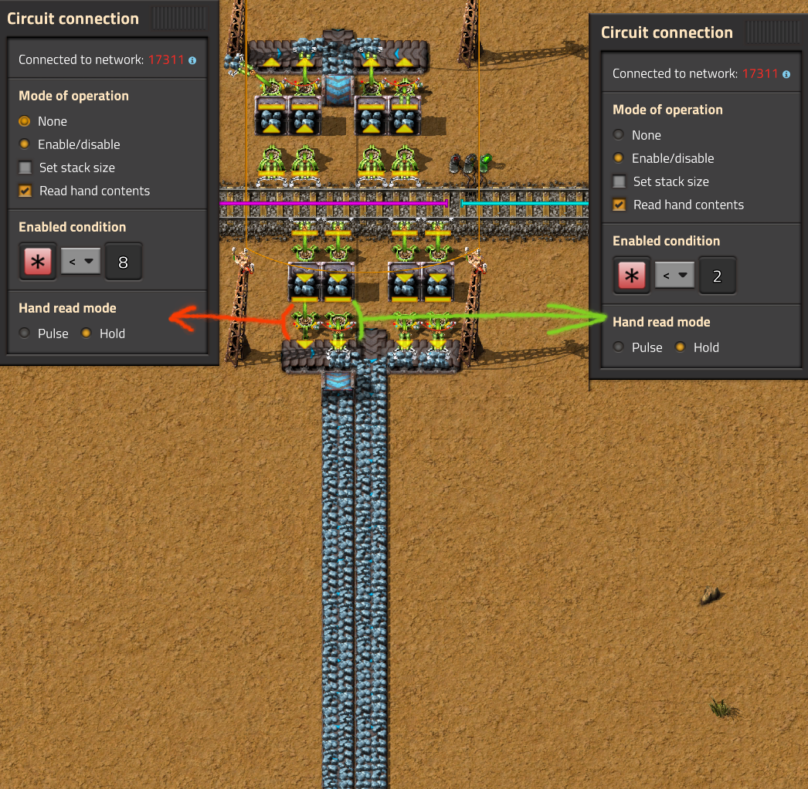
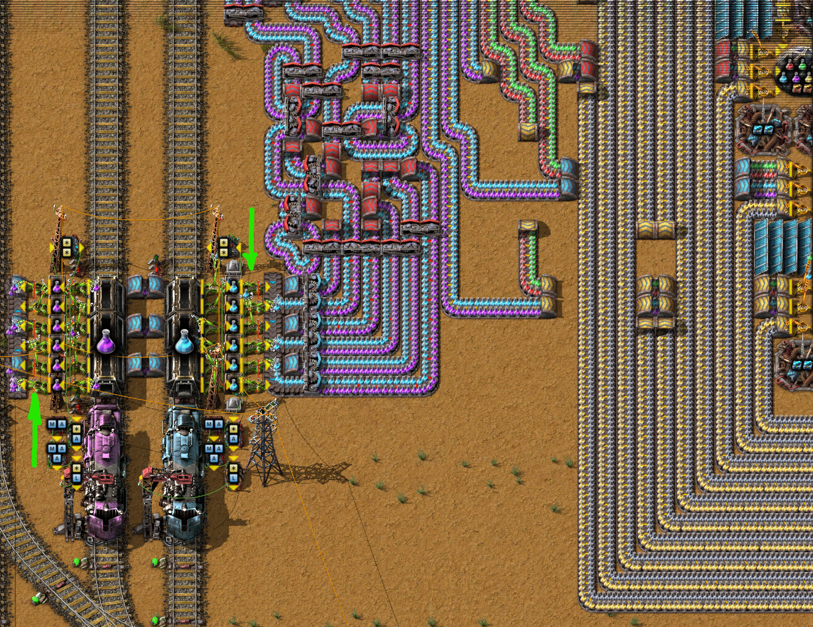

# Синхронизация манипуляторов при разгрузка предметов

> Согласно [Factorio wiki](https://wiki.factorio.com/Inserters#Chest_to_belt) 6 пакетных манипуляторов (`Stack inserter`), пристыкованных с одной стороны грузового вагона, способны постоянно выгружать примерно 1.85 полных полос экспресс-конвейера (`Express transport belt`), если каждый манипулятор будет выгружать на _выделенную полосу (lane) конвейера_.

Если требуется постоянная выгрузка, можно объединить линии полос с двух сторон вагона, но имеющиеся промежутки на линии придётся как-то затыкать, например второй станцией разгрузки.

:::tip А что если попытаться синхронизировать работу двух пакетных манипуляторов на одну линию конвейера?
Тогда может получиться выгрузка трёх полных линий экспресс-конвейера с одной стороны вагона. А ещё лучше, если получиться выгрузка трёх полных полос конвейера с обеих сторон вагона без второй станции разгрузки.
:::

Легко сказать...

## Двухсторонняя выгрузка по два манипулятора на линию конвейера

Сначала выдумаем такой чертёж, чтобы два пакетных манипулятора выгружали на одну и ту же линию конвейера, да ещё и работали вместе с манипуляторами расположенных на другой стороне вагона. И вот тут моей фантазии хватило максимум на два полных конвейера. К сожалению никак не приложу ума, как объединить ещё один конвейер, не выходя за размеры вагона.

Как и ожидалось, полосы конвейера заполняются не полностью, а нужно чтобы _"не было ни единого разрыва"_. Решаем проблему комбинаторикой. Для этого соединяем красным или зелёным проводом два манипулятора, выгружающих на одну линию конвейера. Задаём управление манипулятором на включение/выключение и читаем содержимое руки манипулятора. Методом проб и ошибок подбираем такие значения предметов в руке манипулятора, чтобы выгрузка была ровной (значения для правого и левого манипуляторов отличаются и зависят от чертежа).

То есть мы добились чтобы в каждый момент времени, только один манипулятор выгружал щёта на линию конвейера. Считать такой чертеж удачным я бы не стал, мы не добились выгрузки мечтаемых трёх полос конвейера.

## Куда бы присобачить?

На самом деле, не всё так плохо. У рассматриваемого варианта выгрузки имеется довольно практичное применение. С его помощью можно легко объединять выгрузку различных предметов с двух разных поездов на разные линии конвейера. Вот пример:

Такой вариант выгрузки нам очень пригодиться, когда будем строить мега-фабрику. Здесь у нас имеется всё хорошее. И шесть манипуляторов с одной стороны вагона и неперемешанное содержимое конвейера и вокзал компактный.
