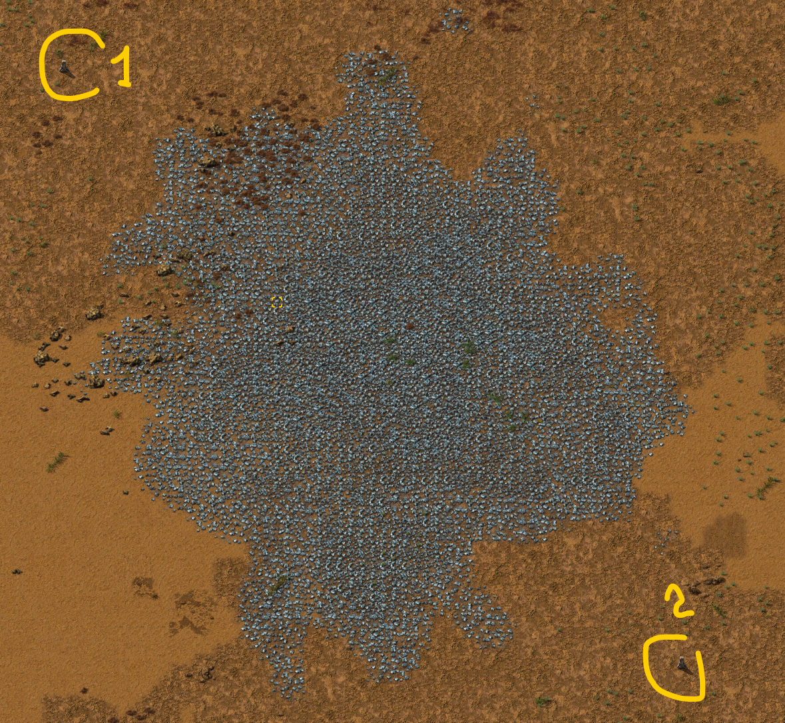
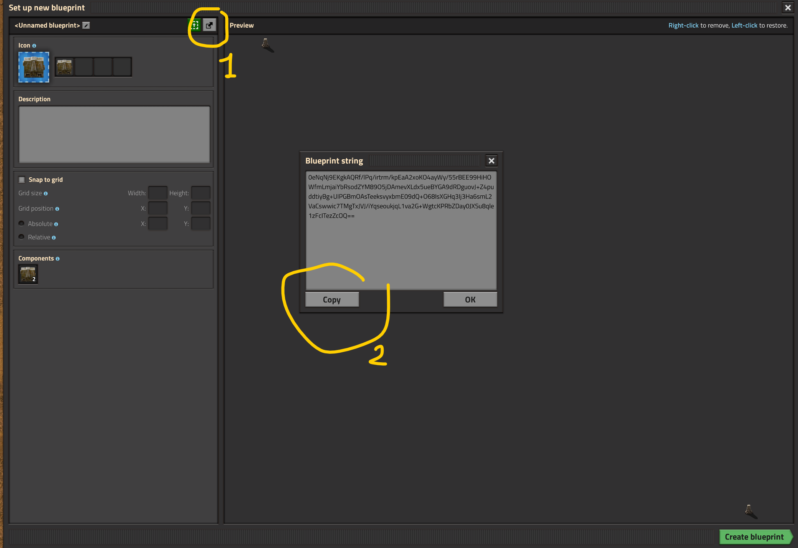
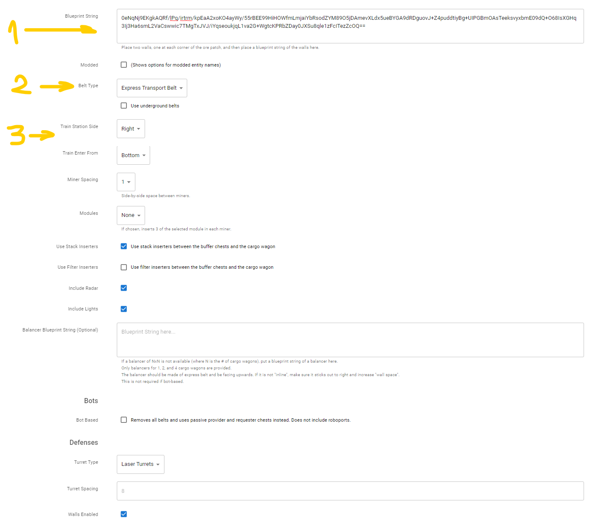
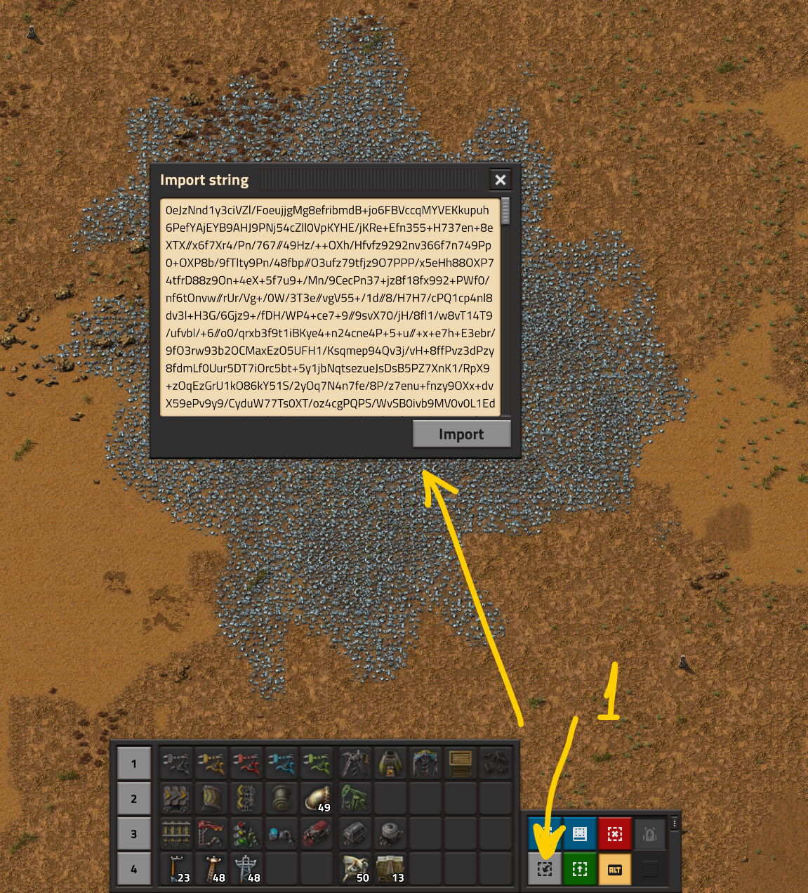
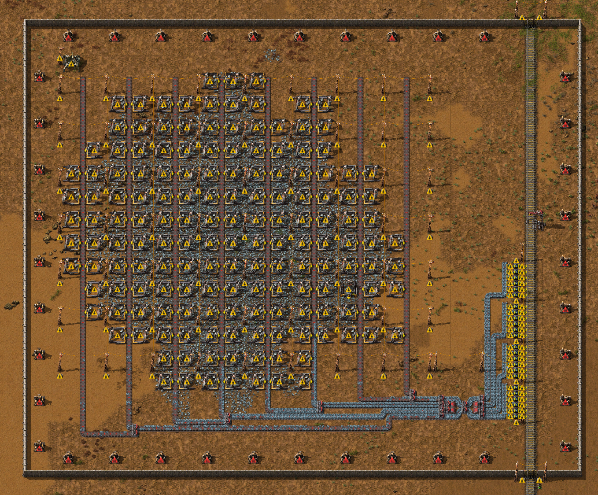
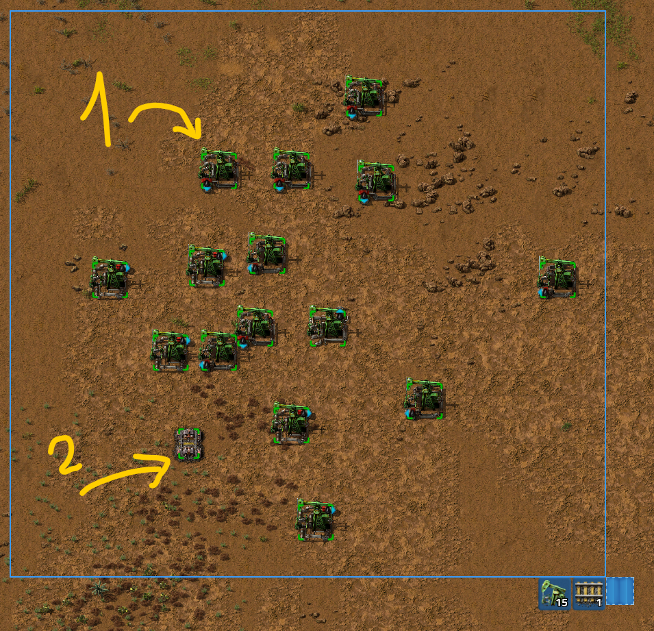
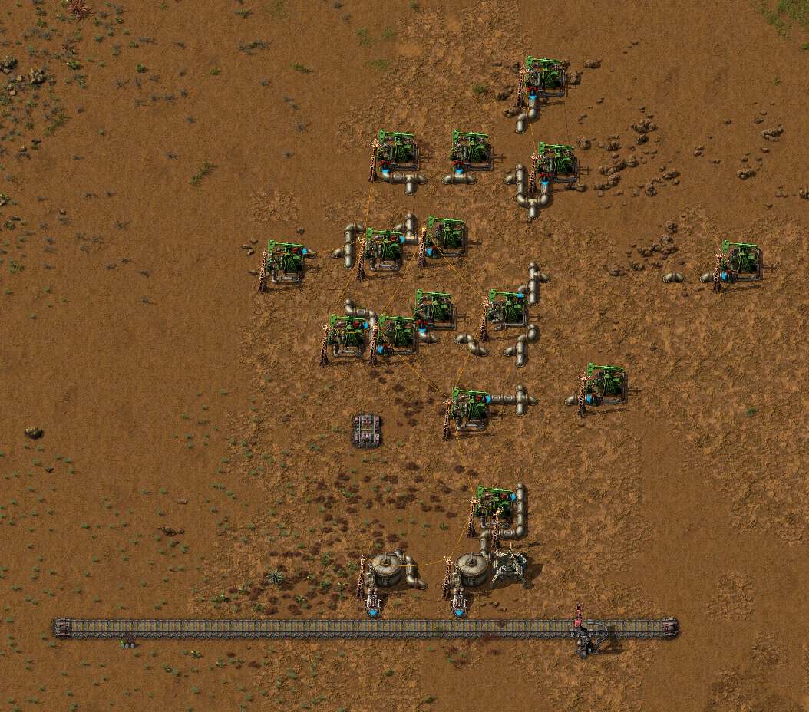

# Строительство шахтёрских аванпостов на автомате

Можно и на пулемёте, смотря как смотреть. А смотреть мы будем на одну тулзу, которая помогает строить большие шахтёрские аванпосты по добыче ресурсов, будь то нефть, уголь, камни или какая-то прочая руда, кроме урановой. К сожалению с урановой рудой беда, но урана обычно хватает и с одного месторождения, поэтому не грешно и руками построить. Хотя при определённой кривизне рук, можно и попробовать на авто-пулемёте.

:::warning Будет много картинок
и не только
:::

## Руда, камешки и уголёк

Строить такие шахтёрские аванпосты очень просто. Ставим одну стену (`Wall`) в верхнем левом углу месторождения, ставим такую же каменную стену в нижнем правом углу месторождения.

Далее создаём чертеж из этих двух стен (Alt+B, если что) и экспортируем строку туда куда надо.

Переходим на тулзу, вот она: [https://www.autotorio.com/outpost](https://www.autotorio.com/outpost). Вставляем экспортированную строку откуда надо в самый первый прямоугольник... э, на самом деле это никакой не прямоугольник, а html элемент [textarea](https://www.w3schools.com/tags/tag_textarea.asp), но кому от этого понятней. Выбираем себе тип конвейров (`Belt Type`), где будет располагаться железнодорожная станция (`Train stop`) и с какой стороны заезжает поезд.

Также, можно указать расстояние между бурами, электрическими разумеется, строить ли дефенс, радары, освещение, можно даже балансер свой указать, короче 100500 разных опций. Разберётесь как-то, не маленькие же. Поиграйтесь в общем, там кстати и перевод на глаголицу есть, качество конечно так себе, но если с англицким совсем туго, хоть как-то не тужить можно. И в конце страницу (прокрутить надо) получаем такую фигню, которую нужно скопипастить куда нужно (Ctrl+C, если что).

Возвращаемся в игру, импортируем строку (Ctrl+V, если что).

И о чудо, мы получаем готовый аванпост, вуаля, блэк джек и ещё кто-то там. Пользуйтесь на здоровье.

Качество, конечно оставляет желать лучшего, но работает и главное быстро. Подведите энергию, заправьте пушки и можно бежать к следующему месторождению, нефти например, а что кстати с нефтью?

## Нефть

Тут ситуация меняется, нужно расставить нефтяные вышки руками и сориентировать их выходы в желаемом направлении. Потом кинуть в каком-то месте железнодорожные рельсы (Зачем? Затем) и всё.

Дальше нужно действовать так же как и для добычи руды. Переходим на другую тулзу, вот она: [https://www.autotorio.com/oil](https://www.autotorio.com/oil). Задаём нужные параметры, на этот раз без пушек и стен, и строим себе аванпост.

Надо отметить, что с нефтяным делом, тулза изрядно глючит, липестричество не очень вдупляет, иногда и трубы путает. Проверяйте в общем и стучите автору, тулза на гитхабе хостится, каждый желающий имеет право править и жаловаться [тут](https://github.com/demipixel/autotorio).

## Больше подробностей

Детальный обзор смотрите на YouTube канале.

