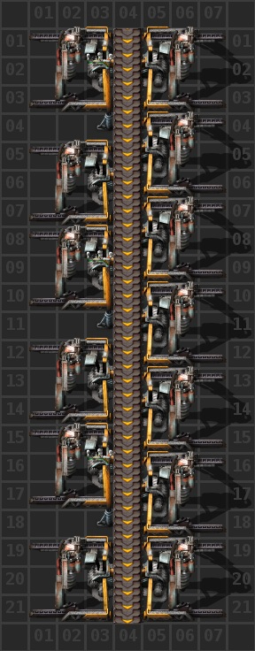

# Добыча ресурсов

Добычу ресурсов можно вести твёрдотопливными бурами (`Burner mining drill`) или электрическим бурами (`Electric mining drill`). Тут капитан очевидность спешит на помощь, других буров в игре как бы не предусмотрено, разве что киркой (`Steel axe`) махать собственноручно (*кстати, кирка почему-то называется стальным инструментом, оригинальный перевод, вот бы всем по стальному инструменту*). Добыча твёрдотопливными бурами стоит рассматривать как временный этап на начальной стадии игры, который стоит сменить как можно быстрее на добычу электрическими бурами. Добыча электрическими бурами ничем не отличается от ресурса к ресурсу, все чертежи полностью одинаковы что для руд, что для камней, что для угля, даже в какой-то степени преемственность есть и для добычи урановой руды (`Uranium ore`).

## Добыча твёрдотопливный бурами

Тут не будет чертежей, места добычи строятся руками в не большом количестве и подлежат сносу. Стройте такое где-то на обочине, по краям ресурсных пятен, чтобы не мешать строительству электрических буров в последствии. Исключение составляет разве что добыча угля, которая твердотопливными бурами может просуществовать довольно долго. Причина проста, как три советские копейки 1961 года чеканки, на начальном этапе игры могут случаться перебои с производством энергии, а твердотопливные буры, добывающие уголь от производимой энергии, не зависят совсем и способны поставлять уголь для паровых электростанций всегда. Перезапустить производство паровой энергии при перебоях с поставкой угля бывает затруднительно.

Тем не менее вот примеры:


1. Добыча камней (`Stone`) в сундук, камни нужны для производства каменных печей (`Stone furnace`) и бойлеров (`Boiler`)
2. Добыча меди (`Copper ore`) и руды (`Iron ore`) с переплавкой в каменных печах
3. Добыча угля (`Coal`) в твёрдотопливные буры, буровая многоножка так сказать, если понимаете о чём я
4. Добыча угля для паровой электростанции, дам всё-таки чертеж одного звена


```blueprint
0eNqd011Kw0AQB/CrlAHfktKk+dx3TyEi+RjKwGYSdrdiCAHx1UN4CkF88Azpjdw2UqSmmvq4H/PbP5NMB7ncYqOIDYgOStSFosZQzSBgeBk+hvfd4+559zS8Da9iEcZL7wocoKJmDeKmA00bzuS+1rQN2iIyWNkbnFX7Vb5VjMqtiIk3bqlISuhtPZf4AMLrbx1ANmQIR+6waO94W+Wo7IVfIQeaWtMYtgPruZEDLYhkZZ8oSWExnvm980P2j7JRGeumVsbNUZoJNFiGBzZOl+Hf8Ho+vD4LBxNwcNoLYo3K2KPzkZPVnMjhBbJ/Vo4m5Gh+M46wNweOL+/yz8RTXU7+AXtz4PTCX9n7sk97YSfmMGLi2+Q6IDMb0u5dZ0q2i6LO9uQ9Kj1+9MQL4tSPo9RfJWu/7z8B1IlS2Q==
```

## Добыча электрическим бурами

А вот тут чертежи будут и не один как прежде. Начнём с простого.


### Самый ручной чертеж

Чертёж стыкается по всем направлениям, то есть можно строить роботами без зазрения совести. Но вся прелесть заключается в том, что элементарно строиться также и руками в четыре простых движений, ну может в пять. Можно использовать для добычи урановой руды, если добавить трубы в промежутках между бурами (с одной стороны, где проведена линия электропередач). Короче, маст хэв на все случаи жизни, рекомендую научиться строить его руками, это не сложно.



```blueprint
0eNqdl91q2zAUx1/FCAYdOCWS/BH7NXa5lJEPkwkc2djuWCmBtrvZKFtht7voXmCQtU3Xr2SvIL/RjtwSxuxtR7pIgqTjn/45On8f+5CM0/0kL4SsSHxIpkk5KUReiUySmKhztVF39VF9Wp+oG7WKnTDaDZ4N5VCqz7D0Q13A95W6qU/q4/rMqT+qe7VSD/BZwxXL+kit1SYeSrrrqHMYbSDwTF0C60ItdaSj7oCwhuFK3apVfTSUDGK/QtQVLDw49XErpJlXPztxIOME1u/V9/rUUV/UN3Xu7IDOpboGOXrp1lEP8H/eN9Tb50PJtbYuZVoAYPRE/an+oBPgwMQ7nQ/YX20cHQCxN9uNG3FrALT/mFo6O42Aa435hyLiklKO8l6V9WaFmOpTeUvi0CUHJGZ04RIxyWRJ4peHpBQzOUp1RHWQJ3BgokrmcL0czfUoSZNJVYhJby6kkLPetBBpSjRBThNg0sWeSxJZiUokj8BmcPBK7s/HSQEB/0G5JM9K8VgsjUq66zc64Re2mYoCrmpW2cJt0dmWXhUjWeZZUfXGSVq1sfwJ2/8T63Vgualo/2+igw66ZyyaYUT7xliKwQa2B+hjDjDc0sv5KE172z3yLE3abPbE5g1bJmL2epztF7ryaLjXwR8YJ8XDJCUyxnIMlvZtC8/DFB6lxrIDlGxzG/oorrUPQ1Q6PNvSHmBKm5obcoDKSmDMDVFcSy/SftuMoctZlx2puR8p6o5NzR0ZYbjM2pFt3V01yOz7I0M1SHNrUlS3YdwcjOo3zLPOOEdl3LfOOKqjMXN7UlTPYaE5GNV1mIUpUX2BmZuSohoDt3dlgKkRbu/KCFMjnFneakPscw+3sCeq+3Dzp1eKaj/ctz7TCHWmFr5EtQhu7kvW0dPgPap59Yp/e5t2SToCEsy9EPO8qYw3SVE+1tWAemHEwiBi/QFni8UvURyXDA==
```

### Самый основной чертеж

Этот по сложнее, также стыкуется, подходит без проблем для добычи урановой руды, имеет немного большее покрытие чем предыдущий (хотя и сомнительно), руками строить сложновато, но возможно, обходиться дороже из-за подземных конвейеров. В основном используется на аутпостах (`Mining outpost`), по-русски слышал вариант перевода как `Шахтерский аванпост`, строиться роботами из рюкзака играющего.


```blueprint
0eNqdVe2K2kAUfZUwUGghionRaH72NWopfgwyECdhMikVCexuWdqypX2A/pA+QMG12nV1dV/h5o16Z1yCbQwb/RGGmXvmnDNnbpIJ6fkxDQXjkngTMqBRX7BQsoATj8AUdrBOL9Kb9ApWsDRggQu36Q3MYZZ+S7/AEu4NeMTFOSwRdw1b2KWXCu0ZrUbVfdHhHQ4/06v0AkErLCxhk37VkDnsvA63qgZMVRUx3+E3yiA3oh4MDdrBRgka8AN+wdR4CXdY/YPqqoTaD+jtM6zV5FWH24VkGrJVNuFeWf3H9YGUWuzwejHPbfpRBaL3GyqNA6/6kFtE5vVgZhoImcHaSD9pMX2qOdq/xslC8SkYhoJ6OwNVLjVe0c3RWWbhCbA3AjOU1gd5xOoCnw0uKF8L3LlSRlZwtz/sArNT+7dKM28QSYhJIt4NKzKoDAUbqIb4QDzXJGPitROTsH7AI+K9mZCIDXnXVwA5Dim2CpN0hNt5d6Rm1Kd9KVi/MmKc8WFlIJjvE8XABxQpreStSSiXTDK6J9ST8Tsej3pUIOAZKpOEQcT2bapNWtWGtokjygyYwF26aidmjt3O2KXo8igMhKz0qC/ztPUn2tr/tM4R2npGG+MxxVAEOD5DnPPrmFmkPIwlOaLjnBpOo0iseYS9cW70Tpnomxn7iA5YPKpkImHg0+KccEyO0LnnRuGUiaJ1cp80yvRJ+4w+cYr7JIhlQaNYtXPv0i1zl5Z1cj5umXys09/PZine+rnd4pbpFss52XYrbxs/jPpb6h38mE3id5EI1153I9bH+Xsqov29tCzHbdtus23XWnU7Sf4Cgl8+qA==
```

### Самый роботизированный чертеж

А вот и чудо роботизации. Чертёж не плох, имеет хорошее покрытие (можно сказать лучшее), имеет большее количество выходных конвейеров чем любой другой. Но при этом, не стыкуется по вертикали, не подходит для добычи урановой руды, безумно дорог из-за подземных конвейеров, не ровно выровнены выходные конвейеры, имеет разное количество буров на стороны конвейера, руками такое чудо строить трудно. Деревянные опоры ЛЭП (`Small electric pole`), можно заменить на средние (`Medium electric pole`).


```blueprint
0eNqdVm2K2zAQvYoR9J8dLDt2HF+iB+guJR8iFTiyseXSEAJJtqWUXVp6gFJ6g92lhpBs3StIN+rIyaaB2GysP1Ekzbz35klje46GUU6SlDKOwjkak2yU0oTTmKEQiZ+iFFu5lLdyLTaiCI2+3bFfXTHxQxSG+Au7v+Un9Ss2cm3AsJPf1FCKB8j5LDaGvJFLcS/+iPvOFYPEX3INC6WKl3cGQN+ILew/QSgEFRC/T4dJaaqlUuHdy+8K/wkit3IFUtS/nbxT+89KTnQeJYhHSP0qv1QZwPBwkAOTjlFVV6NffhQlRAGmXAFeKR5BSAG0OwVRqEUlffW/ElHsxQAhVLCs9JewfdsxkIkyNkgsHluTlI6Vxx9QiG0TzVAYLExERzHLUPhmjjI6YYNIRfBZQsB+yskU8tlgqmYkIiOe0pE1pYyyiTVOaRQhhcDGRGEurk1EGKeckj1gNZm9Zfl0SFIIOELlkJFO0hhGa0giDiRJnNH9qVcCg45XKbQ7HjCMaQrc1W7XPKpjSc6B/4zHacHjHngcDR73yJNNB1FkHQ1K4og0U7kVFSN08m4Y56myyjexd13D0H3B/EYO76ycGnSvLbrfhO7UoPvt3Hk+8O65O66J/Tp3em31Y7upAL8GPtC4rr7GNepr8HjNPHHOG4hU07c07EAXXHLgGGv0XaBhGNZp8J6WY25bx7ymuupuGG7d38EJfB2gp/dI6l/edFizr7F9+WMP9zRaAmOtEw407hJ2X6aCd2H1+gxPvm9MFA0AGdZeQ1Sc8QyW3pM02/dUgLu9vtPz+44duM5i8Q+oP2uL
```
::: warning Маленькое замечание
Данный чертёж предполагает размещение разного количества буров на каждую линию (сторону) одного конвейера, поэтому когда у вас будет прокачанный уровень продуктивности добычи (`Mining productivity`, исследование такое), такой чертёж уже не айс. Например, на 65 уровне продуктивности добычи нужно всего лишь 12 электрических буров (по 6 с каждой стороны), чтобы полностью заполнить экспресс-конвейер (`Express transport belt`, голубой который) добываемым ресурсом.


:::

### Исчё один самый роботизированный чертеж

А вот следующий чертёж будет хорош, на высоких уровнях продуктивности добычи (`Mining productivity`, о чём говорилось выше). Тут исправлены проблемы предыдущего чертежа, а количество выходных линий хватит на несколько погрузочных аутпостов (вокзалов).


```blueprint
0eNqllk2P2jAQhv/KyFJvCSIkIR/Hbntr1UN7K1UVwhCsOnZqO9UixH/vJFkFtGRZ5FwAk/H7zDszsXxiW9Fio7m0LD+xHZpS88ZyJVnOntQ/1EWFOaTxIvmwkR9RWPiCsrIHaFDDJ82FyCHbyM+FobB4IynoCLb4w2UF9oBAirySsNeq7tdPqm6KklS4HB8WcgdG8OpgxRHUfm/Q2nF/hzBgVb8SuLd9uO6iPQhhSykZ2gRKI5QFkbgFcjPEm6KmDwLiAn4cOOmQO4Gmf9htJcXRTY+CbWtB49+W65cwoSiVlzDitHKHutKKvqGr3ZDBYiOZx3ippGH5zxPrfBWiK6k9Nki15BZripCUEK1QYEmplH7NJTn1ezQ7kwKpP7M8OP/yGErLLcdBsF8cf8u23qKmgIvUc0OZGv8qL79LiWCNMnxo5YmRqB8s09Ui9tiR9gch/STgjnyWQ1DkjcnKprWUzg125YgNLtjYARs6YpcXbOqAjd7p1yQzGplR8Jq5moDEszt5y3nA23o+dvk2VrX2DW7iUtPlHa/rCUjqAgkvkOiRxmWz34UodKlgsHRwl2R33E2VMLicMDXueFv7I6xRAt+11r3mU7LzT5Db/B8Y9yB0GYmrYU8eGYkgmn1Q3YIecRfP566dZnHtMovpHbeTs5jMP6wyJ3vp7GmNV07gbHZD4/h9MF0y+ntJfnUL9JgoSJ/++7pewLf+NgbfRdE/ovugGaY/pd5lqyQJkyxOo/P5Pxc/YXE=
```


## Больше подробностей

::: tip Это интересно:
[Много разных чертежей](https://www.reddit.com/r/factorio/comments/ig96gm/big_book_of_mining_blueprints), есть интересные варианты

[Кое-что ещё, но не очень много](https://wiki.factorio.com/Mining)
:::

И вот вам [сохранёнка со всеми няшками](../../saves/AwesomeFactorio%20-%20Resources.zip), чертежи в книге игры, разбор всех полётов [в этом вашем тубе](https://www.youtube.com/playlist?list=PLvB0qwWjZb4KL5HZqJnKbtlvfdKMYzCs2).


Детальный разбор добычи ресурсов смотрите на YouTube канале.

[](http://www.youtube.com/watch?v=ZI2aVerqCT4)
