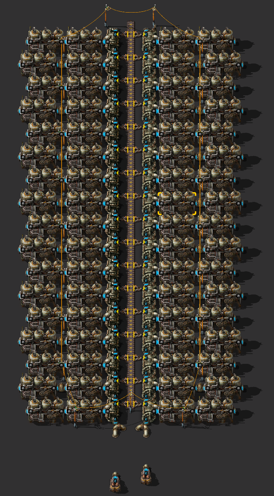
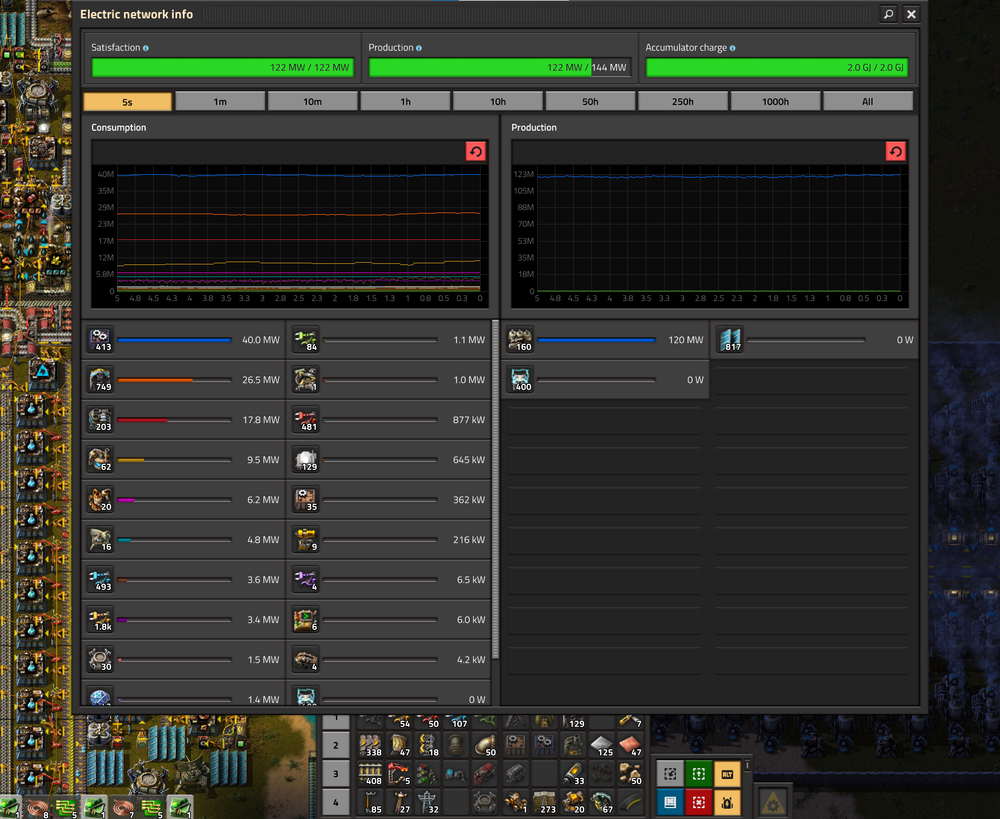

# Паровая энергия

Производство электроэнергии из пара, путем сжигания угля (`Coal`), древесины (`Wood`) или [какого-то топлива](https://wiki.factorio.com/Fuel), в игре реализованно элементарно, поэтому [пишу статью для школьников](https://habr.com/ru/companies/itsumma/articles/551622/). Бойлеры (`Boiler`), паровые двигатели (`Steam engine`), насосы (`Offshore pump`), твёрдотопливные манипуляторы (`Burner inserter`), именно твёрдотопливные манипуляторы, обычные конвейеры (`Transport belt`), которые жёлтые. И конечно же уголь (`Coal`), потом твёрдое топливо (`Solid fuel`) для второй электростанции, достаточно всего парочки электростанций. Жизнь паровых электростанций яркая, но не долгая, после запуска первого спутника, они уходят постепенно в историю, ну или в резерв, уступая место солнечной энергии.

Нужно помнить наизусть следующее: 1 насос способен залить водой 20 бойлеров, каждый бойлер производит пар ровно на 2 паровых двигателя, каждый паровой двигатель производит 900 киловатт энергии. То есть, **на одном насосе можно разместить 40 паровых двигателей и всё это выдаёт 36 мегаватта** под полной загрузкой топливом. Обычно ставят два насоса с каждой стороны конвейера подающего топливо для питания бойлеров, то есть 40 бойлеров, 80 паровых двигателей, 72 мегаватта максимум. И вот тут осторожней, полностью загруженный конвейер угля, жёлтый который, способен питать **только 34 бойлера, то есть 68 паровых двигателей, то есть 61.2 мегаватта максимум**, ещё какое-то количество энергии уйдёт на питание твёрдотопливных манипуляторов. Другие типы топлива, кроме древесины (`Wood`) разумеется, такой проблемой не обладают. Использовать красные конвейеры (`Fast transport belt`) или голубые (`Express transport belt`) любят разные там любители, *"но у нас таких нет, у нас все нормальные ребята"*.

| Топливо | Конвейер | Насосы | Бойлеры | Двигатели | Мегаватты | Примечание |
| ---: | ---: | ---: | ---: | ---: | ---: | --- |
| | | 1  | 20  | 40  | 36 | Максимум на насосе |
| 900  | 100%  | 2  |   34  | 72  | 61.2 | Максимум на угле |
| 360  | 40%  | 2  |   40  | 80  | 72 | Максимум на насосах |
| 900  | 100%  | 5  |   100  | 200  | 180 | Максимум на твёрдом топливе |

::: tip Важно
Используйте только твёрдотопливные манипуляторы для загрузки топлива в бойлеры, другие манипуляторы дороже в производстве и содержании. [Где пруф?!](ГдеПруф)

Не используйте быстрые конвейеры (красные) или экспресс-конвейеры (голубые) для подачи топлива в бойлеры. Такие конвейеры можно использовать для подачи топлива до электростанций, но потом распределять на обычные конвейеры (жёлтые).

Используйте 34 бойлера для паровых электростанций на угле и 40 бойлеров для электростанций на твёрдом топливе. Такие электростанции питаются от двух насосов и одного конвейера топлива, чертежи ниже.

Не используйте ракетное топливо для производства паровой энергии, оно не эффективно, [пруф](EfficientFuelForSteamPower.html#твердое-топливо-супротив-ракетного), [исчё пруф](https://www.youtube.com/watch?v=avZhWqnDwHI&t=224s).
:::

## Чертёж угольной паровой электростанции

Стандартный чертёж на 34 бойлера, что является максимумом для одного простого конвейера угля. Максимальное производство 61.2 мегаватт энергии. Подача топлива в бойлеры посредством твёрдотопливных манипуляторов. Обратите особое внимание, как проведена линия электропередачи между паровыми двигателями. Не нужно раздвигать бойлеры одной клеткой, чтобы протянуть ЛЭП, нужно раздвигать паровые двигатели.



```blueprint
0eNqdXMtu40YQ/BWBZ2kxPZxHj4855BYkQA45BItAtrleAhIl6JFdw/C/h5KDtdcaWtUF7B5sWMXuaVazeqbEp+Z2dey2u344NDdPzX23v9v120O/GZqbJsknP/vtr/msDbNfNv2q2+3ns6SzPw/dcj3rhod+6Mbf+NnvX77sv2523Wx7XG/H36yX3/v1cT3bDOO/bvbYrVabb7PbbnVo5k1/txn2zc3fT82+fxiWq9N1D4/bbrxgf+jW418My/Xpp9vzJZvn8SPDffe9uZHn+dUP7U+xLV5ie/NRD3z09rgbut2iH/bd7vDThVvg04fdcthvN7vD4pzn64fD8+d50w2H/tB3L3mff3j8Zziub8fL3Mhr8OvlarXoVt3dYdffLbabVTdeYLvZ9y8VeWpGvBjdpzhvHkfk0H6K44WGrn/4ers57k7w7Vzi51O8767ipyKtXKB9d4H7fjeGdP6LUIFurQmkjxKQuQ+1BEK9xpfwwf+Aj+/D9xXgCANnG3B6fytXlkKmAFMFMFM1jEgNdZIGFezXBQ7IOhQq7ICELQ5Y42QpmohlJcJ0uLUCikfvtVhs95q0KHIKRmScePIDWSHkaGwc4TX0XGscQWqNQxJBcCyBbGC4QjcIycMMhcsRMSNE9I7CThC2GEgOFc57juQZqaFvCZJjYQcjYZL/iDDtPLqqVICfiCkaE3il4rbfXqH4CbGGwT0FC3SnKYWtEHa5lvubak3k3jq7CIqCVKYVe5MEkT3eJC8RawRrW6ZKl9hVLRuoBnzS5MBSRCpwBwWe8CYJFi5TTfIy3GoN1d4kwbCLXQlhyMHZlVCEFHIQWgnF2ggV5ylXZyhPsBzLoDWwHNLKIVBkgSbWEDmWt9BSJCpwDwWeDSzHCqccy1uohoVgORR2dLQUqjFmVFY51RgTxa6FwAw8roXOiDUM7kkI7QhEjn/Q2B4jroUmc0+EFoLmpJiJLokhq6FLQsNGpGa6CM10yXFdMkGbY0IFDg2MyRu6JFS41HJdMiE1TIHokljYkdBCGHKya6EEieSUeS1ULjv7KK1KW+vsSe0sBzMoOMsTpJYzycSChJs5JkIDdaaOHSI0UOcWZzlWuBw4lheohtHOcjDsxGuhCmNGaSXO1yiTs10MgSkoLobOiDUM6lGYoOlaqe3NBG05qOBiaCp39XYxlKBpRluiTWLIwdAmoXFDubEueShcaqxL0Fin1J5mgmZdVUObxApXqDZ5uRS1GhZHtEko7CJ2MQQie0IMQSq5tLQYSvGytY/aSqTUWnsJBM2xFKKB5pBeLomjOXTcWTgqQmNvoY4XEjSul2KgOVQ4cY7jOeRlECcE0cHAPS2IaqwZ9ZV4rR4tu5ZQRGASwSCJUl0WiKNOHFLGvBfcEzFh4NmgiibTV0IWFaw8hWiYGDRkapEpyCrZhJrxEjTjiXiuH2MeC6H2OJNioXMTX8LMHBINPRm8NxLRNUHoTOgjEFrtAil7DLrQCinLZa8fBZeEqoFSvLMzHkwCcrjIFGTdacaRMgsWMEXKDM3D4qmTh+wwcAMn0eolqolkwQqZ7YxHA1daJ9W4c9JdEkOdPMUulMAs3phirgqlM2QVhHpAZmgCl5baBc0eA29xoTSdPuGuzqAxlfBXo9AGh3XGppKWGv9yxErFuTtzwFaD2v/MmM86cLNgxmzRweDwBO+NQFitUWjCa41CE2brjOnowLutc81tPQovyXXDdSAc12gWBst1xlR6IFmJea4Dx0psAo/UsUTGJvDIfRMiQ74FiYYzevDeiITxGoXmnddV8ozKS7RqvpZIuK/RLAz26zxhQZbIPSGxrYRI7ZBmbNiPBgf2ZPqJsGArNlQlwoONQhtM2IrNJYkaARUbARNnw1aHrQa1K6rYgJm4aVAdtuoGAyh6bxBWbBSa8GKD0JkwYysmpDPvxtaaG3tUXlKqfmzJhCEbzcLgyFZMpmeSlS0WMMdKbATP1FmFYiN45r4poS226oYDfPTeIHzZILTyxuwqeUbl5V3Vmi1KeLPRLAzmbJ0wKItyT0hsL0GpTVLFpn01+LOn0ycM2ooNVUo4tFFog0VbsVFHqRFQsRGwcNZQxQ6hC7UtqtiAWbhv4SpkEpFisIeC90YhjNooNOHURqEJq3bBhHThvdpacZ6elJf3VeupFMKujWZh8GsXSKZ7R23MKPZFYseREvsGtOPODRU6CPbOQEqset5xR/hasEISrm00cN62XSXPqLy8r44Z3hHGbTQLg3O7TLiXvaOekEWwt0dQXCwOAzeYtyfTF8K9XaChygth30ahDf7tAo06XjgDd/FYwFbCvbkbat8Z9X6ScEJtkhaP3XOGgRCtJWfpLpAXxXvC0w0G7glTNwptdZGGH+81KxUX6en2m9gG8v7qGX6Un7CrID8bRheHzeJhtzkO9x9zJ2IljAbwMA1eX+mr5xIxXk/fqkWTu1auiY0H79WwGK+FS1ORFwNcvAr3zg+DRRcd9jB945PZ/P/Wx8XprY8fhQpje2IdosMe1G9sMlcDf12USkP+PH958+PNm1dnzpvVcuzu4+9mvx7H++7+/3dk/rH5du6g/3a7/cvtrxJy8TnF8b/k5+f/AKJJp4U=
```

## Чертёж паровой электростанции на твёрдом топливе

Тут всё то же самое, только 40 бойлеров, что является максимумом для 2 насосов. Максимальное производство 72 мегаватт.

```blueprint
0eNqlXctuG0cQ/BWCZ8qYnumeh4455BYkQA45BEagx9pZgCIJkkpiGPr3LCUnkq1Zq7p4EwmxdtTb3VM1XVp+Xl6v74fdftwcl5efl7fD4WY/7o7jdrO8XJa4+Om31ULD4oftuB72h9WihsWvx+HqbjFsPo6bYXonLn7+8OHw53Y/LHb3d7vpnQ/3w3q4XVx/Wvy6XY+3ix+n18vVcrzZbg7Ly98/Lw/jx83V+nS946fdMF1oPA53029sru5Or64fL7Z8mD6yuR3+WV7Kw+rNDx1Oq7p4WtWLj0bgo9f3+82wvxg3h2F//OrCCfj0cX+1Oey2++PF9bA+vviwPrxfLYfNcTyOw9Pf/fji0x+b+7vr6TKXMoexWu62h/HpJnxeTlAXReo7Wy0/TT9KiO9susrtuB9unn5HT8v8Bjz2I9OBju0/6Na+RY4d5IQjqw9Zn5HvrtbriymNbo778eZit133LyDPUZHHK2yG8eOf19v7/SniIisp7zsXsm9zrYs9t/TcQcyz2dS7me152QEJTCEzRZBMqSR4QMCbKy7lO+i9qEsAbqRkTw6KeJNQ7LtJqKvYzUHBK1Sir44EL9FQnNBKZctr8F6yiHHgFQLPcFBS+B86Q0Ep7sb1HPbSSxlN3ZR5LtXduHsL+LT0Hkhj+jcUhxg8fTUjFR6Fa6xfwvrWgiOXcAXagRMHniFw5Rrr66V3o26evorlRmbaHQbtLr/Qvld+0xZg3fqLb9ffC+SZ+ot4/YXsC0QKDOlLELQwXQODjp6ukZD8TYnsGgotmNwDDSnsRO6BCoFnsmsoFPXi6RpYblSma2DQjSFJELQG7h4m5B4qJxsbpBo1MiQJ0jCaziBJPXFXVrn1urSqhyWFfpdWY/odFojs6XeQDtJC9juBFswpxAapT20cOKQ+LZD9TpCom3j6HZQbRolCDDqdwZI69TexrtKtP1MPS5qpPzOGJWGByARLqpCesEJ0DRC6OrpGhVi+Na5r1IosOHObYIVOCjK3CVbopCBHrmu8Ru+eFCZH18ByIyvRNUBoI1gSCJ25ewiJ78wdmVZIfOdKsKQKaYvceJZUrXOUlFbNel26BAdLelx7D4RRhVggikcVVkifFFIVVoMWzKnCCqnCwqnCCqnCQqrC10vvRt2jCsHcYFQhCN14ltSrv4l1SegWYA0OmjRXgFUImoRFojITxAoJisqMEEFo9bQNiOZXI9tGhBZM7oLQWUEld0HorKBWsm1EKOrN0zag3GiBaRsYtDA0CYPmZhQVUt+Nm1FUbParBE0qkLhoxtOk0l636Yl2SZRem27ZwZMeF98DYXQhGAmPLiyQQmmkLizYBDlwwrBgI+TAKcOCzZADKQ1Lw+wMHm2I5YcERhyi2MazpV4ZTuxLUrcMJWQHXZqrQwmF4EtoMCpBmIph2MzQHsQWz9S+QJxfhBzbF8xvIdyeWKCjAxFuUywZQycn9yVjkfeM7tEMYWb3KHYhmBOKzQ0uimE3kptcFEiTSwwMeYIkh0Q5gz2l1217YmOiMya36KFPcaZtR0YwosHwKMYCaReJpGQsCVsypxlLwjKPE40lYuikaiwJi7xHNoIZkhjdiGLLGQyqU4onSibWr8UUPRRqrhZTYigUGA0lKFQGPbHMRB/F9oz0M6YFEjnTLwFbMrk3QscKksi9ETpXECXH+gUzlatnrg9miDKDfRSbsXuj2NxUI2NiXbmxRsbEujKO74wpED3D8p17ntN4+l+VvutbPbbvPGf7VkZCgtEwj4TMmJAxUkLmgi2Zk5AZk5DGSciMSUgjJWQuWOQ9EhLNEEZCothn+L+7tTiRMqn9WjSPBXy2Fo3xgIPRyIwJPGPCIzPzfhTbM/DPmBrI5MQ/K7ZkcnPEzhcyuTli5wuZHPpnxSLvmfqjGcKM/VFsxg0OYhdu4JExuV64gUfG5HphDOEZkyDlDEd47jnCJ1ImretJleIxhecZU6oUSkOC0XBpSEzJFFJDZsGWzGnIjGnIwmnIjGnISmrIDHlGpLo0JJYhldKQIPYZ7vBuLU6kLIZ+LVaPQXy2FivjEEejwVjEDRMelfECoNgeM4BhaqCSbgDDpqaN2xwNO2Bo3OZo2AFDI90ABtkwpHncAGCGNMYNgGIzXnEUmxt5GCbXGzfyMEyuN8YubpgEaWf4xc16/1WXVjF2DasxeCzjNuNYjYHRkFg0YvBoSIOUTAykhjTDlsxpSIM0ZAychjTF0EkNaYZF3qMh0QxhNCSKfYZ3vFuLEymLqV+L4nGPz9aiMPZxMBrC+MdNMGzGD4Bie/wAJthDTEg/gEVsyeTmCB0wRCE3R+wxZUL6ASxikff4AcAMiYwfAMVmjOQoNjfyMEiuR/JxNxYwdMZLrhWLyxlmcu24WE+kLFrXxhqjx06uMzbWGBkNiUbDoyEVUjIxkhpSoSF1TJyG1IY9xonTkFoxdFJDKuQiicmjIcEMSYyGRLHPcJT3avFEymIO3VpMHkv5bC0mxlKORoOxlCsmPBLjBwCx1eMHUEwNKOkHUOwZYsptjoo9Ck65zVHBZ8GRfgDFHsGnHj8AmiGMHwDFZizlKDY38lBMrpMPw1FMrhtjKVdMgtgZlnLt+FjnzqDM4yfXGQ9rNEY/opHw6EfFVIyR+lETtmROPyqmH62Q3Slhsame7gTew8Z0Jwz7pT/HzXB6lTJzQvTCqwOwm7lKyZFhN2Ak0tu1/NyHwtwKv54mXhy3Fx/32/vN7RulAU3Q4wsTDoBe5tH7EXibgUp+OwLFscbniKY2h1c9f3P+Gu/96un5+JcvvlhgtVxfTe1keu/xCwGG2y/fIfDL9u/Hcv1r2B+eglRFS4slZ6u51oeHfwF3Gqbd
```

## Что в финале?

Двух электростанций будет достаточно, чтобы запустить первый спутник. 148 паровых двигателей от 74 бойлеров (34 на угле и 40 на твёрдом топливе) могут производить примерно 133 мегаватт энергии. Для удовлетворения потребностей [первоначальной базы на 45 научных пакетов в минуту](https://kirkmcdonald.github.io/calc.html#zip=bVDbagQxCP2bPCVld7vTpQP5GOs4ray5YMzD/n0TaAudFkU8F1HcwCCew4hXpzVeHc6SOMeL27tmQIrNiCR8IfdGYnGHZsEUcqtFLUzOsVFqEbqVBMYlh4ZMGSlUwPu6r4uX8s7NGI/Ki8cPSowgR+V88d1Y2B5H5ebT5EH/KIuvWraO/91w82109JvW9bp4BZZhOD0tHhB76gJWdJ7gWxHQYc0k35i38Y8B5+jJpbFOqEUteCcbTrW1Pv/kJw==) требуется 127 мегаватт, **не включая** расходы на манипуляторы, подсветку ночью, радары, дронстанции и прочее. Добавляйте солнечные панели по мере возможностей, чтобы уменьшить производимое загрязнение и снизить зависимость от добычи угля и производства твёрдого топлива.

Расчётные данные потребления электроэнергии сходятся с экспериментом:



После запуска первого спутника, можно полностью переходить на производство солнечной энергии, переводя паровые электростанции в резерв. Потребуется не менее 3,400 солнечных панелей и 2,856 аккумуляторных блоков для начала, что даст около 143 мегаватт энергии.

## Больше подробностей

::: tip Это интересно:
[Таблицы расчётов и прочие интересные данные](https://factoriocheatsheet.com/#basic-power)

[Кое-что ещё, но не очень много](https://wiki.factorio.com/Power_production)
:::

Детальный разбор производства паровой энергии на YouTube канале.

[](http://www.youtube.com/watch?v=RQ80eZAnZ1Q)
