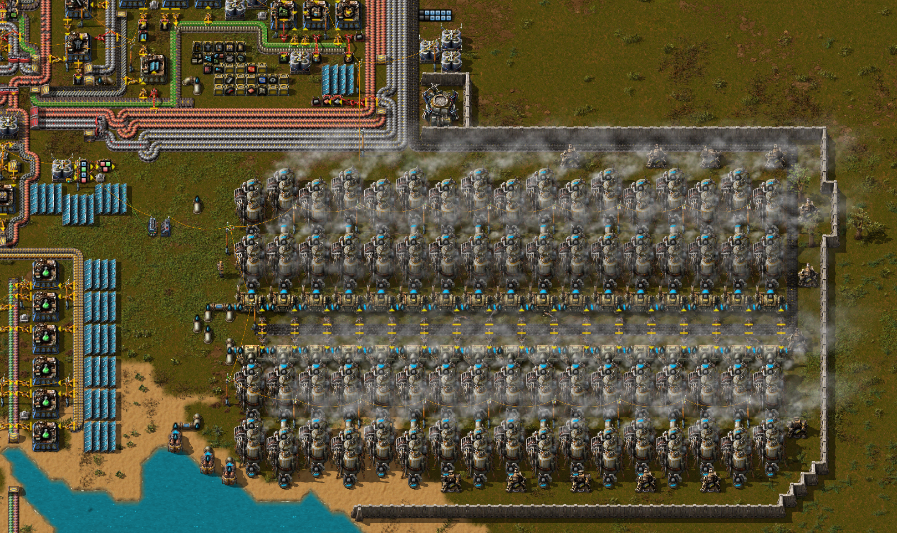
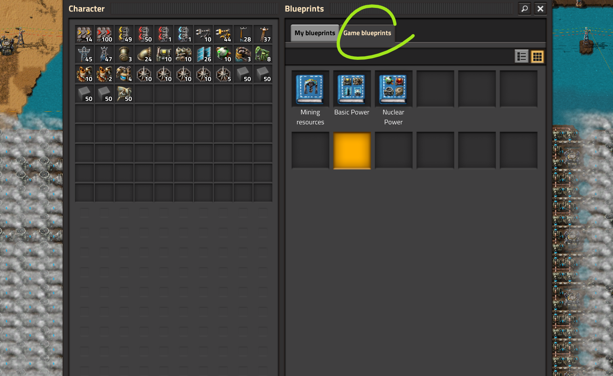

# Производство электроэнергии

Игра в Factorio делится на два этапа. Первый - *строим космический спутник своими руками из палок и чего-то там исчё за 8 часов*, второй - *мы верим, друзья, в корованы ракет* (тут не опечатка, именно *корованы* 🐮, а не то что вы там себе по напридумывали).

::: warning Тут нет чертежей
Статья обзорная и точка. Чертежи пощукайте в предметных статьях:
[Паровая энергия](SteamPower.md),
[Солнечная энергия](SolarPower.md),
[Ядерная энергия](NuclearPower.md)
и прочих.
:::

## Этап первый, космический спутник своими руками

Производство энергии на начальном этапе игры заключаются в строительстве достаточного количества бойлеров (`Boiler`), паровых двигателей (`Steam engine`) и снабжение их углём (`Coal`), не забывая при этом про насосы (`Offshore pump`) подающие воду (`Water`) в бойлеры из ближайших луж. По мере возможностей и без особого спеха производим солнечные панели и устанавливаем их в пустых участках разрастающейся базы. Одним конвейером (`Transport belt`) угля можно питать [34 бойлера, что даёт (аж?) 61.2 мегаватт энергии](SteamPower.md). Этого достаточно, чтобы пережить продвинутую переработку нефти (`Advanced oil processing`) и даже дожить до начала строительства дронстанций (`Roboport`).

Каждый работающий бойлер [загрязняет](https://wiki.factorio.com/Pollution) аж на 30/m. Что бы это не значило, это много, поэтому паровые электростанции являются источником сильного загрязнения, что привлекает местную фауну. Имеет смысл огораживать паровые электростанции стенами (`Wall`) и защищаться турелями (`Turret`) по периметру.

Начинайте производить твердое топливо (`Solid fuel`) как можно скорее. Тут напомню, что производить твёрдое топливо лучше всего из дизельного топлива (`Light oil`) [пруф](https://youtu.be/avZhWqnDwHI?t=66). Сразу после открытия продвинутой переработки нефти (`Advanced oil processing`) добавляйте бойлеры на твердом топливе и паровые двигатели в процесс производства энергии. Это желательно сделать до запуска дронов, иначе можно попасть в блэкаут по части электроснабжения, когда дроны начнут возводить оставшуюся часть базы (надеюсь вы играете по заготовленным чертежам?). А ещё, можно хапнуть проблем с электроснабжением и раньше, в зависимости от того как вы строите. Поэтому не откладывайте строительство электростанции на твёрдом топливе.

Солнечные панели (`Solar panel`) строим сразу как завершим соответсвующее исследование `Solar energy (research)`. Но без фанатизма, ресурсов они требуют много, выхлоп дают маленький. Массовое производство солнечных панелей можно освоить после запуска спутника, а полный переход на солнечную энергию и того позже. Одного заводика, первого (`Assembling machine 1`), где-то в конце других заводов, производящих всё первое необходимое для жизни, вполне хватит для начала.

По мере возможностей производите аккумуляторные блоки (`Accumulator`) и устанавливайте их так же как и солнечные панели, в пустых участках разрастающейся базы. Начинать их производство нужно примерно вместе с фиолетовой наукой (`Production science pack`), которую исследуем после желтой науки (`Utility science pack`). Да, жёлтую науку предпочтительней открывать перед фиолетовой и производство дронов мы запускаем как можно раньше. Хотя опять-таки, есть карты с исключением, особенно когда без сжижения угля (`Coal liquefaction`) вообще никак, тогда фиолетовая вэлком.

Если имеются проблемы с производством твёрдого топлива из нефти, то после открытия фиолетовой науки (`Production science pack`) можно открыть сжижение угля (`Coal liquefaction`), но одной электростанции из 40 бойлеров на твёрдом топливе в дополнение к угольной, обычно хватает для снабжения базы из 45 научных пакетов в минуту и запуска первого спутника. Нефти для производства нужного твёрдого топлива обычно тоже хватает из близлежащего месторождения (вы же подбирали карту так, чтобы не строить поезда для транспортировки нефти?). Также, можно выделить какое-то пространство рядом с базой и размещать солнечные панели уже большими группами и даже какое-то количество аккумуляторных блоков.

### Начальная база на 45 научных пакетов в минуту

[Расчёты по базе на 45 научных пакетов в минуту](https://kirkmcdonald.github.io/calc.html#zip=bVDbagQxCP2bPCVld7vTpQP5GOs4ray5YMzD/n0TaAudFkU8F1HcwCCew4hXpzVeHc6SOMeL27tmQIrNiCR8IfdGYnGHZsEUcqtFLUzOsVFqEbqVBMYlh4ZMGSlUwPu6r4uX8s7NGI/Ki8cPSowgR+V88d1Y2B5H5ebT5EH/KIuvWraO/91w82109JvW9bp4BZZhOD0tHhB76gJWdJ7gWxHQYc0k35i38Y8B5+jJpbFOqEUteCcbTrW1Pv/kJw==), требуется 127 мегаватт, **не включая** расходы на манипуляторы, подсветку ночью, радары, дронстанции и прочее. 148 паровых двигателей от 74 бойлеров (34 на угле и 40 на твёрдом топливе) могут производить примерно 133 мегаватт энергии. Расчётные данные потребления электроэнергии сходятся с экспериментом (тут производим 45 науки в минуту):

::: tip Итого, по минимуму:
Первоначальная электростанция на полном конвейере угля состоящая из 34 бойлеров с полным комплектом паровых двигателей, электростанция на половине конвейера твёрдого топлива из 40 или 50 бойлеров, пару сотен солнечных панелей и может быть какое-то количество аккумуляторных блоков на всякий случай.

| Топливо | Конвейер | Насосы | Бойлеры | Двигатели | Мегаватты | Примечание |
| ---: | ---: | ---: | ---: | ---: | ---: | --- |
| 900  | 100%  | 2  | 34  | 72  | 61.2 | Максимум на угле |
| 360  | 40%  | 2  | 40  | 80  | 72 | Максимум на насосах |
| | | | 500  | 420  | 21 | Солнечная энергия |
| | | | | | ~155 | Итого |
:::

### Начальная база на 75 научных пакетов в минуту

Для справки рассмотрим [расчёты по базе на 75 научных пакетов в минуту](https://kirkmcdonald.github.io/calc.html#zip=dZDdigMxCIXfJleTZUpbSgN5GOs4u1LzgzEX+/abgbZXWRTxnE9Q3MAgnvyIu9MaLw6PkjjHs9u7ZkCKzYjEv5R7kFjcoZk3hdxqUfOH59gotQjdSgLjkn1DpozkK+AzaLhdFynf3IxxgvCHEiPIBHVjYfudkHQA0BmqWraO/9zRRksTX4El7GH9ui6A2FMXsKLDOS2tCOgYzSRvzdt4ypAa7uvq0tgn1KIWfJKNSbVQz5/8Aw==), иногда можно играть и в такую базу, если быстро выйти на железную дорогу. Такой вариант потребует более 256 мегаватт, не включая прочие расходы. Закладываем полный конвейер твёрдого топлива, что даёт 100 бойлеров, плюс начальный конвейер на угле, который на 34 бойлера. Итого 268 паровых двигателей, которые могут производить примерно 241 мегаватт энергии. Этого маловато, в такой конфигурации ближе к запуску спутника нужно будет напирать на солнечную энергетику, включая аккумуляторные блоки для снабжения в ночное время. Если играть на обычных настройках карты, без твиков на огромные залежи ресурсов, нефти может не хватить и без сжижения угля или просто дополнительных угольных электростанций обойтись будет затруднительно. Напомню, что получение твёрдого топлива путём [сжижения угля предпочтительней](EfficientFuelForSteamPower.md#уголек-супротив-твердого-топлива), чем использование угля для производства паровой энергии.

::: tip Итого, если ресурсов вокруг хватает:
Первоначальная электростанция на полном конвейере угля состоящая из 34 бойлеров с полным комплектом паровых двигателей, электростанция на полном конвейере твёрдого топлива из 100 бойлеров и где-то полторы тыщи солнечных панелей вместе с более чем тыщей аккумуляторных блоков.
| Топливо | Конвейер | Насосы | Бойлеры | Двигатели | Мегаватты | Примечание |
| --- | ---: | ---: | ---: | ---: | ---: | --- |
| 900  | 100%  | 2  | 34  | 72  | 61.2 | Максимум на угле |
| 900  | 100%  | 5  | 100  | 200  | 180 | Максимум на твёрдом топливе |
| | | | 1500  | 1260  | 63 | Солнечная энергия |
| | | | | | ~300 | Итого |
|Произвести такое количество солнечных панелей и аккумуляторных блоков может быть затруднительным, если мы хотим запустить спутник за 8 часов. Налегайте на ещё одну электростанцию на твёрдом топливе и дополнительных заводов по сжижению угля. Заменим солнечную энергию:|||||||
| | | | 500  | 420  | 21 | Солнечная энергия |
| 360  | 40%  | 2  | 40  | 80  | 72 | Максимум на насосах |
| | | | | | ~330 | Итого |
:::

## Этап второй, большие корованы ракет

После запуска первого спутника мы хотим играть дальше, ведь так? Поэтому нужно постепенно переходить на солнечную энергию, переводя паровые электростанции в резерв. Думаем про экологию и не дразним кусак загрязнением, а также волнуемся за [Грету Тунберг](https://ru.wikipedia.org/wiki/Thunberga_greta). Также стоит освоить добычу урановой руды (`Uranium ore`) и готовиться производить урановые топливные элементы (`Uranium fuel cell`) для ядерных реакторов (`Nuclear reactor`) через очень долгий процесс обогащения Коварекса (`Kovarex enrichment process`). Ядерные электростанции стоит рассматривать как резервные, в помощь к большим солнечно-аккумуляторным полям.

Можно вообще отказаться от ядерных электростанций, многие так и поступают. Солнечные панели и аккумуляторные блоки в количествах от милльёна и больше хватит всем и на всё. Некоторым хватает и ста тыщъ чтобы закончить игру, игра начинает тормозить на больших базах и изрядно заколёбывает.

Альтернативно, можно пойти путём полного перехода на ядерную энергию, но в таком случае затруднительно контролировать грамотный расход урановых топливных элементов.

## Больше подробностей

::: tip Это интересно
[Таблицы расчётов - Basic Power](https://factoriocheatsheet.com/#basic-power)

[Таблицы расчётов - Nuclear Power](https://factoriocheatsheet.com/#nuclear-power)

[Кое-что ещё, но не очень много](https://wiki.factorio.com/Power_production)
:::

И вот вам [сохранёнка со всеми няшками](../../saves/AwesomeFactorio%20-%20Power%20Production.zip), чертежи в книге игры, разбор всех полётов [в этом вашем тубе](https://www.youtube.com/playlist?list=PLvB0qwWjZb4ILjgq3RQfSdaBsdfC877kL). Чертежи также есть во вложенных статьях.

Детальный разбор общих вопросов производства электроэнергии смотрите на YouTube канале.

