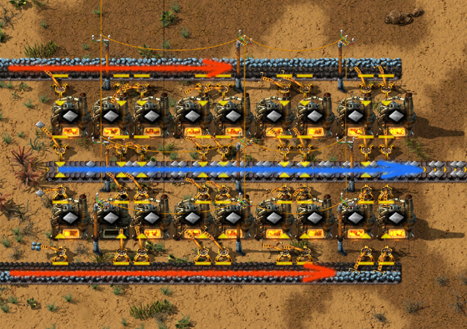
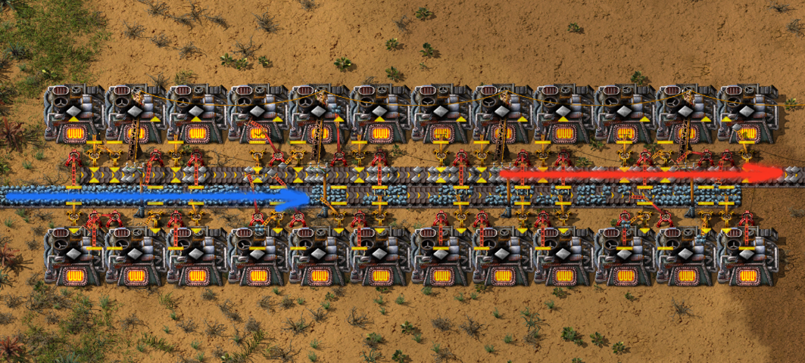
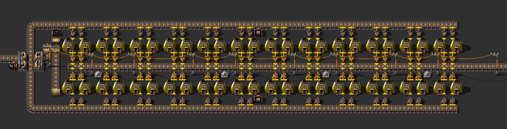
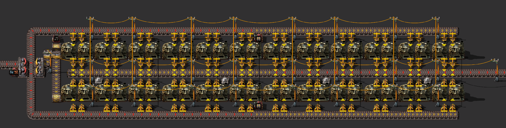

# Плавка ресурсов

В игре пресутсвуют [три типа плавильных печей](https://wiki.factorio.com/Furnace): каменные (`Stone furnace`), стальные (`Steel furnace`) и электрические (`Electric furnace`). Каменные доступны сразу. Стальные появятся чуть позже, освоить их придётся где-то в момент открытия переработки нефти или чуток раньше. То есть довольно быстро. Электрические печи вам понадобятся аж после запуска первого спутника, но внедрить некоторое их число для плавки камней можно будет с открытием фиолетовой науки, она же производственный исследовательский пакет (`Production science pack`).

::: warning Нужно помнить наизусть
Железная руда (`Iron ore`), медная руда (`Copper ore`) и камни (`Stone`) плавятся с одинаковой скоростью.

Потребуется 48 каменных печей или 24 стальных чтобы полностью опустошить один конвейер руды, жёлтый который (`Transport belt`). Соответственно, столько же печей потребуется, чтобы заполнить такой же конвейер выплавленными пластинами.

Камни плавятся по два за раз, в отличие от руды, поэтому потребуется только 24 каменных печей или 12 стальных печей, чтобы опустошить один конвейер, но чтобы заполнить такой же конвейер, нужно печей в два раза больше, то есть как для обычной руды.

Железные плиты (`Iron plate`) плавятся в стальные балки (`Steel plate`) по пять за раз, но выплавка стальных балок в пять раз медленнее, чем выплавка железных пластин. Следовательно, одна печь плавящая железную руду обеспечивает работой одну печь, плавящую стальные балки.

[Тут подробней](https://factoriocheatsheet.com/#material-processing).

Из всего вышеперечисленного следует, что **любой работающий дизайн на каменных печах и обычном конвейере, можно превратить в дизайн на стальных печах** простой заменой печей и конвейера на быстрый конвейер, красный который (`Fast transport belt`).
:::

## Как лучше плавить ресурсы

Существует множество различных дизайнов, различной степени правильности или не правильности, самодельных и научно обоснованных... Короче, существует один правильный и множество не правильных. Правильные собираюсь показать, не правильные не собираюсь.

Начнём с первых шагов в игре, с каменных и стальных печей. Дизайны как для стальных, так и для каменных печей идентичны. Подача угля (для работы печей) и руды (для плавки) подаются на одном конвейере, соответственно, половина конвейера это железная или медная руда, вторая половина конвейера это уголь или другое топливо. Смотрим красные стрелки на рисунке. Выгрузка выплавленных железных (`Iron plate`) или медных (`Copper plate`) пластин осуществляется на один конвейер, с каждой стороны которого находятся плавильные печи. Смотрим синюю стрелку.



::: tip По поводу пол конвейеров
Пол конвейера называется линией, то есть каждый конвейер состоит из двух линий по которым подаются ресурсы. Это важно помнить, когда будете искать разные там балансеры (`balancer` или `tu balancer`), которые нужны для перемешивания ресурсов идущие на разных конвейерах. Но есть особые, линейные, балансеры (`line balancer`), которые перемешивают ещё и ресурсы на разных линиях конвейеров.
:::

С эклектическими печами всё сложнее, или проще. Заменять их особо нечем, топлива не требуют, подавать питание нужно по проводам. Тут тоже из всех дизайнов, правильный только один, там где подача ресурсов и их выгрузка происходят внутри кузницы, так сказать. По синей стрелке на рисунке ресурсы подаются, по красной выгружаются.



## Чертёж первого уровня



```blueprint
0eNrFnV+O20YSxq8i6GkX0Bjs/91zhr3BZhBoxoxDQEMJlMZYwxggiJEnPwS7JzGSeLFZx84VqBuFGiUzksVWf19lgYUBe2yLPxaLXdVF9let19PrxV296pp2M718PX1er2+6ZrVplu30ctr/a/td/6n/6XLyRXsxUZPtN9s3/U/9u0n/cffbv7f/7D9svx0+8cuk/+/wx8f+h/59/3P/fvtN/353iHeT4Ygfh099P+l/mPS/9P/pP27fbL/dvpn8pXpWBW0GzHDMHvNj/+kU9O6vX7SDIW9/N2VvyR/n3r7tfz45ZNL/ujdh+PND/274jw/Dzx+HX5+GT+8vYvt2Ops2N8t2Pb38++vpunnRzhc7D2xererh0ptNfTt8op3f7v626ebterXsNhfX9WIzvR8ObZ/X/5heqvtZ8eD1ZtnWF1/dde38pj44VgPHNt2yvVh2h4cZ9LDVYr45PNDeX82mdbtpNk29v+qHv7z6sr27va674WJy1zubrpbrZj8oXk8H1IWp4jM3m74aflTJPHPDWZ43XX2z/8zDlX0G10K4HuAjOMPgPGmrZeCBhLtH+G70bebt5uJmeXvdtPPNshs9gzv2xmx34KZbLr68rr+ev2yGo4aPftUsNnUHjeab5fCfD5i7XdSrg9F8NeZrz7jDku4IDNyR8PgIvx7Cr+4umnZdd4OfRummOOoSY6whjVUVQ9csXVG+0EVfKCqiFWsuFeAVS7eEM3RKZWc43NwjHmauZ+hsZlaBckY5N6vImMvmT5UYOpv6dUU5wxWdoRVjLps9tWbobPrUhnKGLTvDMuayCVRTQcgmUO0pZ6iyMwJjLptANRWEbALViXJGVa7niMlPRzaBGiYII5tAjWacEUPZGYYxl02ghgnCyCZQ4yhn+LIzmMkvsinOMEEY2fRsIuWMcgFqmMkvsgnUUkHIJlCrKGeUK1CryUcpHdXnj1IHNvs//WB1+poAfcSyVMSzc4GlIp6dCywV8aFcTFsm4gObrS0T8YGdaSwV8aFcTFsm4gObrR0T8YF+1UFFfCgX044pdwM7Fziq3A3lctcxcRfYycUx5W5g5wJHBSE7FzjqmTOUi2nHlLuBTXGOKndDudz1VNyx+d4z5a5nU5xngtCz6dlTQejLxbSn3vX4ckHqmbjzbEb2TNx5NiN7ZvLzbAL1TBB6Nt95Kgh9uZgO1LseXy5IAxV3bM4MVNyx+T4wFahnE2hgZkLP5rtAVaCuXIEG6l2PK1dxgYk7x+bMwMSdY/N9SMKlu2rcF7ES8lSG9xR169Wi2eSWNPyhXUdXbceoT9F2Nzy6dS+64VHuObQ0pU74sz+eF5d3m9Xd7snw9Hwms2A8usj2eKpRh1gCpc+jHIGqzqM8jNIpnkcFAuXPoyKBKrg9Eajzbk8VgTrv9qRwVDzv9qQJ1Hm3J0Ogzrs9WQJVcLsjUAW3E6M9FNxOjPZQcDsx2kPB7cRoD+fdripiuIeqwCLGu48FFjHgvS+wiBHvbYFFDHlf8j0x5n3J98SgdyXfM8IQ9VSP7taGEK1FZGU4h+eI//t3x4dKr5G3xjNA1bNaDYVqDqHHXzyriqnulGL9rITF3qmL7SheqFl7sH4UqLFiMh2gEDcYDBuyWD+KtTIZ3OnNG8cf5Ibb+WJxUS+Gz3fNzcVquahL59jfwbZuXnx9vbx7iAJdmavRE3mZCgwdJUKR2ambxvFPuQTUVOWHn1BhduqI0WF4oG4BlXBZS7WSqdVQS7VM/4XijUy8huKtTA6G4p1MD4biPTJKjuzOjpKAoYDMzAlaPH3RSSZaA/Gmwhxhy44wQkUZaqlQUobiDeYIBzhCqCZDLRXKyVC8l8m/UDwYeRXg54ihFIBKMlUaeNFWqCJD8UIZGYrXkJ+jL/vZYlEWA4CyMjEaetFOpkZD8V6m70LxQSZOQ/FY5EWgsjzQkYAatCyKEo1EOu86JVOhoXgtk1qheCPTWqF4C93GANRmB/oRUKOUR3mZpgq96CAThKH4KBNBoXihggvEe6yyDEBBdaAbAZVPeZRQqYVetJEpq1C8lUmrULyTaatQPPb8FoDSz2NVZABKP0ocEui865NMAAbiQyWTVKF4JdNUoXissvRAORiwytIDRSonCqHzbhDqtFC8l0mpUHyQaalQPFZZeqCyZPQhR0DM0ojNbx4oXKOSKahQS7VM5ITihQotFI9Vlg4oByNWWTqgSI1eJm1CL1qoy0LxlDCLznCRiTxHZ7jEzHmOTkGJiUZHJ9DERKOjgz0x0ejorJescGHTQ0tWyQnxAcN7gZgt+tEMkKSLd6AnohAPeiLRK24QWBOamSeR37iLdaXoBUzQSC2QD+aMNPRitPrc3qPF6N3ytq7S1ejJ7GcnW8xvV6Wlx5Dp82YkNo/Kx5wXPL2gBt6qQC/6geAoEGvmrj6RY+BoITCMChJmWsXRMaD4JTvMI0oJNKcZjyhNL6eBRhqBmjVnpKUXkEAjnUAnmzPS0wtmoJFBoMDNGRnZAIipEABpprUdD4BELyJhHsFkKEerPSBYCRTKGVcfKFDOTgFHyzq5KUBL9M45wyw9Buz5MTCMKm306BjQjl6BAm+Vp9ejQHAQ6MFzro4CQXiOlejlFuyCQWlJoGduowQa9szVG80O2hDOD9ohDLQJo4PWGIFiPme4pddEQO86et0GBHuByD939YG+bfr8bRsGgraZ2xbBjBtMOeMaSX9Cxgu2ohdUsFtllaDxIWekppdqQCONoKMiZ6QVdFTkWI5e1AAv2NNLHCCYjibvCtEUZtqNz9w2ChpOcq5OgoaTDMtV9MoD5l2n6IUCEEzPXb46f9vs7raNP3U6I+jHybkafItxtBiRS6iOf6kPutfTCw8gOAjakXKupB+8nDk/BjJh64Td1rsaH/CJl/bjOAyvpF3TIyd47Jpu2kzTtPZauMMv6i4j3DUX5Us3okX5Tri3K8r3wu1SUX4Q7kCK8qNwU0+UL90nE+RzW5gcvqkB+Uq4myPK18INElG+Ee45iPLtn9iC8PQc/88tCHWQ7uOH+soLt8ZD+UG42xzKj8Lt4VB+Eu6JBvJjJdzEDOUr4c5dKF8LN/JC+Ua4vxTKt8LtplC+dBcklC/dFAnlB2FpCu6HHYW90iA+yb40BMSnSihTAPFK9h0fKF4L25pBvBH2IoN4K+xFBvFO2IsM4r2wFxnEB2EvMoiXdv2CeGnXL7b9d1UJe2lBvLQTGMRrYQMsiDfC9l0Qb4WtpiDeCdt3QbwXdrKC+CDsZAXxUdjUCeKTsCUV/LKIStgzCuKVsGcUxGthdyaIN8LuTBBvhd2ZIN4JuzNBvLQPEsRL+yBBvLQPEsRL+yDBL2GphB2HIF4JOw5BvBZ2HIJ4I+w4BPFW2NsH4p2wtw/Ee2FvH4gPwt4+EB+FbW4gPgmb9DA89b1Png4raq8cTycFI9ySG8UbYWcdiLfChjIQ74TtcCDeC1u3QHwQNp6N4K9m+7f0lwdftjybLuYDbvi3vy3bF7NJPe8WryaL+uXwb7Ppy7pb7w+OyoY0TIdJV9Ho+/vfAHAnBSc=
```

## Чертёж второго уровня



```blueprint
0eNrFXW1uHLkRvcpgfiVAy+BnkdQZcoOssRhJbW8Do57BaGTEMARs1sgv/wiQkxi76yCO184Vem4UzoywGklkdz0yQP7Ylu1+1SzyscjqR9a7+cXytl1vun47P383v2pvLjfdetut+vn5fPjH7m/Dt+HX89l3/dlMznY/7t4Pvw4fZ8PX/S//3v04fNz9Nf7wbfgt/hh/+zr8PHwaPg+f4j992j9Edhaf+WX4svv7bPh5Nvw2/Gv4unu/+2n3fvYH8UI4pWfDP+MzX3Y/xed/Gb49B/r4x+/6+Cof7l/m+C4P1ncfhs/PHpoN/zm+RPz9y/Ax/sOX+Oevh3f9fN+Q3Yd5M+8uV/3N/PzP7+Y33et+sdx7Yft23cbmd9v2Ov6PfnG9/+nV4mZ7tt0s+pv1arM9u2iX2/ldfL6/av8yP5d3zSTCzbZtl2evbjf94rI9eVYxnu02q/5stTl9THMfWy8X29MHzd3LZt72227btcemH354+31/e33RbmJjRhvdzNerm+44RN7NI96ZFv6FbeZv4x+loxc2mrrqNu3l8f8cmvfEgoItEGhBwxYcaMHAFixowcIWDGiBYAsKtOBgCxq04GELArQQYAsStCAFaEIFlHJSwiYCakLBJlDSSQ2bQGcOaWATKLGlhU2gzJYEm0CpLR1sAuW29LAJlNwywCZQdiuY3R4OqDC7PcpuBbPbo9RTMLs9OoEomN0eZbeC2e1RdiuY3R6lnoLZ7dEJRD2wm4GOElsFBB3ltBYAukO5piWCjk4WWiHoKMO0RtDhdb1B0FHqaougo6zVhKCjbNIOQUenA41w1aFc1QhXHcpVg3CVUDYZhKuEzgQG4SqhbDIIVwneISNcJZRNBuEqoTOBQbhKKFcNwlVCuWoQrhLMJoSrhM4EFuGqRblqEa5alKtW1STO4gi9S4HqGlCTAX1g5m1/1W5eb1bxd1bmyjz1RIS6zz2ubrfr231W9Lm9B67u863bRb89u1xdX3T9YrvaTJm0B5Pxwe1mtfz+ov1h8aaLT8X/+qpbbtsNK397uYr/eIC53ee65Unq9mXSRZRJ3Cbzbr97Jwn1wPauv2k38ZWncmu5weB5SHoaKQDNU6PNowfK3lwvlsuzdhnHxqa7PFuvlu1UfuzYuX3bvf7hYnV76EuyjbT+ZcqUBN5ajL+14rjyUZ4t40rSPKQwjWTYzYsvNt48C3bKo0RZqlNE40wjiZL9QsCL0/iLO543zbQ3PQ/JTiMFoHnjc4ETANQ475zktU9Ots8xuSCmkTTQvHGCOoOOYB+mphUXGulCagQ7y39xP049Ryxvepr2Jo8Lp0mwHJIHmjdOUBfgfjGj/RI72sd+8cmZxQN88ePU8zy++Ong6Xl88dMB3QN88ePTgTfgGutR0ss+XdZR9Yrr+cdy7trLI2Qcn0U8j4xuOsx7HhnddJj3ABnd+FzjYTI6N07G0MQIpoRIkTEAZHTjs0jgkdFNh/nAI6ObDvMBIKMbn2sCHLycGu2X/QwpdOwYl+wYgDBufBoJTMJMrwUCkzDT65OAEGZ8PgjAUo7GuSeFYDWQpgO9FDw6kGNAKaCFNNFCjQ5jsqPDOPJCCt8oJV8m7QEbIDIT7255LlUMl/I4QZoB5YAWqokWerh3xGjvHGYYFdJdgxBnnINS8ohjp4OylDzi2MCAAohjJ6YGWKei5ck0qHiCHliBJgVsw9ZkH3XO01SDqnKoT75Y36yX3TaXITsZD4rjhxOqjcHSadMfp0mTsEAu/ZEG8lnvUVKPJXhv7bLOSMNK5K3tyFsnnaIUnOTMDQml4cxrFsrAWb4slIVTj1kognNcWSg88ZaF8nA+KQsV4CRXDkoLOC+ThZJwYiYLpeCsRBZKw2mJLJSBt81ZKAvvm7NQBG8as1AO3jVmoTy8Y8pCBXjLlIMyAt5RZKEkvM/JQil4UZ6F0vCiPAtl4EVkFsrCS9ssFKEfTU/Xd/J/n9A7PYSSSOU1jG+w63W7yUKodDZQGlezXJSsRYfxNTYEz0aAP5TS03Y83q+lv5JKRETxaIHG85UtXf/x3GQVAq9G3j6tvdcIvIbhDbzkZLrFwstiJjAhDpGwQxwCL2B4X6M+EMkP3XumSqJGpb8VSvuUyMvF9XqqOSIzzROieDrdXvD8Q4jkKXgYXsHbIt6o5Koq4FmYEFViINghiCzx9PwTE55qdB0iJ7bZfxZvVPoTrCRErXi6P2Q2CZErBgvDB3iLzBtITsAbZiYwRFk4QjlEUhzg+OoQTXGA53sH0ReOVs7C+QZmpxKcE2ECI+z08ATvoEM6cHgqUJOE0fnsKFLby0maGHWS85lHIq6Hp2iP0NfDAYYrPiF0IHkNJ7WYwAhlPTzBeyTiejg8earRO4mkxOIQbYVo4gYvPUIdb4H5yFu5BaaHGAyHEw+ds4PDSRBwfpQ3KpkKFA9v1IIqPNbIdIguPNfIhIcPyDp40g/wCVkHx62AC7+Y3YvrwJjA8GF3BwePAJ92d2j8U0LUaNJEWvu0D+fCNVolhWlKwOffnYHbBR+Adxa2oeEvHKzBpYSBv3cwgXEuK9gr8HF3p2EbrkaxJ5JSpz0VlJJx1Lr0qPXMMO/0ZJhXAqc2GnsUfk+Nk7ANCX9O441UqeCPa0xg+NoKCrBX4LBMHrYBU5ng4IDfS0ME23Dwp09mR3v4QygTGOYuweELv4WG4PB1ogwq0IuKjCIxTs1KhUabdOzHL6YhOALhN9MQHIGYCiNCNySKqTciDQPjZIbDAX4PDcFhTXHjMMnpOKxCjSo3yYGDYLpR2kcOpFcSGia3hcODhtfYFg5zTDWURXdtiqmNsgEGhgOzhYOmhgOzhYOmhrls4fCgYS5bOMxpWBRv9Sj9MoJ4peGYbeGQYHBaw6HN1Fz3ul/IMkhiam7G2C9kOTZ0mSqF2wRTcB8EhWSIOBGJgddvJHzx+/UbXZ+5fUMZKrjsIffuruAKhhyWL7jvIIcVCq4gyGBZUXDeP4clCw7857BUwen6HJYuOPCewzIFp8tzWLbgwHcOiwpOV+ewXMGZ5BxWyQHgHFYoOJObwSJRcAA2hyULjqTmsFTB+c8cli44AJrDMgVHLXNYtuDoYw6LCg4Z5rBcwbm/HJYvOGGXwwo1SwrHivlO1NhgXrMqK26q59qouW+fa0NX3FbPtVFz5z7XBiyz5Q4mQoXBXGBXcYs/1yu+4h5/ro1QoeS999VTeXxO06i8qCgbwGyQlxWFA7g24GvMmKPKw7eacYFNRa0DrldsRbEDro0aJW5yuB4V5znZmvKuovYBt1G+ooQD10ZAdbPMkcWUCp0ofbnAsqJeA9MrQVWUneDa0BVFIbg2TEVVCK4Ni2ppuR1NqPqXC+wqCllwveIrKllwbdTIdZOT3vHcQU4JqYWoKGxBzKv8ZUV9Dq4NhYpreSNLMxVDnmBgU1Hvg+sVW1Hwg2ujRr+bHLJHaXlOi6aFqygxwm2Ur6gxwrURUIEsc2RJWNLLBZYVNUuYXsGLXHkN29AVVzk+99X/8ypHLU2ZGprrKlumhubCwypi7lCFVcRcYF9WOobrkFBW94YJr2q0w6nJ+v6URU6CqZUsq1bDbU9hqR0uPCwXZo4iBcuFucC2rH4P1yFUVsCHC18jEk4Pz4OmPadt01CJLAcHGqhGloNjJfPGJYfu0zTz/iUnYWBVVoiI6xBdVkWJC2/KCh1x4W1ZpSMuPKHqWm6nwnpgLrAvK87EdUgoq87EhDeiQqybnMyORx1yIkWNVcqCJ2esVBYcWrj3TcHbIebtUwRvh7AKWfDsjpXIgmOTcRU62vTwzGrINVYyC56YsZpZcFix8H26zBFk4dt1ucCqrBAX1yG6rIpYCv5lc9wMn88vlrftetP1e5TlIsLFv/vTqn/dzK67q6tlO1u2b+JfNvM3cVt9fNpL40LcNwQlvFZ3d/8FzVZnVw==
```

## Что ещё

[Сохранёнка со всеми чертежами](../saves/AwesomeFactorio%20-%20Resources.zip), смотрите в книге игры. А также детальный разбор плавки руды и меди на YouTube канале.

[](http://www.youtube.com/watch?v=XXXXXXXXX)