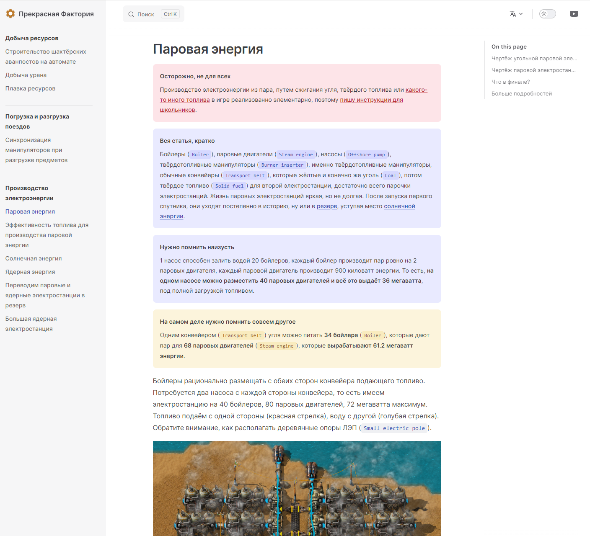

Давно присматриваюсь к `vitepress` на предмет использования в качестве нового движка для сайта. Получается неплохо, но есть и проблемы.

<!-- truncate -->

Больше всего раздражает, что `vitepress` уже второй год в статусе alpha версии. К сожалению текущий движок, используется `vuepress`, уже устарел морально, а новая версия также, как и у `vitepress` никак не релизнется. Не всё хорошо в королевстве `vue` наверное.

Также, не все фичи из `vuepress` перенесены в `vitepress`. Нет увеличения изображений, непонятно как работает `<img src="data:image/*`, иногда просто глючит. Зато интересно реализованы `assets`, более адекватно собирается проект сайта, более компактное оформление и на глаз работает быстрее.

Также, параллельно, присматриваюсь к `docusaurus`, но в этом движке просто отвратительно реализована поддержка нескольких языков. В остальном полностью подходит.

Посмотрим, что получится в итоге.
